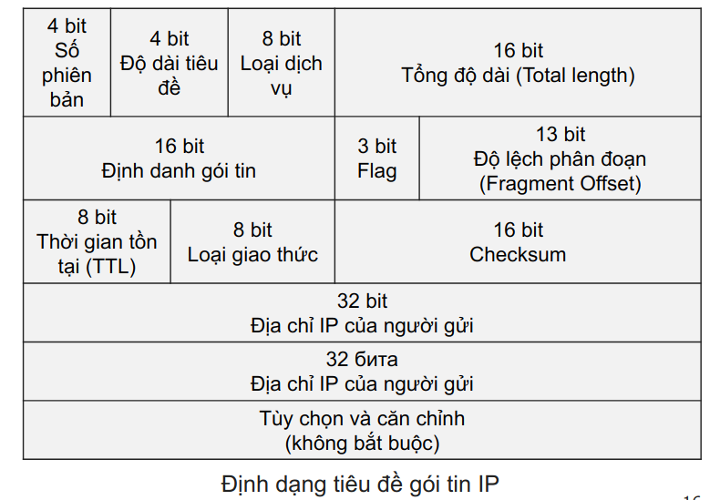

### **Tài liệu bổ sung**  

# **Mô hình OSI**  

Mô hình OSI, còn được gọi là "Mô hình kết nối hệ thống mở". Mô hình này mô tả các quy tắc và quy trình truyền dữ liệu trong các môi trường mạng khác nhau khi thiết lập phiên giao tiếp.  

## **Các tầng của mô hình OSI:**  

1. **Tầng Vật lý (Physical Layer)** – Loại dữ liệu: Bit  
2. **Tầng Liên kết dữ liệu (Data Link Layer)** – Loại dữ liệu: Khung (Frame)  
3. **Tầng Mạng (Network Layer)** – Loại dữ liệu: Gói tin IP (IP Packet)  
4. **Tầng Vận chuyển (Transport Layer)** – Loại dữ liệu: Phân đoạn (Segment)  
5. **Tầng Phiên (Session Layer)** – Loại dữ liệu: Dữ liệu  
6. **Tầng Trình bày (Presentation Layer)** – Loại dữ liệu: Dữ liệu  
7. **Tầng Ứng dụng (Application Layer)** – Loại dữ liệu: Dữ liệu  

Chúng ta sẽ xem xét từng tầng chi tiết hơn.

## **7. Tầng Ứng dụng**  

Tầng ứng dụng là tầng cao nhất và trực tiếp liên kết với các quá trình ứng dụng. Nó còn được gọi là tầng ứng dụng trong mô hình OSI.  

Tầng ứng dụng bao gồm tập hợp nhiều giao thức khác nhau, giúp người dùng mạng truy cập vào các tài nguyên được chia sẻ, chẳng hạn như tệp tin, máy in hoặc các trang web. Ngoài ra, tầng này còn hỗ trợ làm việc cộng tác, ví dụ như sử dụng giao thức email.  

### **Các chức năng chính:**  
- Xác thực người dùng bằng mật khẩu  
- Xác định các chức năng đang hoạt động  
- Kiểm tra sự đầy đủ của tài nguyên hiện có  
- Quản lý các yêu cầu kết nối với các tiến trình ứng dụng khác  

## **6. Tầng Trình bày**  

Tầng trình bày thực hiện mã hóa và giải mã dữ liệu, đảm bảo tính bảo mật của trao đổi dữ liệu cho tất cả các dịch vụ ứng dụng.  

Tầng này đảm bảo rằng thông tin do tầng ứng dụng gửi đi có thể được hiểu đúng ở tầng ứng dụng của hệ thống khác. Khi cần thiết, tầng trình bày sẽ chuyển đổi định dạng dữ liệu sang một dạng chung trong quá trình truyền và thực hiện chuyển đổi ngược khi nhận dữ liệu. Điều này giúp các tầng ứng dụng có thể xử lý sự khác biệt về cú pháp trong cách biểu diễn dữ liệu.  

### **Chức năng:**  
- Tạo yêu cầu thiết lập phiên kết nối giữa các tiến trình ứng dụng  
- Chuẩn hóa cách biểu diễn dữ liệu giữa các tiến trình ứng dụng  
- Thực hiện các dạng biểu diễn dữ liệu khác nhau  
- Hiển thị dữ liệu dưới dạng đồ họa  
- Mã hóa dữ liệu  
- Chuyển tiếp yêu cầu kết thúc phiên kết nối  

## **5. Tầng Phiên**  

Tầng này xác định quy trình thiết lập và duy trì các phiên kết nối giữa người dùng hoặc các tiến trình ứng dụng.  

Tầng phiên đảm bảo quản lý hội thoại, giúp xác định bên nào đang hoạt động tại một thời điểm nhất định và cung cấp phương thức đồng bộ hóa.  

### **Chức năng:**  
- Thiết lập và kết thúc kết nối phiên giữa các hệ thống giao tiếp  
- Xử lý trao đổi dữ liệu thông thường và khẩn cấp giữa các tiến trình ứng dụng  
- Quản lý sự tương tác giữa các tiến trình ứng dụng  
- Đồng bộ hóa kết nối phiên  
- Thông báo cho tiến trình ứng dụng về các tình huống ngoại lệ  

## **4. Tầng Vận chuyển**  

Tầng vận chuyển chịu trách nhiệm điều phối việc truyền dữ liệu giữa các hệ thống cuối và máy chủ, bao gồm số lượng dữ liệu cần gửi, tốc độ truyền, điểm đích, v.v.  

Tầng này xác định liệu có cần thiết lập kết nối hay không, kiểm tra tính toàn vẹn của dữ liệu, khôi phục sau lỗi kết nối và xác định có cần truyền lại dữ liệu hay không.  

- **Đơn vị dữ liệu:** **Phân đoạn (Segment)**  

Ở tầng này có hai giao thức chính:  
- **TCP (Transmission Control Protocol)**  
- **UDP (User Datagram Protocol)**  

Sự khác biệt giữa hai giao thức này là cách chúng xử lý các loại lưu lượng khác nhau:  

- Khi dữ liệu **quan trọng và không thể mất mát**, chúng ta sử dụng **TCP**. TCP đảm bảo kiểm soát việc truyền dữ liệu. Ví dụ: **kết nối từ xa đến máy chủ**. Trong kết nối từ xa, chúng ta gửi các lệnh đến máy chủ, nếu mất một ký tự hoặc cả một lệnh, có thể dẫn đến lỗi nghiêm trọng và làm hỏng quá trình hoạt động.  

- Nếu **mất một số dữ liệu không ảnh hưởng nhiều**, chúng ta sử dụng **UDP**, vì nó nhanh hơn TCP. Ví dụ: **cuộc gọi video**. Nếu một phần nhỏ của dữ liệu bị mất, hình ảnh có thể hơi mờ nhưng toàn bộ luồng video vẫn tiếp tục và đến nhanh hơn.  

- Với **TCP**, thiết bị gửi dữ liệu trước tiên thiết lập kết nối với thiết bị nhận. Quá trình này gọi là **bắt tay TCP (TCP-handshake)**, trong đó hai thiết bị thỏa thuận cách chúng sẽ truyền dữ liệu.  

- Với **UDP**, không cần bắt tay hay thỏa thuận. Thiết bị gửi chỉ cần truyền dữ liệu, bất kể thiết bị nhận có sẵn sàng xử lý dữ liệu hay không.  

### **Chức năng của tầng vận chuyển:**  
- Quản lý truyền dữ liệu qua mạng và đảm bảo tính toàn vẹn của các khối dữ liệu.  
- Phát hiện lỗi, xử lý lỗi một phần và báo cáo lỗi không thể sửa chữa.  
- Truyền lại dữ liệu sau khi xảy ra lỗi hoặc mất mát.  
- Chia nhỏ và ghép nối các khối dữ liệu, đảm bảo thứ tự ưu tiên khi truyền dữ liệu.  
- Điều chỉnh kích thước khối dữ liệu phù hợp với yêu cầu mạng.

## **3. Tầng Mạng**  

Tầng này chịu trách nhiệm thiết lập đường dẫn kết nối giữa các hệ thống người dùng và hệ thống quản trị thông qua mạng truyền thông, đảm bảo lựa chọn tuyến đường nhanh nhất và đáng tin cậy nhất.  

Tầng mạng thiết lập kết nối giữa hai hệ thống trong mạng máy tính và cung cấp kênh kết nối ảo giữa chúng.  

Ngoài ra, tầng mạng cũng báo cáo cho tầng vận chuyển về các lỗi xảy ra trong quá trình truyền dữ liệu. Các thông điệp ở tầng mạng được gọi là **gói tin (packet)**. Gói tin chứa các mảnh dữ liệu cũng như địa chỉ logic của nguồn và đích. Tầng mạng chịu trách nhiệm định địa chỉ và chuyển tiếp dữ liệu.  

- **Đơn vị dữ liệu:** **Gói tin IP (IP Packet)**  

### **Chức năng của tầng mạng:**  
- Phát hiện và sửa lỗi trong quá trình truyền dữ liệu qua mạng truyền thông.  
- Đảm bảo thứ tự của các gói tin.  
- Định tuyến và chuyển mạch.  
- Phân đoạn và ghép nối các gói tin.

## **2. Tầng Liên kết Dữ liệu**  

Đơn vị thông tin của tầng liên kết dữ liệu là **khung (frame)**. Khung là một cấu trúc logic có thể chứa dữ liệu.  

Dữ liệu nhận từ tầng vật lý dưới dạng bit sẽ được tầng liên kết dữ liệu đóng gói thành khung, kiểm tra tính toàn vẹn và nếu cần, sẽ sửa lỗi (hoặc yêu cầu gửi lại khung bị lỗi) trước khi chuyển lên tầng mạng.  

Ở tầng này, một số khái niệm quan trọng xuất hiện, chẳng hạn như **địa chỉ MAC, bộ chuyển mạch (switch), và mạng Ethernet**.  

- **Địa chỉ MAC** – mã định danh duy nhất của mỗi thiết bị kết nối với mạng. Các thành phần như **card mạng, bộ điều hợp Wi-Fi, Bluetooth trên điện thoại** đều có địa chỉ MAC riêng.  
- **Bộ chuyển mạch (Switch)** – thiết bị chịu trách nhiệm truyền dữ liệu trong mạng dựa trên địa chỉ MAC.  
- **Ethernet** – tiêu chuẩn truyền gói tin giữa các thiết bị. Chuẩn này quy định các kết nối có dây, cách mã hóa tín hiệu điện và định dạng khung dữ liệu.  

### **Chức năng của tầng liên kết dữ liệu:**  
- Tạo, quản lý và giải phóng các kết nối liên kết dữ liệu, xác định cổng giao tiếp.  
- Đóng gói dữ liệu vào khung và truyền tải khung dữ liệu.  
- Phát hiện và sửa lỗi trong quá trình truyền dữ liệu.  
- Kiểm soát luồng dữ liệu.  
- Đảm bảo tính minh bạch của kênh logic (cho phép truyền dữ liệu theo bất kỳ phương thức nào).  

---

### **Địa chỉ MAC**  

Địa chỉ vật lý (MAC) gồm **6 byte (48 bit)** và được biểu diễn theo hệ **thập lục phân**. Các byte được phân tách bằng dấu gạch ngang (-) hoặc dấu hai chấm (:) để dễ đọc.  

- **Ba byte đầu**: gọi là **OUI (Organizational Unique Identifier)** – mã định danh duy nhất của nhà sản xuất.  
- **Ba byte cuối**: gọi là **Số giao diện (Interface Number)** – giá trị được gán tại nhà máy và là duy nhất cho mỗi thiết bị.  

Hai bit cao nhất trong địa chỉ MAC có ý nghĩa đặc biệt:  
- **Bit đầu tiên**: xác định địa chỉ là **đơn nhất (0) hay nhóm (1)**.  
- **Bit thứ hai**: xác định địa chỉ MAC là **toàn cầu (0) hay cục bộ (1)**.

## **1. Tầng Vật lý**  

Tầng vật lý trong mô hình OSI chịu trách nhiệm truyền các tín hiệu vật lý từ nguồn đến đích. Trong thế giới hiện đại, dữ liệu có thể được truyền theo nhiều cách khác nhau, vì vậy tiêu chuẩn mô tả một số phương tiện truyền dẫn khác nhau – truyền dữ liệu bằng dòng điện, ánh sáng hoặc sóng vô tuyến.  

Ở tầng này, chúng ta làm việc với **cáp mạng, tín hiệu điện trong dây dẫn, đầu nối, cổng kết nối, và cách mã hóa bit 0 và 1**.  

### **Chức năng của tầng vật lý:**  
- Thiết lập và ngắt kết nối vật lý giữa các thiết bị.  
- Truyền và nhận tín hiệu ở dạng mã tuần tự.  
- Giám sát các kênh truyền dữ liệu.  
- Nhận diện các kênh truyền.  
- Phát hiện lỗi và thông báo sự cố trong hệ thống truyền dẫn.

# **TCP/IP & OSI**  

Ngăn xếp giao thức **TCP/IP (Transmission Control Protocol/Internet Protocol - Giao thức Kiểm soát Truyền tải/Giao thức Internet)** là một mô hình mạng mô tả quá trình truyền dữ liệu số.  

Dựa trên các quy tắc của TCP/IP, Internet và các mạng cục bộ (LAN) hoạt động độc lập với cấu trúc và mục đích của chúng. Các quy tắc này được gọi là **giao thức truyền thông**, và chúng sẽ được tìm hiểu chi tiết trong các bài giảng tiếp theo.  

### **Các tầng trong mô hình TCP/IP:**  
1. **Tầng Liên kết Dữ liệu (Network Access Layer)**  
2. **Tầng Internet (Internet Layer)**  
3. **Tầng Vận chuyển (Transport Layer)**  
4. **Tầng Ứng dụng (Application Layer)**  

## **4. Tầng Ứng dụng**  
- Các giao thức hoạt động ở tầng này: **HTTP/HTTPS, FTP, DNS**, v.v.  
- Trong mô hình **TCP/IP**, tầng này tương ứng với tầng ứng dụng, tầng trình bày và tầng phiên trong mô hình **OSI**.  

---

## **3. Tầng Vận chuyển**  
- Các giao thức hoạt động ở tầng này: **TCP, UDP**, v.v.  
- Trong mô hình **TCP/IP**, tầng này tương ứng với tầng vận chuyển trong mô hình **OSI**.  

---

## **2. Tầng Liên mạng**  
- Giao thức hoạt động ở tầng này: **IP**.  
- Trong mô hình **TCP/IP**, tầng này tương ứng với tầng mạng trong mô hình **OSI**.  

---

## **1. Tầng Liên kết Dữ liệu**  
- Các giao thức hoạt động ở tầng này: **Ethernet, IEEE 802.11 (Wi-Fi)**, v.v.  
- Trong mô hình **TCP/IP**, tầng này tương ứng với **tầng liên kết dữ liệu và tầng vật lý** trong mô hình **OSI**.  

---

### **Sự khác biệt giữa mô hình TCP/IP và OSI**  
- **Mô hình OSI**: là một mô hình khái niệm mô tả **tất cả các quá trình giao tiếp mạng**.  
- **Mô hình TCP/IP**: không chỉ là mô hình khái niệm mà còn là một tập hợp **các giao thức thực tế được sử dụng trong mạng Internet**.  
- Khi nói về **tầng 2, tầng 3 hoặc tầng 7** trong hệ thống mạng, chúng ta thường tham chiếu đến mô hình **OSI**.  
- TCP/IP được sử dụng để mô tả **kiến trúc mạng thực tế** và cung cấp **các giao thức kết nối mạng chuẩn**.

# **Các loại thiết bị mạng**  

Thiết bị mạng là các thiết bị cần thiết để vận hành một mạng máy tính.  

Thông thường, thiết bị mạng được chia thành hai loại: **thiết bị chủ động (active)** và **thiết bị thụ động (passive)**.  

Theo tiêu chuẩn **ГОСТ P 51513-99**, **thiết bị chủ động** là những thiết bị có chứa **mạch điện tử**, **sử dụng nguồn điện từ lưới điện hoặc các nguồn năng lượng khác** (như pin, bộ lưu điện, v.v.), và có khả năng **xử lý, khuếch đại tín hiệu** hoặc thực hiện các chức năng khác.  

Ngược lại, **thiết bị thụ động** không yêu cầu nguồn điện để hoạt động, mà chủ yếu phục vụ mục đích **phân phối hoặc giảm suy hao tín hiệu**.  

---

### **Thiết bị chủ động:**  
- **Hub (Bộ tập trung)**  
- **Switch (Bộ chuyển mạch)**  
- **Router (Bộ định tuyến)**  
- **Card mạng**  
- **Repeater (Bộ lặp tín hiệu)**  

---

### **Thiết bị thụ động:**  
- **Cáp mạng**  
- **Patch panel (Bảng kết nối cáp mạng)**  
- **Tủ mạng**  
- **Giá đỡ thiết bị mạng**  
- **Ổ cắm mạng, phích cắm, v.v.**

### **Xem xét chi tiết một số ví dụ về thiết bị mạng**

## **Hub (Bộ tập trung)**
**Hub**, còn được gọi là **bộ tập trung**, là thiết bị đơn giản nhất để kết nối nhiều thiết bị vào cùng một mạng.  
Hub có nhiều cổng, mỗi cổng có thể kết nối một thiết bị mạng. **Hub không có khả năng xử lý thông tin** – nó chỉ **sao chép dữ liệu nhận được từ một cổng** và phát đến **tất cả các cổng khác** trong mạng.  

Điểm hạn chế của Hub là tất cả thiết bị trong mạng đều **nhận dữ liệu**, **bất kể có phải là thiết bị đích hay không**. Nếu thiết bị nhận đúng gói tin, nó sẽ xử lý, nếu không, gói tin sẽ bị bỏ đi.

---

## **Switch (Bộ chuyển mạch)**
**Switch**, hay **bộ chuyển mạch**, là thiết bị **thông minh hơn Hub**. Nó cũng kết nối nhiều thiết bị trong một mạng, nhưng **chỉ gửi dữ liệu đến thiết bị đích thay vì gửi tới tất cả cổng** như Hub.  

Switch sử dụng một **bảng địa chỉ MAC**, trong đó **lưu trữ thông tin cổng nào kết nối với địa chỉ MAC nào**. Khi nhận được dữ liệu, switch **tra cứu bảng MAC** để biết gói tin cần được gửi đến đâu, giúp tối ưu hóa băng thông và tăng tốc độ truyền dữ liệu.  

- **Switch không được quản lý** (Unmanaged switch) – hoạt động tự động, không cần cấu hình.  
- **Switch được quản lý** (Managed switch) – có thể cấu hình, hỗ trợ nhiều giao thức quản lý mạng nâng cao.

---

## **Router (Bộ định tuyến)**
**Router**, hay còn gọi là **bộ định tuyến**, có chức năng khác biệt so với hub và switch. Nó làm việc với **địa chỉ IP**, không phải địa chỉ MAC.  
Chức năng chính của router là **định tuyến dữ liệu từ mạng này sang mạng khác** dựa trên **địa chỉ IP**.  

Khi nhận được dữ liệu, router **kiểm tra địa chỉ đích** và **tra cứu bảng định tuyến** để quyết định gửi gói tin đi đâu. Nó có thể gửi dữ liệu đến một mạng nội bộ hoặc chuyển tiếp ra internet.  

Router đóng vai trò quan trọng trong kết nối internet, giúp các thiết bị trong mạng cục bộ (LAN) **giao tiếp với mạng bên ngoài**.

### **So sánh trực quan các thiết bị mạng**
#### **Bộ tập trung (Hub)**
- **Tầng**: Vật lý  
- **Hình thức truyền dữ liệu**: Bit  
- **Số lượng cổng**: 4/12  
- **Địa chỉ dùng để truyền dữ liệu**: Địa chỉ MAC  
- **Loại thiết bị**: Không có trí tuệ nhân tạo  

---

#### **Bộ chuyển mạch (Switch)**
- **Tầng**: Liên kết dữ liệu  
- **Hình thức truyền dữ liệu**: Khung (Frame)  
- **Số lượng cổng**: Thông thường từ 4 đến 48  
- **Địa chỉ dùng để truyền dữ liệu**: Địa chỉ MAC  
- **Loại thiết bị**: Có trí tuệ nhân tạo  

---

#### **Bộ định tuyến (Router)**
- **Tầng**: Mạng  
- **Hình thức truyền dữ liệu**: Gói tin (Packet)  
- **Số lượng cổng**: 2/4/5/8  
- **Địa chỉ dùng để truyền dữ liệu**: Địa chỉ IP  
- **Loại thiết bị**: Có trí tuệ nhân tạo  

# **Chuyển mạch**  
Đây là quá trình kết nối các thuê bao khác nhau của mạng truyền thông thông qua các nút trung gian.  

Các mạng truyền thông phải đảm bảo kết nối giữa các thuê bao của chúng.  

Bộ chuyển mạch có khả năng kết nối các thiết bị mạng. Các thiết bị được kết nối với nó thông qua cáp xoắn đôi với đầu nối RJ-45. Loại kết nối này được sử dụng trong cả mạng gia đình và các hệ thống mạng doanh nghiệp lớn. Đây là loại kết nối phổ biến nhất, mặc dù trong các mạng hiệu suất cao có thể sử dụng các đầu nối và phương tiện truyền dữ liệu khác để đảm bảo hiệu suất cao hơn.  

Dựa trên lưu lượng dữ liệu do máy tính tạo ra, bộ chuyển mạch xác định vị trí của từng thiết bị trong mạng.  

### **Xây dựng bảng chuyển mạch**

### **Dữ liệu khung (Frame) đến bộ chuyển mạch**  

Máy tính gửi một khung (frame) đến bộ chuyển mạch, bên trong khung ngoài dữ liệu còn có các tiêu đề đặc biệt được hiển thị trên hình ảnh. Khi bộ chuyển mạch nhận được khung do máy tính A gửi đến máy tính B, nó sẽ trích xuất địa chỉ MAC của người nhận và tìm địa chỉ đó trong bảng chuyển mạch của mình. Nếu bảng chuyển mạch chứa một bản ghi liên kết địa chỉ MAC của người nhận (máy tính B) với một trong các cổng của bộ chuyển mạch, thì khung sẽ được chuyển đến cổng đầu ra tương ứng (trong ví dụ này là cổng 2).  

Quá trình này được gọi là **chuyển tiếp khung (forwarding frame)**. Nếu địa chỉ cổng đầu ra và cổng nguồn trùng nhau, khung sẽ bị loại bỏ bởi bộ chuyển mạch. Quá trình này được gọi là **lọc khung (filtering)**.  

Nếu địa chỉ MAC của người nhận không có trong bảng chuyển mạch (tức là không có bản ghi nào liên quan đến nó), bộ chuyển mạch sẽ tạo ra nhiều bản sao của khung và gửi chúng qua tất cả các cổng, ngoại trừ cổng mà nó nhận được. Quá trình này được gọi là **lập tuyến tràn (flooding)**. Mặc dù quá trình lập tuyến tràn chiếm băng thông, nhưng nó giúp bộ chuyển mạch tránh mất khung khi chưa biết địa chỉ MAC của người nhận và hỗ trợ quá trình học địa chỉ.  

---

### **Các phương thức chuyển mạch**  

Chuyển mạch lưu lượng có thể được thực hiện theo nhiều cách khác nhau tùy theo nhiệm vụ.  

Để đạt được tốc độ mạng tối đa, có một phương thức gọi là **chuyển mạch nhanh (cut-through switching)**. Ở đây, bộ chuyển mạch chỉ kiểm tra sáu byte đầu tiên của khung, vì nó chứa địa chỉ của người nhận thông tin.

Đây là sơ đồ minh họa phương thức **chuyển mạch nhanh (Cut-through switching)**.  

- Bộ chuyển mạch chỉ kiểm tra **6 byte đầu tiên** của khung, chứa địa chỉ **đích (Адрес назначения)**.  
- Sau khi đọc địa chỉ đích, bộ chuyển mạch ngay lập tức bắt đầu chuyển tiếp khung mà không cần chờ nhận toàn bộ dữ liệu.  
- Các trường trong khung bao gồm:  
  - **Địa chỉ đích (Адрес назначения)** – 6 byte  
  - **Địa chỉ nguồn (Адрес источника)**  
  - **Độ dài (Длина)**  
  - **Dữ liệu (Данные)**  
  - **Tổng kiểm tra lỗi (Контрольная сумма)**  

Phương pháp này giúp giảm độ trễ truyền dữ liệu nhưng có nhược điểm là có thể chuyển tiếp các khung có lỗi do không kiểm tra tổng kiểm tra lỗi trước khi truyền.

Trong hầu hết các trường hợp, phương thức chuyển mạch **store-and-forward** được sử dụng. Ở đây, bộ chuyển mạch kiểm tra toàn bộ khung dữ liệu, tính toán tổng kiểm tra lỗi và kiểm tra xem khung có bị thay đổi trong quá trình truyền qua mạng hay không. Nếu phát hiện lỗi, khung đó sẽ bị loại bỏ. Đây là một phương pháp chuyển mạch chậm hơn.

Hình ảnh trên mô tả phương thức **Store-and-Forward** trong chuyển mạch mạng.  

**Chi tiết về cấu trúc gói tin:**
- **Địa chỉ đích (Адрес назначения)**: Xác định thiết bị nhận dữ liệu.
- **Địa chỉ nguồn (Адрес источника)**: Xác định thiết bị gửi dữ liệu.
- **Độ dài (Длина)**: Xác định độ dài của gói dữ liệu.
- **Dữ liệu (Данные)**: Phần dữ liệu chứa nội dung thông tin cần truyền.
- **Tổng kiểm tra (Контрольная сумма)**: Kiểm tra lỗi để xác định tính toàn vẹn của dữ liệu.  

**Nguyên tắc hoạt động:**  
- Bộ chuyển mạch nhận toàn bộ khung dữ liệu trước khi gửi đi.  
- Kiểm tra lỗi bằng cách tính toán tổng kiểm tra.  
- Nếu phát hiện lỗi, khung dữ liệu bị loại bỏ, nếu không thì được chuyển tiếp.  
- Đây là phương thức chuyển mạch chậm hơn so với **Cut-through** nhưng đảm bảo tính toàn vẹn của dữ liệu.

Chúng ta lại thấy cấu trúc của một frame, trong đó có thể nhận thấy:  

- **Địa chỉ đích** – Địa chỉ của card mạng của người nhận.  
- **Địa chỉ nguồn** – Địa chỉ của card mạng của người gửi.  
- **Độ dài** – Số byte, bắt đầu từ trường tiếp theo sau trường này và kết thúc ngay trước trường **Tổng kiểm tra**.  
- **Dữ liệu** – Chính là dữ liệu mà frame mang theo.  
- **Tổng kiểm tra** – Giá trị được tính toán theo một thuật toán nào đó dựa trên các file hoặc dữ liệu có sẵn.  

Nếu bốn trường đầu tiên đã rõ ràng, thì trường cuối cùng có thể chưa thực sự dễ hiểu, vì vậy chúng ta hãy xem xét kỹ hơn về nó.

## **Checksum - Tổng kiểm tra**  

Tổng kiểm tra là một giá trị được tính toán dựa trên một tập hợp dữ liệu bằng cách áp dụng một thuật toán cụ thể và được sử dụng để kiểm tra tính toàn vẹn của dữ liệu trong quá trình truyền hoặc lưu trữ.  

Một đặc điểm quan trọng của tổng kiểm tra là thuật toán của nó luôn tạo ra cùng một giá trị khi có đầu vào giống nhau. Tuy nhiên, chỉ cần một thay đổi nhỏ trong dữ liệu đầu vào cũng sẽ dẫn đến sự thay đổi đáng kể trong tổng kiểm tra.  

Tính chất này giúp sử dụng tổng kiểm tra để xác minh tính toàn vẹn của tệp hoặc dữ liệu. Khi gửi một tệp, người gửi có thể tính toán tổng kiểm tra của nó và gửi kèm theo tệp. Sau đó, người nhận có thể tính toán lại tổng kiểm tra của tệp nhận được và so sánh với tổng kiểm tra ban đầu. Nếu giá trị giống nhau, tệp vẫn nguyên vẹn, nếu không, có thể tệp đã bị thay đổi.  

Cần lưu ý rằng tổng kiểm tra không thể được sử dụng để khôi phục dữ liệu gốc. Tức là, không thể "giải mã" tổng kiểm tra để lấy lại dữ liệu đã được kiểm tra. Tổng kiểm tra chỉ có thể so sánh với một tổng kiểm tra khác.  

Nói cách khác, tổng kiểm tra được sử dụng để phát hiện lỗi khi truyền dữ liệu qua mạng. Nếu có lỗi được phát hiện, frame chứa lỗi sẽ bị loại bỏ.  

Tổng kiểm tra thường được tính bằng thuật toán CRC-32 và có thể phát hiện đến **99,999999977%** các lỗi trong các gói tin có độ dài tối đa 64 byte.
 

## **Mạng IP và địa chỉ IPv4**  

**Internet Protocol** – giao thức định tuyến thuộc tầng mạng trong mô hình TCP/IP.  

Đây là một trong những giao thức chính của tầng mạng (L3). Chính nó định nghĩa khái niệm địa chỉ hóa. Hiện tại, giao thức này có hai loại địa chỉ – IPv4 và IPv6. Trong bài này, chúng ta sẽ tập trung vào loại địa chỉ cũ và phổ biến hơn, đó là IPv4.  

Tầng mạng của mô hình OSI giúp người dùng không cần quan tâm đến địa chỉ MAC, vì việc tìm địa chỉ MAC của người nhận sẽ được thực hiện tự động thông qua **yêu cầu quảng bá ARP**. Nhờ đó, chúng ta không cần ghi nhớ địa chỉ MAC dài và cũng không cần tìm kiếm thủ công trên từng thiết bị. Bây giờ, chúng ta có thể chỉ định một địa chỉ IP đặc biệt cho từng thiết bị và giao tiếp trực tiếp với nó bằng địa chỉ IP thay vì MAC. Địa chỉ IP ngắn hơn, dễ nhớ hơn và thuận tiện hơn trong sử dụng.  

**Gói tin IP** là đơn vị dữ liệu được truyền tải ở tầng mạng của mô hình OSI.

Sẽ rất hữu ích nếu chúng ta xem xét bên trong một gói tin IP có gì. Trong hình minh họa, bạn có thể thấy phần tiêu đề (header) của một gói tin IP, phần này có mặt trong mọi gói tin IP.  

**Tiêu đề** là thông tin dịch vụ giúp dữ liệu của chúng ta có thể được truyền qua mạng. Các loại tiêu đề khác nhau được sử dụng cho tầng thứ hai của mô hình OSI, tầng thứ ba và các tầng khác.  

Ở tầng thứ ba (Network Layer), tiêu đề chứa thông tin dịch vụ giúp bộ định tuyến (router) thực hiện định tuyến các gói tin qua mạng, kiểm tra tính toàn vẹn của dữ liệu và loại bỏ các gói tin trong trường hợp mạng bị lặp vô hạn (looping).

## IPv4  

Giao thức IP đã được phát triển từ lâu, và phiên bản đầu tiên được sử dụng rộng rãi nhất là phiên bản thứ tư, do đó có tên là IPv4. Hãy cùng tìm hiểu chi tiết về IPv4.  

Đối với máy tính, tất cả thông tin được biểu diễn dưới dạng một tập hợp các số 0 và 1. Trong công nghệ mạng cũng vậy – dữ liệu được truyền qua dây cáp dưới dạng các tín hiệu nhị phân, chính là các số 0 và 1. Như đã phân tích trước đó, dữ liệu ở tầng 3 (Network Layer) bao gồm dữ liệu hữu ích và phần tiêu đề của gói tin.  

Mỗi phần của tiêu đề có thể được hiểu như một chuỗi các số 0 và 1, trong đó có địa chỉ của người gửi và người nhận. Số lượng số 0 và 1 trong địa chỉ IP tương ứng với độ dài của nó tính bằng bit, vì bit là đơn vị nhỏ nhất trong thế giới công nghệ thông tin.  

Mỗi phần của địa chỉ IP chứa 8 bit, được gọi là một **octet**. Mỗi octet được ghi theo hệ thập phân, và địa chỉ IP có định dạng gồm bốn octet, phân tách nhau bằng dấu chấm, ví dụ: **213.180.193.3**. Hệ thống chia địa chỉ này giúp con người dễ đọc hơn so với dạng nhị phân 32 bit của máy tính.  

Số lượng giá trị tối đa có thể biểu diễn trong một octet là **256**, tức là từ **0 đến 255**. Do đó, mỗi phần trong địa chỉ IP có thể có giá trị nằm trong khoảng từ 0 đến 255.  

Vậy, địa chỉ IPv4 được biểu diễn dưới dạng **bốn số thập phân từ 0 đến 255, ngăn cách nhau bằng dấu chấm**.

**Dịch nội dung:**  

Trong mạng IPv4, có ba loại địa chỉ IP, mỗi loại địa chỉ được thiết kế để phục vụ một mục đích nhất định. Các loại địa chỉ IP bao gồm:  

- **Địa chỉ mạng**: Địa chỉ IP đại diện cho một mạng hoặc một subnet.  
- **Địa chỉ host**: Địa chỉ IP được gán cho các máy tính hoặc thiết bị đầu cuối trong mạng.  
- **Địa chỉ quảng bá (Broadcast Address)**: Đây là địa chỉ đặc biệt được sử dụng để gửi dữ liệu đến tất cả các thiết bị trong mạng.  

### **Cách xác định địa chỉ mạng và địa chỉ host**  
Làm thế nào để biết một địa chỉ IP thuộc về mạng hay là địa chỉ của một host? Để làm điều này, ta sử dụng **Subnet Mask**.  
Subnet Mask có dạng giống như địa chỉ IP, bao gồm bốn octet và có độ dài 32 bit. Subnet Mask được sử dụng để xác định kích thước của mạng con. Khi xác định subnet, ta có thể tính toán số lượng địa chỉ IP trong mạng bằng cách sử dụng subnet mask.  

Tuy nhiên, có một lưu ý quan trọng – trong bất kỳ mạng nào cũng tồn tại hai địa chỉ đặc biệt không thể gán cho thiết bị đầu cuối. Đó là:  
- **Địa chỉ đầu tiên trong subnet**: Được sử dụng để nhận diện mạng (Network Address). Đây là tên của mạng hoặc subnet.  
- **Địa chỉ cuối cùng trong subnet**: Được sử dụng làm địa chỉ quảng bá (Broadcast Address). Nếu một thiết bị gửi dữ liệu đến địa chỉ broadcast này, tất cả các thiết bị trong mạng con sẽ nhận được dữ liệu.  

---

### **Nhược điểm của IPv4**  

#### **Vấn đề về khả năng mở rộng (Scalability Problem)**  
- Khó khăn trong việc thay đổi hàng loạt địa chỉ IP.  
- Không gian địa chỉ 32-bit có hạn, gây ra tình trạng thiếu hụt địa chỉ IP.  
- Xử lý tiêu đề gói tin IPv4 có độ phức tạp tương đối cao.  
- Khó khăn trong việc tổng hợp tuyến đường và mở rộng bảng định tuyến.  

#### **Thiếu một số cơ chế quan trọng**  
- Không có các cơ chế bảo mật tích hợp.  
- Không hỗ trợ đầy đủ các lớp ưu tiên và phân loại lưu lượng dữ liệu.

## **IPv6**  

IPv6 là phiên bản mới của giao thức Internet (Internet Protocol), được thiết kế để giải quyết các vấn đề mà IPv4 gặp phải, nhờ vào một loạt thay đổi quan trọng.  

Sự khác biệt đầu tiên và quan trọng nhất là độ dài của địa chỉ IP trong giao thức mới đã tăng lên 128 bit. Điều này cho phép tạo ra \(2^{128}\) địa chỉ duy nhất, con số này tương đương với:  
340.282.366.920.938.463.463.374.607.431.768.211.456 địa chỉ.  

Do độ dài địa chỉ thay đổi, định dạng của nó cũng thay đổi theo. Địa chỉ IP mới trở nên phức tạp hơn, ví dụ như:  

**Ví dụ về địa chỉ IPv6:**  
`2001:0db8:0000:0000:0000:0000:0010:ad12`  

Địa chỉ IPv6 hiện nay bao gồm 8 nhóm số thập lục phân, được phân tách bằng dấu hai chấm (:). Thoạt nhìn có vẻ phức tạp, nhưng tin tốt là trong các địa chỉ như vậy, ta có thể lược bỏ các số 0 ở bên trái và thay thế dãy số 0 liên tiếp bằng dấu **::** để rút gọn.  

Vì vậy, địa chỉ lớn trên có thể được ghi gọn lại như sau:  
`2001:db8:0000:0000:0000:0000:0010:ad12`  
hoặc đơn giản hơn:  
`2001:db8:10:ad12`

### **Định dạng tiêu đề IPv6**  

- Trường đầu tiên trong tiêu đề của giao thức IPv6 cũng giống như trong tiêu đề của giao thức IPv4, đó là số phiên bản – **IPv4 có giá trị 4, còn IPv6 có giá trị 6**.  

- Tiếp theo là trường **lớp lưu lượng (Traffic Class)**, dùng để hỗ trợ **chất lượng dịch vụ (QoS)**. Cách đơn giản nhất là phân loại lưu lượng thành hai loại: **thông thường** và **quan trọng**. Các bộ định tuyến (router) hỗ trợ QoS có thể ưu tiên truyền tải dữ liệu quan trọng nhanh hơn bằng cách sử dụng các kênh chuyên dụng hoặc các phương pháp phân loại lưu lượng khác.  

- Trường tiếp theo trong tiêu đề IPv6 là **nhãn luồng (Flow Label)**, nó được sử dụng để kết hợp lợi ích của **mạng chuyển mạch gói (packet switching)** và **mạng chuyển mạch kênh (circuit switching)**. Nhãn này giúp tối ưu hóa các gói tin có cùng nguồn và đích đến, đồng thời yêu cầu một loại dịch vụ cụ thể. Các bộ định tuyến hỗ trợ **chuyển tiếp theo nhãn** sẽ xử lý các gói tin dựa trên nhãn này, giúp tăng tốc độ xử lý dữ liệu.  

- Trường **độ dài tải trọng (Payload Length)** là trường kế tiếp, khác với IPv4 – nơi chỉ định tổng độ dài của gói tin, **trong IPv6 trường này chỉ định kích thước của dữ liệu mà không bao gồm phần tiêu đề**.  

- Trường tiếp theo là **tiêu đề tiếp theo (Next Header)**, được sử dụng để chỉ ra tiêu đề bổ sung nếu có.  

- Cuối cùng, trong IPv6, **thời gian sống (Time-to-Live - TTL) được đổi thành “Số lượng bước nhảy tối đa” (Hop Limit)**. Thay vì đo thời gian sống theo giây như trong IPv4, trong IPv6 **giới hạn số lần chuyển tiếp qua bộ định tuyến** trước khi gói tin bị loại bỏ được sử dụng.

So với tiêu đề của giao thức IPv4, giao thức IPv6 đã loại bỏ một số trường liên quan đến **phân mảnh (fragmentation)** và **tính toán tổng kiểm tra (checksum)**.  

- **Tổng kiểm tra (Checksum)**: Việc tính toán tổng kiểm tra tạo ra gánh nặng lớn cho các bộ định tuyến. Tuy nhiên, **tổng kiểm tra thường không cần thiết** vì nó đã được xử lý ở **tầng liên kết dữ liệu (Data Link Layer)** thay vì **tầng mạng (Network Layer)**. Do đó, trong IPv6, **tổng kiểm tra đã bị loại bỏ** để giảm tải cho bộ định tuyến.  

- **Phân mảnh (Fragmentation)**: Trong IPv4, phân mảnh cũng làm tăng tải xử lý cho các bộ định tuyến. Trong thực tế, hầu hết các mạng sử dụng **kích thước gói cố định**, chẳng hạn như **Ethernet 1500 byte**, nên phân mảnh thường **không cần thiết**. Nếu một gói tin đi qua một mạng có **kích thước MTU (Maximum Transmission Unit) nhỏ hơn**, thay vì phân mảnh, IPv6 sử dụng **Path MTU Discovery** để xác định kích thước gói phù hợp trước khi truyền.  

- **Phần mở rộng (Extension Headers)**: Cũng như IPv4, tiêu đề của IPv6 có hai phần: **bắt buộc** và **tùy chọn**. Trong phần tùy chọn, có thể có nhiều **tiêu đề mở rộng**, giúp bổ sung các thông tin cần thiết.  

Các loại tiêu đề mở rộng trong IPv6 gồm:  
- **Tiêu đề tham số định tuyến (Routing Header)** – Chứa thông tin để các bộ định tuyến xử lý gói tin đúng cách.  
- **Tiêu đề tham số người nhận (Destination Options Header)** – Chứa dữ liệu dành riêng để xử lý ở phía người nhận.  
- **Tiêu đề định tuyến bổ sung (Additional Routing Header)** – Chứa danh sách các bộ định tuyến trung gian mà gói tin **bắt buộc phải đi qua**.

### **Ưu điểm của IPv6**  
IPv6 vượt trội hơn IPv4 và có nhiều lợi ích rõ ràng.  

**Thứ nhất**, không gian địa chỉ rộng hơn giúp IPv6 mang lại nhiều lợi thế:  
- **Địa chỉ đủ dùng trong nhiều thập kỷ tới**, không cần các giải pháp thay thế như NAT.  
- **Mỗi thiết bị** có thể nhận được **địa chỉ IP công khai ("trắng")**, giúp kết nối tốt hơn.  
- **Hỗ trợ tốt hơn cho mạng peer-to-peer**, giúp các thiết bị giao tiếp trực tiếp mà không qua trung gian.  

**Thứ hai**, IPv6 đơn giản hóa và cải tiến một số tính năng:  
- **Địa chỉ có thể tự động tạo và cấu hình** nhờ công nghệ **SLAAC (Stateless Address Autoconfiguration)**, giúp quản trị mạng dễ dàng hơn.  
- **Tiêu đề gói tin được đơn giản hóa**, giúp xử lý nhanh hơn.  
- **Bổ sung hỗ trợ bắt buộc cho mã hóa IPsec**, tăng cường bảo mật mạng.  

---

### **Nhược điểm của IPv6**  
IPv6 không phải là **"viên đạn bạc"** và vẫn có nhiều thách thức lớn.  

- **Chi phí triển khai cao**:  
  - Các **nhà cung cấp dịch vụ (ISP)** phải nâng cấp phần cứng, cấu hình lại hệ thống, điều này tốn kém.  
  - Nếu IPv4 vẫn hoạt động tốt, nhiều đơn vị không thấy cần phải chuyển đổi ngay.  

- **Thiếu kinh nghiệm và hiểu biết**:  
  - **Quản trị IPv6 còn phức tạp**, ngay cả các chuyên gia giàu kinh nghiệm cũng gặp khó khăn, chưa nói đến người dùng phổ thông.  

- **Không tương thích ngược với IPv4**:  
  - **Không thể chạy IPv6 trực tiếp trên hạ tầng IPv4**, dẫn đến giai đoạn quá độ **dual-stack** (chạy song song IPv4 và IPv6).  
  - Điều này làm **tăng gấp đôi nguy cơ lỗi cấu hình và mở rộng bề mặt tấn công bảo mật**, vì phải bảo vệ cả hai giao thức.  

Dù vậy, **hầu hết chuyên gia đều đồng ý rằng việc chuyển sang IPv6 là điều tất yếu**, chỉ là vấn đề thời gian. Khi quá trình chuyển đổi hoàn tất, chúng ta sẽ thực sự thấy IPv6 hoạt động hiệu quả như thế nào.

# **Thuê địa chỉ IP. IANA. Phân phối địa chỉ IP theo quốc gia**  

**IANA** (Internet Assigned Numbers Authority) là tổ chức quản lý phân bổ địa chỉ IP trên toàn cầu cũng như cấp số **AS (Autonomous System Number - số hệ thống tự trị)**. IANA chủ yếu hoạt động ở cấp độ tổ chức, còn việc **thuê địa chỉ IP hoặc số AS** có thể thực hiện thông qua **RIR hoặc LIR**.  

**RIR** (Regional Internet Registry - **Cơ quan đăng ký Internet khu vực**) là các tổ chức khu vực chịu trách nhiệm phân bổ địa chỉ IP theo từng khu vực địa lý. Ví dụ:  
- **Châu Âu và Nga** được quản lý bởi **RIPE NCC**.  

**LIR** (Local Internet Registry - **Cơ quan đăng ký Internet địa phương**) là tổ chức nhỏ hơn, có thể là bất kỳ tổ chức nào đáp ứng các yêu cầu về tài liệu cần thiết. LIR được thành lập để giảm tải công việc cho RIR và phục vụ cho các nhu cầu đăng ký địa chỉ IP cục bộ hơn.  

---

### **Số AS và phân bổ địa chỉ IP**  
Ban đầu, số AS tối đa là **65.535**, nhưng sau này tiêu chuẩn đã được mở rộng. Hiện tại, số AS có thể được cấp phát nhiều như số lượng địa chỉ **IPv4** còn tồn tại.  

Số **AS được gán cho một mạng con cụ thể**, đã đăng ký thông qua **LIR**.  
- Bạn **không thể có AS** nếu chỉ sở hữu một dải địa chỉ nhỏ hơn **/24 (256 địa chỉ IP)**.  
- Nếu một tổ chức trở thành **hệ thống tự trị (AS)**, họ có thể hoạt động như một nhà cung cấp dịch vụ (**ISP**), cho thuê địa chỉ IP và điều phối lưu lượng mạng ra Internet toàn cầu.

## **Giao thức ARP**  

Một trong những giao thức quan trọng nhất trong các mạng cục bộ hiện đại là **ARP (Address Resolution Protocol - Giao thức phân giải địa chỉ)**.  
Giao thức này được sử dụng trong mạng máy tính để xác định **địa chỉ MAC** của một máy tính khác dựa trên **địa chỉ IP đã biết**. ARP thực hiện việc ánh xạ từ địa chỉ logic (**IP**) sang địa chỉ vật lý (**MAC**) và lưu kết quả vào bộ nhớ đệm **ARP cache** của thiết bị.  

- **ARP hoạt động ở tầng 2 và tầng 3 của mô hình OSI**.  
- **Mỗi thiết bị trong mạng đều sử dụng ARP** để tìm kiếm địa chỉ MAC tương ứng.  

---

## **Bộ nhớ đệm ARP (ARP Cache)**  
- Kích thước bộ nhớ đệm ARP **có giới hạn** và các địa chỉ trong đó **thường chỉ tồn tại trong vài phút**.  
- Bộ nhớ này được **xóa định kỳ** để giải phóng không gian và duy trì dữ liệu cập nhật.  
- Cơ chế này được thiết kế để đảm bảo **bảo mật và quyền riêng tư**, giúp **ngăn chặn đánh cắp địa chỉ MAC hoặc IP**, **hạn chế tấn công mạng**.  

Khi một địa chỉ IP không còn được sử dụng, **bộ nhớ đệm sẽ xóa bỏ** nó, cùng với bất kỳ dữ liệu nào liên quan đến những lần kết nối thất bại (ví dụ: kết nối với một máy tính không tồn tại hoặc không bật nguồn).  

---

**Yêu cầu ARP (ARP Request)**  

### **Cách hoạt động của ARP**  

**Bước 1:** Máy chủ A gửi một yêu cầu ARP đến tất cả các máy trong mạng, yêu cầu tìm địa chỉ MAC của máy chủ B bằng cách gửi **gói tin quảng bá (broadcast request)**.  

**Bước 2:**  
- Máy chủ B nhận được yêu cầu ARP và nhận diện **địa chỉ IP** của mình trong yêu cầu.  
- Sau đó, nó gửi lại **phản hồi ARP (ARP reply)**, trong đó **cung cấp địa chỉ MAC của mình**.  
- Các thiết bị khác trong mạng, như máy chủ C, sẽ **bỏ qua yêu cầu này**, vì địa chỉ IP không khớp với IP của chúng.  

**Bước 3:** Máy chủ A nhận phản hồi ARP từ máy chủ B, sau đó **lưu địa chỉ MAC của B vào bộ nhớ đệm ARP (ARP cache)** cùng với địa chỉ IP tương ứng.  

---

### **Bảng ARP (ARP Table)**  

Nhờ quá trình này, **một bảng ARP sẽ được tạo trên máy tính** của chúng ta, chứa tất cả phản hồi nhận được từ các thiết bị khác trong mạng. **Bảng ARP là một danh sách ánh xạ giữa địa chỉ IP và địa chỉ MAC.**  

- **Câu lệnh `arp -a`, `arp -g`** giúp hiển thị bảng ARP của thiết bị.  

#### **Cấu trúc của bảng ARP:**  
- **Địa chỉ IP** của thiết bị đích.  
- **Địa chỉ MAC** tương ứng với địa chỉ IP đó.  
- **Cách thức thêm địa chỉ MAC vào bảng:**  
  - **Địa chỉ MAC tĩnh (static MAC addresses):** Do quản trị viên thêm thủ công.  
  - **Địa chỉ MAC động (dynamic MAC addresses):** Được tạo và xóa tự động khi cần thiết.  

> **Lưu ý:** **Địa chỉ MAC broadcast `FF:FF:FF:FF:FF:FF` luôn được lưu trong bảng ARP** vì nó là địa chỉ dùng để gửi yêu cầu ARP đến toàn bộ mạng.
