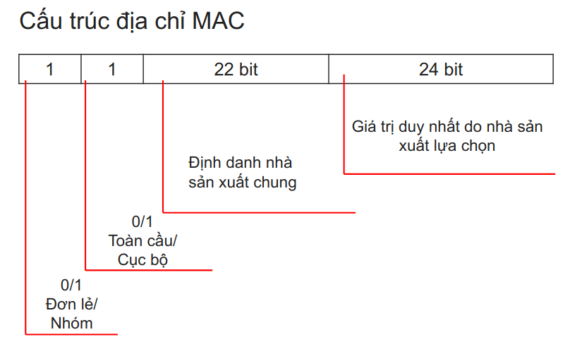
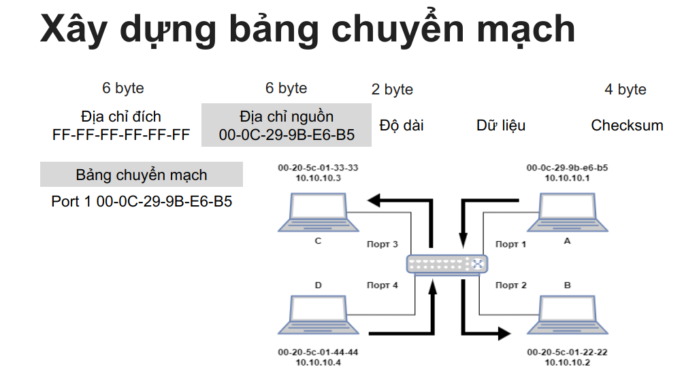
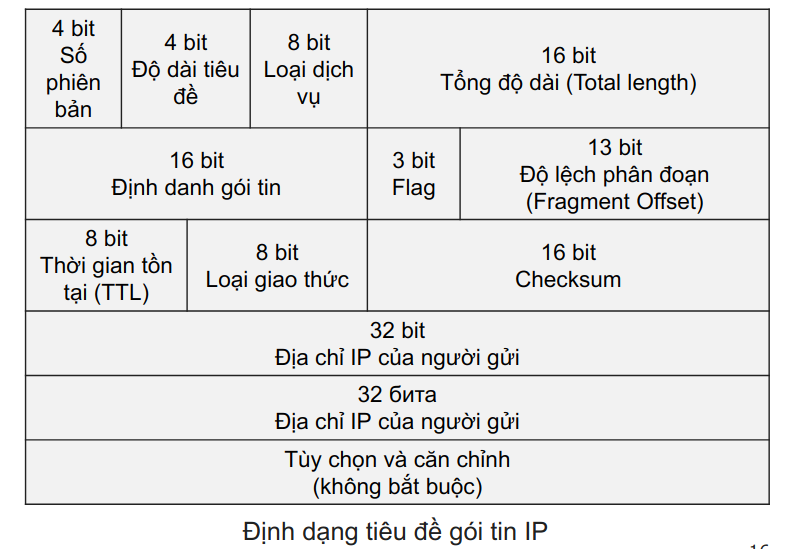
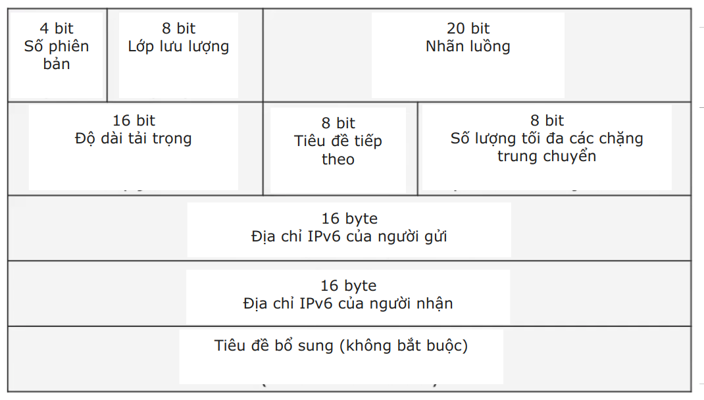
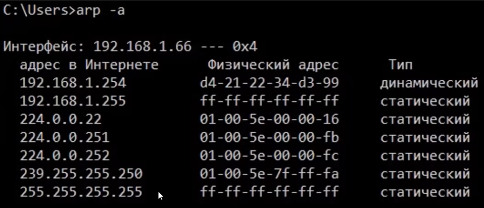

# **Tài liệu bài giảng**  

**Công nghệ mạng**  
💡 Tập hợp các **giao thức tiêu chuẩn** được thống nhất và các phương tiện phần mềm-phần cứng thực hiện chúng, đủ để xây dựng các mạng máy tính.  

## **Mô hình OSI**  
_**Tiêu chuẩn định hình lưu lượng**_

| **Tầng (Layers)** | **Mô tả** | **PDU** |
|------------------|----------|---------|
| **7. Ứng dụng (Application)** | Các giao thức ứng dụng, ví dụ: DHCP | Dữ liệu |
| **6. Trình bày (Presentation)** | Mã hóa dữ liệu từ dạng con người sang máy tính | Dữ liệu |
| **5. Phiên (Session)** | Thiết lập phiên kết nối giữa hai thiết bị | Dữ liệu |
| **4. Vận chuyển (Transport)** | Đảm bảo truyền dữ liệu đáng tin cậy, sử dụng giao thức TCP/UDP | Phân đoạn |
| **3. Mạng (Network)** | Thêm địa chỉ IP, định tuyến dữ liệu | Gói tin IP |
| **2. Liên kết dữ liệu (Data Link)** | Đảm bảo kết nối mạng ở mức vật lý và kiểm soát lỗi | Khung |
| **1. Vật lý (Physical)** | Phương thức truyền dữ liệu dưới dạng nhị phân (Điều chế tín hiệu) | Bit |

## **Địa chỉ MAC**  

❗ **Định danh duy nhất** của thiết bị mạng đang hoạt động hoặc một số giao diện của nó trong mạng Ethernet. Địa chỉ này **được nhúng vào card mạng** tại nhà máy sản xuất.  

Địa chỉ được cấp bởi tổ chức có tên là **IANA**.

Loại địa chỉ MAC (tổng cộng 48 ký tự)

## **Bảng so sánh Hub, Switch và Router**  

|   | **Hub (Bộ tập trung)** | **Switch (Bộ chuyển mạch)** | **Router (Bộ định tuyến)** |
|---|---------------------|--------------------|-------------------|
| **Tầng (Layer)** | Vật lý | Liên kết dữ liệu | Mạng |
| **Hình thức truyền dữ liệu** | Bit hoặc tín hiệu điện | Khung & Gói tin | Gói tin |
| **Số lượng cổng** | 4/12 | Thường từ 4 đến 48 | 2/4/5/8 |
| **Địa chỉ dùng để truyền dữ liệu** | Địa chỉ MAC | Địa chỉ MAC | Địa chỉ IP |
| **Loại thiết bị** | Không thông minh | Thông minh | Thông minh |

## **Cách hoạt động của chuyển mạch**  

💡 **Chuyển mạch** – quá trình kết nối các thuê bao khác nhau trong mạng truyền thông thông qua các nút trung gian.  

1. Bộ chuyển mạch tạo **bảng chuyển mạch** để xác định hướng gửi lưu lượng. Bảng này chứa sự liên kết giữa cổng và địa chỉ MAC.  

2. Lựa chọn phương pháp chuyển mạch:  
   - **Cut-through** – phương pháp nhanh, nhưng không kiểm tra tổng kiểm tra (checksum), chỉ thực hiện chuyển mạch dựa trên địa chỉ.  
   - **Store-and-forward** – phương pháp chính, chậm hơn nhưng người dùng không nhận thấy sự khác biệt. Nó tạo và kiểm tra **tổng kiểm tra** (thuật toán băm, thuật toán CRC-32) và **nếu phát hiện lỗi, khung dữ liệu sẽ bị loại bỏ**.

## **Định địa chỉ IP**  

❗ **Internet Protocol** – giao thức định tuyến ở **tầng mạng** của ngăn xếp TCP/IP.

## **IPv6**  

💡 Thay đổi chính – địa chỉ của người gửi và người nhận dài hơn, mỗi địa chỉ chiếm **16 byte**.

## **Ưu điểm của IPv6**  

- Số lượng địa chỉ đủ dùng trong nhiều thập kỷ tới.  
- Mỗi thiết bị đều có địa chỉ IP "trắng" (public IP).  
- Mở rộng khả năng của mạng **peer-to-peer**.  
- Tiêu đề gói tin được đơn giản hóa.  
- Hỗ trợ mã hóa lưu lượng với **IPsec**.

## **ARP**  

#### _Làm thế nào để biết máy tính đang kết nối qua cổng nào?_  

💡 **ARP (Address Resolution Protocol)** – giao thức phân giải địa chỉ. Đây là **giao thức** dùng để xác định sự tương ứng giữa địa chỉ **logic** của tầng mạng (IP) và địa chỉ **vật lý** của thiết bị (MAC). ARP được thiết kế để truyền các gói IP thông qua các khung Ethernet.  

- **Địa chỉ Broadcast (Địa chỉ quảng bá)** – đây là địa chỉ không được gán cho một thiết bị cụ thể nào trong mạng, dùng để truyền gói tin quảng bá trong mạng máy tính. Ở tầng **L2**, địa chỉ MAC quảng bá **FF:FF:FF:FF:FF:FF** được sử dụng để gửi các **datagram** (ví dụ: **yêu cầu ARP**). Các datagram được gửi đến địa chỉ này sẽ được tất cả các thiết bị mạng trong mạng cục bộ chấp nhận.  

- **Yêu cầu ARP** (_Who has ..._).  

- **Broadcast ARP** – khi một thiết bị kết nối vào mạng, nó sẽ gửi yêu cầu đến tất cả các thiết bị khác trong mạng để yêu cầu ghi nhận địa chỉ của nó vào bảng ARP.  

- Khi một thiết bị phản hồi yêu cầu ARP, thông tin sẽ được lưu vào bộ chuyển mạch (switch) hoặc thiết bị mạng khác trong bảng ARP. Bảng này gồm ba cột: **Host | Địa chỉ MAC | Địa chỉ IP**.

