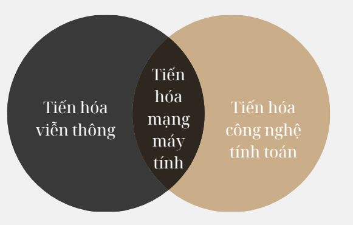

## Mục lục

# Phần I: Cơ bản về mạng truyền dữ liệu
- [Chương 1: Sự phát triển của mạng máy tính](#chuong-1-su-phat-trien-cua-mang-may-tinh)
- [Chương 2: Các nguyên tắc chung trong xây dựng mạng](#chuong-2-cac-nguyen-tac-chung-trong-xay-dung-mang)
- [Chương 3: Chuyển mạch kênh và chuyển mạch gói](#chuong-3-chuyen-mach-kenh-va-chuyen-mach-goi)
- [Chương 4: Chuẩn hóa và phân loại mạng](#chuong-4-chuan-hoa-va-phan-loai-mang)
- [Chương 5: Các đặc tính mạng và chất lượng dịch vụ](#chuong-5-cac-dac-tinh-mang-va-chat-luong-dich-vu)
- [Câu hỏi cho Phần I](#cau-hoi-cho-phan-i)

## Nội dung

# Phần I: Cơ bản về mạng truyền dữ liệu

## Chương 1: Sự phát triển của mạng máy tính

### 1.1 Hai nguồn gốc của mạng máy tính
 
- **Mạng máy tính** là kết quả phát triển từ hai ngành quan trọng: **kỹ thuật tính toán (computing technology)** và **viễn thông (telecommunications technology)**.  
- Chúng có hai vai trò chính:  
  1. **Hệ thống máy tính liên kết (interconnected computer system)** giúp trao đổi dữ liệu và thực hiện các nhiệm vụ tự động.  
  2. **Phương tiện truyền thông tin (information transmission medium)** giúp mã hóa, truyền và xử lý dữ liệu trong các hệ thống **viễn thông (telecommunication systems)** như mạng điện thoại.

