## Mục lục

# Phần I: Cơ bản về mạng truyền dữ liệu
- [Chương 1: Sự phát triển của mạng máy tính](#chuong-1-su-phat-trien-cua-mang-may-tinh)
- [Chương 2: Các nguyên tắc chung trong xây dựng mạng](#chuong-2-cac-nguyen-tac-chung-trong-xay-dung-mang)
- [Chương 3: Chuyển mạch kênh và chuyển mạch gói](#chuong-3-chuyen-mach-kenh-va-chuyen-mach-goi)
- [Chương 4: Chuẩn hóa và phân loại mạng](#chuong-4-chuan-hoa-va-phan-loai-mang)
- [Chương 5: Các đặc tính mạng và chất lượng dịch vụ](#chuong-5-cac-dac-tinh-mang-va-chat-luong-dich-vu)
- [Câu hỏi cho Phần I](#cau-hoi-cho-phan-i)

## Nội dung

<h1 id="chuong-1-su-phat-trien-cua-mang-may-tinh">CHƯƠNG 1: Sự phát triển của mạng máy tính</h1>

## 1.1 Hai nguồn gốc của mạng máy tính
 
- **Mạng máy tính** là kết quả phát triển từ hai ngành quan trọng: **kỹ thuật tính toán (computing technology)** và **viễn thông (telecommunications technology)**.  
- Chúng có hai vai trò chính:  
  1. **Hệ thống máy tính liên kết (interconnected computer system)** giúp trao đổi dữ liệu và thực hiện các nhiệm vụ tự động.  
  2. **Phương tiện truyền thông tin (information transmission medium)** giúp mã hóa, truyền và xử lý dữ liệu trong các hệ thống viễn thông như mạng điện thoại.

Hình 1.1. Sự tiến hóa của mạng máy tính tại giao điểm của công nghệ tính toán và công nghệ viễn thông.

## 1.2 Những mạng máy tính đầu tiên

### 1.2.1 Hệ thống xử lý theo lô

- **Hệ thống xử lý theo lô (batch processing systems)** dựa trên **máy tính lớn (mainframe)**, nơi người dùng chuẩn bị **thẻ đục lỗ (punched cards)** chứa dữ liệu và chương trình, sau đó gửi vào trung tâm tính toán (computing center).  
- Tác vụ của nhiều người dùng được nhóm thành **gói (batch)** và xử lý tuần tự, tối ưu hóa việc sử dụng bộ xử lý .  
- Người dùng nhận kết quả sau một chu kỳ xử lý, gây độ trễ cao.  
- Chế độ tương tác chưa phổ biến do ưu tiên hiệu suất bộ xử lý hơn trải nghiệm người dùng.

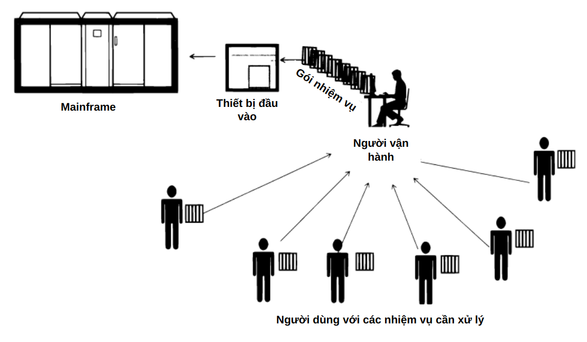

Hình 1.2. Hệ thống tập trung dựa trên máy tính trung tâm (mainframe).

### 1.2.2 Hệ thống đa thiết bị đầu cuối — hình mẫu của mạng

- **Hệ thống đa thiết bị đầu cuối (multi-terminal systems)** với **chế độ chia sẻ thời gian (time-sharing mode)** cho phép mỗi người dùng có phiên làm việc riêng, giúp tương tác trực tiếp với mainframe.  
- Bộ xử lý phân chia tài nguyên theo thời gian, đảm bảo người dùng không nhận thấy độ trễ do chia sẻ hệ thống.  
- **Thiết bị đầu cuối (terminals)** mở rộng ra ngoài trung tâm tính toán, phân tán trong doanh nghiệp, trong khi khả năng tính toán vẫn tập trung.  
- Một số chức năng như **nhập/xuất dữ liệu (data input/output)** trở thành **hệ thống phân tán (distributed system)**.  
- Người dùng có thể  truy cập file và chạy chương trình từ bất kỳ thiết bị nào mà không cần thiết bị lưu trữ cá nhân.  
- Hệ thống này trở thành tiền đề cho **mạng máy tính cục bộ (local computer networks - LANs)**.

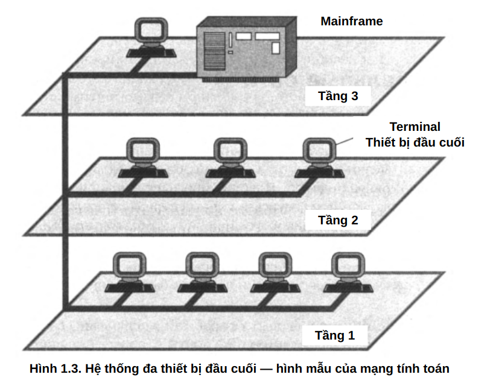

Hình 1.3. Hệ thống đa thiết bị đầu cuối — hình mẫu của mạng tính toán

### 1.2.3 Những mạng toàn cầu đầu tiên

- **Mạng diện rộng hay còn gọi là mạng toàn cầu (Wide Area Network - WAN)** kết nối các máy tính phân tán về mặt địa lý, ban đầu thông qua mạng điện thoại và **modem**.  
- Hệ thống phát triển từ **kết nối thiết bị đầu cuối - máy tính (terminal-computer)** sang **kết nối máy tính - máy tính (computer-computer)**, cho phép trao đổi dữ liệu tự động.  
- Các dịch vụ ban đầu bao gồm chia sẻ tệp tin, **đồng bộ hóa cơ sở dữ liệu (database synchronization)** và **thư điện tử (email)**.  
- Giao thức mạng phát triển với mô hình truyền gói tin thay thế **chuyển mạch kênh (circuit switching)**, giúp tối ưu băng thông và giảm chi phí.  
- Ban đầu, **kênh truyền (communication channels)** có tốc độ thấp (~kbit/s), chủ yếu hỗ trợ truyền file và email, nhưng dần nâng cấp với các tiêu chuẩn như **X.25** vào thập niên 1970.  
- **ARPANET**, phát triển bởi Bộ Quốc phòng Mỹ năm 1969, là tiền thân của **Internet**, áp dụng **hệ điều hành mạng (network operating systems)** để quản lý tài nguyên phân tán và **giao thức truyền thông (communication protocols)**.  
- **Số hóa thoại (digital voice transmission)** trong mạng điện thoại thúc đẩy sự phát triển của **mạng số tốc độ cao (high-speed digital networks)**, giúp **mạng WAN** đạt chất lượng dịch vụ ngang tầm **mạng LAN**.

### 1.2.4 Những mạng cục bộ đầu tiên

- **Mạng cục bộ (Local Area Networks - LANs)** phát triển từ đầu những năm 1970 nhờ sự ra đời của **mạch tích hợp quy mô lớn (Large Scale Integrated Circuits - LSI)**, giúp giảm giá thành và tăng khả năng của máy tính mini.  
- **Máy tính mini** trở thành đối thủ cạnh tranh với **máy tính lớn (mainframes)**, phá vỡ quy luật Grosch khi nhiều **máy tính nhỏ** có thể thay thế một **máy tính lớn** với cùng chi phí nhưng hiệu suất tốt hơn cho **tác vụ song song (parallel tasks)**.  
- Các bộ phận trong doanh nghiệp có thể sở hữu máy tính riêng để quản lý sản xuất, kho bãi và vận hành công nghệ.  
- **Tài nguyên tính toán (computing resources)** phân bố trên toàn doanh nghiệp, nhưng vẫn hoạt động độc lập , chưa có liên kết mạng thực sự.

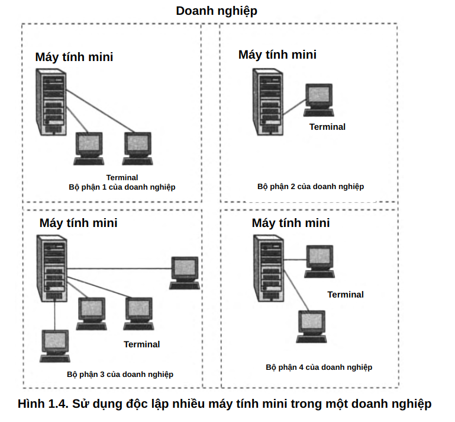

Hình 1.4. Sử dụng độc lập nhiều máy tính mini trong một doanh nghiệp

- **Mạng cục bộ (Local Area Network - LAN)** kết nối các máy tính trong phạm vi nhỏ (~1-2 km), thường thuộc về một tổ chức.  
- Ban đầu, các máy tính mini kết nối với nhau qua **bộ ghép nối (interface devices)** để trao đổi dữ liệu tự động giữa các bộ phận doanh nghiệp.  
- **Mạng Ethernet tiêu chuẩn (Standard Ethernet networks)** dần thay thế các giải pháp riêng lẻ, tạo ra nền tảng chung cho việc kết nối **máy tính cá nhân (PCs)** với nhau và với máy chủ.  
- **Công nghệ chuyển mạch gói (packet switching technology)** từ mạng diện rộng được áp dụng vào LANs, giúp cải thiện hiệu suất truyền dữ liệu.  
- Cuối thập niên 1980, các **chuẩn mạng LAN (LAN standards)** gồm **Ethernet, Token Ring, Arcnet, FDDI** ra đời, nhưng Ethernet trở thành lựa chọn phổ biến nhất.  
- **Máy tính cá nhân (PCs)** thay thế **máy tính mini**, trở thành nền tảng chính của LANs, hoạt động như **máy khách (clients)** và **máy chủ (servers)**.  
- **Kết nối đơn giản (plug-and-play connectivity)** giúp LANs dễ triển khai, thúc đẩy sự phổ biến của máy tính trong doanh nghiệp và hộ gia đình.  
- Cuối thập niên 1990, **Ethernet 10 Mbps, Fast Ethernet 100 Mbps và Gigabit Ethernet 1 Gbps** trở thành tiêu chuẩn, nhờ hiệu suất cao và chi phí thấp.

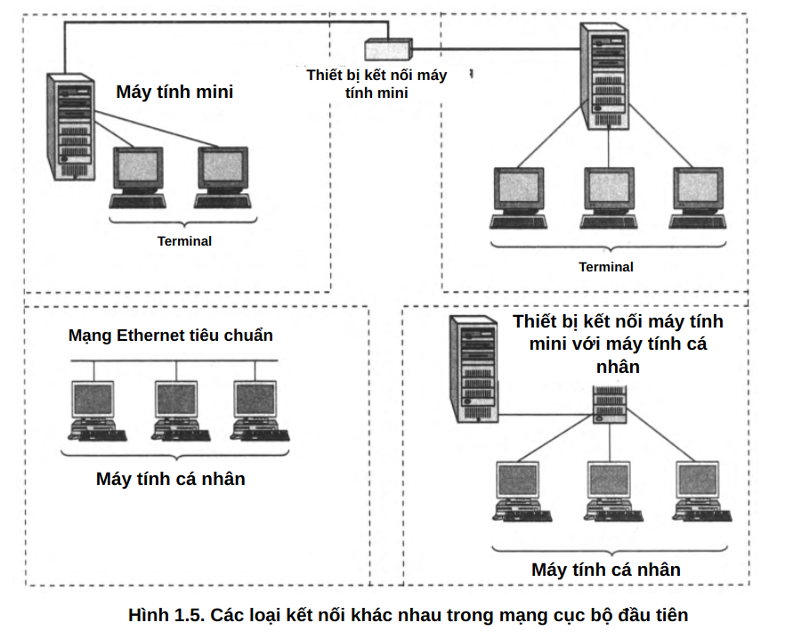

Hình 1.5. Các loại kết nối khác nhau trong mạng cục bộ đầu tiên

## 1.3 Hội tụ mạng

### 1.3.1 Hội tụ giữa mạng cục bộ và mạng toàn cầu

- **Sự hội tụ giữa mạng LAN và WAN (Convergence of LANs and WANs)** trở nên rõ ràng vào cuối thập niên 1980 do sự khác biệt giảm dần về **độ tin cậy (reliability)**, phương thức truyền dữ liệu, **tốc độ (speed)** và dịch vụ.  
- **LANs** sử dụng **kết nối cự ly ngắn (short-distance connections)** với **băng thông cao (high bandwidth)**, trong khi **WANs** phải tối ưu hóa cho **kênh truyền xa (long-distance links)** có **độ trễ cao (high latency)**.  
- **Mạng WAN nâng cấp** nhờ **Frame Relay, ATM**, cải thiện truyền gói tin với độ trễ thấp hơn, giảm mất gói.  
- **Internet phát triển mạnh** từ thập niên 1990, hợp nhất nhiều công nghệ mạng vào mô hình IP.  
- **Mạng diện rộng đô thị (Metropolitan Area Networks - MANs)** xuất hiện, kết nối **mạng LAN quy mô lớn** với tốc độ **hàng trăm Mbps đến Gbps**.  
- **Ethernet mở rộng ra mạng WAN** với Ethernet qua quang, giúp LAN và WAN hoạt động trên nền IP đồng nhất.

### 1.3.2 Hội tụ giữa mạng máy tính và mạng viễn thông

- **Mạng hội tụ (Converged Networks)** xuất hiện từ thập niên 1980 với mục tiêu hợp nhất mạng máy tính  và mạng viễn thông, hình thành **mạng đa dịch vụ (multiservice networks)**.  
- **Mạng viễn thông** truyền thống bao gồm **radio, điện thoại, truyền hình**, trong khi **mạng máy tính** tập trung vào truyền dữ liệu.  
- Hội tụ dữ liệu và đa phương tiện cho phép truyền cả thông tin thoại (voice), video và dữ liệu trên nền tảng chung.  
- **ISDN (Integrated Services Digital Network)** là một trong những công nghệ đầu tiên kết hợp thoại và dữ liệu nhưng bị thay thế bởi **Internet** và **IP-based services**.  
- **Internet trở thành nền tảng chính** cho **IP telephony, video streaming, cloud computing**, làm mờ ranh giới giữa **mạng viễn thông và mạng máy tính**.  
- **Công nghệ di động (Mobile Technologies - 3G, 4G, 5G)** hỗ trợ dịch vụ IP, giúp **mạng điện thoại và mạng dữ liệu hội tụ hoàn toàn**.  
- **Chuyển mạch gói (Packet switching)** thay thế **chuyển mạch kênh (Circuit switching)** trong viễn thông, tối ưu hóa băng thông và hỗ trợ **QoS (Quality of Service)** để đảm bảo độ trễ thấp cho dịch vụ thời gian thực.

## 1.4 Internet như một yếu tố phát triển công nghệ mạng

- Internet là đỉnh cao của mạng viễn thông, phát triển mạnh mẽ từ thập niên 1980 và tiếp tục mở rộng.  
- Chỉ số phát triển Internet gồm số lượng người dùng, thiết bị đầu cuối, lưu lượng dữ liệu.  
- Thiết bị Internet tăng từ 1000 host (1980) → 1 triệu (1991) → 100 triệu (2000) → hơn 1 tỷ (2018), với 23 tỷ thiết bị kết nối.  
- Lưu lượng dữ liệu tăng theo cấp số nhân:  
  - **1990: 1 TB → 2000: 84 PB → 2013: 50 EB → 2018: 129 EB**  
- Máy tính cá nhân (PCs) giảm dần, thay thế bởi thiết bị di động (smartphones, tablets) và thiết bị IoT (Internet of Things).  
- Dịch vụ Internet chuyển từ tải file sang truyền phát video , với nội dung theo yêu cầu dẫn đầu từ 2010.  
- **Điện toán đám mây (cloud computing)** đẩy mạnh xử lý dữ liệu từ xa thay vì lưu trữ cục bộ.  
- Ô tô tự hành cần kết nối Internet tốc độ cao và độ trễ thấp để xử lý dữ liệu AI theo thời gian thực.  
- Tăng trưởng và biến đổi liên tục của Internet buộc công nghệ mạng phải thích ứng, phát triển kiến trúc điện toán biên để đáp ứng yêu cầu độ trễ thấp. 

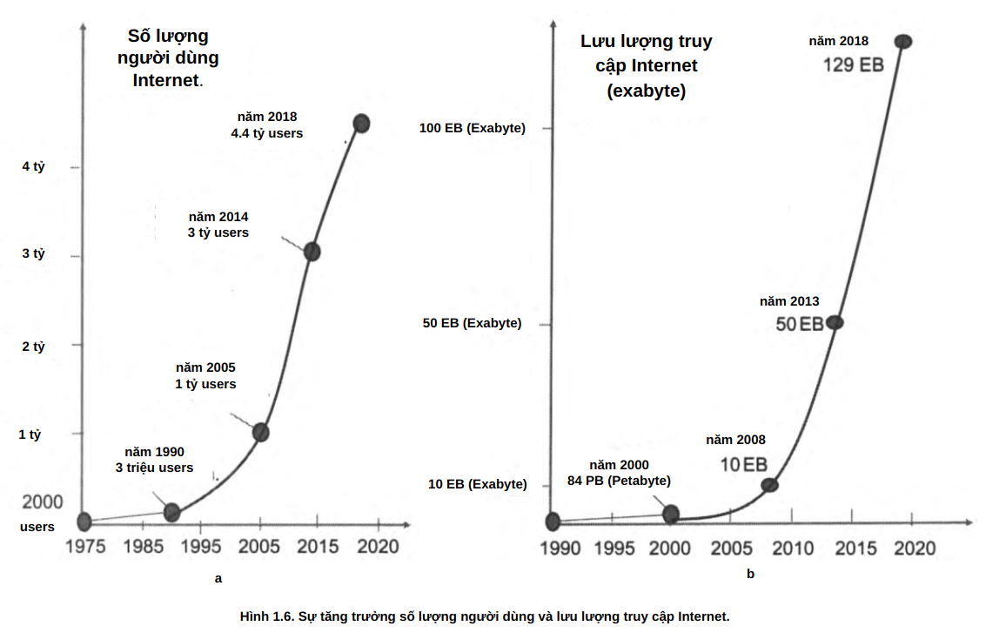

Hình 1.6. Sự tăng trưởng số lượng người dùng và lưu lượng truy cập Internet.

<h1 id="chuong-2-cac-nguyen-tac-chung-trong-xay-dung-mang">CHƯƠNG 2: Các nguyên tắc chung trong xây dựng mạng</h1>

## 2.1 Mạng đơn giản nhất với hai máy tính

### 2.1.2 Chia sẻ tài nguyên

Nguyên tắc cơ bản của mạng máy tính với mô hình kết nối đơn giản giữa hai máy tính để chia sẻ tài nguyên. Tài nguyên chia sẻ gồm thiết bị ngoại vi (ổ đĩa, máy in, máy quét), dữ liệu (bộ nhớ trong, thiết bị lưu trữ ngoài) và khả năng tính toán (chạy chương trình từ xa). Máy tính cần kết nối bằng phương tiện mạng để chia sẻ tài nguyên. Minh họa mô tả hai máy tính, một máy kết nối trực tiếp với máy in, máy còn lại sử dụng máy in qua mạng.

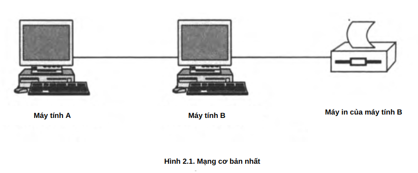

Hình 2.1. Mạng cơ bản nhất

### 2.1.2 Giao diện mạng

Phân loại và nguyên tắc hoạt động của giao diện mạng.  

- **Giao diện vật lý (cổng)**: Tập hợp các kết nối điện và tín hiệu truyền thông, thường là cổng kết nối với các chân tiếp xúc, dây cáp hoặc kênh truyền dữ liệu.  
- **Giao diện logic (giao thức)**: Tập hợp quy tắc truyền thông, định dạng dữ liệu và cách thức trao đổi thông tin giữa các thiết bị.  

Hai loại giao diện mạng chính:  
1. **Giao diện máy tính - máy tính**:  
   - Thành phần phần cứng: Card mạng (NIC - Network Interface Card).  
   - Thành phần phần mềm: Trình điều khiển card mạng.  

2. **Giao diện máy tính - thiết bị ngoại vi (máy in)**:  
   - Từ máy tính: Trình điều khiển card mạng và trình điều khiển máy in.  
   - Từ thiết bị ngoại vi: Giao diện máy in nhận dữ liệu, lệnh và thực thi tác vụ in.  

Hình minh họa mô tả cách hai máy tính giao tiếp với nhau và với máy in thông qua các tầng giao diện mạng.

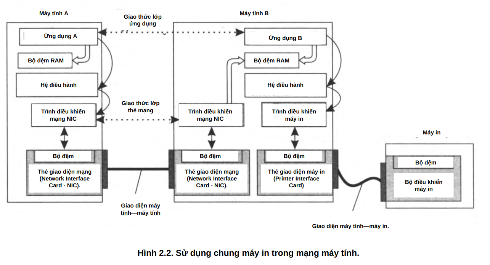

Hình 2.2. Sử dụng chung máy in trong mạng máy tính.

### 2.1.3 Kết nối máy tính với thiết bị ngoại vi

Quy trình kết nối máy tính với thiết bị ngoại vi (máy in) qua mạng:  

1. **Yêu cầu in dữ liệu**  
   - Ứng dụng trên máy B cần in dữ liệu, gửi yêu cầu đến hệ điều hành.  
   - Yêu cầu chứa địa chỉ dữ liệu cần in và thông tin thiết bị in.  

2. **Xử lý yêu cầu bởi hệ điều hành**  
   - Hệ điều hành kích hoạt trình điều khiển máy in.  
   - Trình điều khiển tương tác với giao diện mạng để gửi dữ liệu đến máy in.  

3. **Gửi lệnh in qua trình điều khiển**  
   - Trình điều khiển máy in dịch lệnh in thành các lệnh điều khiển cụ thể như "In ký tự", "Xuống dòng", "Trả đầu dòng".  
   - Dữ liệu in được truyền vào bộ đệm của card mạng và gửi tới máy in.  

4. **Xử lý dữ liệu bởi card mạng**  
   - Card mạng truyền dữ liệu tuần tự dưới dạng tín hiệu điện.  
   - Mỗi byte dữ liệu được đánh dấu bằng tín hiệu bắt đầu và kết thúc.  

5. **Xử lý dữ liệu bởi bộ điều khiển máy in**  
   - Máy in nhận tín hiệu, ghép thành byte và kiểm tra tính toàn vẹn dữ liệu.  
   - Nếu hợp lệ, máy in thực thi lệnh in và thông báo trạng thái hoàn thành.

### 2.1.4 Trao đổi dữ liệu giữa hai máy tính

Trao đổi dữ liệu giữa hai máy tính:  

- **Cơ chế trao đổi dữ liệu**  
  - Hai máy tính giao tiếp bằng cách trao đổi thông điệp.  
  - Ứng dụng trên mỗi máy phải tuân thủ giao thức chung để hiểu và phản hồi đúng cách.  

- **Quy trình gửi dữ liệu**  
  - Ứng dụng A gửi thông điệp vào bộ đệm RAM.  
  - Hệ điều hành kích hoạt trình điều khiển card mạng.  
  - Card mạng truyền dữ liệu tuần tự dưới dạng tín hiệu.  

- **Quy trình nhận dữ liệu**  
  - Card mạng máy B nhận dữ liệu, kiểm tra lỗi và lưu vào bộ đệm.  
  - Hệ điều hành truyền dữ liệu cho ứng dụng B.  
  - Ứng dụng B xử lý và phản hồi nếu cần.  

- **Tính đồng bộ và xác nhận**  
  - Mỗi byte dữ liệu có tín hiệu bắt đầu và kết thúc.  
  - Máy nhận xác nhận từng gói dữ liệu để đảm bảo truyền tải chính xác.  

Cơ chế này đảm bảo ứng dụng trên hai máy tính có thể giao tiếp chính xác qua mạng.

### 2.1.5 Truy cập thiết bị ngoại vi qua mạng

Truy cập thiết bị ngoại vi qua mạng:  

1. **Ứng dụng A gửi yêu cầu**  
   - Ứng dụng A tạo thông điệp yêu cầu in, chứa thông tin cần thiết.  
   - Lưu thông điệp vào bộ đệm RAM và gửi yêu cầu đến hệ điều hành.  

2. **Hệ điều hành truyền dữ liệu qua mạng**  
   - Kích hoạt trình điều khiển card mạng trên máy A.  
   - Card mạng A gửi dữ liệu đến card mạng B, chuyển vào bộ đệm RAM máy B.  

3. **Ứng dụng B xử lý yêu cầu**  
   - Ứng dụng B nhận dữ liệu từ bộ đệm, phân tích và xác định hành động.  
   - Gửi yêu cầu đến hệ điều hành để thực hiện tác vụ in.  

4. **Thực thi lệnh in**  
   - Hệ điều hành máy B gọi trình điều khiển máy in.  
   - Trình điều khiển giao tiếp với card mạng và bộ điều khiển máy in.  

5. **Máy in thực hiện lệnh in**  
   - Máy in nhận dữ liệu, kiểm tra và tiến hành in theo yêu cầu.  

Cơ chế này cho phép thiết bị ngoại vi (máy in) được sử dụng từ xa thông qua mạng máy tính.

## 2.2 Phần mềm mạng

### 2.2.1 Dịch vụ và dịch vụ mạng

- **Dịch vụ và dịch vụ mạng**  
  - Các ứng dụng có thể cần truy cập từ xa đến tài nguyên như máy in, tệp tin hoặc cơ sở dữ liệu.  
  - Thay vì mỗi ứng dụng tự xử lý, chức năng này được tách thành **mô-đun khách hàng (client)** và **mô-đun máy chủ (server)**.  
  - Ví dụ: Dịch vụ in mạng gồm **client in** gửi yêu cầu và **server in** xử lý yêu cầu.  

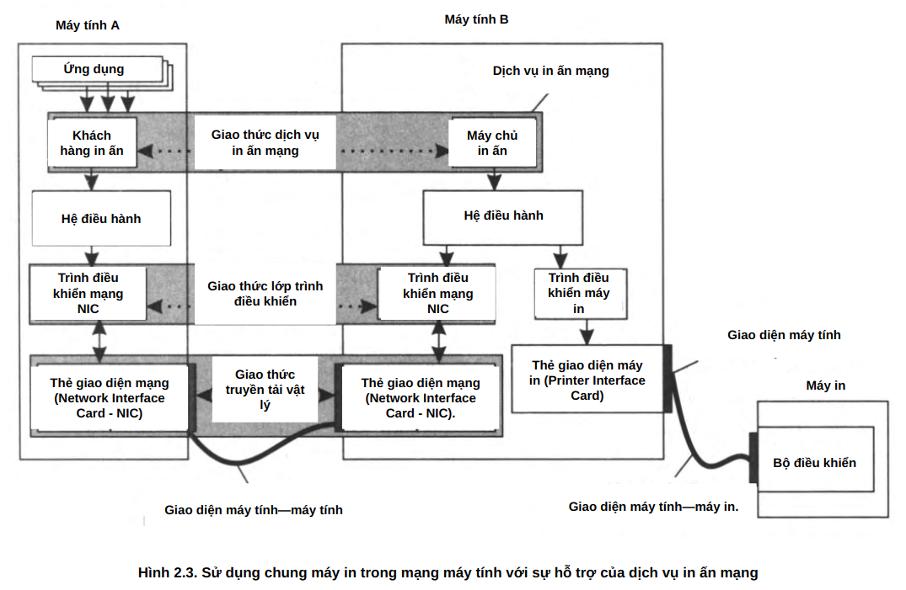

Hình 2.3. Sử dụng chung máy in trong mạng máy tính với sự hỗ trợ của dịch vụ in ấn mạng.

- **Khách hàng (Client)**  
  - Gửi yêu cầu truy cập tài nguyên từ xa.  
  - Nhận và xử lý phản hồi từ máy chủ.  

- **Máy chủ (Server)**  
  - Luôn sẵn sàng nhận yêu cầu từ client.  
  - Xử lý yêu cầu và trả kết quả.  

- **Dịch vụ Web**  
  - Gồm **web-server** (máy chủ cung cấp nội dung web) và **web-browser** (trình duyệt truy cập nội dung).  
  - Giao tiếp qua giao thức HTTP.  
  - Có thể lưu trữ dữ liệu trên **web-site** hoặc dịch vụ đám mây.  

- **Truyền thông qua mạng**  
  - Dữ liệu có thể đi trực tiếp giữa client và server hoặc qua nhiều thiết bị trung gian.  
  - Sử dụng **phương tiện truyền thông mạng** để đảm bảo truyền tải dữ liệu ổn định.  

Hệ thống phần mềm mạng giúp tổ chức truy cập tài nguyên hiệu quả thông qua các dịch vụ chuyên biệt.

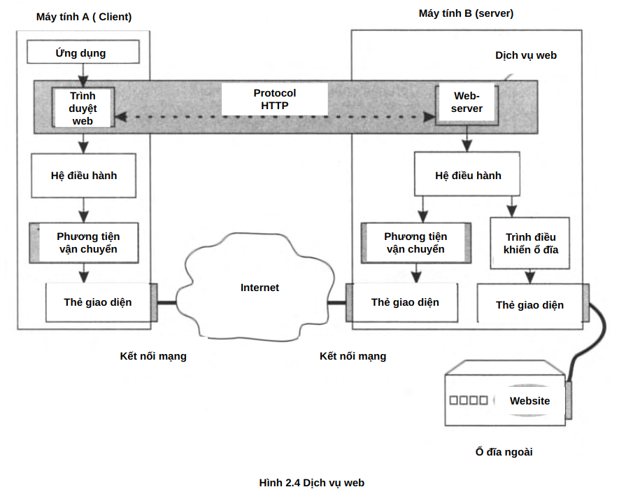

Hình 2.4 Dịch vụ web

### 2.2.2 Hệ điều hành mạng (Network Operating System)

Hệ điều hành mạng (Network Operating System - NOS):  

- **Khái niệm**  
  - Mở rộng khả năng quản lý tài nguyên của hệ điều hành đến nhiều máy tính trong mạng.  
  - Cung cấp giao diện và công cụ giúp người dùng, ứng dụng truy cập tài nguyên từ xa.  

- **Thành phần chính của hệ điều hành mạng**  
  - **Dịch vụ mạng (Network Services)**: Quản lý các tài nguyên chia sẻ (máy in, tệp tin, cơ sở dữ liệu).  
  - **Giao tiếp mạng (Networking Communication)**: Gồm các trình điều khiển giao diện mạng và giao thức truyền thông.  
  - **Quản lý tài nguyên cục bộ**: Điều khiển các thiết bị và tài nguyên trên chính máy tính.  

- **Phân loại hệ điều hành mạng**  
  1. **Hệ điều hành đồng đẳng (Peer-to-Peer OS)**  
     - Các máy tính vừa có thể làm máy khách (client), vừa có thể làm máy chủ (server).  
     - Thường dùng trong mạng nhỏ, chia sẻ tài nguyên đơn giản.  
  2. **Hệ điều hành máy khách (Client OS)**  
     - Máy tính chạy client OS có thể truy cập tài nguyên mạng nhưng không cung cấp dịch vụ mạng.  
  3. **Hệ điều hành máy chủ (Server OS)**  
     - Cung cấp dịch vụ mạng như lưu trữ tệp, quản lý người dùng, xử lý yêu cầu từ client.  
     - Máy chủ thường không dùng cho tác vụ cá nhân mà tập trung vào phục vụ mạng.  

- **Vai trò của hệ điều hành mạng**  
  - Hỗ trợ dịch vụ mạng như web, email, tệp tin, in ấn.  
  - Tích hợp các giao thức truyền thông để đảm bảo kết nối hiệu quả.  
  - Quản lý tài nguyên và người dùng trong mạng một cách bảo mật.  

Hệ điều hành mạng là nền tảng quan trọng giúp các thiết bị và ứng dụng giao tiếp, chia sẻ tài nguyên trong hệ thống mạng.

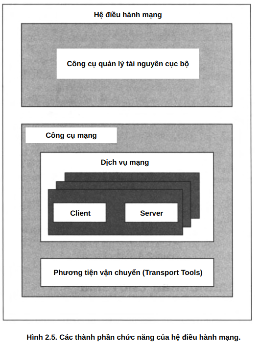

Hình 2.5. Các thành phần chức năng của hệ điều hành mạng.

### 2.2.3 Ứng dụng mạng (Network Applications)

- **Ứng dụng cục bộ (Local Application)**  
  - Chạy hoàn toàn trên một máy tính, chỉ sử dụng tài nguyên cục bộ.  
  - Không yêu cầu kết nối mạng để hoạt động.  

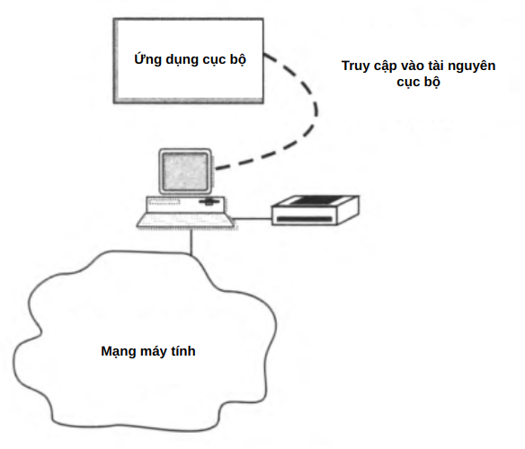

Hình 2.6 a. Các loại ứng dụng hoạt động trong mạng.

- **Ứng dụng mạng tập trung (Centralized Network Application)**  
  - Chạy trên một máy tính nhưng truy cập tài nguyên từ các máy khác trong mạng.  
  - Ví dụ: Một ứng dụng trên máy khách lấy dữ liệu từ máy chủ tệp và gửi lệnh in đến máy chủ in.  

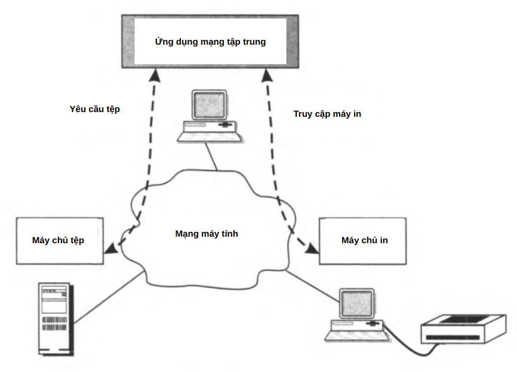

Hình 2.6 b. Các loại ứng dụng hoạt động trong mạng.

- **Ứng dụng mạng phân tán (Distributed Network Application)**  
  - Bao gồm nhiều phần chạy trên các máy tính khác nhau, cùng phối hợp xử lý nhiệm vụ.  
  - Ví dụ: Một hệ thống phân tích dữ liệu có thể chia các phần xử lý giao diện, phân tích dữ liệu và lưu trữ lên nhiều máy chủ khác nhau.  

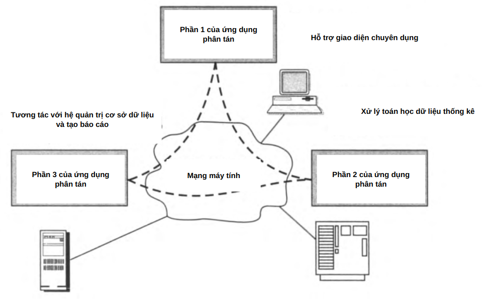

Hình 2.6 c. Các loại ứng dụng hoạt động trong mạng.

- **Dịch vụ web phân tán (Distributed Web Services)**  
  - Một dạng ứng dụng mạng phân tán, với máy chủ web xử lý hàng trăm, hàng nghìn yêu cầu từ trình duyệt của các thiết bị khác nhau.  
  - Ví dụ: Hệ thống xử lý dữ liệu của CERN với hơn 30.000 máy tính được kết nối.  

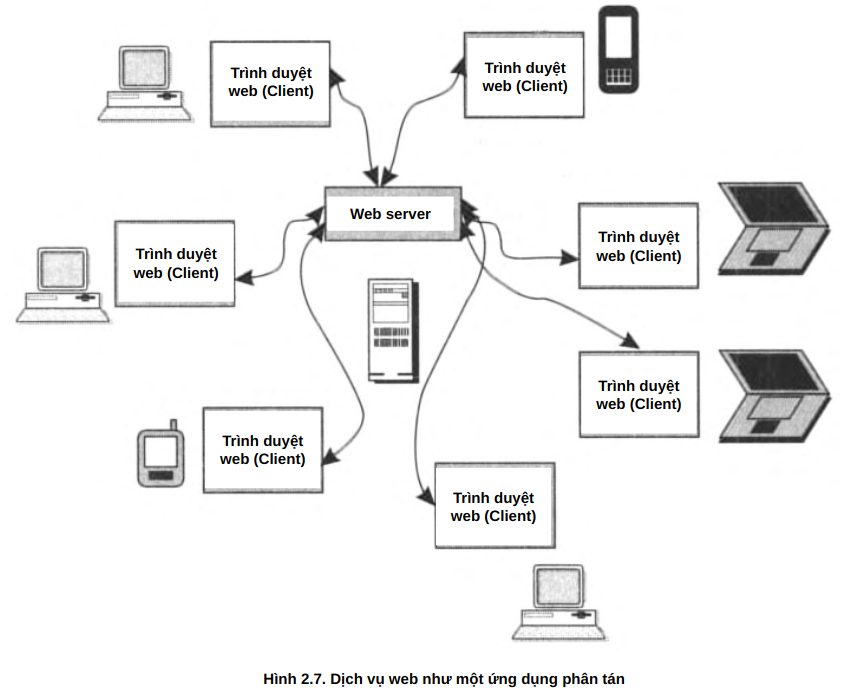

**Hình 2.7.** Dịch vụ web như một ứng dụng phân tán.

Ứng dụng mạng giúp tối ưu hóa hiệu suất, phân tán tài nguyên và hỗ trợ nhiều người dùng đồng thời.

## 2.3 Truyền dữ liệu vật lý qua đường truyền (Physical Data Transmission via Communication Lines)

### 2.3.1 Mã hóa (Encoding) 

- **Mã hóa tín hiệu**  
  - Dữ liệu trong máy tính được biểu diễn bằng **mã nhị phân (0,1)** dưới dạng tín hiệu điện hoặc quang.  
  - Có nhiều phương pháp mã hóa:  
    - **Mã hóa tiềm năng**: 0 và 1 được biểu diễn bằng các mức điện áp khác nhau.  
    - **Mã hóa xung**: Sử dụng các xung có cường độ khác nhau để biểu diễn bit dữ liệu.  
    - **Điều chế (Modulation)**: Biểu diễn dữ liệu bằng sóng sin để truyền trên kênh có chất lượng thấp.  

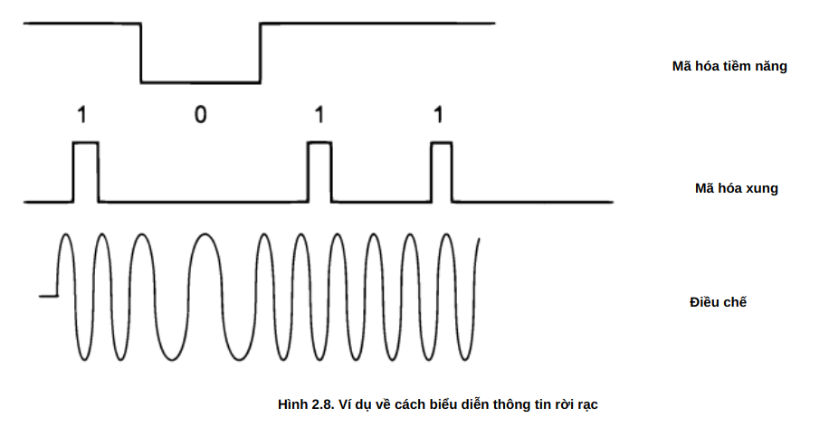

Hình 2.8. Ví dụ về cách biểu diễn thông tin rời rạc

- **Vấn đề suy giảm tín hiệu và nhiễu**  
  - Truyền dữ liệu qua dây dẫn dài dễ bị nhiễu và biến dạng tín hiệu.  
  - Giải pháp: Dùng các phương pháp mã hóa phù hợp và bổ sung cơ chế kiểm tra lỗi.  

- **Đồng bộ hóa tín hiệu (Synchronization)**  
  - Tránh lỗi do lệch pha hoặc mất đồng bộ giữa máy phát và máy thu.  
  - Có thể sử dụng tín hiệu xung đồng bộ hoặc mã đồng bộ trong dữ liệu truyền.  

- **Kiểm tra lỗi truyền dữ liệu**  
  - **Tính tổng kiểm tra (Checksum)**: Tính toán và gửi kèm dữ liệu để phát hiện lỗi.  
  - **Tín hiệu xác nhận (Acknowledgment Signal)**: Máy thu phản hồi để xác nhận dữ liệu nhận đúng.  

Những cơ chế này giúp truyền dữ liệu qua mạng ổn định, chính xác, giảm thiểu lỗi và mất dữ liệu.

### 2.3.2 Đặc tính của các kênh vật lý (Characteristics of Physical Channels)

**Đặc điểm của kênh truyền vật lý:**  

- **Tải dữ liệu đầu vào (Offered Load):**  
  - Tổng lượng dữ liệu mà ứng dụng gửi vào mạng.  
  - Được đo bằng tốc độ tạo dữ liệu (bit/s).  

- **Băng thông (Throughput Capacity):**  
  - Tốc độ tối đa mà kênh có thể truyền dữ liệu.  
  - Không phụ thuộc vào tải đầu vào mà do đặc tính vật lý của kênh quyết định.  
  - Ví dụ: Ethernet quang có thể đạt 10 Gbit/s, Fast Ethernet đạt 100 Mbit/s, Gigabit Ethernet đạt 1 Gbit/s.  

- **Tắc nghẽn và nút cổ chai (Bottleneck):**  
  - Tốc độ truyền của một đường dẫn bị giới hạn bởi thành phần chậm nhất trong tuyến.  

- **Tốc độ truyền dữ liệu thực tế (Information Rate):**  
  - Tổng lượng dữ liệu thực tế truyền qua kênh trong một khoảng thời gian.  
  - Bị ảnh hưởng bởi lỗi truyền, mất gói, nghẽn mạng.  

**Các kiểu kênh truyền:**  

- **Kênh song công (Full-duplex):**  
  - Truyền dữ liệu đồng thời theo cả hai hướng.  
  - Ví dụ: Cáp quang có hai sợi riêng biệt cho hai chiều truyền.  

- **Kênh bán song công (Half-duplex):**  
  - Truyền theo hai hướng nhưng không đồng thời, từng bên lần lượt truyền.  
  - Ví dụ: Bộ đàm.  

- **Kênh đơn công (Simplex):**  
  - Chỉ truyền theo một chiều duy nhất.  
  - Ví dụ: Truyền hình cáp.  

Các đặc điểm này giúp đánh giá hiệu suất và lựa chọn phương thức truyền phù hợp trong mạng.

## 2.4 Vấn đề kết nối nhiều máy tính

### 2.4.1 Cấu trúc liên kết của các kết nối vật lý (Topology of Physical Connections)
 
 > **Cấu trúc liên kết mạng (Network Topology)** là cấu hình của một đồ thị (graph), trong đó các đỉnh (vertices) tương ứng với các nút cuối (end nodes) của mạng (ví dụ: máy tính) và thiết bị truyền thông (communication devices) (ví dụ: bộ định tuyến – router), và các cạnh (edges) là các kết nối thông tin vật lý giữa các đỉnh.

- **Tôpô mạng:**  
  - Cấu trúc kết nối giữa các máy tính và thiết bị mạng.  
  - Xác định cách dữ liệu được truyền giữa các thiết bị.  

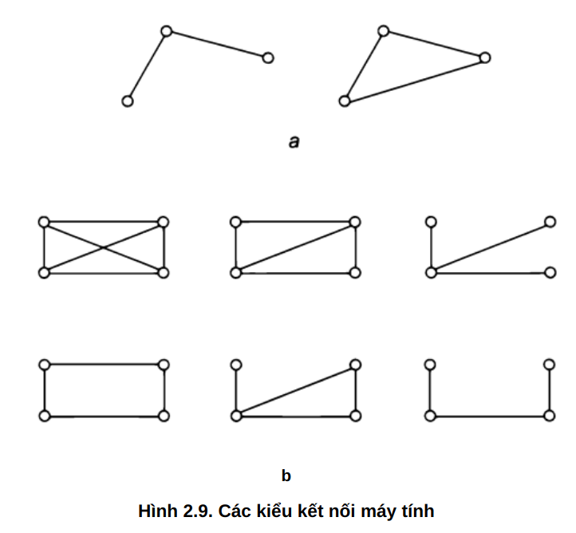

Hình 2.9. Các kiểu kết nối máy tính

- **Các kiểu tôpô phổ biến:**  
  1. **Tôpô hoàn toàn liên kết (Fully Connected)**  
     - Mỗi máy kết nối trực tiếp với tất cả các máy khác.  
     - Tăng độ tin cậy nhưng tốn nhiều cổng kết nối và dây cáp.  

  2. **Tôpô hình lưới (Mesh Topology)**  
     - Một số nút kết nối trực tiếp với nhau, các nút khác sử dụng đường dẫn trung gian.  
     - Cải thiện khả năng chịu lỗi, thường dùng trong mạng lớn.  

  3. **Tôpô vòng (Ring Topology)**  
     - Các thiết bị kết nối theo vòng khép kín.  
     - Dữ liệu đi theo một hướng cố định, cần có cơ chế kiểm soát lỗi.  

  4. **Tôpô hình sao (Star Topology)**  
     - Mỗi thiết bị kết nối với một trung tâm (hub/switch).  
     - Dễ dàng mở rộng, nhưng nếu trung tâm hỏng, toàn mạng ngừng hoạt động.  

  5. **Tôpô cây (Hierarchical Star/Tree Topology)**  
     - Kết hợp nhiều tôpô hình sao thành hệ thống phân cấp.  
     - Dùng trong mạng LAN lớn.  

  6. **Tôpô bus (Bus Topology)**  
     - Tất cả thiết bị chia sẻ một đường truyền chính.  
     - Dễ triển khai nhưng hiệu suất giảm khi số nút tăng.  

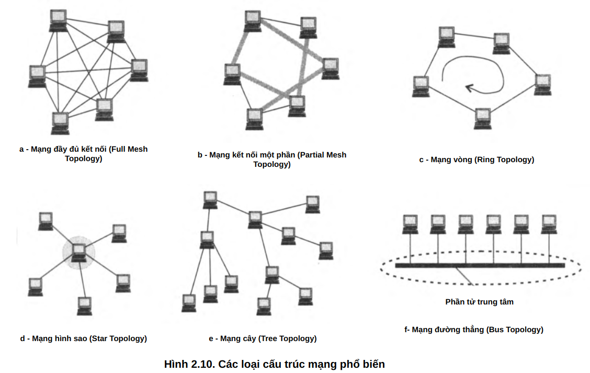

Hình 2.10. Các loại cấu trúc mạng phổ biến

  7. **Tôpô hỗn hợp (Hybrid Topology)**  
     - Kết hợp nhiều kiểu tôpô khác nhau.  
     - Phù hợp với hệ thống mạng lớn và phức tạp.  

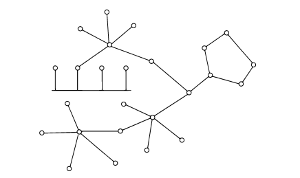

Hình 2.11. Cấu trúc mạng hỗn hợp.

Việc lựa chọn tôpô phù hợp giúp tối ưu hiệu suất, độ tin cậy và khả năng mở rộng của mạng.

### 2.4.2 Định địa chỉ các nút mạng

**Định địa chỉ nút mạng (Network Node Addressing):**  

- **Các loại địa chỉ mạng:**  
  1. **Địa chỉ đơn nhất (Unicast Address):** Gán cho một thiết bị duy nhất trong mạng.  
  2. **Địa chỉ nhóm (Multicast Address):** Xác định một nhóm thiết bị, dữ liệu gửi đến tất cả các nút trong nhóm.  
  3. **Địa chỉ quảng bá (Broadcast Address):** Gửi đến toàn bộ thiết bị trong mạng.  
  4. **Địa chỉ phát tán ngẫu nhiên (Anycast Address):** Chỉ gửi đến một nút gần nhất trong nhóm.  

- **Loại địa chỉ:**  
  - **Địa chỉ số (Numeric Address):** Ví dụ: 192.168.1.1.  
  - **Địa chỉ ký hiệu (Symbolic Address):** Ví dụ: `ftp.arch1.ucl.ac.uk`.  

- **Tổ chức địa chỉ:**  
  - **Địa chỉ phẳng (Flat Addressing):** Không có cấu trúc phân cấp, như địa chỉ MAC.  
  - **Địa chỉ phân cấp (Hierarchical Addressing):** Chia thành nhóm, miền, nút giúp dễ quản lý và định tuyến.  

- **Dịch địa chỉ:**  
  - **Phương pháp tập trung:** Máy chủ lưu trữ bảng ánh xạ tên và địa chỉ số (DNS).  
  - **Phương pháp phân tán:** Máy tính tự xác định địa chỉ phần cứng bằng giao thức ARP.  

- **Số hiệu cổng (Port Number):**  
  - Dùng để định danh ứng dụng hoặc dịch vụ đang chạy trên thiết bị.  
  - Ví dụ: HTTP (80), HTTPS (443).  

Cấu trúc địa chỉ mạng giúp tổ chức và quản lý việc truyền dữ liệu hiệu quả, hỗ trợ định tuyến linh hoạt.

### 2.4.3 Chuyển mạch (Switching)

**Chuyển mạch (Switching):**  

- **Khái niệm:**  
  - Khi hai nút mạng không kết nối trực tiếp, dữ liệu phải đi qua các nút trung gian (transit nodes).  
  - Quá trình này được gọi là **chuyển mạch (switching)**, và chuỗi các nút trung gian tạo thành **tuyến đường (route).**  

- **Ví dụ minh họa:**  
  - Trong mạng có các nút 2 và 4 không kết nối trực tiếp.  
  - Dữ liệu phải đi qua các nút trung gian 1 và 5 theo tuyến **2 → 1 → 5 → 4**.  
  - Nút 2 là điểm gửi, nút 4 là điểm nhận, các nút 1 và 5 đóng vai trò trung gian.  

Chuyển mạch giúp định tuyến dữ liệu trong các mạng không hoàn toàn kết nối, đảm bảo liên lạc giữa mọi thiết bị.

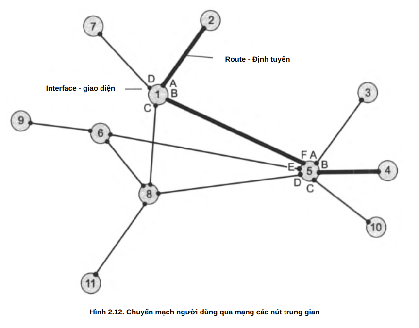

Hình 2.12. Chuyển mạch người dùng qua mạng các nút trung gian

