## Mục lục

# Phần I: Cơ bản về mạng truyền dữ liệu
- [Chương 1: Sự phát triển của mạng máy tính](#chuong-1-su-phat-trien-cua-mang-may-tinh)
- [Chương 2: Các nguyên tắc chung trong xây dựng mạng](#chuong-2-cac-nguyen-tac-chung-trong-xay-dung-mang)
- [Chương 3: Chuyển mạch kênh và chuyển mạch gói](#chuong-3-chuyen-mach-kenh-va-chuyen-mach-goi)
- [Chương 4: Chuẩn hóa và phân loại mạng](#chuong-4-chuan-hoa-va-phan-loai-mang)
- [Chương 5: Các đặc tính mạng và chất lượng dịch vụ](#chuong-5-cac-dac-tinh-mang-va-chat-luong-dich-vu)
- [Câu hỏi cho Phần I](#cau-hoi-cho-phan-i)

## Nội dung

<h1 id="chuong-1-su-phat-trien-cua-mang-may-tinh">CHƯƠNG 1: Sự phát triển của mạng máy tính</h1>

## 1.1 Hai nguồn gốc của mạng máy tính
 
- **Mạng máy tính** là kết quả phát triển từ hai ngành quan trọng: **kỹ thuật tính toán (computing technology)** và **viễn thông (telecommunications technology)**.  
- Chúng có hai vai trò chính:  
  1. **Hệ thống máy tính liên kết (interconnected computer system)** giúp trao đổi dữ liệu và thực hiện các nhiệm vụ tự động.  
  2. **Phương tiện truyền thông tin (information transmission medium)** giúp mã hóa, truyền và xử lý dữ liệu trong các hệ thống viễn thông như mạng điện thoại.

Hình 1.1. Sự tiến hóa của mạng máy tính tại giao điểm của công nghệ tính toán và công nghệ viễn thông.

## 1.2 Những mạng máy tính đầu tiên

### 1.2.1 Hệ thống xử lý theo lô

- **Hệ thống xử lý theo lô (batch processing systems)** dựa trên **máy tính lớn (mainframe)**, nơi người dùng chuẩn bị **thẻ đục lỗ (punched cards)** chứa dữ liệu và chương trình, sau đó gửi vào trung tâm tính toán (computing center).  
- Tác vụ của nhiều người dùng được nhóm thành **gói (batch)** và xử lý tuần tự, tối ưu hóa việc sử dụng bộ xử lý .  
- Người dùng nhận kết quả sau một chu kỳ xử lý, gây độ trễ cao.  
- Chế độ tương tác chưa phổ biến do ưu tiên hiệu suất bộ xử lý hơn trải nghiệm người dùng.

Hình 1.2. Hệ thống tập trung dựa trên máy tính trung tâm (mainframe).

### 1.2.2 Hệ thống đa thiết bị đầu cuối — hình mẫu của mạng

- **Hệ thống đa thiết bị đầu cuối (multi-terminal systems)** với **chế độ chia sẻ thời gian (time-sharing mode)** cho phép mỗi người dùng có phiên làm việc riêng, giúp tương tác trực tiếp với mainframe.  
- Bộ xử lý phân chia tài nguyên theo thời gian, đảm bảo người dùng không nhận thấy độ trễ do chia sẻ hệ thống.  
- **Thiết bị đầu cuối (terminals)** mở rộng ra ngoài trung tâm tính toán, phân tán trong doanh nghiệp, trong khi khả năng tính toán vẫn tập trung.  
- Một số chức năng như **nhập/xuất dữ liệu (data input/output)** trở thành **hệ thống phân tán (distributed system)**.  
- Người dùng có thể  truy cập file và chạy chương trình từ bất kỳ thiết bị nào mà không cần thiết bị lưu trữ cá nhân.  
- Hệ thống này trở thành tiền đề cho **mạng máy tính cục bộ (local computer networks - LANs)**.

Hình 1.3. Hệ thống đa thiết bị đầu cuối — hình mẫu của mạng tính toán

### 1.2.3 Những mạng toàn cầu đầu tiên

- **Mạng diện rộng hay còn gọi là mạng toàn cầu (Wide Area Network - WAN)** kết nối các máy tính phân tán về mặt địa lý, ban đầu thông qua mạng điện thoại và **modem**.  
- Hệ thống phát triển từ **kết nối thiết bị đầu cuối - máy tính (terminal-computer)** sang **kết nối máy tính - máy tính (computer-computer)**, cho phép trao đổi dữ liệu tự động.  
- Các dịch vụ ban đầu bao gồm chia sẻ tệp tin, **đồng bộ hóa cơ sở dữ liệu (database synchronization)** và **thư điện tử (email)**.  
- Giao thức mạng phát triển với mô hình truyền gói tin thay thế **chuyển mạch kênh (circuit switching)**, giúp tối ưu băng thông và giảm chi phí.  
- Ban đầu, **kênh truyền (communication channels)** có tốc độ thấp (~kbit/s), chủ yếu hỗ trợ truyền file và email, nhưng dần nâng cấp với các tiêu chuẩn như **X.25** vào thập niên 1970.  
- **ARPANET**, phát triển bởi Bộ Quốc phòng Mỹ năm 1969, là tiền thân của **Internet**, áp dụng **hệ điều hành mạng (network operating systems)** để quản lý tài nguyên phân tán và **giao thức truyền thông (communication protocols)**.  
- **Số hóa thoại (digital voice transmission)** trong mạng điện thoại thúc đẩy sự phát triển của **mạng số tốc độ cao (high-speed digital networks)**, giúp **mạng WAN** đạt chất lượng dịch vụ ngang tầm **mạng LAN**.

### 1.2.4 Những mạng cục bộ đầu tiên

- **Mạng cục bộ (Local Area Networks - LANs)** phát triển từ đầu những năm 1970 nhờ sự ra đời của **mạch tích hợp quy mô lớn (Large Scale Integrated Circuits - LSI)**, giúp giảm giá thành và tăng khả năng của máy tính mini.  
- **Máy tính mini** trở thành đối thủ cạnh tranh với **máy tính lớn (mainframes)**, phá vỡ quy luật Grosch khi nhiều **máy tính nhỏ** có thể thay thế một **máy tính lớn** với cùng chi phí nhưng hiệu suất tốt hơn cho **tác vụ song song (parallel tasks)**.  
- Các bộ phận trong doanh nghiệp có thể sở hữu máy tính riêng để quản lý sản xuất, kho bãi và vận hành công nghệ.  
- **Tài nguyên tính toán (computing resources)** phân bố trên toàn doanh nghiệp, nhưng vẫn hoạt động độc lập , chưa có liên kết mạng thực sự.

Hình 1.4. Sử dụng độc lập nhiều máy tính mini trong một doanh nghiệp

- **Mạng cục bộ (Local Area Network - LAN)** kết nối các máy tính trong phạm vi nhỏ (~1-2 km), thường thuộc về một tổ chức.  
- Ban đầu, các máy tính mini kết nối với nhau qua **bộ ghép nối (interface devices)** để trao đổi dữ liệu tự động giữa các bộ phận doanh nghiệp.  
- **Mạng Ethernet tiêu chuẩn (Standard Ethernet networks)** dần thay thế các giải pháp riêng lẻ, tạo ra nền tảng chung cho việc kết nối **máy tính cá nhân (PCs)** với nhau và với máy chủ.  
- **Công nghệ chuyển mạch gói (packet switching technology)** từ mạng diện rộng được áp dụng vào LANs, giúp cải thiện hiệu suất truyền dữ liệu.  
- Cuối thập niên 1980, các **chuẩn mạng LAN (LAN standards)** gồm **Ethernet, Token Ring, Arcnet, FDDI** ra đời, nhưng Ethernet trở thành lựa chọn phổ biến nhất.  
- **Máy tính cá nhân (PCs)** thay thế **máy tính mini**, trở thành nền tảng chính của LANs, hoạt động như **máy khách (clients)** và **máy chủ (servers)**.  
- **Kết nối đơn giản (plug-and-play connectivity)** giúp LANs dễ triển khai, thúc đẩy sự phổ biến của máy tính trong doanh nghiệp và hộ gia đình.  
- Cuối thập niên 1990, **Ethernet 10 Mbps, Fast Ethernet 100 Mbps và Gigabit Ethernet 1 Gbps** trở thành tiêu chuẩn, nhờ hiệu suất cao và chi phí thấp.

Hình 1.5. Các loại kết nối khác nhau trong mạng cục bộ đầu tiên

## 1.3 Hội tụ mạng

### 1.3.1 Hội tụ giữa mạng cục bộ và mạng toàn cầu

- **Sự hội tụ giữa mạng LAN và WAN (Convergence of LANs and WANs)** trở nên rõ ràng vào cuối thập niên 1980 do sự khác biệt giảm dần về **độ tin cậy (reliability)**, phương thức truyền dữ liệu, **tốc độ (speed)** và dịch vụ.  
- **LANs** sử dụng **kết nối cự ly ngắn (short-distance connections)** với **băng thông cao (high bandwidth)**, trong khi **WANs** phải tối ưu hóa cho **kênh truyền xa (long-distance links)** có **độ trễ cao (high latency)**.  
- **Mạng WAN nâng cấp** nhờ **Frame Relay, ATM**, cải thiện truyền gói tin với độ trễ thấp hơn, giảm mất gói.  
- **Internet phát triển mạnh** từ thập niên 1990, hợp nhất nhiều công nghệ mạng vào mô hình IP.  
- **Mạng diện rộng đô thị (Metropolitan Area Networks - MANs)** xuất hiện, kết nối **mạng LAN quy mô lớn** với tốc độ **hàng trăm Mbps đến Gbps**.  
- **Ethernet mở rộng ra mạng WAN** với Ethernet qua quang, giúp LAN và WAN hoạt động trên nền IP đồng nhất.

### 1.3.2 Hội tụ giữa mạng máy tính và mạng viễn thông

- **Mạng hội tụ (Converged Networks)** xuất hiện từ thập niên 1980 với mục tiêu hợp nhất mạng máy tính  và mạng viễn thông, hình thành **mạng đa dịch vụ (multiservice networks)**.  
- **Mạng viễn thông** truyền thống bao gồm **radio, điện thoại, truyền hình**, trong khi **mạng máy tính** tập trung vào truyền dữ liệu.  
- Hội tụ dữ liệu và đa phương tiện cho phép truyền cả thông tin thoại (voice), video và dữ liệu trên nền tảng chung.  
- **ISDN (Integrated Services Digital Network)** là một trong những công nghệ đầu tiên kết hợp thoại và dữ liệu nhưng bị thay thế bởi **Internet** và **IP-based services**.  
- **Internet trở thành nền tảng chính** cho **IP telephony, video streaming, cloud computing**, làm mờ ranh giới giữa **mạng viễn thông và mạng máy tính**.  
- **Công nghệ di động (Mobile Technologies - 3G, 4G, 5G)** hỗ trợ dịch vụ IP, giúp **mạng điện thoại và mạng dữ liệu hội tụ hoàn toàn**.  
- **Chuyển mạch gói (Packet switching)** thay thế **chuyển mạch kênh (Circuit switching)** trong viễn thông, tối ưu hóa băng thông và hỗ trợ **QoS (Quality of Service)** để đảm bảo độ trễ thấp cho dịch vụ thời gian thực.

## 1.4 Internet như một yếu tố phát triển công nghệ mạng

- Internet là đỉnh cao của mạng viễn thông, phát triển mạnh mẽ từ thập niên 1980 và tiếp tục mở rộng.  
- Chỉ số phát triển Internet gồm số lượng người dùng, thiết bị đầu cuối, lưu lượng dữ liệu.  
- Thiết bị Internet tăng từ 1000 host (1980) → 1 triệu (1991) → 100 triệu (2000) → hơn 1 tỷ (2018), với 23 tỷ thiết bị kết nối.  
- Lưu lượng dữ liệu tăng theo cấp số nhân:  
  - **1990: 1 TB → 2000: 84 PB → 2013: 50 EB → 2018: 129 EB**  
- Máy tính cá nhân (PCs) giảm dần, thay thế bởi thiết bị di động (smartphones, tablets) và thiết bị IoT (Internet of Things).  
- Dịch vụ Internet chuyển từ tải file sang truyền phát video , với nội dung theo yêu cầu dẫn đầu từ 2010.  
- **Điện toán đám mây (cloud computing)** đẩy mạnh xử lý dữ liệu từ xa thay vì lưu trữ cục bộ.  
- Ô tô tự hành cần kết nối Internet tốc độ cao và độ trễ thấp để xử lý dữ liệu AI theo thời gian thực.  
- Tăng trưởng và biến đổi liên tục của Internet buộc công nghệ mạng phải thích ứng, phát triển kiến trúc điện toán biên để đáp ứng yêu cầu độ trễ thấp. 

Hình 1.6. Sự tăng trưởng số lượng người dùng và lưu lượng truy cập Internet.

<h1 id="chuong-2-cac-nguyen-tac-chung-trong-xay-dung-mang">CHƯƠNG 2: Các nguyên tắc chung trong xây dựng mạng</h1>

## 2.1 Mạng đơn giản nhất với hai máy tính

### 2.1.2 Chia sẻ tài nguyên

Nguyên tắc cơ bản của mạng máy tính với mô hình kết nối đơn giản giữa hai máy tính để chia sẻ tài nguyên. Tài nguyên chia sẻ gồm thiết bị ngoại vi (ổ đĩa, máy in, máy quét), dữ liệu (bộ nhớ trong, thiết bị lưu trữ ngoài) và khả năng tính toán (chạy chương trình từ xa). Máy tính cần kết nối bằng phương tiện mạng để chia sẻ tài nguyên. Minh họa mô tả hai máy tính, một máy kết nối trực tiếp với máy in, máy còn lại sử dụng máy in qua mạng.

Hình 2.1. Mạng cơ bản nhất

### 2.1.2 Giao diện mạng

Phân loại và nguyên tắc hoạt động của giao diện mạng.  

- **Giao diện vật lý (cổng)**: Tập hợp các kết nối điện và tín hiệu truyền thông, thường là cổng kết nối với các chân tiếp xúc, dây cáp hoặc kênh truyền dữ liệu.  
- **Giao diện logic (giao thức)**: Tập hợp quy tắc truyền thông, định dạng dữ liệu và cách thức trao đổi thông tin giữa các thiết bị.  

Hai loại giao diện mạng chính:  
1. **Giao diện máy tính - máy tính**:  
   - Thành phần phần cứng: Card mạng (NIC - Network Interface Card).  
   - Thành phần phần mềm: Trình điều khiển card mạng.  

2. **Giao diện máy tính - thiết bị ngoại vi (máy in)**:  
   - Từ máy tính: Trình điều khiển card mạng và trình điều khiển máy in.  
   - Từ thiết bị ngoại vi: Giao diện máy in nhận dữ liệu, lệnh và thực thi tác vụ in.  

Hình minh họa mô tả cách hai máy tính giao tiếp với nhau và với máy in thông qua các tầng giao diện mạng.

Hình 2.2. Sử dụng chung máy in trong mạng máy tính.

### 2.1.3 Kết nối máy tính với thiết bị ngoại vi

Quy trình kết nối máy tính với thiết bị ngoại vi (máy in) qua mạng:  

1. **Yêu cầu in dữ liệu**  
   - Ứng dụng trên máy B cần in dữ liệu, gửi yêu cầu đến hệ điều hành.  
   - Yêu cầu chứa địa chỉ dữ liệu cần in và thông tin thiết bị in.  

2. **Xử lý yêu cầu bởi hệ điều hành**  
   - Hệ điều hành kích hoạt trình điều khiển máy in.  
   - Trình điều khiển tương tác với giao diện mạng để gửi dữ liệu đến máy in.  

3. **Gửi lệnh in qua trình điều khiển**  
   - Trình điều khiển máy in dịch lệnh in thành các lệnh điều khiển cụ thể như "In ký tự", "Xuống dòng", "Trả đầu dòng".  
   - Dữ liệu in được truyền vào bộ đệm của card mạng và gửi tới máy in.  

4. **Xử lý dữ liệu bởi card mạng**  
   - Card mạng truyền dữ liệu tuần tự dưới dạng tín hiệu điện.  
   - Mỗi byte dữ liệu được đánh dấu bằng tín hiệu bắt đầu và kết thúc.  

5. **Xử lý dữ liệu bởi bộ điều khiển máy in**  
   - Máy in nhận tín hiệu, ghép thành byte và kiểm tra tính toàn vẹn dữ liệu.  
   - Nếu hợp lệ, máy in thực thi lệnh in và thông báo trạng thái hoàn thành.

### 2.1.4 Trao đổi dữ liệu giữa hai máy tính

Trao đổi dữ liệu giữa hai máy tính:  

- **Cơ chế trao đổi dữ liệu**  
  - Hai máy tính giao tiếp bằng cách trao đổi thông điệp.  
  - Ứng dụng trên mỗi máy phải tuân thủ giao thức chung để hiểu và phản hồi đúng cách.  

- **Quy trình gửi dữ liệu**  
  - Ứng dụng A gửi thông điệp vào bộ đệm RAM.  
  - Hệ điều hành kích hoạt trình điều khiển card mạng.  
  - Card mạng truyền dữ liệu tuần tự dưới dạng tín hiệu.  

- **Quy trình nhận dữ liệu**  
  - Card mạng máy B nhận dữ liệu, kiểm tra lỗi và lưu vào bộ đệm.  
  - Hệ điều hành truyền dữ liệu cho ứng dụng B.  
  - Ứng dụng B xử lý và phản hồi nếu cần.  

- **Tính đồng bộ và xác nhận**  
  - Mỗi byte dữ liệu có tín hiệu bắt đầu và kết thúc.  
  - Máy nhận xác nhận từng gói dữ liệu để đảm bảo truyền tải chính xác.  

Cơ chế này đảm bảo ứng dụng trên hai máy tính có thể giao tiếp chính xác qua mạng.

### 2.1.5 Truy cập thiết bị ngoại vi qua mạng

Truy cập thiết bị ngoại vi qua mạng:  

1. **Ứng dụng A gửi yêu cầu**  
   - Ứng dụng A tạo thông điệp yêu cầu in, chứa thông tin cần thiết.  
   - Lưu thông điệp vào bộ đệm RAM và gửi yêu cầu đến hệ điều hành.  

2. **Hệ điều hành truyền dữ liệu qua mạng**  
   - Kích hoạt trình điều khiển card mạng trên máy A.  
   - Card mạng A gửi dữ liệu đến card mạng B, chuyển vào bộ đệm RAM máy B.  

3. **Ứng dụng B xử lý yêu cầu**  
   - Ứng dụng B nhận dữ liệu từ bộ đệm, phân tích và xác định hành động.  
   - Gửi yêu cầu đến hệ điều hành để thực hiện tác vụ in.  

4. **Thực thi lệnh in**  
   - Hệ điều hành máy B gọi trình điều khiển máy in.  
   - Trình điều khiển giao tiếp với card mạng và bộ điều khiển máy in.  

5. **Máy in thực hiện lệnh in**  
   - Máy in nhận dữ liệu, kiểm tra và tiến hành in theo yêu cầu.  

Cơ chế này cho phép thiết bị ngoại vi (máy in) được sử dụng từ xa thông qua mạng máy tính.

## 2.2 Phần mềm mạng

### 2.2.1 Dịch vụ và dịch vụ mạng

- **Dịch vụ và dịch vụ mạng**  
  - Các ứng dụng có thể cần truy cập từ xa đến tài nguyên như máy in, tệp tin hoặc cơ sở dữ liệu.  
  - Thay vì mỗi ứng dụng tự xử lý, chức năng này được tách thành **mô-đun khách hàng (client)** và **mô-đun máy chủ (server)**.  
  - Ví dụ: Dịch vụ in mạng gồm **client in** gửi yêu cầu và **server in** xử lý yêu cầu.  

Hình 2.3. Sử dụng chung máy in trong mạng máy tính với sự hỗ trợ của dịch vụ in ấn mạng.

- **Khách hàng (Client)**  
  - Gửi yêu cầu truy cập tài nguyên từ xa.  
  - Nhận và xử lý phản hồi từ máy chủ.  

- **Máy chủ (Server)**  
  - Luôn sẵn sàng nhận yêu cầu từ client.  
  - Xử lý yêu cầu và trả kết quả.  

- **Dịch vụ Web**  
  - Gồm **web-server** (máy chủ cung cấp nội dung web) và **web-browser** (trình duyệt truy cập nội dung).  
  - Giao tiếp qua giao thức HTTP.  
  - Có thể lưu trữ dữ liệu trên **web-site** hoặc dịch vụ đám mây.  

- **Truyền thông qua mạng**  
  - Dữ liệu có thể đi trực tiếp giữa client và server hoặc qua nhiều thiết bị trung gian.  
  - Sử dụng **phương tiện truyền thông mạng** để đảm bảo truyền tải dữ liệu ổn định.  

Hệ thống phần mềm mạng giúp tổ chức truy cập tài nguyên hiệu quả thông qua các dịch vụ chuyên biệt.

Hình 2.4 Dịch vụ web

### 2.2.2 Hệ điều hành mạng (Network Operating System)

Hệ điều hành mạng (Network Operating System - NOS):  

- **Khái niệm**  
  - Mở rộng khả năng quản lý tài nguyên của hệ điều hành đến nhiều máy tính trong mạng.  
  - Cung cấp giao diện và công cụ giúp người dùng, ứng dụng truy cập tài nguyên từ xa.  

- **Thành phần chính của hệ điều hành mạng**  
  - **Dịch vụ mạng (Network Services)**: Quản lý các tài nguyên chia sẻ (máy in, tệp tin, cơ sở dữ liệu).  
  - **Giao tiếp mạng (Networking Communication)**: Gồm các trình điều khiển giao diện mạng và giao thức truyền thông.  
  - **Quản lý tài nguyên cục bộ**: Điều khiển các thiết bị và tài nguyên trên chính máy tính.  

- **Phân loại hệ điều hành mạng**  
  1. **Hệ điều hành đồng đẳng (Peer-to-Peer OS)**  
     - Các máy tính vừa có thể làm máy khách (client), vừa có thể làm máy chủ (server).  
     - Thường dùng trong mạng nhỏ, chia sẻ tài nguyên đơn giản.  
  2. **Hệ điều hành máy khách (Client OS)**  
     - Máy tính chạy client OS có thể truy cập tài nguyên mạng nhưng không cung cấp dịch vụ mạng.  
  3. **Hệ điều hành máy chủ (Server OS)**  
     - Cung cấp dịch vụ mạng như lưu trữ tệp, quản lý người dùng, xử lý yêu cầu từ client.  
     - Máy chủ thường không dùng cho tác vụ cá nhân mà tập trung vào phục vụ mạng.  

- **Vai trò của hệ điều hành mạng**  
  - Hỗ trợ dịch vụ mạng như web, email, tệp tin, in ấn.  
  - Tích hợp các giao thức truyền thông để đảm bảo kết nối hiệu quả.  
  - Quản lý tài nguyên và người dùng trong mạng một cách bảo mật.  

Hệ điều hành mạng là nền tảng quan trọng giúp các thiết bị và ứng dụng giao tiếp, chia sẻ tài nguyên trong hệ thống mạng.

Hình 2.5. Các thành phần chức năng của hệ điều hành mạng.

### 2.2.3 Ứng dụng mạng (Network Applications)

- **Ứng dụng cục bộ (Local Application)**  
  - Chạy hoàn toàn trên một máy tính, chỉ sử dụng tài nguyên cục bộ.  
  - Không yêu cầu kết nối mạng để hoạt động.  

Hình 2.6 a. Các loại ứng dụng hoạt động trong mạng.

- **Ứng dụng mạng tập trung (Centralized Network Application)**  
  - Chạy trên một máy tính nhưng truy cập tài nguyên từ các máy khác trong mạng.  
  - Ví dụ: Một ứng dụng trên máy khách lấy dữ liệu từ máy chủ tệp và gửi lệnh in đến máy chủ in.  

Hình 2.6 b. Các loại ứng dụng hoạt động trong mạng.

- **Ứng dụng mạng phân tán (Distributed Network Application)**  
  - Bao gồm nhiều phần chạy trên các máy tính khác nhau, cùng phối hợp xử lý nhiệm vụ.  
  - Ví dụ: Một hệ thống phân tích dữ liệu có thể chia các phần xử lý giao diện, phân tích dữ liệu và lưu trữ lên nhiều máy chủ khác nhau.  

Hình 2.6 c. Các loại ứng dụng hoạt động trong mạng.

- **Dịch vụ web phân tán (Distributed Web Services)**  
  - Một dạng ứng dụng mạng phân tán, với máy chủ web xử lý hàng trăm, hàng nghìn yêu cầu từ trình duyệt của các thiết bị khác nhau.  
  - Ví dụ: Hệ thống xử lý dữ liệu của CERN với hơn 30.000 máy tính được kết nối.  

**Hình 2.7.** Dịch vụ web như một ứng dụng phân tán.

Ứng dụng mạng giúp tối ưu hóa hiệu suất, phân tán tài nguyên và hỗ trợ nhiều người dùng đồng thời.

## 2.3 Truyền dữ liệu vật lý qua đường truyền (Physical Data Transmission via Communication Lines)

### 2.3.1 Mã hóa (Encoding) 

- **Mã hóa tín hiệu**  
  - Dữ liệu trong máy tính được biểu diễn bằng **mã nhị phân (0,1)** dưới dạng tín hiệu điện hoặc quang.  
  - Có nhiều phương pháp mã hóa:  
    - **Mã hóa tiềm năng**: 0 và 1 được biểu diễn bằng các mức điện áp khác nhau.  
    - **Mã hóa xung**: Sử dụng các xung có cường độ khác nhau để biểu diễn bit dữ liệu.  
    - **Điều chế (Modulation)**: Biểu diễn dữ liệu bằng sóng sin để truyền trên kênh có chất lượng thấp.  

Hình 2.8. Ví dụ về cách biểu diễn thông tin rời rạc

- **Vấn đề suy giảm tín hiệu và nhiễu**  
  - Truyền dữ liệu qua dây dẫn dài dễ bị nhiễu và biến dạng tín hiệu.  
  - Giải pháp: Dùng các phương pháp mã hóa phù hợp và bổ sung cơ chế kiểm tra lỗi.  

- **Đồng bộ hóa tín hiệu (Synchronization)**  
  - Tránh lỗi do lệch pha hoặc mất đồng bộ giữa máy phát và máy thu.  
  - Có thể sử dụng tín hiệu xung đồng bộ hoặc mã đồng bộ trong dữ liệu truyền.  

- **Kiểm tra lỗi truyền dữ liệu**  
  - **Tính tổng kiểm tra (Checksum)**: Tính toán và gửi kèm dữ liệu để phát hiện lỗi.  
  - **Tín hiệu xác nhận (Acknowledgment Signal)**: Máy thu phản hồi để xác nhận dữ liệu nhận đúng.  

Những cơ chế này giúp truyền dữ liệu qua mạng ổn định, chính xác, giảm thiểu lỗi và mất dữ liệu.

### 2.3.2 Đặc tính của các kênh vật lý (Characteristics of Physical Channels)

**Đặc điểm của kênh truyền vật lý:**  

- **Tải dữ liệu đầu vào (Offered Load):**  
  - Tổng lượng dữ liệu mà ứng dụng gửi vào mạng.  
  - Được đo bằng tốc độ tạo dữ liệu (bit/s).  

- **Băng thông (Throughput Capacity):**  
  - Tốc độ tối đa mà kênh có thể truyền dữ liệu.  
  - Không phụ thuộc vào tải đầu vào mà do đặc tính vật lý của kênh quyết định.  
  - Ví dụ: Ethernet quang có thể đạt 10 Gbit/s, Fast Ethernet đạt 100 Mbit/s, Gigabit Ethernet đạt 1 Gbit/s.  

- **Tắc nghẽn và nút cổ chai (Bottleneck):**  
  - Tốc độ truyền của một đường dẫn bị giới hạn bởi thành phần chậm nhất trong tuyến.  

- **Tốc độ truyền dữ liệu thực tế (Information Rate):**  
  - Tổng lượng dữ liệu thực tế truyền qua kênh trong một khoảng thời gian.  
  - Bị ảnh hưởng bởi lỗi truyền, mất gói, nghẽn mạng.  

**Các kiểu kênh truyền:**  

- **Kênh song công (Full-duplex):**  
  - Truyền dữ liệu đồng thời theo cả hai hướng.  
  - Ví dụ: Cáp quang có hai sợi riêng biệt cho hai chiều truyền.  

- **Kênh bán song công (Half-duplex):**  
  - Truyền theo hai hướng nhưng không đồng thời, từng bên lần lượt truyền.  
  - Ví dụ: Bộ đàm.  

- **Kênh đơn công (Simplex):**  
  - Chỉ truyền theo một chiều duy nhất.  
  - Ví dụ: Truyền hình cáp.  

Các đặc điểm này giúp đánh giá hiệu suất và lựa chọn phương thức truyền phù hợp trong mạng.

## 2.4 Vấn đề kết nối nhiều máy tính

### 2.4.1 Cấu trúc liên kết của các kết nối vật lý (Topology of Physical Connections)
 
 > **Cấu trúc liên kết mạng (Network Topology)** là cấu hình của một đồ thị (graph), trong đó các đỉnh (vertices) tương ứng với các nút cuối (end nodes) của mạng (ví dụ: máy tính) và thiết bị truyền thông (communication devices) (ví dụ: bộ định tuyến – router), và các cạnh (edges) là các kết nối thông tin vật lý giữa các đỉnh.

- **Tôpô mạng:**  
  - Cấu trúc kết nối giữa các máy tính và thiết bị mạng.  
  - Xác định cách dữ liệu được truyền giữa các thiết bị.  

Hình 2.9. Các kiểu kết nối máy tính

- **Các kiểu tôpô phổ biến:**  
  1. **Tôpô hoàn toàn liên kết (Fully Connected)**  
     - Mỗi máy kết nối trực tiếp với tất cả các máy khác.  
     - Tăng độ tin cậy nhưng tốn nhiều cổng kết nối và dây cáp.  

  2. **Tôpô hình lưới (Mesh Topology)**  
     - Một số nút kết nối trực tiếp với nhau, các nút khác sử dụng đường dẫn trung gian.  
     - Cải thiện khả năng chịu lỗi, thường dùng trong mạng lớn.  

  3. **Tôpô vòng (Ring Topology)**  
     - Các thiết bị kết nối theo vòng khép kín.  
     - Dữ liệu đi theo một hướng cố định, cần có cơ chế kiểm soát lỗi.  

  4. **Tôpô hình sao (Star Topology)**  
     - Mỗi thiết bị kết nối với một trung tâm (hub/switch).  
     - Dễ dàng mở rộng, nhưng nếu trung tâm hỏng, toàn mạng ngừng hoạt động.  

  5. **Tôpô cây (Hierarchical Star/Tree Topology)**  
     - Kết hợp nhiều tôpô hình sao thành hệ thống phân cấp.  
     - Dùng trong mạng LAN lớn.  

  6. **Tôpô bus (Bus Topology)**  
     - Tất cả thiết bị chia sẻ một đường truyền chính.  
     - Dễ triển khai nhưng hiệu suất giảm khi số nút tăng.  

Hình 2.10. Các loại cấu trúc mạng phổ biến

  7. **Tôpô hỗn hợp (Hybrid Topology)**  
     - Kết hợp nhiều kiểu tôpô khác nhau.  
     - Phù hợp với hệ thống mạng lớn và phức tạp.  

Hình 2.11. Cấu trúc mạng hỗn hợp.

Việc lựa chọn tôpô phù hợp giúp tối ưu hiệu suất, độ tin cậy và khả năng mở rộng của mạng.

### 2.4.2 Định địa chỉ các nút mạng

**Định địa chỉ nút mạng (Network Node Addressing):**  

- **Các loại địa chỉ mạng:**  
  1. **Địa chỉ đơn nhất (Unicast Address):** Gán cho một thiết bị duy nhất trong mạng.  
  2. **Địa chỉ nhóm (Multicast Address):** Xác định một nhóm thiết bị, dữ liệu gửi đến tất cả các nút trong nhóm.  
  3. **Địa chỉ quảng bá (Broadcast Address):** Gửi đến toàn bộ thiết bị trong mạng.  
  4. **Địa chỉ phát tán ngẫu nhiên (Anycast Address):** Chỉ gửi đến một nút gần nhất trong nhóm.  

- **Loại địa chỉ:**  
  - **Địa chỉ số (Numeric Address):** Ví dụ: 192.168.1.1.  
  - **Địa chỉ ký hiệu (Symbolic Address):** Ví dụ: `ftp.arch1.ucl.ac.uk`.  

- **Tổ chức địa chỉ:**  
  - **Địa chỉ phẳng (Flat Addressing):** Không có cấu trúc phân cấp, như địa chỉ MAC.  
  - **Địa chỉ phân cấp (Hierarchical Addressing):** Chia thành nhóm, miền, nút giúp dễ quản lý và định tuyến.  

- **Dịch địa chỉ:**  
  - **Phương pháp tập trung:** Máy chủ lưu trữ bảng ánh xạ tên và địa chỉ số (DNS).  
  - **Phương pháp phân tán:** Máy tính tự xác định địa chỉ phần cứng bằng giao thức ARP.  

- **Số hiệu cổng (Port Number):**  
  - Dùng để định danh ứng dụng hoặc dịch vụ đang chạy trên thiết bị.  
  - Ví dụ: HTTP (80), HTTPS (443).  

Cấu trúc địa chỉ mạng giúp tổ chức và quản lý việc truyền dữ liệu hiệu quả, hỗ trợ định tuyến linh hoạt.

### 2.4.3 Chuyển mạch (Switching)

**Chuyển mạch (Switching):**  

- **Khái niệm:**  
  - Khi hai nút mạng không kết nối trực tiếp, dữ liệu phải đi qua các nút trung gian (transit nodes).  
  - Quá trình này được gọi là **chuyển mạch (switching)**, và chuỗi các nút trung gian tạo thành **tuyến đường (route).**  

- **Ví dụ minh họa:**  
  - Trong mạng có các nút 2 và 4 không kết nối trực tiếp.  
  - Dữ liệu phải đi qua các nút trung gian 1 và 5 theo tuyến **2 → 1 → 5 → 4**.  
  - Nút 2 là điểm gửi, nút 4 là điểm nhận, các nút 1 và 5 đóng vai trò trung gian.  

Chuyển mạch giúp định tuyến dữ liệu trong các mạng không hoàn toàn kết nối, đảm bảo liên lạc giữa mọi thiết bị.

Hình 2.12. Chuyển mạch người dùng qua mạng các nút trung gian

## 2.5 Nhiệm vụ tổng quát của chuyển mạch (General task of switching)

**Tổng quát về nhiệm vụ chuyển mạch:**  

1. **Xác định luồng thông tin:** Xác định các dòng dữ liệu cần định tuyến qua mạng.  
2. **Định tuyến luồng:** Xác định tuyến đường dữ liệu đi qua các nút mạng.  
3. **Truyền dữ liệu qua mạng:** Chuyển tiếp dữ liệu tại các nút trung gian.  
4. **Ghép kênh và tách kênh dữ liệu:** Quản lý nhiều luồng dữ liệu đi qua cùng một nút mạng.  

### 2.5.1 Xác định các luồng thông tin (Defining information flows)

**Xác định luồng thông tin:**  
- **Luồng thông tin** là chuỗi liên tục của các đơn vị dữ liệu (gói, khung).  
- Các luồng có thể phân biệt bằng địa chỉ nguồn, đích, số hiệu cổng, ứng dụng, v.v.  
- Một luồng có thể được chia thành nhiều **luồng con**, mỗi luồng con có thể đi theo tuyến khác nhau.  

**Phân loại dấu hiệu luồng:**  
- **Dấu hiệu toàn cục:** Xác định duy nhất trong toàn mạng, thường là địa chỉ nguồn và đích.  
- **Dấu hiệu cục bộ:** Chỉ có ý nghĩa trong phạm vi một nút hoặc liên kết cụ thể.  

**Gán nhãn dữ liệu (Labeling):**  
- Một số hệ thống dùng **nhãn định danh (label)** để xác định và tối ưu hóa xử lý dữ liệu.  
- **Nhãn tĩnh:** Không thay đổi trong toàn bộ tuyến truyền.  
- **Nhãn động:** Có thể thay đổi tại mỗi nút mạng.  

Chuyển mạch dữ liệu dựa trên các tiêu chí như địa chỉ, nhãn, hoặc định danh ứng dụng, giúp tối ưu hóa hiệu suất và độ tin cậy của mạng.

### 2.5.2 Định tuyến (Routing)

- **Nhiệm vụ chính:**  
  1. **Xác định tuyến đường:** Chọn dãy nút trung gian để truyền dữ liệu.  
  2. **Thông báo tuyến:** Cập nhật bảng định tuyến trên các thiết bị mạng.  

- **Tiêu chí chọn tuyến đường tối ưu:**  
  - Băng thông kênh truyền.  
  - Độ trễ truyền tải.  
  - Số lượng nút trung gian.  
  - Độ tin cậy của tuyến.  

- **Phương pháp xác định tuyến:**  
  - **Thủ công:** Do quản trị viên cài đặt cố định (ít linh hoạt).  
  - **Tự động:** Dùng thuật toán và giao thức để cập nhật động.  

- **Sử dụng metric để đánh giá tuyến:**  
  - Metric là giá trị xác định độ dài tuyến (dựa trên độ trễ, chi phí, số nút, băng thông, v.v.).  
  - Ví dụ: Đường có ít nút trung gian hơn nhưng băng thông thấp hơn có thể không phải là lựa chọn tốt nhất.  

- **Bảng định tuyến:**  
  - Ghi lại thông tin tuyến đường cho từng luồng dữ liệu.  
  - Khi có dữ liệu đến, dựa vào bảng này để xác định hướng đi tiếp theo.  

**Bảng 2.1. Mẫu bảng chuyển mạch**  

| **Đặc điểm luồng**            | **Hướng truyền dữ liệu (số giao diện và/hoặc địa chỉ của nút tiếp theo)** |
|-------------------------------|--------------------------------------------------------------------------|
| n = (DA, SA, A)               | if/1                                                                    |

- **DA**: Địa chỉ đích (Destination Address).  
- **SA**: Địa chỉ nguồn (Source Address).  
- **A**: Thuộc tính khác của luồng dữ liệu. 

Định tuyến giúp tối ưu hóa việc truyền dữ liệu qua mạng, đảm bảo hiệu suất và độ tin cậy trong hệ thống mạng phức tạp.

### 2.5.3 Chuyển tiếp dữ liệu (Data forwarding)

**Truyền dữ liệu qua mạng (Data Forwarding):**  

- **Quy trình truyền dữ liệu:**  
  1. Gói tin được gửi từ nguồn qua giao diện đầu ra theo tuyến đã xác định.  
  2. Các nút trung gian chuyển tiếp dữ liệu qua các giao diện tương ứng.  
  3. Mỗi nút trung gian sử dụng **bảng chuyển mạch (switching table)** để xác định giao diện đầu ra.  
  4. Gói tin đến đích theo đúng tuyến.  

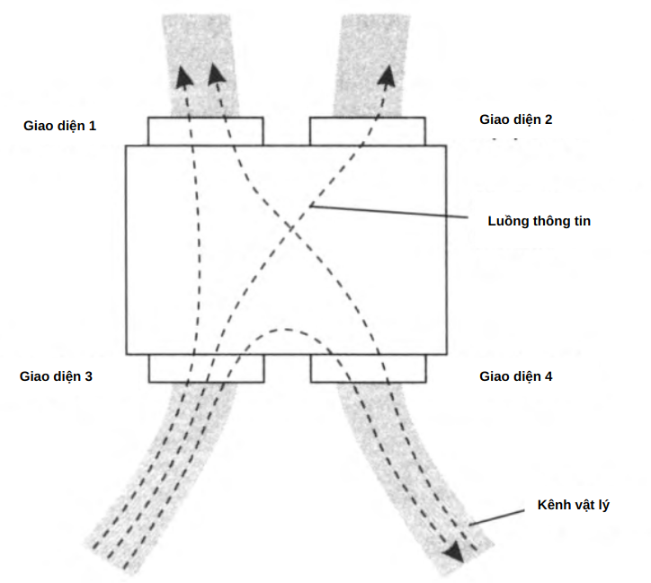

Hình 2.14. Bộ chuyển mạch (Switch)

- **Thiết bị chuyển mạch (Switch):**  
  - **Chuyển mạch (Switching):** Quá trình di chuyển dữ liệu từ một giao diện sang giao diện khác trong cùng thiết bị.  
  - **Giao diện switch (Switch Interface):** Cổng vật lý để nhận và gửi dữ liệu.  
  - **Switch có thể là thiết bị chuyên dụng hoặc phần mềm trong máy tính.**  

- **Phân loại chuyển mạch:**  
  - **Chuyển mạch phần cứng:** Sử dụng thiết bị mạng như switch Ethernet.  
  - **Chuyển mạch phần mềm:** Thực hiện trên máy tính với cơ chế định tuyến phần mềm.  

- **Mạng chuyển mạch (Switching Network):**  
  - Một tập hợp các nút chuyển mạch kết nối với nhau.  
  - Ví dụ: Hình 2.15 mô tả một mạng chuyển mạch gồm các nút trung gian truyền tải dữ liệu giữa các điểm cuối.  

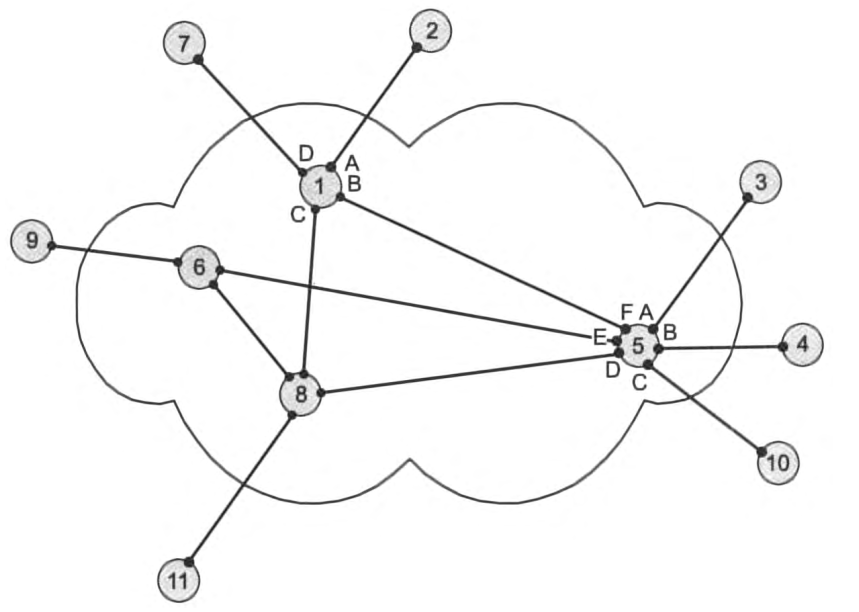

Hình 2.15. Mạng chuyển mạch (Switching network)

Chuyển mạch là bước quan trọng trong quá trình truyền dữ liệu, giúp tối ưu hiệu suất và đảm bảo thông tin đến đúng địa chỉ.

### 2.5.4 Ghép kênh và tách kênh (Multiplexing and Demultiplexing)

- **Ghép kênh (Multiplexing):**  
  - Kết hợp nhiều luồng dữ liệu thành một dòng duy nhất để truyền qua một kênh vật lý.  
  - Giảm số lượng đường truyền, tối ưu hóa tài nguyên mạng.  

- **Tách kênh (Demultiplexing):**  
  - Phân tách dữ liệu nhận được từ một dòng tổng hợp thành các luồng riêng biệt.  
  - Đảm bảo dữ liệu đến đúng đích.  

Hình 2.16 minh họa một đoạn mạng bao gồm ba bộ chuyển mạch (switches). Bộ chuyển mạch 1 có bốn giao diện mạng (network interfaces). Dữ liệu từ hai giao diện — 3 và 4 — được gửi đến giao diện 1. Dữ liệu này cần được truyền qua một kênh vật lý chung, do đó phải thực hiện thao tác ghép kênh (multiplexing).

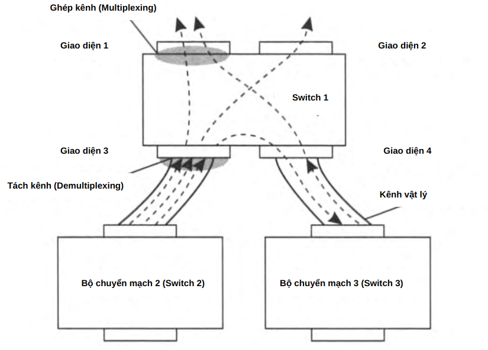

Hình 2.16. Các thao tác ghép kênh và tách kênh trong chuyển mạch

- **Các phương pháp ghép kênh phổ biến:**  
  1. **Ghép kênh theo thời gian (TDM - Time Division Multiplexing):**  
     - Mỗi luồng dữ liệu sử dụng kênh vật lý vào những khoảng thời gian riêng biệt.  
  2. **Ghép kênh theo tần số (FDM - Frequency Division Multiplexing):**  
     - Mỗi luồng dữ liệu được truyền trên một dải tần riêng biệt.  
  3. **Ghép kênh theo mã (CDM - Code Division Multiplexing):**  
     - Sử dụng mã duy nhất để phân biệt từng luồng dữ liệu trên cùng một kênh.  

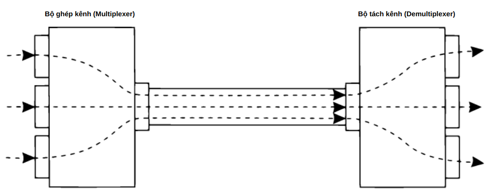

Hình 2.17. Bộ ghép kênh và bộ tách kênh

- **Ứng dụng:**  
  - Sử dụng trong mạng viễn thông, truyền hình cáp, truyền dữ liệu internet.  
  - Cần thiết để tối ưu băng thông trong mạng phức tạp.  

Ghép kênh giúp tận dụng hiệu quả tài nguyên truyền dẫn, trong khi tách kênh đảm bảo dữ liệu được phân phối chính xác.

### 2.5.5 Môi trường truyền dữ liệu chia sẻ (Shared data transmission medium)

- **Môi trường không chia sẻ (Dedicated Medium):**  
  - Mỗi đường truyền chỉ kết nối hai giao diện.  
  - Dữ liệu được truyền theo mô hình song công (full-duplex).  

- **Môi trường chia sẻ (Shared Medium):**  
  - Một kênh vật lý kết nối nhiều thiết bị mạng.  
  - Chỉ một thiết bị có thể truyền dữ liệu tại một thời điểm.  

- **Loại kênh truyền:**  
  1. **Kênh song công (Full-duplex):** Mỗi thiết bị có kênh riêng biệt cho gửi và nhận.  
 
 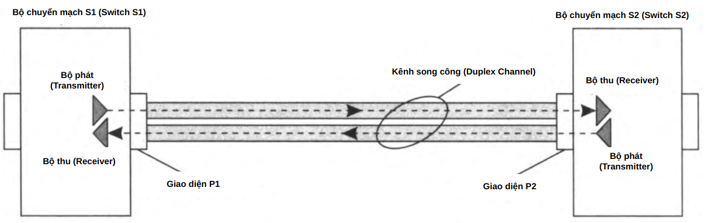

Hình 2.18. Kênh song công - không có môi trường chia sẻ

  2. **Kênh bán song công (Half-duplex):** Dữ liệu được gửi từng lượt trên cùng một kênh.  
  
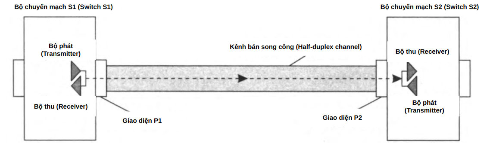

Hình 2.19. Kênh bán song công - môi trường chia sẻ

  3. **Kênh nhiều thiết bị (Multiple Access Channel):** Một kênh được chia sẻ giữa nhiều thiết bị.  

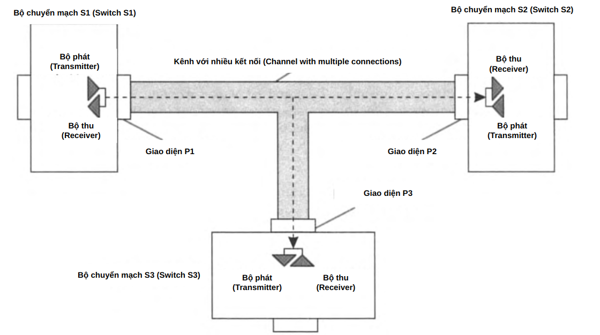

Hình 2.20. Kênh với nhiều kết nối - môi trường chia sẻ

- **Nhược điểm của môi trường chia sẻ:**  
  - Dễ xảy ra xung đột khi nhiều thiết bị cùng gửi dữ liệu.  
  - Băng thông bị chia sẻ giữa các thiết bị, làm giảm hiệu suất.  
  - Cần cơ chế điều phối truy cập (ví dụ: CSMA/CD trong Ethernet).  

- **Ứng dụng:**  
  - Môi trường chia sẻ chủ yếu được sử dụng trong mạng không dây.  
  - Mạng có dây hiện nay chủ yếu sử dụng mô hình chuyển mạch thay vì chia sẻ kênh.  

Công nghệ chuyển mạch đã thay thế dần môi trường chia sẻ trong mạng có dây để tăng hiệu suất và khả năng mở rộng.

<h1 id="chuong-3-chuyen-mach-kenh-va-chuyen-mach-goi">CHƯƠNG 3: Chuyển mạch kênh và chuyển mạch gói (Channel Switching and Packet Switching)</h1>

- Hai phương pháp này đều có ưu và nhược điểm riêng.  
- **Chuyển mạch kênh** phù hợp với các mạng điện thoại truyền thống, đảm bảo một kênh cố định cho mỗi cuộc gọi.  
- **Chuyển mạch gói** tối ưu hơn cho lưu lượng mạng máy tính, đặc biệt là trong các hệ thống như Internet hay VoIP, do khả năng sử dụng băng thông hiệu quả hơn.  
- Cuộc tranh luận về phương pháp nào tối ưu hơn vẫn chưa có kết luận rõ ràng, và cả hai công nghệ này sẽ tiếp tục cùng tồn tại trong thời gian dài.  

### 3.1 Chuyển mạch kênh (Channel Switching)

- Xuất hiện sớm hơn nhiều so với chuyển mạch gói, có nguồn gốc từ mạng điện thoại đầu tiên.  
- Được sử dụng rộng rãi trong viễn thông, cung cấp các kênh kết nối ổn định và tốc độ cao.  
- Ban đầu, kết nối giữa các máy tính sử dụng đường truyền điện thoại, sau đó mở rộng sang mạng truy cập Internet.  
- Mạng chuyển mạch kênh bao gồm **các bộ chuyển mạch (switching nodes)** và **các nút cuối (end nodes)**, được kết nối thông qua **các đường truyền vật lý (lines)**.  
- Khác với mạng chuyển mạch gói, mạng chuyển mạch kênh tạo ra **một kênh liên tục (circuit session)** giữa hai thuê bao trong suốt thời gian liên lạc.  
- Quản lý luồng dữ liệu và định tuyến trong mạng chuyển mạch kênh có thể do quản trị viên thiết lập thủ công hoặc thông qua hệ thống định tuyến tự động.  

### 3.1.1 Kênh sơ cấp (Elementary Channel)

#### **Khái niệm kênh sơ cấp**
- Trong mạng viễn thông với **chuyển mạch kênh** (channel switching), có một khái niệm quan trọng là **kênh sơ cấp**.
- **Kênh sơ cấp** là một đặc tính kỹ thuật cơ bản của mạng chuyển mạch kênh, biểu thị một giá trị cố định về băng thông trong phạm vi mạng đó. 
- Mọi tuyến liên kết trong mạng **chuyển mạch kênh** đều có thông lượng (băng thông) là **bội số nguyên của kênh sơ cấp**.

#### **Định nghĩa kênh sơ cấp**
- **Kênh sơ cấp** là đơn vị tối thiểu về **băng thông** của một tuyến liên kết trong mạng chuyển mạch kênh.
- Khi thiết kế mạng, ta **chọn giá trị kênh sơ cấp sao cho không nhỏ hơn mức cần thiết để truyền dữ liệu với tải trọng dự kiến**.
- **Ví dụ trong mạng điện thoại số hiện đại**:
  - Kênh sơ cấp thường có tốc độ **64 kbit/s**.
  - Đây là tốc độ tối thiểu đủ để truyền thoại số chất lượng tốt.

#### **Đặc điểm của mạng chuyển mạch kênh**
- Các tuyến liên kết có thể có băng thông khác nhau, nhưng luôn là **bội số nguyên của kênh sơ cấp**.
- **Ví dụ**:
  - Tuyến kết nối thuê bao điện thoại có thể có **2, 24, 30 kênh sơ cấp**.
  - Tuyến kết nối giữa các tổng đài có thể có **480 hoặc 1920 kênh sơ cấp**.

> **“Băng thông của mỗi tuyến liên kết trong mạng chuyển mạch kênh luôn bằng một số nguyên lần của kênh sơ cấp.”**

#### **Cách chia băng thông theo công nghệ**
- Kênh sơ cấp thực chất là **phần chia của băng thông tuyến liên kết**.
- Tùy từng công nghệ, cách chia băng thông này có thể khác nhau:
  - **Công nghệ phân chia theo thời gian (TDM - Time Division Multiplexing)**:  
    - Dữ liệu được chia thành các khe thời gian cố định trên một đường truyền.
  - **Công nghệ OTN (Optical Transport Network)**:  
    - Mỗi kênh sơ cấp được ánh xạ vào một khung thời gian nhất định.
  - **Công nghệ DWDM (Dense Wavelength Division Multiplexing)**:  
    - Kênh sơ cấp được xác định dựa trên dải tần số hoặc bước sóng.

---

#### **Số hóa tiếng nói (Voice Digitization)**

##### **Vấn đề số hóa tiếng nói**
- **Truyền thông tin thoại dưới dạng tín hiệu số** là một bước tiến quan trọng trong viễn thông.
- Vào những năm 1960, tiếng nói bắt đầu được truyền trong mạng điện thoại dưới dạng **chuỗi bit nhị phân** (0 và 1).
- Quá trình này dựa trên nguyên lý **rời rạc hóa tín hiệu** (*discretization*), bao gồm:
  1. **Rời rạc hóa theo thời gian** (*sampling in time*):  
     - Lấy mẫu tín hiệu âm thanh với một khoảng thời gian cố định.
  2. **Rời rạc hóa theo biên độ** (*sampling in amplitude*):  
     - Chuyển đổi mỗi giá trị mẫu thành dạng số.

##### **Nguyên lý rời rạc hóa**
- **Hình 3.1** minh họa quá trình số hóa tiếng nói:
  - **Trục hoành (thời gian)**: Các thời điểm t1, t2, t3... khi tín hiệu được lấy mẫu.
  - **Trục tung (biên độ)**: Giá trị của tín hiệu tại mỗi thời điểm được lượng tử hóa thành số nhị phân.

- **Để đảm bảo chất lượng thoại tốt, ta dùng:**
  - **Tần số lấy mẫu 8000 Hz** (8 kHz) → tức **8000 mẫu/giây**.
  - **Mỗi mẫu được mã hóa bằng 8 bit** → có tổng cộng **256 mức biên độ**.
  - **Băng thông cần thiết cho một kênh thoại số hóa**:  
    \[
    8000 \times 8 = 64,000 \text{ bit/s} = 64 \text{ kbit/s}
    \]
  - **Kênh thoại số 64 kbit/s** này chính là **kênh sơ cấp** trong mạng điện thoại số.

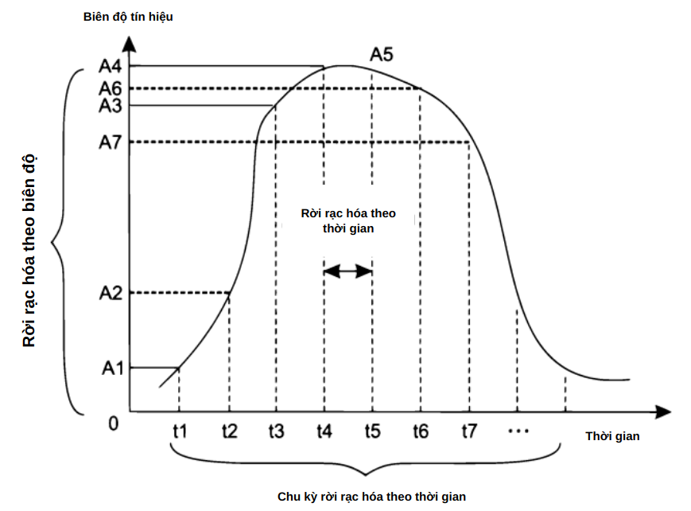

Hình 3.1. Điều chế rời rạc của quá trình liên tục

---

#### **3. Ví dụ về mạng chuyển mạch kênh (Hình 3.2)**

##### **Giả định về một mạng chuyển mạch kênh**
- Giả sử một đoạn mạng có **kênh sơ cấp 7 bit/s**.
- Các tuyến liên kết có băng thông là **bội số của kênh sơ cấp**:  
  - Có tuyến **2 kênh sơ cấp** (2 × 7 bit/s).  
  - Có tuyến **3 kênh sơ cấp** (3 × 7 bit/s).  
  - Có tuyến **4 kênh sơ cấp** (4 × 7 bit/s).  
  - Có tuyến **5 kênh sơ cấp** (5 × 7 bit/s).  

- **Mỗi tổng đài có các giao tiếp riêng (port)**, ví dụ:
  - Tổng đài **S2**:
    - **Port P1** có các kênh **1, 2, 3, 4**.
    - **Port P3** có các kênh **1, 2, 3, 4, 5**.

##### **Thiết lập kênh ghép (Composite Channel)**
- **Mục tiêu**: Kết nối giữa thuê bao **A và B** qua mạng.
- **Lộ trình truyền tín hiệu**:  
  - Tín hiệu thoại từ A đến B sẽ đi qua **4 tổng đài (switch)**: **S1, S2, S3, S4**.
  - Giả sử **luồng dữ liệu giữa A và B là 2T bit/s**.
  - Khi đó, ta cần **2 kênh sơ cấp** để đảm bảo đủ băng thông.

- **Cách thiết lập kênh ghép**:
  - Trên mỗi tuyến liên kết, ta **cấp phát 2 kênh sơ cấp** cho phiên truyền dữ liệu.
  - Các kênh sơ cấp này **được ghép lại** thành một **kênh tổng hợp**, giúp đảm bảo luồng dữ liệu trôi chảy.

### **Kết luận**
- Trong mạng chuyển mạch kênh, **mỗi kết nối cần một số kênh sơ cấp nhất định trên mọi tuyến liên kết**.
- Khi cuộc gọi hoặc phiên truyền kết thúc, **các kênh sơ cấp được giải phóng và sẵn sàng sử dụng cho phiên khác**.

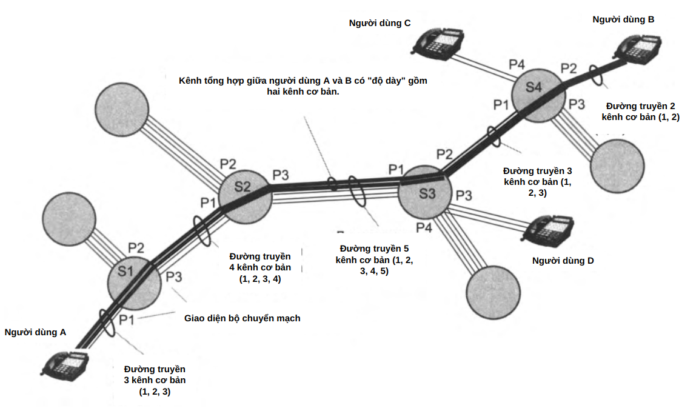

### 3.1.2 Kênh tổng hợp (Composite Channel)

#### **Định nghĩa**
- **Kênh hợp thành** là một kênh được thiết lập bằng cách **ghép nối các kênh sơ cấp** dành riêng cho luồng thông tin cụ thể.
- Trong ví dụ đang xét, kết nối giữa hai thuê bao **A và B** được thiết lập thông qua **kênh hợp thành có "độ dày" bằng hai kênh sơ cấp**.
- Nếu lưu lượng truyền tải giữa A và B không vượt quá **T bit/s**, chỉ cần một kênh sơ cấp trong kênh hợp thành.

#### **Yêu cầu băng thông**
- Khi thuê bao trao đổi dữ liệu với **lưu lượng lớn hơn**, yêu cầu băng thông cao hơn.
- Để đảm bảo thông lượng, cần dự trữ **số lượng kênh sơ cấp phù hợp trên mỗi tuyến truyền**.

---

#### **Đặc điểm của kênh hợp thành**

Kênh hợp thành có những đặc điểm quan trọng sau:

1. **Cấu trúc ổn định**:  
   - Kênh hợp thành **luôn có cùng số lượng kênh sơ cấp trên toàn bộ tuyến đường**.

2. **Dung lượng cố định**:  
   - Kênh hợp thành có **băng thông cố định và không thay đổi** trong suốt phiên kết nối.

3. **Tính tạm thời**:  
   - Kênh hợp thành **chỉ tồn tại trong suốt phiên liên lạc** giữa hai thuê bao.

4. **Dữ liệu truyền trong kênh hợp thành được sử dụng độc quyền**:  
   - Không có ai khác được dùng những kênh sơ cấp đã cấp phát.

5. **Dữ liệu được truyền không bị mất mát hoặc trễ**:  
   - Dữ liệu đến thuê bao đích **với tốc độ nguồn gửi**, **không bị ảnh hưởng bởi lưu lượng mạng khác**.

6. **Sau khi kết thúc phiên kết nối, các kênh sơ cấp được giải phóng**:  
   - Chúng sẽ quay trở lại **bộ tài nguyên chung** để được tái sử dụng.

---

#### **Quá trình thiết lập kết nối trong mạng chuyển mạch kênh**

- **Trong mạng điện thoại, có thể có nhiều cuộc gọi đồng thời**.
- Mạng phải đảm bảo **chia sẻ tài nguyên hợp lý** để các thuê bao có thể thiết lập phiên kết nối.

##### **Mô hình thiết lập kết nối**
1. **Yêu cầu kết nối**:  
   - Khi thuê bao muốn thiết lập cuộc gọi, một **yêu cầu được gửi vào mạng**.
   - Mạng sẽ kiểm tra xem **có đủ kênh sơ cấp trên toàn bộ tuyến không**.

2. **Xử lý khi tài nguyên không đủ**:  
   - Nếu không còn đủ kênh sơ cấp, kết nối sẽ **bị từ chối** và báo lại cho thuê bao gọi đi.

3. **Mạng chuyển mạch kênh hoạt động theo nguyên tắc định sẵn**:  
   - **Các cuộc gọi đang hoạt động có ưu tiên cao hơn** so với cuộc gọi mới.

---

#### **Bảng định tuyến và quản lý tài nguyên**

- Mỗi **tổng đài (switch) trong mạng** có **bảng định tuyến toàn cục** để xác định đường truyền kết nối.
- **Ví dụ bảng định tuyến của tổng đài S4**:

| Thuê bao | Cổng đầu ra (Giao tiếp) |
|----------|-------------------------|
| A        | P1                      |
| B        | P2                      |
| C        | P4                      |
| D        | P3                      |

- Khi một yêu cầu kết nối được xử lý:
  - Mạng sẽ **ghi nhận thông tin kết nối** vào **bảng định tuyến cục bộ** trên từng tổng đài.
  - Ví dụ bảng định tuyến của tổng đài S4:

| Kênh sơ cấp đầu vào | Kênh sơ cấp đầu ra |
|--------------------|------------------|
| P1/Kênh 2        | P2/Kênh 1        |
| P1/Kênh 3        | P2/Kênh 2        |

- Các bảng này giúp **tổng đài quản lý các kênh sơ cấp đã cấp phát**.

---

#### **Từ chối kết nối trong mạng chuyển mạch kênh**

- **Không phải mọi yêu cầu kết nối đều được chấp nhận**.
- Nếu **không có đủ kênh sơ cấp trên toàn bộ tuyến truyền**, mạng sẽ từ chối kết nối.

##### **Ví dụ về từ chối kết nối (Hình 3.3)**
- Nếu **thuê bao C gửi yêu cầu kết nối đến thuê bao D** khi mạng đang bận:
  - Tổng đài kiểm tra và thấy **chỉ còn 1 kênh sơ cấp trống, trong khi cần 2 kênh sơ cấp**.
  - **Yêu cầu bị từ chối** và thuê bao C được thông báo rằng kết nối không thể thực hiện.

- **Khi mạng bị quá tải, tỷ lệ từ chối kết nối tăng lên**.

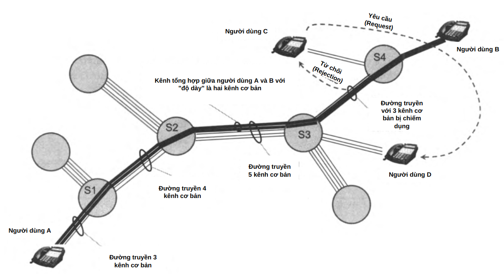

Hình 3.3. Từ chối thiết lập kết nối trong mạng chuyển mạch kênh

---

#### **Hai chế độ thiết lập kết nối**

- **Chế độ tự động động (Dynamic Automatic Mode)**:  
  - Thuê bao gửi yêu cầu và **mạng tự động kiểm tra, cấp phát tài nguyên**.
  - Đây là cách hoạt động phổ biến trong **hệ thống điện thoại hiện đại**.

- **Chế độ thủ công tĩnh (Static Manual Mode)**:  
  - Trước đây, mạng điện thoại hoạt động theo cách thủ công:
    - **Tổng đài viên gán kênh bằng tay** thông qua các **cáp kết nối**.
    - **Ít linh hoạt, khó mở rộng**, nhưng phù hợp với **các kênh thuê riêng**.

- Ngày nay, mạng **ưu tiên chế độ tự động**, nhưng **chế độ thủ công vẫn được dùng cho các kết nối cố định dài hạn**.

---

#### **Mạng chuyển mạch kênh như hệ thống đường ống dữ liệu (Hình 3.4)**

- **Mạng chuyển mạch kênh có thể so sánh với một hệ thống đường ống dữ liệu**.
- Quá trình thiết lập kết nối gồm hai bước:
  1. **Xác minh đường truyền**:
     - Kiểm tra **tính khả dụng của kênh sơ cấp trên toàn tuyến**.
  2. **Cố định kênh sơ cấp**:
     - Các kênh sơ cấp được **cấp phát độc quyền** cho cuộc gọi.

- **Sau khi thiết lập kết nối, dữ liệu được truyền tự do mà không cần kiểm tra lại đường truyền**.

- **So sánh với mạng dữ liệu gói**:
  - Mạng chuyển mạch kênh **định tuyến cố định**, giống như hệ thống đường ống **có van đóng/mở**.
  - Trái lại, **mạng chuyển mạch gói không có tuyến cố định**, giống như việc **gửi từng gói hàng qua nhiều tuyến đường khác nhau**.

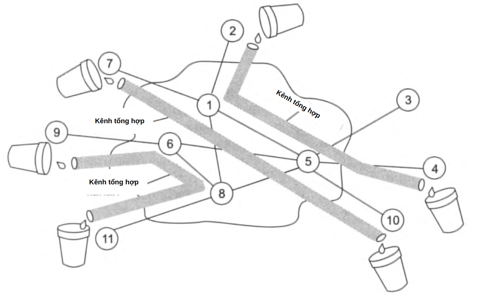

Hình 3.4. Mạng chuyển mạch kênh như một hệ thống đường ống

---

#### **8. Kết luận**
- **Kênh hợp thành (Composite Channel)** giúp ghép nhiều kênh sơ cấp để đảm bảo băng thông đủ lớn.
- **Quá trình thiết lập kết nối trong mạng chuyển mạch kênh gồm hai bước**:
  1. Gửi yêu cầu kết nối.
  2. Kiểm tra và cấp phát tài nguyên.
- **Mạng có thể từ chối kết nối nếu không còn đủ kênh sơ cấp**.
- **Có hai chế độ kết nối**:
  - **Tự động động**: Phổ biến trong mạng hiện đại.
  - **Thủ công tĩnh**: Dùng cho các kênh thuê riêng.
- **Mạng chuyển mạch kênh có thể được so sánh với hệ thống đường ống dữ liệu**:
  - **Sau khi kết nối được thiết lập, dữ liệu truyền tải diễn ra liền mạch mà không cần xử lý lại việc định tuyến**.

---

### 3.1.3 Hiệu suất kém khi truyền tải lưu lượng xung nhịp (Pulsing Traffic)**

#### **Hiệu suất tối ưu của mạng chuyển mạch kênh**
- **Mạng chuyển mạch kênh hoạt động hiệu quả nhất khi lưu lượng người dùng có tốc độ ổn định trong suốt phiên kết nối.**
- Lý do là vì **băng thông của đường truyền đã được cố định trước**, tương ứng với **khả năng truyền tải tối đa của mạng**.
- Khi **dữ liệu truyền tải không ổn định** (tức là có lúc cao, lúc thấp), hiệu suất sử dụng tài nguyên mạng bị giảm.

#### **Lưu lượng thoại trong mạng chuyển mạch kênh**
- Trong các cuộc gọi thoại:
  - **Người dùng không nói liên tục** mà có những khoảng dừng giữa các câu.
  - **Cường độ giọng nói thay đổi liên tục**, không phải lúc nào cũng sử dụng hết băng thông đường truyền.
- Điều này làm cho **dữ liệu thoại trở nên không đều**, gây ra lãng phí tài nguyên đường truyền.
- Tuy nhiên, **mạng chuyển mạch kênh vẫn phù hợp để truyền thoại**, vì:
  - Dữ liệu thoại **có tính liên tục ở mức tương đối**.
  - **Tốc độ truyền tải cần thiết không quá lớn** so với băng thông đã cấp phát.
  - **Sự lãng phí tài nguyên là chấp nhận được**, vì không ảnh hưởng nghiêm trọng đến hiệu suất toàn hệ thống.

---

#### Hiệu suất kém hơn khi truyền tải dữ liệu máy tính (Computer Traffic)

- **Lưu lượng dữ liệu máy tính có đặc tính xung nhịp mạnh hơn rất nhiều so với thoại.**
- Điều này làm giảm đáng kể hiệu suất của mạng chuyển mạch kênh khi xử lý loại lưu lượng này.

##### **Đặc điểm của lưu lượng dữ liệu máy tính**
- Lưu lượng máy tính **luôn có tính xung nhịp**, ví dụ:
  - Khi tải một trang web từ Internet, **tốc độ truyền dữ liệu tăng đột ngột** trong một khoảng thời gian ngắn.
  - Sau khi tải xong, **tốc độ truyền giảm về 0** cho đến khi có một yêu cầu tải dữ liệu tiếp theo.
- **Sự gián đoạn này làm lãng phí tài nguyên mạng chuyển mạch kênh**, vì:
  - **Băng thông đã cấp phát không được sử dụng liên tục**.
  - **Các kênh sơ cấp vẫn bị chiếm giữ ngay cả khi không có dữ liệu truyền tải**.

##### **Ví dụ về sự lãng phí tài nguyên**
- **Tưởng tượng bạn sử dụng thang máy trong một ga tàu điện ngầm:**
  - Khi có người bước vào, thang máy hoạt động.
  - Khi không có ai sử dụng, thang máy **vẫn chiếm không gian, nhưng không thực hiện chức năng nào cả**.
- **Mạng chuyển mạch kênh cũng vậy:**
  - Nếu sử dụng nó để tải dữ liệu từ Internet, kênh vẫn bị giữ nguyên dù **không có dữ liệu được truyền tải liên tục**.

---

#### 3. Kết luận
- **Mạng chuyển mạch kênh không phù hợp để truyền tải lưu lượng dữ liệu máy tính**, vì:
  - **Lưu lượng có đặc tính xung nhịp, không sử dụng hết băng thông cố định**.
  - **Dữ liệu chỉ truyền trong một khoảng thời gian ngắn, sau đó dừng hẳn**.
  - **Duy trì kênh cố định gây lãng phí tài nguyên mạng**.
- Vì vậy, để truyền tải dữ liệu máy tính hiệu quả hơn, **cần có các giải pháp mạng phù hợp hơn**, chẳng hạn như:
  - **Mạng chuyển mạch gói (Packet Switching)**:  
    - Cấp phát tài nguyên theo nhu cầu, không giữ cố định kênh.
  - **Công nghệ tối ưu hóa lưu lượng** để thích ứng với tính chất không liên tục của dữ liệu máy tính.

---
## 3.2 Chuyển mạch gói (Packet Switching)

#### **Sự khác biệt giữa chuyển mạch gói và chuyển mạch kênh**
- **Mạng chuyển mạch gói**, cũng như mạng chuyển mạch kênh, **bao gồm các bộ chuyển mạch được kết nối với nhau bằng các tuyến liên kết vật lý**.
- Tuy nhiên, **cách truyền dữ liệu trong hai loại mạng này hoàn toàn khác nhau**:
  - **Trong mạng chuyển mạch kênh**, trước khi truyền dữ liệu, **một kênh cố định được thiết lập và giữ nguyên trong suốt phiên kết nối**.
  - **Trong mạng chuyển mạch gói**, **dữ liệu được chia thành các gói nhỏ**, có thể được truyền theo **các tuyến khác nhau mà không cần kênh cố định**.

#### **Tính linh hoạt của chuyển mạch gói**
- **Không cần đặt trước kênh cố định cho từng kết nối**, giúp sử dụng tài nguyên mạng hiệu quả hơn.
- **Dữ liệu có thể đi theo nhiều tuyến khác nhau**, nghĩa là:
  - **Một số gói có thể đến đích nhanh hơn gói khác**.
  - **Có thể xảy ra mất gói hoặc tắc nghẽn mạng**, nhưng có cơ chế kiểm soát lỗi để khắc phục.

---

#### Nguyên lý hoạt động của chuyển mạch gói

**Khái niệm gói tin (Packet)**
- **Mọi dữ liệu được truyền qua mạng chuyển mạch gói đều được chia thành các gói nhỏ**.
- **Mỗi gói gồm hai phần chính**:
  1. **Phần tiêu đề (Header)**:
     - Chứa địa chỉ đích và các thông tin điều khiển khác.
  2. **Phần dữ liệu (Payload)**:
     - Chứa nội dung thực tế được truyền tải.

- **Một số gói còn có phần "đuôi" (Trailer)**:
  - Phần này thường chứa **tổng kiểm tra lỗi (Checksum)** để xác định xem dữ liệu có bị lỗi khi truyền qua mạng hay không.

 **Hình 3.5: Quá trình chia dữ liệu thành các gói**

- **Quy trình truyền dữ liệu theo gói bao gồm 4 bước**:
  1. **Bước 1**: Dữ liệu ban đầu được chuẩn bị để gửi.
  2. **Bước 2**: Dữ liệu được chia nhỏ thành nhiều phần nhỏ.
  3. **Bước 3**: Tạo các gói tin bằng cách thêm tiêu đề vào từng phần dữ liệu.
  4. **Bước 4**: Ở đầu nhận, các gói tin được tập hợp lại để khôi phục dữ liệu gốc.

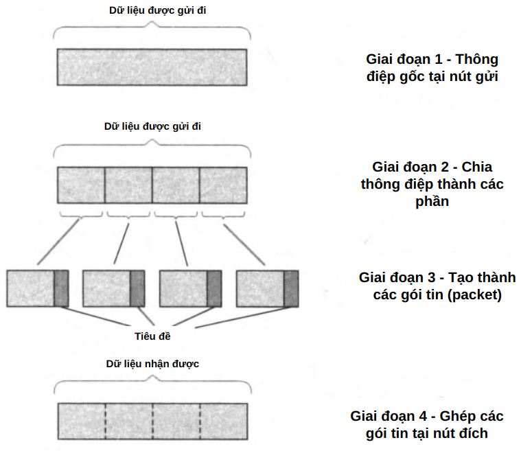

Hình 3.5. Phân chia dữ liệu thành các gói tin

---

**. Các loại gói tin trong mạng chuyển mạch gói**

- **Độ dài gói tin có thể khác nhau tùy vào công nghệ sử dụng**:
  - **ATM (Asynchronous Transfer Mode)**: Gói tin có độ dài cố định, gọi là **cell**.
  - **Ethernet**: Có giới hạn độ dài tối thiểu và tối đa cho mỗi gói tin.

- **Tốc độ truyền gói tin phụ thuộc vào nguồn phát**:
  - Khác với mạng chuyển mạch kênh, nơi kênh truyền luôn sẵn sàng, **mạng chuyển mạch gói có thể tiếp nhận dữ liệu không đồng đều theo thời gian**.

---

**. Định tuyến gói tin trong mạng**

- **Mạng chuyển mạch gói quyết định tuyến đường của từng gói dữ liệu theo hai cách**:
  1. **Định tuyến tĩnh (Static Routing)**:
     - Các tuyến đường được thiết lập trước và không thay đổi.
  2. **Định tuyến động (Dynamic Routing)**:
     - Các gói có thể được định tuyến theo **tình trạng hiện tại của mạng**.

- **Một gói tin có thể đi qua nhiều bộ chuyển mạch trước khi đến đích**.
- **Khác với chuyển mạch kênh, các gói tin không nhất thiết phải đi theo cùng một tuyến đường**.

**Hình 3.6: Mô hình truyền gói tin trong mạng**

- Gói tin từ **nhiều nút đầu cuối khác nhau** được gửi đến mạng chuyển mạch gói.
- Mỗi gói có thể đi theo **những tuyến đường khác nhau** trước khi đến đích.

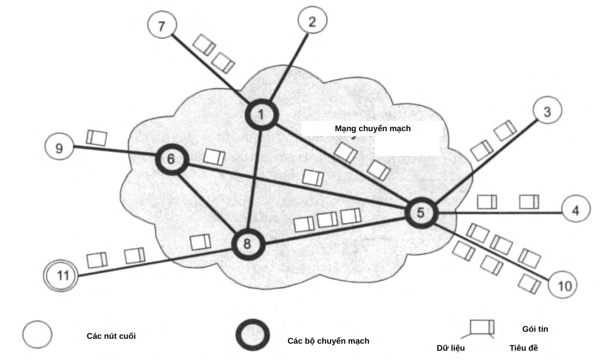

Hình 3.6. Truyền dữ liệu qua mạng dưới dạng các gói tin

---

#### Hiệu suất sử dụng băng thông trong mạng chuyển mạch gói

- **Gói tin từ nhiều nguồn khác nhau có thể được truyền qua cùng một tuyến liên kết**, làm **tận dụng tối đa băng thông sẵn có**.
- **Không giống mạng chuyển mạch kênh, băng thông không bị lãng phí khi không có dữ liệu cần truyền**.

**Hình 3.7: Hiện tượng san bằng lưu lượng mạng**

- Dữ liệu từ nhiều nguồn khác nhau được trộn vào nhau, giúp **giảm thiểu hiện tượng tắc nghẽn** và **sử dụng băng thông hiệu quả hơn**.

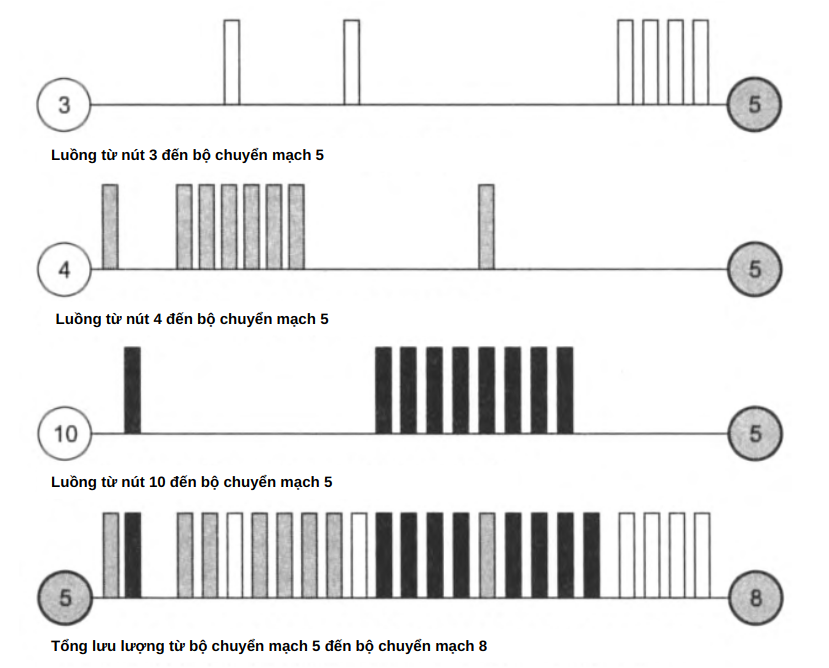

Hình 3.7. Làm mượt lưu lượng trong các mạng chuyển mạch gói tin

---

#### **6. Kết luận**
- **Mạng chuyển mạch gói linh hoạt hơn mạng chuyển mạch kênh**, do:
  - **Không cần thiết lập trước một kênh cố định**.
  - **Có thể truyền dữ liệu theo nhiều tuyến khác nhau**.
  - **Sử dụng tài nguyên mạng hiệu quả hơn**.

- **Tuy nhiên, nhược điểm của mạng chuyển mạch gói là**:
  - **Gói tin có thể bị trễ hoặc mất mát**.
  - **Cần cơ chế kiểm soát lỗi và sắp xếp lại gói tin**.

- **Ứng dụng chính của chuyển mạch gói**:
  - **Internet** hoạt động dựa trên nguyên lý này.
  - **Các mạng truyền dữ liệu tốc độ cao** sử dụng để tối ưu hóa tài nguyên.

---

### 3.2.1 Bộ đệm gói (Packet Buffering)

