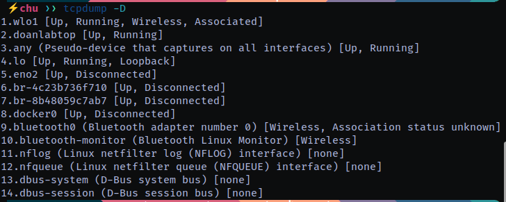
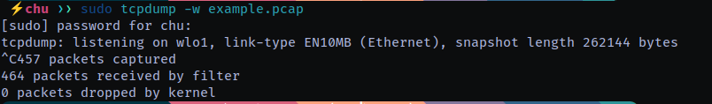

### Kiến thức cơ bản về **tcpdump**:
**tcpdump** là một công cụ dòng lệnh dùng để bắt gói tin trên mạng, giúp phân tích và chẩn đoán lưu lượng mạng.

## 1. **Cài đặt tcpdump**
- **Ubuntu/Debian:**  
  ```bash
  sudo apt install tcpdump
  ```
- **CentOS/RHEL:**  
  ```bash
  sudo yum install tcpdump
  ```
- **macOS (Homebrew):**  
  ```bash
  brew install tcpdump
  ```

---

## 2. **Các lệnh cơ bản**
- **Kiểm tra danh sách giao diện mạng**  
  ```bash
  tcpdump -D
  ```

  

- **Bắt gói tin trên một giao diện**  
  ```bash
  sudo tcpdump -i eth0
  ```
  (Thay `eth0` bằng giao diện mạng của bạn)

- **Lưu gói tin vào file để phân tích sau**  
  ```bash
  sudo tcpdump -i eth0 -w file.pcap
  ```


  Đọc lại file đã lưu:
  ```bash
  tcpdump -r file.pcap
  ```

---

## 3. **Lọc gói tin**
### a) **Lọc theo địa chỉ IP**
- Bắt gói tin từ hoặc đến một IP:
  ```bash
  tcpdump -i eth0 host 192.168.1.1
  ```
- Chỉ bắt gói tin đi từ một IP:
  ```bash
  tcpdump -i eth0 src host 192.168.1.1
  ```
- Chỉ bắt gói tin đến một IP:
  ```bash
  tcpdump -i eth0 dst host 192.168.1.1
  ```

### b) **Lọc theo giao thức**
- Bắt gói tin TCP:
  ```bash
  tcpdump -i eth0 tcp
  ```
- Bắt gói tin UDP:
  ```bash
  tcpdump -i eth0 udp
  ```
- Bắt gói tin ICMP (ping):
  ```bash
  tcpdump -i eth0 icmp
  ```

### c) **Lọc theo cổng**
- Bắt gói tin HTTP (cổng 80):
  ```bash
  tcpdump -i eth0 port 80
  ```
- Bắt gói tin SSH (cổng 22):
  ```bash
  tcpdump -i eth0 port 22
  ```
- Bắt gói tin từ hoặc đến nhiều cổng:
  ```bash
  tcpdump -i eth0 port 22 or port 443
  ```

### d) **Lọc theo mạng**
- Bắt gói tin từ mạng 192.168.1.0/24:
  ```bash
  tcpdump -i eth0 net 192.168.1.0/24
  ```

---

## 4. **Hiển thị thông tin gói tin chi tiết**
- Hiển thị chi tiết tiêu đề gói tin:
  ```bash
  tcpdump -i eth0 -v
  ```
- Hiển thị rất chi tiết:
  ```bash
  tcpdump -i eth0 -vv
  ```
- Hiển thị cả dữ liệu thô của gói tin:
  ```bash
  tcpdump -i eth0 -X
  ```
- Hiển thị dữ liệu dạng hex và ASCII:
  ```bash
  tcpdump -i eth0 -XX
  ```

---

## 5. **Kết hợp nhiều bộ lọc**
- Bắt gói tin TCP từ 192.168.1.1 đến cổng 80:
  ```bash
  tcpdump -i eth0 tcp and src host 192.168.1.1 and port 80
  ```
- Bắt tất cả gói tin ngoại trừ SSH:
  ```bash
  tcpdump -i eth0 not port 22
  ```

---

## 6. **Một số tùy chọn hữu ích**
- **Giới hạn số lượng gói tin bắt được** (ví dụ: 10 gói):
  ```bash
  tcpdump -i eth0 -c 10
  ```
- **Giới hạn kích thước gói tin được bắt** (chỉ lấy 100 byte đầu mỗi gói):
  ```bash
  tcpdump -i eth0 -s 100
  ```
- **Bắt gói tin nhưng không phân giải tên miền** (giảm tải hệ thống):
  ```bash
  tcpdump -i eth0 -n
  ```
- **Bắt gói tin và hiển thị thời gian đầy đủ**:
  ```bash
  tcpdump -i eth0 -tttt
  ```

---

## 7. **Phân tích file .pcap bằng Wireshark**
File `.pcap` có thể mở bằng **Wireshark** để phân tích trực quan hơn.

Cài Wireshark:
```bash
sudo apt install wireshark
```
Mở file `.pcap`:
```bash
wireshark file.pcap
```

---

## 8. **Ví dụ thực tế**
### a) **Giám sát lưu lượng HTTP**
```bash
sudo tcpdump -i eth0 port 80 -A
```
(Xem nội dung HTTP dưới dạng ASCII)

### b) **Phát hiện cuộc tấn công ping flood**
```bash
sudo tcpdump -i eth0 icmp
```

### c) **Kiểm tra lưu lượng SSH**
```bash
sudo tcpdump -i eth0 port 22
```

---

## **Tóm tắt nhanh**
| Lệnh | Chức năng |
|------|----------|
| `tcpdump -i eth0` | Bắt tất cả gói tin trên `eth0` |
| `tcpdump -D` | Liệt kê các giao diện mạng |
| `tcpdump -i eth0 port 80` | Bắt gói tin HTTP |
| `tcpdump -i eth0 host 192.168.1.1` | Bắt gói tin từ/đến IP 192.168.1.1 |
| `tcpdump -i eth0 -w file.pcap` | Lưu gói tin vào file |
| `tcpdump -r file.pcap` | Đọc file gói tin |
| `tcpdump -i eth0 -n` | Không phân giải tên miền |
| `tcpdump -i eth0 -X` | Hiển thị dữ liệu thô của gói tin |

---

## **Hướng dẫn sử dụng Wireshark để phân tích gói tin mạng**

Wireshark là một công cụ mạnh mẽ dùng để bắt và phân tích lưu lượng mạng theo cách trực quan hơn so với tcpdump.

---

## **1. Cài đặt Wireshark**
### **Trên Linux**
- **Ubuntu/Debian**:
  ```bash
  sudo apt update
  sudo apt install wireshark
  ```
  Trong quá trình cài đặt, nếu được hỏi *"Should non-superusers be able to capture packets?"*, chọn **Yes** để sử dụng Wireshark mà không cần quyền root.

- **CentOS/RHEL**:
  ```bash
  sudo yum install wireshark
  ```

### **Trên macOS**
Nếu đã cài **Homebrew**, chạy:
```bash
brew install wireshark
```

### **Trên Windows**
1. Tải Wireshark từ trang chính thức: [https://www.wireshark.org/download.html](https://www.wireshark.org/download.html)
2. Chạy file `.exe` và làm theo hướng dẫn.

---

## **2. Mở Wireshark và bắt gói tin**
### **Bước 1: Chạy Wireshark**
Mở Wireshark từ Start Menu (Windows) hoặc terminal (`wireshark &` trên Linux).

### **Bước 2: Chọn giao diện mạng**
- Sau khi mở Wireshark, bạn sẽ thấy danh sách các **giao diện mạng** (`Interfaces`).
- Chọn giao diện cần theo dõi (VD: Wi-Fi, Ethernet) rồi bấm **Start**.

### **Bước 3: Dừng bắt gói tin**
- Nhấn nút **Stop** (🔴) hoặc phím **Ctrl + E**.

---

## **3. Lọc gói tin**
Wireshark cho phép sử dụng bộ lọc để dễ dàng tìm kiếm gói tin quan trọng.

### **a) Lọc bằng Display Filter (lọc hiển thị)**
- **Lọc theo giao thức**:
  ```plaintext
  http
  tcp
  udp
  icmp
  dns
  ```
- **Lọc theo địa chỉ IP**:
  ```plaintext
  ip.src == 192.168.1.1  # Chỉ hiển thị gói tin từ IP này
  ip.dst == 192.168.1.100  # Chỉ hiển thị gói tin đến IP này
  ip.addr == 192.168.1.1  # Hiển thị cả gửi và nhận từ IP này
  ```
- **Lọc theo cổng**:
  ```plaintext
  tcp.port == 80   # Chỉ hiển thị gói tin HTTP
  udp.port == 53   # Chỉ hiển thị gói tin DNS
  ```
- **Lọc theo từ khóa trong dữ liệu gói tin**:
  ```plaintext
  frame contains "password"  # Tìm gói tin chứa từ "password"
  ```

### **b) Lọc bằng Capture Filter (lọc trong quá trình bắt)**
- **Bắt gói tin từ IP cụ thể**:
  ```plaintext
  host 192.168.1.1
  ```
- **Bắt gói tin TCP hoặc UDP**:
  ```plaintext
  tcp
  udp
  ```
- **Bắt gói tin HTTP (cổng 80)**:
  ```plaintext
  port 80
  ```
- **Bắt gói tin ICMP (ping)**:
  ```plaintext
  icmp
  ```

---

## **4. Phân tích gói tin**
### **a) Hiểu về giao diện Wireshark**
Wireshark có **ba phần chính**:
1. **Danh sách gói tin** (Packet List): Hiển thị tất cả gói tin đã bắt được.
2. **Chi tiết gói tin** (Packet Details): Hiển thị thông tin chi tiết về gói tin đang chọn.
3. **Dữ liệu thô (Packet Bytes)**: Hiển thị dữ liệu dạng hex và ASCII.

### **b) Các thông tin quan trọng trong một gói tin**
- **Source (SRC)**: Địa chỉ IP nguồn.
- **Destination (DST)**: Địa chỉ IP đích.
- **Protocol**: Giao thức (TCP, UDP, ICMP, DNS, HTTP...).
- **Length**: Kích thước gói tin.
- **Info**: Thông tin tóm tắt gói tin.

### **c) Xem nội dung gói tin**
- Nhấn vào một gói tin trong danh sách.
- Dưới phần **Packet Details**, mở rộng mục **Hypertext Transfer Protocol** để xem nội dung HTTP.
- Đối với TCP, có thể thấy cổng và các cờ (SYN, ACK...).

---

## **5. Xuất và phân tích dữ liệu**
### **a) Lưu gói tin**
- **Lưu gói tin đã bắt**:
  1. Vào **File > Save As**.
  2. Chọn định dạng `.pcapng` hoặc `.pcap`.

- **Mở file đã lưu**:
  ```bash
  wireshark file.pcap
  ```

### **b) Xuất dữ liệu gói tin**
- Xuất dữ liệu sang **CSV, JSON, XML** qua **File > Export Packet Dissections**.

---

## **6. Một số tình huống thực tế**
### **a) Phân tích HTTP để tìm dữ liệu đăng nhập**
1. Sử dụng filter:
   ```plaintext
   http.request.method == "POST"
   ```
2. Kiểm tra phần **Form data** để xem username, password (nếu không mã hóa).

### **b) Xem các kết nối TCP đang mở**
- Dùng filter:
  ```plaintext
  tcp.flags.syn == 1 and tcp.flags.ack == 0
  ```
  → Hiển thị các gói **SYN**, tức là kết nối TCP mới.

### **c) Kiểm tra tấn công DDoS**
- Dùng filter:
  ```plaintext
  ip.src == 192.168.1.1 and tcp.flags.syn == 1
  ```
  → Kiểm tra xem có quá nhiều kết nối SYN từ một IP không.

---

## **7. Mẹo nâng cao**
### **a) Dùng Wireshark để theo dõi các thiết bị IoT**
- Dùng filter:
  ```plaintext
  eth.src == 00:1A:2B:3C:4D:5E
  ```
  → Lọc theo địa chỉ MAC của thiết bị IoT.

### **b) Phân tích DNS requests để phát hiện malware**
- Dùng filter:
  ```plaintext
  dns.qry.name contains "malicious-domain.com"
  ```
  → Xem liệu thiết bị có đang truy cập domain độc hại không.

### **c) Theo dõi tải xuống file từ HTTP**
- Dùng filter:
  ```plaintext
  http.response.code == 200 and http.content_type contains "application/octet-stream"
  ```
  → Xem gói tin tải xuống file.

---

## **8. So sánh Wireshark với tcpdump**
| Tính năng         | Wireshark | tcpdump |
|------------------|-----------|---------|
| Giao diện đồ họa | ✅ Có | ❌ Không |
| Lọc mạnh mẽ | ✅ Có | ✅ Có |
| Phân tích dữ liệu | ✅ Có | ❌ Không |
| Hiển thị dữ liệu trực quan | ✅ Có | ❌ Không |
| Lưu gói tin | ✅ Có | ✅ Có |

---

## **9. Kết luận**
Wireshark là một công cụ phân tích mạng mạnh mẽ, giúp kiểm tra lưu lượng, phát hiện tấn công và chẩn đoán lỗi mạng dễ dàng hơn. Nếu bạn mới bắt đầu, hãy thử:
- Bắt gói tin HTTP.
- Xem lưu lượng DNS.
- Lọc các kết nối TCP mở.

