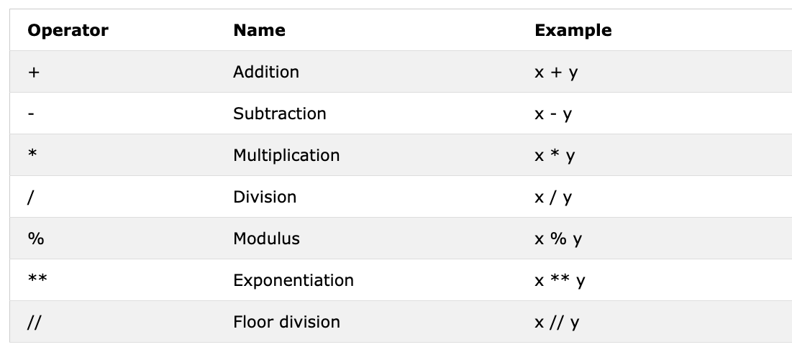

# 3. Operators - Toán tử

---


## 3.1 Boolean

Kiểu dữ liệu boolean đại diện cho một trong hai giá trị: `True` hoặc `False`. Việc sử dụng các kiểu dữ liệu này sẽ rõ ràng hơn khi chúng ta bắt đầu sử dụng toán tử so sánh. Lưu ý, chữ cái đầu tiên của `True` và `False` phải viết hoa, không giống như trong JavaScript.  

Ví dụ: Giá trị Boolean.

```python
print(True)
print(False)
```

## 3.2 Assignment Operators - Toán tử gán

-  Toán tử gán được sử dụng để gán giá trị cho một biến. 
-  Dấu bằng trong toán học cho thấy hai giá trị bằng nhau, tuy nhiên trong Python điều đó có nghĩa là chúng ta đang lưu trữ một giá trị trong một biến nhất định và chúng ta gọi đó là phép gán hoặc giá trị gán cho một biến.


## 3.3 Arithmetic operators - Toán tử số học

- Addition(+): a + b
- Subtraction(-): a - b
- Multiplication(*): a * b
- Division(/): a / b
- Modulus(%): a % b
- Floor division(//): a // b
- Exponentiation(**): a ** b



- Ví dụ: integers

```python
# integers

print('Addition: ', 1 + 2)		# = 3
print('Subtraction: ', 3 - 2) 		# = 1
print('Multiplication: ', 2 * 3)	# = 6
print('Division: ', 6 / 3) 		# = 2 Phép chia trong Python cho kết quả số thực
print('Division: ', 7 / 2)		# 3.5
print('Division without the remainder: ', 7 // 2) 	# 3 chia lấy nguyên 
print('Division without the remainder: ', 7 // 3)	# 2
print('Modulus: ', 3 % 2) 		# 1 lấy dư
print('Exponentiation: ', 2 ** 3)	# 8 lũy thừa
```

- Ví dụ: Float

```python
# Floating numbers
print('Floating Point Number, PI', 3.14)
print('Floating Point Number, gravity', 9.81)
```

- Ví dụ: Số phức

```python
chu@chu-Latitude-5510:$ cat complex_numbers.py 
# Complex numbers
print('Complex number: ', 1 +2j)
print('Multiplying complex numbers: ', (1 + 2j)*(2 + 3j))
chu@chu-Latitude-5510: python3 complex_numbers.py 
Complex number:  (1+2j)
Multiplying complex numbers:  (-4+7j)
```

- Ví dụ 1:

```python
# Khai báo biến ở đầu tiên

a = 3  # a là tên biến và 3 là kiểu dữ liệu số nguyên (integer)
b = 2  # b là tên biến và 2 là kiểu dữ liệu số nguyên (integer)

# Các phép toán số học và gán kết quả vào một biến
total = a + b
diff = a - b
product = a * b
division = a / b
remainder = a % b
floor_division = a // b
exponential = a ** b

# Lẽ ra tôi nên sử dụng "sum" thay cho "total", nhưng "sum" là một hàm tích hợp sẵn - hãy cố gắng tránh ghi đè các hàm tích hợp sẵn
print(total)  # nếu bạn không thêm chuỗi mô tả trong lệnh in, bạn sẽ không biết kết quả đến từ đâu
print('a + b = ', total)
print('a - b = ', diff)
print('a * b = ', product)
print('a / b = ', division)
print('a % b = ', remainder)
print('a // b = ', floor_division)
print('a ** b = ', exponential)
```

- Ví dụ 2:

```python
chu@chu-Latitude-5510:$ cat example_2.py 
# Tính diện tích hình tròn
radius = 10
area_of_circle = 3.14 * radius ** 2
print('area of circle = ', area_of_circle)

#tính diện tích hình chữ nhật
length = 10
width = 5
area_of_rectangle = length * width
print('area of rectangle = ', area_of_rectangle)

# Tính trọng lượng của một vật
mass = 75
gravity = 9.18
weigth = mass * gravity
print(weigth, 'N')

#Tính mật độ chất lỏng

mass = 75
volume = 0.075
density = mass / volume 
chu@chu-Latitude-5510:$ python3 example_2.py 
area of circle =  314.0
area of rectangle =  50
688.5 N
```
## 3.4 Comparison Operators - Toán tử so sánh


- Ví dụ:

```python
print(3 > 2)     # True, because 3 is greater than 2
print(3 >= 2)    # True, because 3 is greater than 2
print(3 < 2)     # False,  because 3 is greater than 2
print(2 < 3)     # True, because 2 is less than 3
print(2 <= 3)    # True, because 2 is less than 3
print(3 == 2)    # False, because 3 is not equal to 2
print(3 != 2)    # True, because 3 is not equal to 2
print(len('mango') == len('avocado'))  # False
print(len('mango') != len('avocado'))  # True
print(len('mango') < len('avocado'))   # True
print(len('milk') != len('meat'))      # False
print(len('milk') == len('meat'))      # True
print(len('tomato') == len('potato'))  # True
print(len('python') > len('dragon'))   # False


# Comparing something gives either a True or False

print('True == True: ', True == True)
print('True == False: ', True == False)
print('False == False:', False == False)
```
- Ngoài các toán tử ở trên thì
  - is: Trả về True nếu cả hai biến đều là cùng một đối tượng (x is y)
  - is not: Trả về True nếu cả hai biến không cùng là một đối tượng (x is not y)
  - in: Trả về True nếu danh sách được truy vấn chứa một mục nhất định (x in y)
  - not in: Trả về True nếu danh sách được truy vấn không có mục nào đó (x not in y)

```python3
print('1 là 1', 1 is 1)                # True - vì giá trị dữ liệu là giống nhau
print('1 không phải là 2', 1 is not 2)  # True - vì 1 không phải là 2
print('A có trong Asabeneh', 'A' in 'Asabeneh')  # True - tìm thấy A trong chuỗi
print('B có trong Asabeneh', 'B' in 'Asabeneh')  # False - không có chữ B hoa
print('coding có trong "coding for all"', 'coding' in 'coding for all')  # True - vì "coding for all" có từ "coding"
print('a có trong an:', 'a' in 'an')     # True
print('4 là 2 ** 2:', 4 is 2 ** 2)      # True
```

## 3.5 Logical Operators - Toán tử logic

Khác với các ngôn ngữ lập trình khác, Python sử dụng các từ khóa `and`, `or` và `not` cho các toán tử logic. Các toán tử logic được sử dụng để kết hợp các câu lệnh điều kiện.


```python
print(3 > 2 and 4 > 3) # True - vì cả hai câu đều đúng
print(3 > 2 and 4 < 3) # False - vì câu thứ hai sai
print(3 < 2 and 4 < 3) # False - vì cả hai câu đều sai
print('True and True: ', True and True)
print(3 > 2 or 4 > 3)  # True - vì cả hai câu đều đúng
print(3 > 2 or 4 < 3)  # True - vì một trong hai câu đúng
print(3 < 2 or 4 < 3)  # False - vì cả hai câu đều sai
print('True or False:', True or False)
print(not 3 > 2)     # False - vì 3 > 2 là đúng, nên not True sẽ ra False
print(not True)      # False - Phủ định, toán tử not sẽ chuyển True thành False
print(not False)     # True
print(not not True)  # True
print(not not False) # False
```

## 3.6 Bài tập

```python
# 1 - Khai báo tuổi của bạn với kiểu dữ liệu integer
my_age = 22

# 2 - Khai báo chiều cao của bạn với kiểu dữ liệu float
my_height = 158.5

# 3 - Khai báo số phức
complex_number = 2 + 3j

# 4 - Viết thông báo yêu cầu nhập đáy, chiều cao của tam giác và tính diện tích tam giác đó
base_of_triangle = input('Enter base: ')
height_of_triangle = input('Enter height: ')
print('area of the triangle: ', 0.5*float(base_of_triangle)*float(height_of_triangle))

# 5 - Viết thông báo yêu cầu nhập cạnh a, b, c của tam giác và in ra chu vi của tam giác đó
side_a = int(input('Enter side a: '))
side_b = int(input('Enter side b: '))
side_c = int(input('Enter side c: '))
print('Perimeter of the triangle: ', side_a + side_b + side_c)

# 6 - Nhập chiều dài và chiều rộng của hình chữ nhập. Tính diện tích và chu vi
length_of_a_rectangle = float(input('Enter lenght: '))
width_of_a_rectangle = float(input('Enter width: '))
print('Area of a rectangle: ', length_of_a_rectangle*width_of_a_rectangle)
print('Perimeter of a rectangle: ', (length_of_a_rectangle + width_of_a_rectangle) * 2)

# 7 - Nhập bán kính hình tròn. Tính chu vi và diện tích
pi = 3.14
radius = float(input('Enter radius: '))
print('Area of the circle: ', pi * radius * radius)
print('Circumference of the circle: ', 2 * pi * radius)
```

```python

# 8 Độ dốc (Slope): Trong phương trình dạng y=mx+c, m chính là độ dốc. Với phương trình y=2x−2y = 2x - 2y=2x−2, độ dốc mmm là 2.
# Giao điểm với trục x (x-intercept): 
# Giao điểm với trục y (y-intercept):

def calculate_linear_properties():
    # Hệ số từ phương trình y = 2x - 2
    slope = 2
    intercept_y = -2
    
    # Tính giao điểm với trục x
    # y = mx + c -> 0 = 2x - 2 -> 2x = 2 -> x = 1
    intercept_x = intercept_y / slope
    
    # Giao điểm với trục y đã được cho sẵn là -2
    return slope, intercept_x, intercept_y

# Lấy các thuộc tính
slope, x_intercept, y_intercept = calculate_linear_properties()

# In kết quả
print(f"Độ dốc: {slope}")
print(f"Giao điểm với trục x: {x_intercept}")
print(f"Giao điểm với trục y: {y_intercept}")
```

```python
# Một cách giải quyết khác của câu 8
def calculate_linear_properties(m,n):
    slope = m
    intercept_y = n
    intercept_x = -m/n
    return slope, intercept_y, intercept_x

print("Enter the Equation: y = ax +c")
a = int(input("Enter slope a = "))
c = int(input("Enter intercept_y: c = "))

slope, intercept_y, intercept_x = calculate_linear_properties(a,c)

print(f"slope = {slope}")
print(f"intercept_y = {intercept_y}")
print(f"intercept_x = {intercept_x}")
```

```python
# 9 - Slope is (m = y2-y1/x2-x1). Find the slope and Euclidean distance between point (2, 2) and point (6,10)
import math

# Tọa độ 2 điểm:
print("Nhap toa do diem A:")
x_1, y_1 = int(input("x_1 = ")), int(input("y_1 = "))
print("Nhap toa do diem B:")
x_2, y_2 = int(input("x_2 = ")), int(input("y_2 = "))


#Tính độ dốc (slope)
slope = (y_2 - y_1) / (x_2 - x_1)

#Tính khoảng cách Euclid
distance = math.sqrt((x_2 - x_1)**2 + (y_2 - y_1)**2)

print(f"Độ dốc giữa hai điểm A, B là: {slope}")
print(f"Khoảng các Euclid giữa hai điểm A, B là: {distance}")
```

```python
# 10 - So sánh slope của bài 8 và bài 9
import math

#Bai 8

def calculate_linear_properties(m,n):
    slope_exer_8 = m
    intercept_y = n
    intercept_x = -m/n
    return slope_exer_8, intercept_y, intercept_x

print("Enter the Equation: y = ax +c")
a = int(input("Enter slope a = "))
c = int(input("Enter intercept_y: c = "))

slope_exer_8, intercept_y, intercept_x = calculate_linear_properties(a,c)

print(f"slope = {slope_exer_8}")
print(f"intercept_y = {intercept_y}")
print(f"intercept_x = {intercept_x}")

# Bai 9
# Tọa độ 2 điểm:
print("Nhap toa do diem A:")
x_1, y_1 = int(input("x_1 = ")), int(input("y_1 = "))
print("Nhap toa do diem B:")
x_2, y_2 = int(input("x_2 = ")), int(input("y_2 = "))


#Tính độ dốc (slope)
slope_exer_9 = (y_2 - y_1) / (x_2 - x_1)

#Tính khoảng cách Euclid
distance = math.sqrt((x_2 - x_1)**2 + (y_2 - y_1)**2)

print(f"Độ dốc giữa hai điểm A, B là: {slope_exer_9}")
print(f"Khoảng các Euclid giữa hai điểm A, B là: {distance}")
```

```python
# 11 - Cho phương trình y = x^2 + 6x + 9, nhập số x, tìm y. Giải phương trình
import numpy as np
#Dinh nghia phuong trinh bac 2
def calculate_y(x):
    return x**2 +6*x +9

#Tinh gia tri cua y voi mot so gia tri cua x
x = int(input("Enter x = "))
value_y = calculate_y(x)
print(f"voi x = {x}, y = {value_y}")

#Giai pt bac 2
# chung ta su dung thu vien co san nhu sau
he_so = [1, 6, 9]
solution = np.roots(he_so)

print(f"Nghiem cua phuong trinh voi y = 0 la {solution}")
```

```python
# 12 Find the length of 'python' and 'dragon' and make a falsy comparison statement.
print(len("python") == len("dragon"))
print("python" == "dragon")

# 13 Use and operator to check if 'on' is found in both 'python' and 'dragon'
print("on in both python and dragon: ", "on" in "python" and "on" in "dragon")
```

```python
# 14 - "I hope this course is not full of jargon". Use in operator to check if jargon is in the sentence.
text = "I hope this course is not full of jargon"
print("jargon in the tex :" , "jargon" in text)
```

```python
# 16 Find the length of the text python and convert the value to float and convert it to string
text = "python"

# Tìm độ dài của chuỗi 'python' và chuyển thành float
length_of_text = len(text)
print("Length of the text 'python':", length_of_text)

# Chuyển độ dài (là một số nguyên) thành float và rồi thành string
length_float = float(length_of_text)
print("Convert the length to float:", length_float)

# Chuyển giá trị float thành string
length_str_float = str(length_float)
print("Convert the float to string:", length_str_float)
```

```python
# 17 Even numbers are divisible by 2 and the remainder is zero. How do you check if a number is even or not using python?
def check_even_number(n):
    if n % 2 == 0:
        return True
    else:
        return False

n = int(input("Enter a number: "))
result = check_even_number(n)
print(f"Number is even: {result}")
```

```python
# 18 - Check if the floor division of 7 by 3 is equal to the int converted value of 2.7.

x = 7 // 3
x = int(x)
print(x) 
print("Checking floor division: ", x == 2.7)
```

```python
# 19 - Check if type of '10' is equal to type of 10
a = '10'
resul = type(a) == type(10)
print("'10' is equal to of 10: ", resul)
```

```python
# 20 - Check if int('9.8') is equal to 10
a = int(float( '9.8'))
print(a)
print("int('9.8') is equal to 10: ", a == 10)
```

```python
# 21 - Writ a script that prompts the user to enter hours and rate per hour. Calculate pay of the person?
hours = int(input("Enter hours: "))
rate_per_hour = int(input("Enter rate per hour: "))
your_weekly_earnings = hours * rate_per_hour
print(f"Your weekly earnings: {your_weekly_earnings}")
```

```python
# 22 - Write a script that prompts the user to enter number of years. Calculate the number of seconds a person can live. Assume a person can live hundred years
years = int(input("Enter number of years you have lived: "))
result = years * 365 * 24 * 60 * 60
print(f"You have lived for {result} seconds.")
```

```python
# 23 Write a Python script that displays the following table
"""
1 1 1 1 1
2 1 2 4 8
3 1 3 9 27
4 1 4 16 64
5 1 5 25 125
"""
# Ta nhận ra bảng trên có quy tắc : a b a^b a^2 a^3 với a chạy từ 1 -> 5, b = 1
for a in range(1,6):
    print(f"{a}    1   {a}    {a**2}    {a**3}")
```
