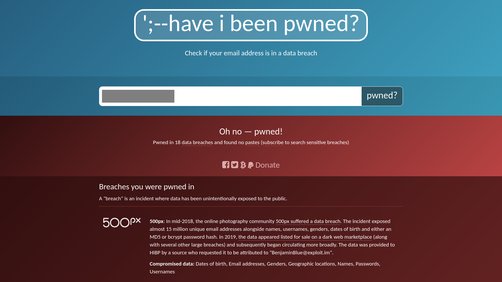

# Search Skills

> Tìm hiểu để tìm kiếm hiệu quả internet và sử dụng các công cụ tìm kiếm chuyên dụng và tài liệu kỹ thuật.

## Mục Lục

1. [Task 1: Introduction](#task-1-introduction)

2. [Task 2: Evaluation of Search Results](#task-2-evaluation-of-search-results)

3. [Task 3: Search Engines](#task-3-search-engines)

4. [Task 4: Specialized Search Engines](#task-4-specialized-search-engines)

5. [Task 5: Vulnerabilities and Exploits](#task-5-vulnerabilities-and-exploits)

6. [Task 6: Technical Documentation](#task-6-technical-documentation)

7. [Task 7: Social Media](#task-7-social-media)

8. [Task 8: Conclusion](#task-8-conclusion)

## Nội dung

# Task 1: Introduction

Một tìm kiếm nhanh trên Google với cụm từ "learn cyber security - học an ninh mạng" trả về khoảng 600 triệu kết quả, trong khi tìm kiếm với cụm từ "học hacking" trả về hơn gấp đôi con số đó! Con số này có thể đã tăng lên nhiều hơn nữa khi bạn tham gia phòng này.  

Chúng ta đang sống trong một thế giới tràn ngập thông tin. Bạn có chọn cách đầu hàng trước tình trạng quá tải thông tin và chấp nhận những kết quả đầu tiên bạn tìm thấy? Hay bạn muốn học các kỹ năng cần thiết để tìm và truy cập những gì mình đang tìm kiếm? Phòng này nhằm giúp bạn thực hiện điều thứ hai.  

### **Mục tiêu học tập**  
Mục tiêu của phòng này là dạy bạn:  
- Đánh giá các nguồn thông tin  
- Sử dụng công cụ tìm kiếm hiệu quả  
- Khám phá các công cụ tìm kiếm chuyên biệt  
- Đọc tài liệu kỹ thuật  
- Tận dụng mạng xã hội  
- Kiểm tra các nguồn tin tức

# Task 2: Evaluation of Search Results

**Đánh giá kết quả tìm kiếm**

Trên Internet, mọi người đều có thể đăng tải bài viết của mình. Điều này có thể dưới dạng bài viết blog, bài báo, hoặc bài đăng trên mạng xã hội. Thậm chí, nó còn xuất hiện một cách tinh vi hơn, như việc chỉnh sửa các trang wiki công cộng. Khả năng này cho phép bất kỳ ai cũng có thể đưa ra những tuyên bố thiếu căn cứ. Mọi người có thể bày tỏ ý kiến của mình về các phương pháp an ninh mạng tốt nhất, xu hướng lập trình trong tương lai, hoặc cách chuẩn bị tốt nhất cho một buổi phỏng vấn DevSecOps.

Là người đọc, nhiệm vụ của chúng ta là đánh giá thông tin. Chúng tôi sẽ liệt kê một vài điều cần xem xét khi đánh giá thông tin:

- **Nguồn (Source):** Xác định tác giả hoặc tổ chức xuất bản thông tin. Hãy xem xét liệu họ có uy tín và đủ thẩm quyền trong chủ đề được bàn luận hay không. Việc xuất bản một bài viết blog không đồng nghĩa với việc tác giả là chuyên gia trong lĩnh vực đó.
- **Bằng chứng và lý luận (Evidence and reasoning):** Kiểm tra xem các tuyên bố có được hỗ trợ bởi bằng chứng đáng tin cậy và lập luận logic hay không. Chúng ta tìm kiếm các sự thật chắc chắn và những lý lẽ vững vàng.
- **Tính khách quan và thiên kiến (Objectivity and bias):** Đánh giá liệu thông tin có được trình bày một cách khách quan và hợp lý, phản ánh nhiều góc nhìn hay không. Chúng ta không quan tâm đến những tác giả cố ý thúc đẩy các chương trình nghị sự mờ ám, quảng bá sản phẩm hoặc công kích đối thủ.
- **Sự chứng thực và tính nhất quán (Corroboration and consistency):** Xác minh thông tin được trình bày thông qua sự chứng thực từ nhiều nguồn độc lập. Kiểm tra xem liệu nhiều nguồn tin đáng tin cậy và có uy tín có đồng ý với các luận điểm chính hay không.

**Câu hỏi 1: Bạn gọi một phương pháp hoặc sản phẩm mã hóa được xem là giả mạo hoặc lừa đảo là gì?**  
<details>  
<summary>Hiển thị đáp án</summary>  
Đáp án: Snake oil  
</details>  

---
Trong lĩnh vực mật mã và an ninh thông tin, một phương pháp hoặc sản phẩm mã hóa được coi là **giả mạo** hoặc **lừa đảo** thường được gọi là **"snake oil"** (dầu rắn).

**Đặc điểm của "snake oil" trong mật mã:**

1. **Overhyped Claims - Tuyên bố quá đà**: Hứa hẹn những điều như "không thể phá vỡ" hoặc "cách mạng hóa," nhưng không có bằng chứng kỹ thuật hoặc nghiên cứu được công nhận.
2. **Lack of Transparency - Thiếu minh bạch**: Phương pháp hoặc thuật toán thường là bí mật và không được các chuyên gia kiểm tra, khiến khó đánh giá mức độ an toàn.
3. **Misleading Terminology - Thuật ngữ gây hiểu nhầm**: Sử dụng các thuật ngữ nghe "hoành tráng" để tạo cảm giác đáng tin cậy, nhưng thực tế không có giá trị bảo mật.
4. **No Peer Review - Không được đánh giá bởi cộng đồng**: Các thuật toán mã hóa thực sự an toàn thường được kiểm tra và đánh giá bởi cộng đồng mật mã trước khi được chấp nhận rộng rãi.

**Tại sao gọi là "snake oil"?**

Thuật ngữ này xuất phát từ thời kỳ thế kỷ 19, khi các "người bán dầu rắn" quảng cáo các loại thuốc giả mạo với những công dụng kỳ diệu. Trong mật mã, "snake oil" là ẩn dụ cho những sản phẩm hoặc phương pháp lừa đảo, tuyên bố cung cấp bảo mật mạnh mẽ nhưng thực tế không đáng tin cậy.

**Cách tránh "snake oil" trong mật mã:**

- Sử dụng các thuật toán mã hóa đã được công nhận và kiểm tra, như **AES**, **RSA**, hoặc **ECC**.
- Tìm kiếm đánh giá từ các chuyên gia hoặc cộng đồng mật mã.
- Tránh các sản phẩm không công khai thuật toán hoặc không minh bạch.
---

**Câu hỏi 2: Tên của lệnh thay thế cho `netstat` trong hệ thống Linux là gì?**  
<details>  
<summary>Hiển thị đáp án</summary>  
Đáp án: ss  
</details>  

---

Lệnh thay thế **`netstat`** trong các hệ thống Linux hiện đại là **`ss`**, viết tắt của **Socket Statistics**.

**Đặc điểm chính của lệnh `ss`:**

1. **Nhanh hơn và hiệu quả hơn**: `ss` hoạt động nhanh hơn `netstat` vì nó truy cập trực tiếp vào không gian kernel thông qua **socket netlink**, thay vì phân tích các tệp trong `/proc`.
2. **Cung cấp thông tin chi tiết hơn**: `ss` cung cấp nhiều thông tin chi tiết về các kết nối TCP, UDP, và socket thô (raw sockets).
3. **Hỗ trợ lọc linh hoạt**: Cho phép lọc dữ liệu dựa trên địa chỉ, cổng, trạng thái, hoặc giao thức.
4. **Thuộc gói iproute2**: `ss` nằm trong gói **iproute2**, được cài đặt mặc định trên hầu hết các bản phân phối Linux hiện nay.

**Các ví dụ sử dụng lệnh `ss`:**

1. **Hiển thị tất cả kết nối**:
   ```bash
   ss -a
   ```
2. **Hiển thị các cổng đang lắng nghe**:
   ```bash
   ss -l
   ```
3. **Hiển thị các kết nối TCP**:
   ```bash
   ss -t
   ```
4. **Hiển thị các kết nối UDP**:
   ```bash
   ss -u
   ```
5. **Hiển thị thống kê chi tiết**:
   ```bash
   ss -s
   ```

**Tại sao `ss` thay thế `netstat`?**

Lệnh `netstat` được coi là đã **lỗi thời** trên các hệ thống Linux hiện đại, trong khi `ss` hoạt động nhanh hơn và cung cấp nhiều tính năng mới hơn. Mặc dù nhiều hệ thống vẫn giữ `netstat` để tương thích, nhưng bạn nên chuyển sang sử dụng `ss` vì nó phù hợp với các công cụ mạng hiện đại hơn.

---

# Task 3: Search Engines

**Công cụ tìm kiếm**

Mỗi chúng ta đều đã từng sử dụng công cụ tìm kiếm trên Internet; tuy nhiên, không phải ai cũng cố gắng khai thác hết sức mạnh của chúng. Hầu hết các công cụ tìm kiếm trên Internet đều cho phép bạn thực hiện tìm kiếm nâng cao. Hãy xem xét các ví dụ sau:

- **[Google](https://www.google.com/advanced_search)**  
- **[Bing](https://support.microsoft.com/en-us/topic/advanced-search-options-b92e25f1-0085-4271-bdf9-14aaea720930)**  
- **[DuckDuckGo](https://duckduckgo.com/duckduckgo-help-pages/results/syntax/)**  

Hãy xem các toán tử tìm kiếm được hỗ trợ bởi Google.

- **"exact phrase - cụm từ chính xác"**: Dấu ngoặc kép cho biết bạn đang tìm kiếm các trang chứa từ hoặc cụm từ chính xác. Ví dụ, bạn có thể tìm kiếm `"passive reconnaissance"` để tìm các trang chứa cụm từ chính xác này.   

- **site:** Toán tử này cho phép bạn giới hạn tìm kiếm trong một tên miền cụ thể. Ví dụ, chúng ta có thể tìm kiếm các câu chuyện thành công trên TryHackMe bằng cách sử dụng  
  `site:tryhackme.com success stories`.

- **-**: Dấu trừ cho phép bạn loại bỏ các kết quả tìm kiếm có chứa một từ hoặc cụm từ cụ thể. Ví dụ, bạn có thể quan tâm đến việc tìm hiểu về kim tự tháp, nhưng không muốn xem các trang web về du lịch; một cách tiếp cận là tìm kiếm:  
  `pyramids -tourism`  
  hoặc  
  `-tourism pyramids`.

- **filetype:** Toán tử tìm kiếm này rất hữu ích để tìm kiếm tệp thay vì các trang web. Một số loại tệp bạn có thể tìm kiếm bằng Google bao gồm Tài liệu PDF, Tài liệu Microsoft Word (DOC), Bảng tính Excel (XLS), và Bài thuyết trình PowerPoint (PPT). Ví dụ, để tìm các bài thuyết trình về an ninh mạng, hãy thử tìm kiếm:  
  `filetype:ppt cyber security`.

Bạn có thể kiểm tra thêm các điều khiển nâng cao trên các công cụ tìm kiếm khác trong [danh sách các toán tử tìm kiếm nâng cao](https://github.com/cipher387/Advanced-search-operators-list); tuy nhiên, các ví dụ trên cung cấp một điểm khởi đầu tốt. Hãy kiểm tra công cụ tìm kiếm yêu thích của bạn để biết các toán tử tìm kiếm được hỗ trợ.

---

**Câu hỏi 1: Làm thế nào để giới hạn tìm kiếm Google của bạn chỉ trong các file PDF chứa các từ khóa "cyber warfare report"?**  
<details>  
<summary>Hiển thị đáp án</summary>  
Đáp án: filetype:pdf cyber warfare report  
</details>  

**Câu hỏi 2: Cụm từ nào là ý nghĩa của lệnh `ss` trong Linux?**  
<details>  
<summary>Hiển thị đáp án</summary>  
Đáp án: socket statistics  
</details>  

# Task 4: Specialized Search Engines

**Công cụ tìm kiếm chuyên biệt**

Bạn đã quen thuộc với các công cụ tìm kiếm Internet; tuy nhiên, bạn đã quen thuộc bao nhiêu với các công cụ tìm kiếm chuyên biệt? Đây là những công cụ tìm kiếm được sử dụng để tìm các loại kết quả cụ thể.

### Shodan

Hãy bắt đầu với **[Shodan](https://www.shodan.io/)**, một công cụ tìm kiếm dành cho các thiết bị kết nối Internet. Nó cho phép bạn tìm kiếm các loại và phiên bản cụ thể của máy chủ, thiết bị mạng, hệ thống điều khiển công nghiệp, và các thiết bị IoT. 

Bạn có thể muốn xem có bao nhiêu máy chủ vẫn đang chạy **Apache 2.4.1** và sự phân bố của chúng trên các quốc gia. Để tìm câu trả lời, chúng ta có thể tìm kiếm với từ khóa  
**apache 2.4.1**,  
kết quả sẽ trả về danh sách các máy chủ với chuỗi `"apache 2.4.1"` trong tiêu đề của chúng.


**Hãy xem thêm các ví dụ về Shodan tại** [Shodan Search Query Examples](https://www.shodan.io/search/examples) **để biết thêm. Ngoài ra, bạn có thể kiểm tra** [Shodan trends](https://trends.shodan.io/) **để có cái nhìn lịch sử nếu bạn có đăng ký tài khoản.**

### Censys

**Thoạt nhìn**, [Censys](https://search.censys.io/) **tương tự với Shodan. Tuy nhiên, Shodan tập trung vào các thiết bị và hệ thống kết nối Internet, chẳng hạn như máy chủ, bộ định tuyến, webcam và thiết bị IoT. Ngược lại, Censys tập trung vào các máy chủ kết nối Internet, trang web, chứng chỉ, và các tài sản Internet khác.**

Một số trường hợp sử dụng của nó bao gồm:  
- Liệt kê các tên miền đang được sử dụng,  
- Kiểm tra các cổng và dịch vụ đang mở,  
- Phát hiện các tài sản không mong muốn trong mạng.  

Bạn có thể muốn xem thêm [Censys Search Use Cases](https://support.censys.io/hc/en-us/articles/20720064229140-Censys-Search-Use-Cases) để biết thêm chi tiết.


### VirusTotal

[**VirusTotal**](https://www.virustotal.com/gui/) là một trang web trực tuyến cung cấp dịch vụ quét virus cho các tệp bằng cách sử dụng nhiều công cụ diệt virus khác nhau. Nó cho phép người dùng tải lên tệp hoặc cung cấp URL để quét chúng bằng nhiều công cụ diệt virus và máy quét trang web trong một thao tác. Người dùng thậm chí có thể nhập hàm băm của tệp để kiểm tra kết quả của các tệp đã được tải lên trước đó.

Ảnh chụp màn hình bên dưới minh họa kết quả quét tệp đã gửi qua 67 công cụ diệt virus. Ngoài ra, người dùng có thể xem các bình luận từ cộng đồng để có thêm thông tin chi tiết.  

Thỉnh thoảng, một tệp có thể bị gắn cờ là virus hoặc Trojan; tuy nhiên, điều này có thể không chính xác vì nhiều lý do. Đây là lúc các thành viên cộng đồng có thể cung cấp những giải thích chi tiết hơn.


### Have I Been Pwned

[**Have I Been Pwned** (HIBP)](https://haveibeenpwned.com/) là một công cụ đơn giản nhưng mạnh mẽ, giúp bạn kiểm tra xem địa chỉ email của mình có xuất hiện trong các vụ rò rỉ dữ liệu hay không. Việc phát hiện email của bạn nằm trong dữ liệu bị rò rỉ đồng nghĩa với việc thông tin cá nhân, và quan trọng hơn, mật khẩu của bạn có thể đã bị lộ.

Nhiều người thường sử dụng cùng một mật khẩu trên nhiều nền tảng. Do đó, nếu một nền tảng bị xâm phạm, mật khẩu của họ trên các nền tảng khác cũng có nguy cơ bị tiết lộ. Mặc dù mật khẩu thường được lưu trữ ở định dạng mã hóa, nhưng nhiều mật khẩu không đủ phức tạp và có thể bị khôi phục bằng nhiều phương pháp tấn công khác nhau.



