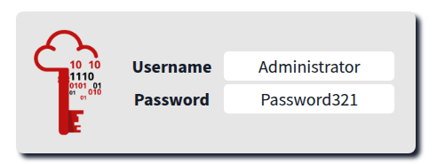

# Active Directory Basics

> Phòng này sẽ giới thiệu các khái niệm và chức năng cơ bản được cung cấp bởi Active Directory.

## Mục Lục

1. [Task 1: Introduction](#task-1-introduction)

2. [Task 2: Windows Domains](#task-2-windows-domains)

3. [Task 3: Active Directory](#task-3-active-directory)

4. [Task 4: Managing Users in AD](#task-4-managing-users-in-ad)

5. [Task 5: Managing Computers in AD](#task-5-managing-computers-in-ad)

6. [Task 6: Group Policies](#task-6-group-policies)

7. [Task 7: Authentication Methods](#task-7-authentication-methods)

8. [Task 8: Trees, Forests and Trusts](#task-8-trees-forests-and-trusts)

9. [Task 9: Conclusion](#task-9-conclusion)

## Nội dung

# Task 1: Introduction

Microsoft Active Directory là xương sống của thế giới doanh nghiệp. Nó đơn giản hóa việc quản lý các thiết bị và người dùng trong một môi trường doanh nghiệp. Trong phòng này, chúng ta sẽ đi sâu vào các thành phần quan trọng của Active Directory.

#### Mục tiêu của phòng:

Trong phòng này, chúng ta sẽ học về Active Directory và làm quen với các chủ đề sau:
- Active Directory là gì
- Miền (Domain) của Active Directory là gì
- Các thành phần trong một miền Active Directory
- Rừng (Forests) và mối quan hệ tin cậy giữa các miền (Domain Trust)
- Và nhiều nội dung khác!

#### Yêu cầu đầu vào:
- Hiểu biết cơ bản về Windows. Hãy kiểm tra [Windows Fundamentals module](https://github.com/CHu292/SOC/tree/main/Try_Hack_Me/Pre_Security/5_Windows_Fundamentals) để biết thêm thông tin về điều này.

# Task 2: Windows Domains

Hãy tưởng tượng bạn đang quản lý một mạng của một doanh nghiệp nhỏ chỉ với năm máy tính và năm nhân viên. Trong một mạng nhỏ như vậy, bạn có thể cấu hình từng máy tính một cách riêng lẻ mà không gặp vấn đề gì. Bạn sẽ đăng nhập thủ công vào từng máy tính, tạo người dùng cho những ai cần sử dụng chúng và thực hiện các cấu hình cụ thể cho từng tài khoản nhân viên. Nếu máy tính của một người dùng gặp sự cố, bạn có thể đến chỗ họ và sửa máy tính tại chỗ.

Mặc dù điều này nghe có vẻ như một cuộc sống rất thư thả, nhưng giả sử doanh nghiệp của bạn đột nhiên phát triển và bây giờ có 157 máy tính và 320 người dùng khác nhau, nằm rải rác tại bốn văn phòng khác nhau. Liệu bạn có thể tiếp tục quản lý từng máy tính như một thực thể riêng biệt, cấu hình thủ công các chính sách cho từng người dùng trên toàn bộ mạng và cung cấp hỗ trợ tại chỗ cho tất cả mọi người? Câu trả lời có khả năng cao là không.

Để vượt qua những hạn chế này, chúng ta có thể sử dụng một miền Windows (Windows domain). Nói đơn giản, một **miền Windows** là một nhóm người dùng và máy tính dưới sự quản lý của một doanh nghiệp nhất định. Ý tưởng chính của một miền là tập trung hóa việc quản trị các thành phần chung của một mạng máy tính Windows trong một kho lưu trữ duy nhất gọi là **Active Directory (AD)**. Máy chủ chạy dịch vụ Active Directory được gọi là **Domain Controller (DC)**. 

Những lợi ích chính của việc có một miền Windows được cấu hình bao gồm:

- **Quản lý danh tính tập trung:** Tất cả người dùng trên mạng có thể được cấu hình từ Active Directory với nỗ lực tối thiểu.  
- **Quản lý chính sách bảo mật:** Bạn có thể cấu hình các chính sách bảo mật trực tiếp từ Active Directory và áp dụng chúng cho người dùng và máy tính trên toàn mạng khi cần.

## Một ví dụ thực tế

Nếu điều này nghe có vẻ hơi khó hiểu, có khả năng bạn đã từng tương tác với một miền Windows ở trường học, đại học hoặc nơi làm việc của bạn.

Trong mạng lưới trường học/đại học, bạn thường sẽ được cung cấp một tên người dùng và mật khẩu mà bạn có thể sử dụng trên bất kỳ máy tính nào có sẵn trong khuôn viên. Thông tin xác thực của bạn hợp lệ cho tất cả các máy vì bất cứ khi nào bạn nhập chúng vào một máy, quá trình xác thực sẽ được chuyển đến Active Directory, nơi thông tin xác thực của bạn sẽ được kiểm tra. Nhờ Active Directory, thông tin xác thực của bạn không cần tồn tại trên từng máy riêng lẻ mà vẫn có thể sử dụng được trên toàn mạng.

Active Directory cũng là thành phần cho phép trường học/đại học của bạn hạn chế bạn truy cập vào bảng điều khiển (control panel) trên các máy của trường học/đại học. Các chính sách thường sẽ được triển khai trên toàn mạng để bạn không có quyền quản trị trên các máy tính đó.

## Chào mừng đến với THM Inc.

Trong nhiệm vụ này, chúng ta sẽ đảm nhận vai trò của một quản trị viên IT mới tại THM Inc. Nhiệm vụ đầu tiên của chúng ta là xem xét miền hiện tại "THM.local" và thực hiện một số cấu hình bổ sung. Bạn sẽ có thông tin đăng nhập quản trị để truy cập Domain Controller (DC) đã được cấu hình sẵn để thực hiện các nhiệm vụ.

Nếu bạn muốn kết nối với máy này qua **RDP**, bạn có thể sử dụng thông tin đăng nhập sau đây: 

**Lưu ý:** Khi kết nối qua **RDP**, sử dụng **THM\Administrator** làm tên người dùng để chỉ định rằng bạn muốn đăng nhập với tài khoản **Administrator** trong miền **THM**.

Vì chúng ta sẽ kết nối đến máy mục tiêu qua **RDP**, đây cũng là thời điểm thích hợp để khởi động **AttackBox** (trừ khi bạn đang sử dụng máy của chính mình). 

