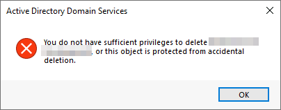
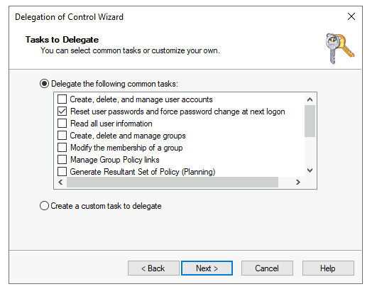
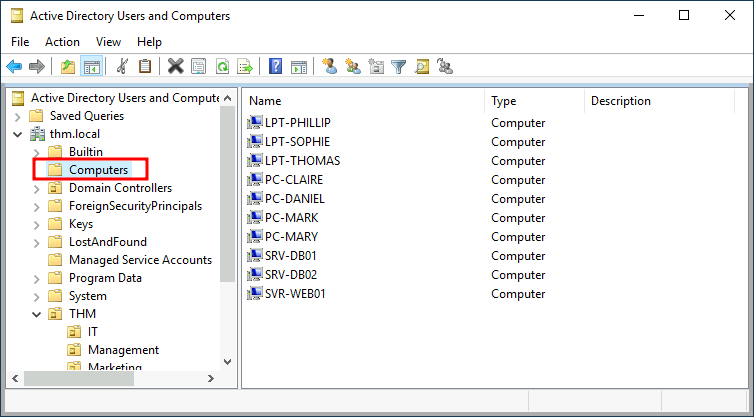
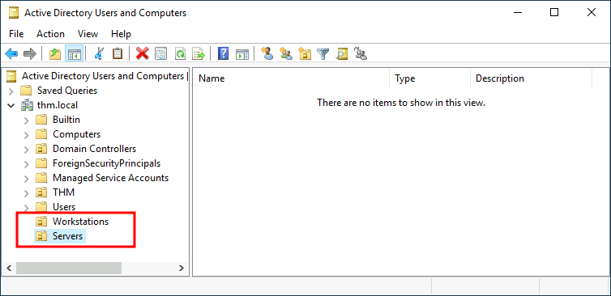
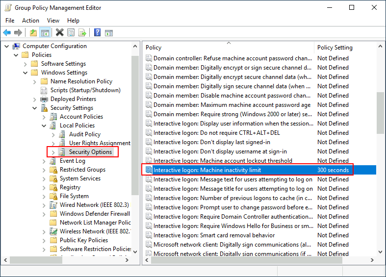

# Active Directory Basics

> Phòng này sẽ giới thiệu các khái niệm và chức năng cơ bản được cung cấp bởi Active Directory.

## Mục Lục

1. [Task 1: Introduction](#task-1-introduction)

2. [Task 2: Windows Domains](#task-2-windows-domains)

3. [Task 3: Active Directory](#task-3-active-directory)

4. [Task 4: Managing Users in AD](#task-4-managing-users-in-ad)

5. [Task 5: Managing Computers in AD](#task-5-managing-computers-in-ad)

6. [Task 6: Group Policies](#task-6-group-policies)

7. [Task 7: Authentication Methods](#task-7-authentication-methods)

8. [Task 8: Trees, Forests and Trusts](#task-8-trees-forests-and-trusts)

9. [Task 9: Conclusion](#task-9-conclusion)

## Nội dung

# Task 1: Introduction

Microsoft Active Directory là xương sống của thế giới doanh nghiệp. Nó đơn giản hóa việc quản lý các thiết bị và người dùng trong một môi trường doanh nghiệp. Trong phòng này, chúng ta sẽ đi sâu vào các thành phần quan trọng của Active Directory.

#### Mục tiêu của phòng:

Trong phòng này, chúng ta sẽ học về Active Directory và làm quen với các chủ đề sau:
- Active Directory là gì
- Miền (Domain) của Active Directory là gì
- Các thành phần trong một miền Active Directory
- Rừng (Forests) và mối quan hệ tin cậy giữa các miền (Domain Trust)
- Và nhiều nội dung khác!

#### Yêu cầu đầu vào:
- Hiểu biết cơ bản về Windows. Hãy kiểm tra [Windows Fundamentals module](https://github.com/CHu292/SOC/tree/main/Try_Hack_Me/Pre_Security/5_Windows_Fundamentals) để biết thêm thông tin về điều này.

# Task 2: Windows Domains

Hãy tưởng tượng bạn đang quản lý một mạng của một doanh nghiệp nhỏ chỉ với năm máy tính và năm nhân viên. Trong một mạng nhỏ như vậy, bạn có thể cấu hình từng máy tính một cách riêng lẻ mà không gặp vấn đề gì. Bạn sẽ đăng nhập thủ công vào từng máy tính, tạo người dùng cho những ai cần sử dụng chúng và thực hiện các cấu hình cụ thể cho từng tài khoản nhân viên. Nếu máy tính của một người dùng gặp sự cố, bạn có thể đến chỗ họ và sửa máy tính tại chỗ.

Mặc dù điều này nghe có vẻ như một cuộc sống rất thư thả, nhưng giả sử doanh nghiệp của bạn đột nhiên phát triển và bây giờ có 157 máy tính và 320 người dùng khác nhau, nằm rải rác tại bốn văn phòng khác nhau. Liệu bạn có thể tiếp tục quản lý từng máy tính như một thực thể riêng biệt, cấu hình thủ công các chính sách cho từng người dùng trên toàn bộ mạng và cung cấp hỗ trợ tại chỗ cho tất cả mọi người? Câu trả lời có khả năng cao là không.

Để vượt qua những hạn chế này, chúng ta có thể sử dụng một miền Windows (Windows domain). Nói đơn giản, một **miền Windows** là một nhóm người dùng và máy tính dưới sự quản lý của một doanh nghiệp nhất định. Ý tưởng chính của một miền là tập trung hóa việc quản trị các thành phần chung của một mạng máy tính Windows trong một kho lưu trữ duy nhất gọi là **Active Directory (AD)**. Máy chủ chạy dịch vụ Active Directory được gọi là **Domain Controller (DC)**. 


Những lợi ích chính của việc có một miền Windows được cấu hình bao gồm:

- **Quản lý danh tính tập trung:** Tất cả người dùng trên mạng có thể được cấu hình từ Active Directory với nỗ lực tối thiểu.  
- **Quản lý chính sách bảo mật:** Bạn có thể cấu hình các chính sách bảo mật trực tiếp từ Active Directory và áp dụng chúng cho người dùng và máy tính trên toàn mạng khi cần.

## Một ví dụ thực tế

Nếu điều này nghe có vẻ hơi khó hiểu, có khả năng bạn đã từng tương tác với một miền Windows ở trường học, đại học hoặc nơi làm việc của bạn.

Trong mạng lưới trường học/đại học, bạn thường sẽ được cung cấp một tên người dùng và mật khẩu mà bạn có thể sử dụng trên bất kỳ máy tính nào có sẵn trong khuôn viên. Thông tin xác thực của bạn hợp lệ cho tất cả các máy vì bất cứ khi nào bạn nhập chúng vào một máy, quá trình xác thực sẽ được chuyển đến Active Directory, nơi thông tin xác thực của bạn sẽ được kiểm tra. Nhờ Active Directory, thông tin xác thực của bạn không cần tồn tại trên từng máy riêng lẻ mà vẫn có thể sử dụng được trên toàn mạng.

Active Directory cũng là thành phần cho phép trường học/đại học của bạn hạn chế bạn truy cập vào bảng điều khiển (control panel) trên các máy của trường học/đại học. Các chính sách thường sẽ được triển khai trên toàn mạng để bạn không có quyền quản trị trên các máy tính đó.

## Chào mừng đến với THM Inc.

Trong nhiệm vụ này, chúng ta sẽ đảm nhận vai trò của một quản trị viên IT mới tại THM Inc. Nhiệm vụ đầu tiên của chúng ta là xem xét miền hiện tại "THM.local" và thực hiện một số cấu hình bổ sung. Bạn sẽ có thông tin đăng nhập quản trị để truy cập Domain Controller (DC) đã được cấu hình sẵn để thực hiện các nhiệm vụ.

Nếu bạn muốn kết nối với máy này qua **RDP**, bạn có thể sử dụng thông tin đăng nhập sau đây: 


**Lưu ý:** Khi kết nối qua **RDP**, sử dụng **THM\Administrator** làm tên người dùng để chỉ định rằng bạn muốn đăng nhập với tài khoản **Administrator** trong miền **THM**.

Vì chúng ta sẽ kết nối đến máy mục tiêu qua **RDP**, đây cũng là thời điểm thích hợp để khởi động **AttackBox** (trừ khi bạn đang sử dụng máy của chính mình). 

**Câu hỏi 1: Trong một miền Windows, thông tin xác thực được lưu trữ trong kho lưu trữ tập trung được gọi là gì?**  
<details>  
<summary>Hiển thị đáp án</summary>  
Đáp án: Active Directory  
</details>  

**Câu hỏi 2: Máy chủ chịu trách nhiệm vận hành các dịch vụ Active Directory được gọi là gì?**  
<details>  
<summary>Hiển thị đáp án</summary>  
Đáp án: Domain Controller  
</details>  

# Task 3: Active Directory

Trung tâm của bất kỳ Miền Windows nào là **Active Directory Domain Service (AD DS)**. Dịch vụ này hoạt động như một danh mục chứa thông tin về tất cả các "đối tượng" tồn tại trên mạng của bạn. Trong số nhiều đối tượng được hỗ trợ bởi **AD**, chúng ta có người dùng, nhóm, máy tính, máy in, chia sẻ và nhiều đối tượng khác. Hãy xem một số trong số đó:

## Người dùng (Users)  

Người dùng là một trong những loại đối tượng phổ biến nhất trong Active Directory. Người dùng là một trong những đối tượng được gọi là **security principals** (nguyên tắc bảo mật), có nghĩa là họ có thể được xác thực bởi miền và có thể được cấp quyền đối với **resources** (tài nguyên) như tệp hoặc máy in. Bạn có thể nói rằng một nguyên tắc bảo mật là một đối tượng có thể hành động trên các tài nguyên trong mạng.

Người dùng có thể được sử dụng để đại diện cho hai loại thực thể:  

- **People**: Người dùng thường đại diện cho các cá nhân trong tổ chức của bạn cần truy cập vào mạng, chẳng hạn như nhân viên.  
- **Services**: Bạn cũng có thể xác định người dùng để được sử dụng bởi các dịch vụ như IIS hoặc MSSQL. Mỗi dịch vụ riêng lẻ yêu cầu một người dùng để chạy, nhưng người dùng dịch vụ khác với người dùng thông thường vì họ chỉ có quyền cần thiết để chạy dịch vụ cụ thể của họ.  

## Máy tính (Machines)  

Máy tính là một loại đối tượng khác trong Active Directory; đối với mỗi máy tính tham gia miền Active Directory, một đối tượng máy tính sẽ được tạo. Máy tính cũng được xem là **"security principals"** (nguyên tắc bảo mật) và được chỉ định một tài khoản giống như bất kỳ người dùng thông thường nào. Tài khoản này có quyền hạn chế hơn trong chính miền đó.

Bản thân tài khoản máy tính là quản trị viên cục bộ trên máy tính được chỉ định, chúng thường không được phép truy cập bởi bất kỳ ai ngoài chính máy tính, nhưng giống như bất kỳ tài khoản nào khác, nếu bạn có mật khẩu, bạn có thể sử dụng nó để đăng nhập.

**Lưu ý**: Mật khẩu của tài khoản máy tính được tự động thay đổi và thường bao gồm 120 ký tự ngẫu nhiên.  

Việc xác định tài khoản máy tính tương đối đơn giản. Chúng tuân theo một quy ước đặt tên cụ thể. Tên tài khoản máy tính là tên của máy tính, theo sau là ký hiệu đô la ($). Ví dụ: một máy tính có tên **DC01** sẽ có tài khoản máy tính được gọi là **DC01$**.  

## Nhóm bảo mật (Security Groups)

Nếu bạn quen thuộc với Windows, bạn có thể biết rằng bạn có thể định nghĩa các nhóm người dùng để gán quyền truy cập vào tệp hoặc tài nguyên khác cho toàn bộ nhóm thay vì từng người dùng. Điều này giúp quản lý dễ dàng hơn vì bạn có thể thêm người dùng vào một nhóm hiện có, và họ sẽ tự động kế thừa tất cả các quyền của nhóm đó. Nhóm bảo mật cũng được xem là **security principals** (nguyên tắc bảo mật) và, do đó, có thể có quyền đối với các tài nguyên trong mạng.

Các nhóm có thể có cả người dùng và máy tính làm thành viên. Nếu cần, nhóm có thể bao gồm các nhóm khác.

Một số nhóm được tạo mặc định trong một miền có thể được sử dụng để cấp các quyền cụ thể cho người dùng. Ví dụ, dưới đây là một số nhóm quan trọng nhất trong một miền:

| **Nhóm bảo mật (Security Group)** | **Mô tả (Description)** |
|----------------------------------|--------------------------|
| **Domain Admins**               | Người dùng trong nhóm này có quyền quản trị trên toàn bộ miền. Theo mặc định, họ có thể quản trị bất kỳ máy tính nào trong miền, bao gồm cả Domain Controllers (DCs). |
| **Server Operators**            | Người dùng trong nhóm này có thể quản trị Domain Controllers. Họ không thể thay đổi tư cách thành viên của các nhóm quản trị. |
| **Backup Operators**            | Người dùng trong nhóm này được phép truy cập bất kỳ tệp nào, bất kể quyền hạn. Họ được sử dụng để thực hiện sao lưu dữ liệu trên máy tính. |
| **Account Operators**           | Người dùng trong nhóm này có thể tạo hoặc sửa đổi các tài khoản khác trong miền. |
| **Domain Users**                | Bao gồm tất cả tài khoản người dùng hiện có trong miền. |
| **Domain Computers**            | Bao gồm tất cả máy tính hiện có trong miền. |
| **Domain Controllers**          | Bao gồm tất cả các Domain Controllers (DCs) hiện có trong miền. |

Bạn có thể tham khảo danh sách đầy đủ các nhóm bảo mật mặc định từ [tài liệu của Microsoft](https://learn.microsoft.com/en-us/windows-server/identity/ad-ds/manage/understand-security-groups).

## **Active Directory Users and Computers**

Để cấu hình người dùng, nhóm hoặc máy tính trong Active Directory, chúng ta cần đăng nhập vào Domain Controller và chạy **"Active Directory Users and Computers"** từ menu Start.


Điều này sẽ mở một cửa sổ nơi bạn có thể thấy được hệ thống phân cấp của người dùng, máy tính và nhóm tồn tại trong miền. Các đối tượng này được tổ chức trong **Organizational Units (OUs)**, là các đối tượng chứa (**container objects**) cho phép bạn phân loại người dùng và máy tính. OUs chủ yếu được sử dụng để định nghĩa các nhóm người dùng với các yêu cầu chính sách tương tự. Ví dụ, nhân viên trong bộ phận Kinh doanh của tổ chức bạn có thể có một bộ chính sách khác với những người trong bộ phận IT. Lưu ý rằng một người dùng chỉ có thể thuộc một OU duy nhất tại một thời điểm.

Kiểm tra máy của chúng ta, ta có thể thấy đã có một OU được gọi là **THM** với bốn OU (Organizational Unit) con cho các bộ phận IT, Quản lý, Tiếp thị và Kinh doanh. Đây là một mô hình phổ biến vì nó cho phép triển khai hiệu quả các chính sách cơ bản áp dụng cho toàn bộ các phòng ban. Hãy nhớ rằng, mặc dù đây sẽ là mô hình dự kiến hầu hết thời gian, bạn cũng có thể định nghĩa OUs theo ý muốn. Cứ thoải mái nhấp chuột phải vào OU **THM** và tạo một OU mới bên trong gọi là **Students** chỉ để thử nghiệm. 


Nếu bạn mở bất kỳ OU nào, bạn có thể thấy người dùng mà chúng chứa và thực hiện các tác vụ đơn giản như tạo, xóa hoặc chỉnh sửa chúng khi cần thiết. Bạn cũng có thể đặt lại mật khẩu nếu cần (rất hữu ích cho bộ phận hỗ trợ kỹ thuật).

Chắc hẳn bạn đã nhận ra rằng có một số container mặc định khác ngoài OU **THM**. Những container này được Windows tự động tạo ra và bao gồm các nội dung sau:

- **Builtin**: Chứa các nhóm mặc định có sẵn trên bất kỳ máy chủ Windows nào.
- **Computers**: Bất kỳ máy nào tham gia vào mạng sẽ được đưa vào đây theo mặc định. Bạn có thể di chuyển chúng nếu cần.
- **Domain Controllers**: OU mặc định chứa các DC (Domain Controller) trong mạng của bạn.
- **Users**: Người dùng và nhóm mặc định áp dụng trong toàn bộ bối cảnh của miền (domain-wide).
- **Managed Service Accounts**: Chứa các tài khoản được sử dụng bởi các dịch vụ trong miền Windows của bạn.

## So sánh giữa Security Groups và OUs

Có lẽ bạn đang tự hỏi tại sao lại có cả **nhóm bảo mật** (Security Groups) và **OUs**. Mặc dù cả hai đều được sử dụng để phân loại người dùng và máy tính, mục đích của chúng hoàn toàn khác nhau:

- **OUs** rất hữu ích để **áp dụng chính sách** cho người dùng và máy tính, bao gồm các cấu hình cụ thể áp dụng cho các nhóm người dùng dựa trên vai trò của họ trong doanh nghiệp. Lưu ý rằng, một người dùng chỉ có thể là thành viên của **một OU duy nhất** tại một thời điểm, vì không có lý do hợp lý để áp dụng hai tập hợp chính sách khác nhau cho một người dùng duy nhất.

- **Security Groups**, mặt khác, được sử dụng để **cấp quyền truy cập vào các tài nguyên**. Ví dụ: bạn sẽ sử dụng các nhóm nếu bạn muốn một số người dùng có quyền truy cập vào một thư mục được chia sẻ hoặc một máy in mạng. Một người dùng có thể là thành viên của nhiều nhóm, điều này rất cần thiết để cấp quyền truy cập vào nhiều tài nguyên khác nhau.

**Câu hỏi:**

---

**Câu hỏi 1: Nhóm nào thường quản lý tất cả các máy tính và tài nguyên trong một miền?**  
<details>  
<summary>Hiển thị đáp án</summary>  
Đáp án: Domain Admins  
</details>  

---

**Câu hỏi 2: Tên của tài khoản máy được liên kết với một máy có tên TOM-PC sẽ là gì?**  
<details>  
<summary>Hiển thị đáp án</summary>  
Đáp án: TOM-PC$  
</details>  

Trong môi trường **Active Directory (AD)**, tài khoản máy tính (**machine account**) được tạo tự động khi một máy tính được tham gia vào miền (**domain**). Tên của tài khoản máy tính thường tuân theo quy tắc:  

**Tên máy + ký tự "$"**  

**Tài khoản máy tính dùng để làm gì?**
1. **Xác thực (Authentication)** – Máy tính sử dụng tài khoản này để xác thực với bộ điều khiển miền (**Domain Controller**).  
2. **Áp dụng Group Policy** – Cho phép máy tính nhận các chính sách bảo mật và cấu hình từ hệ thống.  
3. **Giao tiếp bảo mật** – Đảm bảo kết nối an toàn giữa máy tính và các dịch vụ trên mạng nội bộ.

---

**Câu hỏi 3: Giả sử công ty chúng ta tạo một bộ phận mới dành cho Đảm bảo Chất lượng (Quality Assurance). Chúng ta nên sử dụng loại container nào để nhóm tất cả người dùng Quality Assurance sao cho chính sách có thể được áp dụng nhất quán với họ?**  
<details>  
<summary>Hiển thị đáp án</summary>  
Đáp án: Organizational Units  
</details>  

Để nhóm tất cả người dùng thuộc bộ phận **Đảm bảo Chất lượng (Quality Assurance - QA)** và áp dụng chính sách một cách nhất quán, bạn nên sử dụng **Đơn vị Tổ chức (Organizational Units - OUs)** trong **Active Directory (AD)** hoặc **Azure AD** nếu sử dụng môi trường đám mây.  

**Tại sao nên sử dụng Đơn vị Tổ chức (OU)?**

1. **Áp dụng chính sách nhất quán** – OUs cho phép bạn triển khai **Chính sách Nhóm (Group Policies - GPOs)** trong Active Directory, đảm bảo rằng tất cả người dùng QA đều có chung cài đặt bảo mật, quyền truy cập và tuân thủ quy định.  
2. **Quản lý tập trung** – Quản trị viên có thể dễ dàng quản lý tài khoản người dùng, quyền hạn và cài đặt bảo mật cho toàn bộ nhóm QA trong một vị trí duy nhất.  
3. **Phân quyền quản trị** – Nếu trưởng nhóm QA hoặc nhân viên IT cần quyền kiểm soát cụ thể đối với người dùng QA, có thể cấp quyền quản lý trực tiếp trên OU.  
4. **Khả năng mở rộng** – Khi bộ phận QA phát triển, bạn chỉ cần thêm người dùng mới vào OU và họ sẽ tự động kế thừa các chính sách đã thiết lập.  

**Các phương pháp thay thế**

- **Nhóm Bảo mật (Security Groups)**: Hữu ích để kiểm soát quyền truy cập vào tài nguyên hệ thống và ứng dụng.  
- **Nhóm Động (Dynamic Groups - Azure AD)**: Nếu sử dụng môi trường đám mây, có thể thiết lập nhóm động để tự động thêm người dùng vào nhóm QA dựa trên thông tin như chức danh công việc hoặc phòng ban.  
---

# Task 4: Managing Users in AD

**Quản lý Người dùng trong Active Directory (AD)**

Nhiệm vụ đầu tiên của bạn với tư cách là quản trị viên miền mới là kiểm tra các OU (Organizational Units) và người dùng hiện có trong **Active Directory (AD)**, vì một số thay đổi gần đây đã xảy ra trong doanh nghiệp. Bạn đã được cung cấp sơ đồ tổ chức sau đây và dự kiến sẽ thực hiện các thay đổi trong **AD** để phù hợp với nó.

> **Active Directory** là một dịch vụ thư mục được Microsoft phát triển cho các mạng miền Windows. Nó lưu trữ thông tin về các đối tượng trong mạng như máy tính, người dùng và nhóm. Dịch vụ này cung cấp khả năng xác thực và ủy quyền, đồng thời cho phép quản trị viên quản lý tài nguyên mạng tập trung.


## Xóa các OU và người dùng dư thừa

Điều đầu tiên bạn nên nhận thấy là có một **OU (Organizational Unit)** bổ sung trong cấu hình **AD (Active Directory)** hiện tại của bạn mà không xuất hiện trong sơ đồ tổ chức. Chúng tôi được thông báo rằng bộ phận này đã bị đóng do cắt giảm ngân sách và cần được xóa khỏi miền. Nếu bạn cố nhấp chuột phải và xóa **OU**, bạn sẽ gặp lỗi sau:



> Trong các miền Windows, **Organizational Unit (OU)** đề cập đến các **container** chứa người dùng, nhóm và máy tính mà các chính sách tương tự nên được áp dụng.  
Trong hầu hết các trường hợp, **OU** sẽ tương ứng với các **phòng ban** trong một doanh nghiệp.

Theo mặc định, các **OU** được bảo vệ khỏi việc xóa nhầm. Để xóa **OU**, chúng ta cần kích hoạt **Advanced Features** trong menu **View**.


Điều này sẽ hiển thị cho bạn một số container bổ sung và cho phép bạn tắt tính năng bảo vệ khỏi việc xóa nhầm. Để thực hiện, nhấp chuột phải vào **OU**, chọn **Properties**. Bạn sẽ tìm thấy một hộp kiểm trong tab **Object** để tắt bảo vệ.


Hãy chắc chắn bỏ chọn hộp kiểm và thử xóa lại **OU**. Bạn sẽ được nhắc xác nhận rằng bạn muốn xóa **OU**, và kết quả là, bất kỳ người dùng, nhóm hoặc **OU** nào bên dưới nó cũng sẽ bị xóa.

Sau khi xóa **OU** dư thừa, bạn nên nhận thấy rằng đối với một số phòng ban, người dùng trong **AD** không khớp với những người trong sơ đồ tổ chức của chúng ta. Hãy tạo và xóa người dùng khi cần để khớp với sơ đồ.

## **Ủy quyền (Delegation)**

Một trong những điều hữu ích mà bạn có thể làm trong **AD** là cấp quyền kiểm soát một số **OU** nhất định cho một số người dùng cụ thể. Quá trình này được gọi là **ủy quyền (delegation)** và cho phép bạn cấp quyền đặc biệt để thực hiện các tác vụ nâng cao trên **OU** mà không cần Quản trị viên miền (Domain Administrator) can thiệp.

Một trong những trường hợp sử dụng phổ biến nhất cho điều này là cấp quyền cho nhóm **IT support** để đặt lại mật khẩu của người dùng có quyền hạn thấp hơn. Theo sơ đồ tổ chức của chúng ta, Phillip phụ trách **IT support**, vì vậy có thể chúng ta sẽ muốn ủy quyền kiểm soát việc đặt lại mật khẩu cho các **OU** của bộ phận **Sales, Marketing và Management** cho anh ta.

Trong ví dụ này, chúng ta sẽ ủy quyền kiểm soát **OU Sales** cho Phillip. Để ủy quyền kiểm soát một **OU**, bạn có thể nhấp chuột phải vào nó và chọn **Delegate Control**.


Điều này sẽ mở một cửa sổ mới, nơi bạn sẽ được yêu cầu chọn người dùng mà bạn muốn ủy quyền kiểm soát:

**Lưu ý:** Để tránh nhập sai tên người dùng, hãy nhập **"phillip"** và nhấp vào nút **Check Names**. Windows sẽ tự động hoàn thành tên người dùng cho bạn.


Nhấp vào **OK**, và trong bước tiếp theo, chọn tùy chọn sau:



Nhấp vào **Next** vài lần, và bây giờ Phillip sẽ có thể đặt lại mật khẩu cho bất kỳ người dùng nào trong bộ phận bán hàng. Mặc dù bạn có thể muốn lặp lại các bước này để ủy quyền đặt lại mật khẩu cho các bộ phận Marketing và Quản lý, nhưng chúng ta sẽ dừng lại ở đây cho nhiệm vụ này. Bạn có thể tiếp tục cấu hình phần còn lại của các **OU** nếu muốn.

Bây giờ hãy sử dụng tài khoản của Phillip để thử đặt lại mật khẩu của Sophie. Dưới đây là thông tin đăng nhập của Phillip để bạn đăng nhập qua **RDP**:


**Lưu ý:** Khi kết nối qua **RDP**, sử dụng `THM\phillip` làm tên người dùng để đăng nhập bằng tài khoản **phillip** trên miền **THM**.

Mặc dù bạn có thể muốn mở **Active Directory Users and Computers** để kiểm tra các quyền mới của Phillip, nhưng thực tế anh ta không có đủ quyền để mở nó. Vì vậy, bạn sẽ cần sử dụng phương pháp khác để đặt lại mật khẩu. Trong trường hợp này, chúng ta sẽ sử dụng **Powershell** để thực hiện:


Vì chúng ta không muốn Sophie tiếp tục sử dụng một mật khẩu mà chúng ta biết, nên chúng ta cũng có thể ép buộc đặt lại mật khẩu vào lần đăng nhập tiếp theo bằng lệnh sau:


**Lưu ý:** Khi kết nối qua **RDP**, sử dụng **THM\sophie** làm tên người dùng để xác định bạn muốn đăng nhập bằng người dùng **sophie** trên miền **THM**.

https://www.youtube.com/watch?v=C9UaUzrXGXE

# Task 5: Managing Computers in AD

Quản lý Máy tính trong Active Directory (AD)

Theo mặc định, tất cả các máy tham gia vào miền (trừ Domain Controllers - DCs) sẽ được đặt trong một container có tên là "Computers". Nếu chúng ta kiểm tra DC của mình, chúng ta sẽ thấy rằng một số thiết bị đã có sẵn trong đó.




Trong mạng, có thể có các loại thiết bị khác nhau như máy chủ, máy tính xách tay và PC dành cho người dùng. Việc đặt tất cả thiết bị vào cùng một vị trí không phải là ý tưởng tốt, vì bạn có thể muốn áp dụng các chính sách khác nhau cho máy chủ và thiết bị mà người dùng sử dụng hàng ngày.

Một phương pháp tổ chức hợp lý là phân loại thiết bị theo mục đích sử dụng. Thông thường, các thiết bị có thể được chia thành ba danh mục chính:

## 1. Workstations (Máy trạm)
- Đây là loại thiết bị phổ biến nhất trong một miền Active Directory.
- Người dùng miền sẽ đăng nhập vào máy trạm để làm việc hoặc duyệt web.
- Các thiết bị này không nên có tài khoản có quyền cao đăng nhập vào.

## 2. Servers (Máy chủ)
- Máy chủ là loại thiết bị phổ biến thứ hai trong Active Directory.
- Chúng được sử dụng để cung cấp dịch vụ cho người dùng hoặc các máy chủ khác.

## 3. Domain Controllers (Bộ điều khiển miền)
- Đây là loại thiết bị phổ biến thứ ba trong Active Directory.
- Domain Controllers giúp quản lý miền Active Directory.
- Chúng chứa mật khẩu băm của tất cả tài khoản người dùng, khiến chúng trở thành thiết bị nhạy cảm nhất trong hệ thống.

## Tổ chức OUs trong AD
Để sắp xếp AD một cách gọn gàng, chúng ta có thể tạo hai OU (Organizational Units) riêng biệt:
- **Workstations**
- **Servers**

Domain Controllers đã có một OU mặc định do Windows tạo sẵn. Hai OU trên sẽ được tạo trực tiếp dưới **thm.local** trong cấu trúc miền.




**Trả lời các câu hỏi dưới đây**  

1. **Sau khi sắp xếp các máy tính có sẵn, có bao nhiêu máy đã được đưa vào Workstations OU?**  

Tạo một Organizational Unit (OU) trong Active Directory Users and Computers (ADUC).


Sau đó chúng ta sẽ di chuyển các máy trạm vào workstations


<details>  
<summary>Hiển thị đáp án</summary>  
Đáp án: 7  
</details>  

2. **Có nên tạo các OU riêng biệt cho Servers và Workstations không? (yay/nay)**  
<details>  
<summary>Hiển thị đáp án</summary>  
Đáp án: yay 
</details>  

# Task 6: Group Policies

Chính sách Nhóm (Group Policies)

Cho đến nay, chúng ta đã tổ chức người dùng và máy tính vào các OU (Organizational Units), nhưng mục đích chính của việc này là để có thể triển khai các chính sách khác nhau cho từng OU một cách riêng biệt. Bằng cách này, chúng ta có thể áp dụng các cấu hình và tiêu chuẩn bảo mật khác nhau cho người dùng tùy theo bộ phận của họ.

Windows quản lý các chính sách này thông qua Group Policy Objects (GPO).
GPO thực chất là một tập hợp các thiết lập có thể áp dụng cho các OU. GPO có thể chứa các chính sách dành cho người dùng hoặc máy tính, giúp thiết lập các tiêu chuẩn trên các thiết bị và danh tính cụ thể.

Để cấu hình GPO, bạn có thể sử dụng công cụ Group Policy Management, có sẵn trong menu Start.


Khi mở công cụ Group Policy Management, điều đầu tiên bạn sẽ thấy là cấu trúc OU đầy đủ của mình, như đã được thiết lập trước đó.

Để cấu hình Group Policies (Chính sách nhóm), trước tiên bạn cần tạo một GPO (Group Policy Object) trong mục Group Policy Objects, sau đó liên kết nó với OU mà bạn muốn áp dụng chính sách.

Ví dụ: bạn có thể thấy rằng trong hệ thống của mình đã có một số GPO được tạo sẵn.


Chúng ta có thể thấy trong hình ảnh trên rằng đã có 3 GPO được tạo. Trong số đó, Default Domain Policy và RDP Policy được liên kết với toàn bộ miền thm.local, còn Default Domain Controllers Policy chỉ được liên kết với OU Domain Controllers.

Một điều quan trọng cần lưu ý là bất kỳ GPO nào được liên kết với một OU sẽ áp dụng cho cả OU đó và tất cả các sub-OU bên dưới nó. Ví dụ, OU Sales vẫn sẽ bị ảnh hưởng bởi Default Domain Policy.

Bây giờ, hãy kiểm tra Default Domain Policy để xem bên trong một GPO có gì. Tab đầu tiên khi bạn chọn một GPO sẽ hiển thị phạm vi (scope), tức là nơi GPO được liên kết trong Active Directory.

Với chính sách hiện tại, chúng ta có thể thấy rằng nó chỉ được liên kết với miền thm.local.


Như bạn có thể thấy, bạn cũng có thể áp dụng Security Filtering (Lọc bảo mật) cho GPO, để chúng chỉ áp dụng cho các người dùng/máy tính cụ thể trong một OU.

Theo mặc định, GPO sẽ áp dụng cho nhóm Authenticated Users, nhóm này bao gồm tất cả người dùng và máy tính.

Tab Settings chứa nội dung thực tế của GPO và cho chúng ta biết các cấu hình cụ thể mà nó áp dụng. Như đã đề cập trước đó, mỗi GPO có thể chứa các cấu hình áp dụng riêng cho máy tính hoặc người dùng.

Trong trường hợp này, Default Domain Policy chỉ chứa các cấu hình dành cho máy tính.


Bạn có thể tự do khám phá GPO và mở rộng các mục có sẵn bằng cách sử dụng các liên kết "show" ở bên phải của từng cấu hình.

Trong trường hợp này, Default Domain Policy chứa các cấu hình cơ bản nhất, thường áp dụng cho hầu hết các miền, bao gồm chính sách mật khẩu và khóa tài khoản.


Vì GPO này áp dụng cho toàn bộ miền, nên bất kỳ thay đổi nào đối với nó sẽ ảnh hưởng đến tất cả các máy tính.

Hãy thay đổi chính sách độ dài mật khẩu tối thiểu, yêu cầu người dùng phải đặt mật khẩu có ít nhất 10 ký tự.

Để thực hiện việc này, chuột phải vào GPO và chọn Edit.


Thao tác này sẽ mở một cửa sổ mới, nơi chúng ta có thể điều hướng và chỉnh sửa tất cả các cấu hình có sẵn.

Để thay đổi độ dài mật khẩu tối thiểu, hãy điều hướng đến:
Computer Configurations → Policies → Windows Setting → Security Settings → Account Policies → Password Policy

Sau đó, thay đổi giá trị chính sách theo yêu cầu.


Như bạn có thể thấy, có rất nhiều chính sách có thể được thiết lập trong một GPO.

Việc giải thích từng chính sách một trong một phiên duy nhất là không khả thi, nhưng bạn có thể tự do khám phá, vì một số chính sách khá dễ hiểu.

Nếu bạn cần thêm thông tin về bất kỳ chính sách nào, bạn có thể nhấp đúp vào chính sách đó và đọc tab Explain để biết chi tiết.


## **Phân phối GPO (GPO distribution)**  

Các **GPO** được phân phối trong mạng thông qua một **network share** có tên là **SYSVOL**, được lưu trữ trên **Domain Controller (DC)**.  
Tất cả người dùng trong miền thường có quyền truy cập vào thư mục chia sẻ này qua mạng để **đồng bộ GPO định kỳ**.  

Thư mục chia sẻ **SYSVOL** theo mặc định trỏ đến thư mục:  
➡ **C:\Windows\SYSVOL\sysvol\** trên mỗi **Domain Controller (DC)** trong mạng.

Sau khi thực hiện bất kỳ thay đổi nào đối với **GPO**, có thể mất **tối đa 2 giờ** để các máy tính cập nhật thay đổi.  

Nếu bạn muốn buộc một máy tính cụ thể **đồng bộ GPO ngay lập tức**, bạn có thể chạy lệnh sau trên máy đó.


## **Tạo một số GPO cho THM Inc.**  

Trong công việc mới của chúng ta, chúng ta được giao nhiệm vụ triển khai một số **GPO** để thực hiện các yêu cầu sau:  

1. Chặn những người không thuộc bộ phận IT truy cập **Control Panel**.  
2. Cấu hình **máy trạm và máy chủ tự động khóa màn hình sau 5 phút không hoạt động**, tránh trường hợp người dùng để lộ phiên làm việc của họ.  

Bây giờ, chúng ta sẽ tập trung vào từng mục trên, xác định các **chính sách cần kích hoạt trong mỗi GPO** và nơi chúng nên được liên kết.

---

## **Hạn chế truy cập Control Panel**  

Chúng ta muốn **hạn chế quyền truy cập Control Panel trên tất cả các máy tính**, chỉ cho phép những người thuộc bộ phận IT sử dụng. Người dùng thuộc các bộ phận khác không được phép thay đổi cài đặt hệ thống.

Hãy tạo một **GPO mới** có tên **Restrict Control Panel Access** và mở nó để chỉnh sửa.  
Vì GPO này áp dụng cho **người dùng cụ thể**, chúng ta sẽ tìm trong phần **User Configuration** để thiết lập chính sách phù hợp.


Hãy lưu ý rằng chúng ta đã kích hoạt chính sách Prohibit Access to Control Panel and PC settings (Cấm truy cập vào Control Panel và cài đặt máy tính).

Sau khi GPO được cấu hình, chúng ta cần liên kết nó với tất cả các OU chứa những người dùng không nên có quyền truy cập vào Control Panel trên máy tính của họ.

Trong trường hợp này, chúng ta sẽ liên kết GPO với các OU Marketing, Management và Sales bằng cách kéo và thả GPO vào từng OU đó.


## **GPO Khóa Màn Hình Tự Động (Auto Lock Screen GPO)**  

Đối với **GPO đầu tiên**, liên quan đến việc **khóa màn hình** cho **máy trạm (workstations) và máy chủ (servers)**, chúng ta có thể **áp dụng trực tiếp** GPO này cho các **OU Workstations, Servers và Domain Controllers** mà chúng ta đã tạo trước đó.

Mặc dù giải pháp này có thể hoạt động, nhưng một **cách tiếp cận thay thế** là **áp dụng GPO này cho miền gốc**. Vì chúng ta muốn GPO ảnh hưởng đến **tất cả các máy tính**, và vì các OU **Workstations, Servers và Domain Controllers** đều là **OU con** của miền gốc, chúng sẽ kế thừa các chính sách của miền.

#### **Lưu ý:**  
Nếu chúng ta áp dụng **GPO này** cho miền gốc, nó cũng sẽ được **kế thừa bởi các OU khác** như **Sales hoặc Marketing**. Tuy nhiên, vì những OU này **chỉ chứa người dùng**, bất kỳ **cấu hình dành cho máy tính** trong GPO của chúng ta sẽ bị **bỏ qua** bởi chúng.

Bây giờ, hãy tạo một **GPO mới** có tên **Auto Lock Screen** và chỉnh sửa nó.  
Chính sách chúng ta cần thiết lập được tìm thấy theo đường dẫn sau:



Sau khi các GPO đã được áp dụng cho các OU phù hợp, chúng ta có thể đăng nhập với tư cách bất kỳ người dùng nào trong Marketing, Sales hoặc Management để kiểm tra.

Đối với nhiệm vụ này, hãy kết nối qua RDP bằng thông tin đăng nhập của Mark để xác minh.


#### **Lưu ý:**  
Khi kết nối qua **RDP**, sử dụng **THM\Mark** làm tên người dùng để đăng nhập với tài khoản **Mark** trong miền **THM**.  

Nếu chúng ta thử mở **Control Panel**, một thông báo sẽ xuất hiện, cho biết thao tác này bị quản trị viên từ chối. Bạn cũng có thể đợi **5 phút** để kiểm tra xem màn hình có tự động khóa hay không.  

Vì chúng ta **không áp dụng GPO hạn chế Control Panel cho bộ phận IT**, bạn vẫn có thể đăng nhập vào máy với tư cách bất kỳ người dùng nào trong nhóm này và truy cập **Control Panel** bình thường.  

#### **Lưu ý:**  
Nếu bạn đã **tạo và liên kết các GPO**, nhưng vì lý do nào đó chúng vẫn không hoạt động, hãy chạy lệnh sau để **cưỡng chế cập nhật GPO**:  
```powershell
gpupdate /force
```

**Trả lời các câu hỏi dưới đây**  

1. **Tên của thư mục chia sẻ mạng được sử dụng để phân phối GPOs đến các máy trong miền là gì?**  
<details>  
<summary>Hiển thị đáp án</summary>  
Đáp án: ______  
</details>  

2. **GPO có thể được sử dụng để áp dụng cài đặt cho người dùng và máy tính không? (yay/nay)**  
<details>  
<summary>Hiển thị đáp án</summary>  
Đáp án: ___  
</details>  


