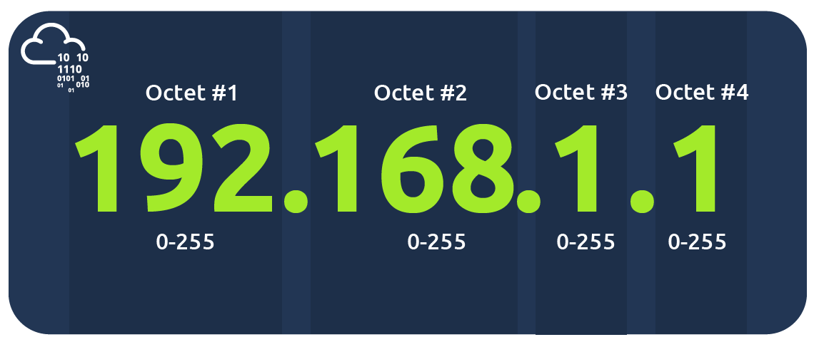
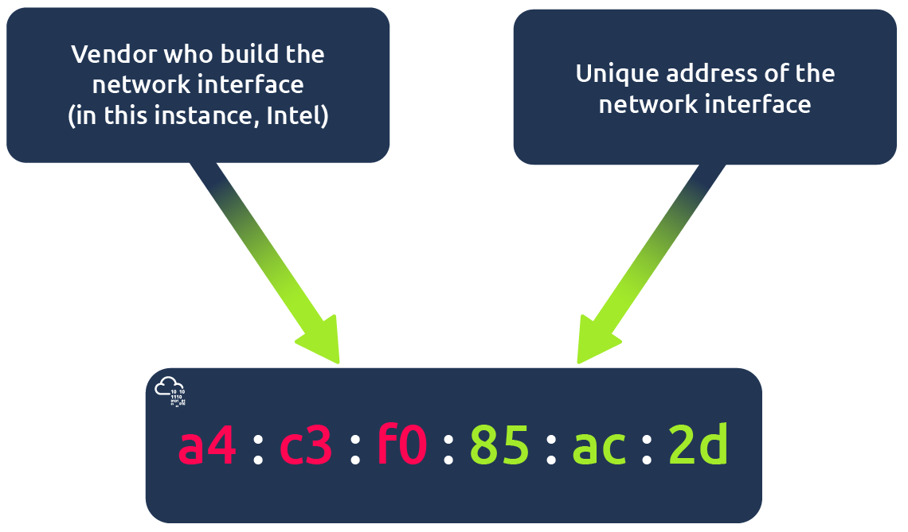
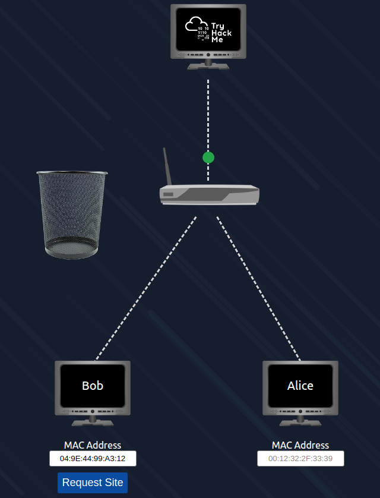
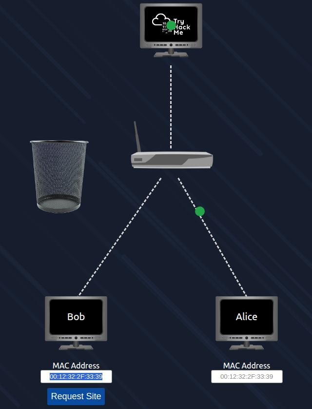
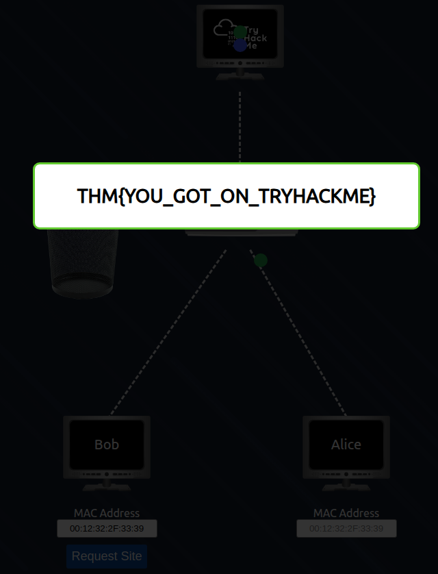
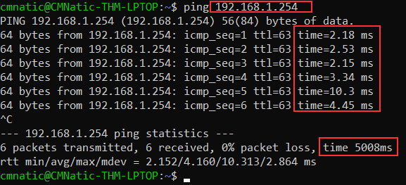
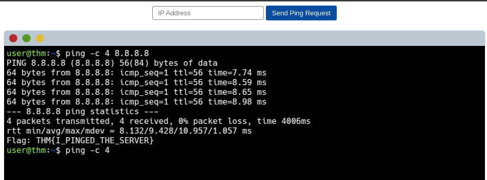

# What is Networking?

> Hãy bắt đầu tìm hiểu những kiến ​​thức cơ bản về mạng máy tính trong mô-đun tương tác và ngắn gọn này.

## Mục Lục

1. [Task 1: What is Networking?](#task-1-what-is-networking)

2. [Task 2: What is the Internet?](#task-2-what-is-the-internet)

3. [Task 3: Identifying Devices on a Network](#task-3-identifying-devices-on-a-network)

4. [Task 4: Ping (ICMP)](#task-4-ping-icmp)

5. [Task 5: Continue Your Learning: Intro to LAN](#task-5-continue-your-learning-intro-to-lan)

## Nội dung

# Task 1: What is Networking?

Mạng đơn giản chỉ là các kết nối. Ví dụ, vòng kết nối bạn bè của bạn: mọi người đều được kết nối với nhau nhờ các sở thích, kỹ năng, hoặc các đặc điểm tương đồng.  

Mạng có thể được tìm thấy trong mọi lĩnh vực của cuộc sống, chẳng hạn như:  

- Hệ thống giao thông công cộng của một thành phố.  
- Cơ sở hạ tầng như hệ thống điện quốc gia.  
- Các cuộc họp mặt và gặp gỡ hàng xóm.  
- Hệ thống bưu chính để gửi thư từ và bưu kiện.  

---

Nhưng cụ thể hơn, trong máy tính, mạng cũng giống như vậy, chỉ khác ở chỗ chúng được phân bổ cho các thiết bị công nghệ. Lấy ví dụ điện thoại của bạn: lý do bạn có nó là để truy cập các dịch vụ, và nó hoạt động nhờ giao tiếp giữa các thiết bị với nhau và các quy tắc kèm theo.  

Trong lĩnh vực máy tính, một mạng có thể được hình thành từ 2 thiết bị đến hàng tỷ thiết bị. Các thiết bị này bao gồm mọi thứ từ laptop, điện thoại đến camera an ninh, đèn giao thông và thậm chí cả nông trại thông minh!  

---

Mạng được tích hợp vào cuộc sống hàng ngày của chúng ta. Cho dù đó là thu thập dữ liệu thời tiết, cung cấp điện đến nhà, hay thậm chí xác định ai có quyền đi trước trên đường, mạng đều hiện diện khắp nơi trong thế giới hiện đại. Chính vì mạng rất quan trọng ngày nay, việc hiểu rõ khái niệm về mạng là điều cần thiết trong lĩnh vực an ninh mạng.  

Hãy xem sơ đồ dưới đây làm ví dụ: **Alice, Bob, và Jim** đã hình thành mạng của họ! Chúng ta sẽ tìm hiểu thêm về điều này sau.  


Mạng có đủ loại hình dạng và kích thước, điều mà chúng ta cũng sẽ thảo luận trong phần này.

**Trả lời câu hỏi bên dưới**  

**Thuật ngữ chính dành cho các thiết bị được kết nối với nhau là gì?**  

<details>
  <summary>Hiển thị đáp án</summary>
  Đáp án: Network
</details>

# Task 2: What is the Internet?

Giờ đây, khi chúng ta đã hiểu mạng là gì và được định nghĩa như thế nào trong máy tính (chỉ là các thiết bị được kết nối), hãy cùng khám phá Internet.  

Internet là một mạng lưới khổng lồ bao gồm rất nhiều mạng nhỏ hơn bên trong nó. Dựa trên ví dụ từ nhiệm vụ trước, hãy tưởng tượng rằng **Alice** đã có thêm những người bạn mới tên là **Zayn** và **Toby**, và cô ấy muốn giới thiệu họ với **Bob** và **Jim**. Vấn đề là chỉ có Alice nói được ngôn ngữ giống như Zayn và Toby. Vì vậy, Alice sẽ phải là người truyền tin!  


Nhờ khả năng nói được cả hai ngôn ngữ, Alice có thể giao tiếp với cả hai nhóm thông qua cô ấy – tạo thành một mạng lưới mới.  

Phiên bản đầu tiên của Internet nằm trong dự án ARPANET vào cuối những năm 1960. Dự án này được tài trợ bởi Bộ Quốc phòng Hoa Kỳ và là mạng được ghi nhận đầu tiên hoạt động. Tuy nhiên, phải đến năm 1989, Internet như chúng ta biết mới được phát minh bởi **Tim Berners-Lee** với sự ra đời của **World Wide Web (WWW)**. Đến thời điểm đó, Internet bắt đầu được sử dụng như một kho lưu trữ và chia sẻ thông tin, giống như hiện nay.  

Hãy liên hệ mạng bạn bè của Alice với các thiết bị máy tính. Internet giống như một phiên bản lớn hơn rất nhiều của loại sơ đồ này:  


Như đã đề cập trước đó, Internet được tạo thành từ nhiều mạng nhỏ kết nối với nhau. Các mạng nhỏ này được gọi là **mạng riêng (private networks)**, trong khi các mạng kết nối những mạng nhỏ này lại với nhau được gọi là **mạng công cộng (public networks)** – hoặc chính là Internet!  

Tóm lại, một mạng có thể thuộc một trong hai loại:  

- **Mạng riêng (Private network)**  
- **Mạng công cộng (Public network)**  

Các thiết bị sẽ sử dụng một tập hợp các nhãn để nhận dạng chính mình trên mạng, điều mà chúng ta sẽ tìm hiểu trong nhiệm vụ dưới đây.  

---

**Trả lời câu hỏi dưới đây**  

**Ai đã phát minh ra World Wide Web?**  

<details>
  <summary>Hiển thị đáp án</summary>
  Đáp án: Tim Berners-Lee
</details>

# Task 3: Identifying Devices on a Network

 **Nhận diện thiết bị trên mạng**  

Để giao tiếp và duy trì trật tự, các thiết bị cần phải được nhận diện và có thể nhận diện trên mạng. Nếu bạn không biết mình đang nói chuyện với ai vào cuối ngày, thì điều đó có ích gì?  

---

Các thiết bị trên mạng rất giống con người ở chỗ chúng có hai cách để được nhận diện:  

- **Tên của chúng ta**  
- **Dấu vân tay của chúng ta**  

Giờ đây, chúng ta có thể thay đổi tên mình thông qua các thủ tục pháp lý, nhưng chúng ta không thể thay đổi dấu vân tay. Mỗi con người đều có một bộ dấu vân tay riêng biệt, có nghĩa là ngay cả khi họ thay đổi tên, vẫn có một danh tính phía sau.  

Các thiết bị cũng có điều tương tự: hai phương thức nhận diện, một trong số đó là cố định. Chúng là:  

- **Địa chỉ IP**  
- **Địa chỉ MAC (Media Access Control)** – Hãy coi đây là một thứ tương tự như số sê-ri của thiết bị.

### **Địa chỉ IP**

Tóm tắt, **địa chỉ IP** (Internet Protocol) có thể được sử dụng như một cách để xác định một thiết bị (host) trên mạng trong một khoảng thời gian. Địa chỉ IP đó sau đó có thể được gán cho một thiết bị khác mà không cần thay đổi. Đầu tiên, hãy phân tích chính xác một địa chỉ IP theo sơ đồ dưới đây:



**Địa chỉ IP** là một tập hợp các số được chia thành bốn octet. Giá trị của mỗi octet sẽ tạo thành địa chỉ IP của thiết bị trên mạng. Con số này được tính toán thông qua một kỹ thuật được gọi là **định địa chỉ IP (IP addressing)** và **chia subnet (subnetting)**, nhưng đó là nội dung cho một ngày khác. Điều quan trọng cần hiểu ở đây là địa chỉ IP có thể thay đổi từ thiết bị này sang thiết bị khác, nhưng không thể hoạt động đồng thời nhiều hơn một lần trong cùng một mạng.  

**Địa chỉ IP** tuân theo một tập hợp các tiêu chuẩn gọi là **giao thức (protocols)**. Các giao thức này là xương sống của mạng, buộc nhiều thiết bị phải giao tiếp cùng một ngôn ngữ, điều mà chúng ta sẽ tìm hiểu sau. Tuy nhiên, hãy nhớ rằng các thiết bị có thể tồn tại trong cả **mạng riêng (private)** và **mạng công cộng (public)**. Vị trí của thiết bị sẽ xác định loại địa chỉ IP mà nó có: **địa chỉ IP công cộng (public)** hoặc **địa chỉ IP riêng (private)**.  

- **Địa chỉ công cộng:** Được sử dụng để nhận dạng thiết bị trên Internet.  
- **Địa chỉ riêng:** Được sử dụng để nhận dạng một thiết bị trong số các thiết bị khác trên mạng riêng.  

Hãy xem bảng và ảnh chụp màn hình dưới đây làm ví dụ. Ở đây chúng ta có hai thiết bị trên một mạng riêng:  

| Device Name        | IP Address    | IP Address Type |
|--------------------|---------------|------------------|
| DESKTOP-KJE57FD    | 192.168.1.77  | Private          |
| DESKTOP-KJE57FD    | 86.157.52.21  | Public           |
| CMNatic-PC         | 192.168.1.74  | Private          |
| CMNatic-PC         | 86.157.52.21  | Public           |


Hai thiết bị này có thể sử dụng địa chỉ IP riêng của mình để giao tiếp với nhau. Tuy nhiên, bất kỳ dữ liệu nào được gửi lên Internet từ một trong hai thiết bị này sẽ được nhận dạng bằng cùng một địa chỉ IP công cộng. Địa chỉ IP công cộng được cung cấp bởi Nhà cung cấp Dịch vụ Internet của bạn (ISP) với một khoản phí hàng tháng (hóa đơn của bạn!).


Khi ngày càng có nhiều thiết bị được kết nối, việc có được một địa chỉ IP công cộng chưa được sử dụng trở nên ngày càng khó khăn hơn. Ví dụ, Cisco, một gã khổng lồ trong ngành mạng, đã ước tính rằng sẽ có khoảng **50 tỷ thiết bị** được kết nối trên Internet vào cuối năm 2021. (Cisco, 2021). Đây chính là lúc các phiên bản địa chỉ IP ra đời.  

Cho đến nay, chúng ta mới chỉ thảo luận về một phiên bản của giao thức định địa chỉ Internet, được gọi là **IPv4**, sử dụng hệ thống số với **2^32 địa chỉ IP** (tương đương 4,29 tỷ địa chỉ) – vì vậy, bạn có thể thấy tại sao lại có sự thiếu hụt này!  

---

**IPv6** là một phiên bản mới của giao thức định địa chỉ Internet được tạo ra để giải quyết vấn đề này. Mặc dù thoạt nhìn có vẻ phức tạp hơn, nhưng nó mang lại một số lợi ích:  

- Hỗ trợ tới **2^128 địa chỉ IP** (hơn 340 nghìn tỷ tỷ địa chỉ), khắc phục hoàn toàn các vấn đề gặp phải với IPv4.  
- Hiệu quả hơn nhờ vào các phương pháp mới.  

Ảnh chụp màn hình dưới đây so sánh địa chỉ **IPv6** và **IPv4**.  


### **Địa chỉ MAC**

Các thiết bị trên mạng đều có một **giao diện mạng vật lý** (network interface), đây là một bảng vi mạch được tìm thấy trên bo mạch chủ của thiết bị. Giao diện mạng này được gán một địa chỉ duy nhất tại nhà máy nơi nó được sản xuất, gọi là **địa chỉ MAC (Media Access Control)**.  

**Địa chỉ MAC** là một số thập lục phân gồm **12 ký tự** (một hệ thống số cơ số 16 được sử dụng trong máy tính để biểu diễn số) được chia thành từng cặp và cách nhau bởi dấu hai chấm. Các dấu hai chấm này được coi là các ký tự phân tách. Ví dụ: **a4:c3:f0:85:ac:2d**.  

- Sáu ký tự đầu tiên đại diện cho **công ty** đã sản xuất giao diện mạng.  
- Sáu ký tự cuối cùng là một **số duy nhất**.



Tuy nhiên, một điều thú vị về địa chỉ MAC là chúng có thể bị làm giả hoặc "giả mạo" trong một quy trình gọi là **spoofing**. **Spoofing** xảy ra khi một thiết bị trên mạng giả vờ nhận dạng như một thiết bị khác bằng cách sử dụng địa chỉ MAC của nó. Khi điều này xảy ra, nó có thể phá vỡ các thiết kế bảo mật kém, vốn giả định rằng các thiết bị giao tiếp trên mạng đều đáng tin cậy.  

---

Hãy xem xét kịch bản sau: Một tường lửa (firewall) được cấu hình để cho phép mọi giao tiếp đến và đi từ địa chỉ MAC của **quản trị viên**. Nếu một thiết bị giả vờ hoặc "giả mạo" địa chỉ MAC này, tường lửa sẽ nghĩ rằng nó đang nhận dữ liệu từ quản trị viên trong khi thực tế không phải như vậy.  

---

Những nơi như quán cà phê, quán trà, và khách sạn thường sử dụng kiểm soát địa chỉ MAC khi cung cấp mạng Wi-Fi "Khách" hoặc "Công cộng". Cấu hình này có thể cung cấp các dịch vụ tốt hơn, ví dụ như kết nối nhanh hơn nếu bạn sẵn sàng trả phí cho mỗi thiết bị.  

Phòng thực hành tương tác đính kèm nhiệm vụ này được thiết kế để mô phỏng chính kịch bản này!  

### **Thực hành**

Phòng thực hành tương tác mô phỏng một mạng Wi-Fi của khách sạn, nơi bạn phải trả tiền để sử dụng dịch vụ. Bạn sẽ nhận thấy rằng **router** không cho phép các gói dữ liệu của **Bob** (màu xanh) đến trang web **TryHackMe** và đang chuyển chúng vào thùng rác. Trong khi đó, các gói dữ liệu của **Alice** (màu xanh lá) lại được truyền đi thành công vì cô ấy đã trả tiền để sử dụng Wi-Fi.  

Hãy thử thay đổi địa chỉ MAC của Bob thành giống với địa chỉ MAC của Alice để xem điều gì sẽ xảy ra.  

### **Trả lời các câu hỏi dưới đây**

1. **Thuật ngữ "IP" viết tắt của gì?**  

<details>
  <summary>Hiển thị đáp án</summary>
  Đáp án: Internet Protocol
</details>

2. **Mỗi phần của địa chỉ IP được gọi là gì?**  

<details>
  <summary>Hiển thị đáp án</summary>
  Đáp án: Octet
</details>

3. **Một địa chỉ IP có bao nhiêu phần (dạng số)?**  

<details>
  <summary>Hiển thị đáp án</summary>
  Đáp án: 4
</details>

4. **Thuật ngữ "MAC" viết tắt của gì?**  

<details>
  <summary>Hiển thị đáp án</summary>
  Đáp án: Media Access Control
</details>

5. **Triển khai phòng thực hành tương tác bằng cách sử dụng nút "View Site" và giả mạo địa chỉ MAC của bạn để truy cập trang web. Lá cờ là gì?**

Đầu tiên ta thấy truy cập của Bob bị chặn 



Chúng ta cần giả mạo địa chỉ MAC của Bob bằng địa chỉ MAC của Alice



Kết quả:



<details>
  <summary>Hiển thị đáp án</summary>
  Đáp án: THM{YOU_GOT_ON_TRYHACKME}
</details>

# Task 4: Ping (ICMP)

**Ping** là một trong những công cụ mạng cơ bản nhất mà chúng ta có thể sử dụng. Ping sử dụng các gói ICMP (**Internet Control Message Protocol**) để xác định hiệu suất của kết nối giữa các thiết bị, ví dụ, kiểm tra xem kết nối có tồn tại hoặc đáng tin cậy không.  

Thời gian cần thiết để các gói ICMP di chuyển giữa các thiết bị được đo bằng lệnh ping, như minh họa trong ảnh chụp màn hình bên dưới. Phép đo này được thực hiện bằng cách sử dụng gói phản hồi ICMP (ICMP echo packet) và sau đó nhận phản hồi từ thiết bị đích.  


**Ping** có thể được thực hiện đối với các thiết bị trong mạng, chẳng hạn như mạng gia đình của bạn hoặc các tài nguyên như trang web. Công cụ này có thể dễ dàng sử dụng và được cài đặt sẵn trên các hệ điều hành (OS) như **Linux** và **Windows**.  

Cú pháp để thực hiện một lệnh ping đơn giản là:  

```bash
ping <địa chỉ IP hoặc URL của trang web>
```

Hãy xem điều này trong hành động qua ảnh chụp màn hình bên dưới:  



Ở đây, chúng ta đang ping một thiết bị có địa chỉ IP riêng là **192.168.1.254**. Ping cho chúng ta biết rằng chúng ta đã gửi **sáu gói ICMP**, tất cả đều được nhận lại với thời gian trung bình là **4,16 mili-giây**.  


**Bây giờ bạn sẽ thực hiện lệnh ping đến địa chỉ "8.8.8.8" trên trang web triển khai trong nhiệm vụ này. Lệnh ping địa chỉ đúng sẽ tiết lộ một flag để trả lời câu hỏi sau đây.**  



### **Trả lời các câu hỏi dưới đây**

1. **Ping sử dụng giao thức nào?**  

<details>
  <summary>Hiển thị đáp án</summary>
  Đáp án: ICMP
</details>

2. **Cú pháp để ping đến địa chỉ 10.10.10.10 là gì?**  

<details>
  <summary>Hiển thị đáp án</summary>
  Đáp án: ping 10.10.10.10
</details>

3. **Flag bạn nhận được khi ping đến địa chỉ 8.8.8.8 là gì?**  

<details>
  <summary>Hiển thị đáp án</summary>
  Đáp án: THM{I_PINGED_THE_SERVER}
</details>

# Task 5: Continue Your Learning: Intro to LAN

[Trả xiền để đc học :)](https://tryhackme.com/r/why-subscribe?roomCode=introtolan)
