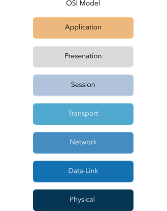

# OSI Model

> Tìm hiểu về khung cơ bản của mạng (networking framework) xác định các giai đoạn khác nhau trong đó dữ liệu được xử lý trên một mạng.

## Mục Lục

1. [Task 1: What is the OSI Model?](#task-1-what-is-the-osi-model)

2. [Task 2: Layer 7 - Application](#task-2-layer-7-application)

3. [Task 3: Layer 6 - Presentation](#task-3-layer-6-presentation)

4. [Task 4: Layer 5 - Session](#task-4-layer-5-session)

5. [Task 5: Layer 4 - Transport](#task-5-layer-4-transport)

6. [Task 6: Layer 3 - Network](#task-6-layer-3-network)

7. [Task 7: Layer 2 - Data Link](#task-7-layer-2-data-link)

8. [Task 8: Layer 1 - Physical](#task-8-layer-1-physical)

9. [Task 9: Practical - OSI Game](#task-9-practical-osi-game)

## Nội dung

# Task 1: What is the OSI Model?

**Mô hình OSI**  

Mô hình OSI (viết tắt của **Open Systems Interconnection Model**) là một mô hình cơ bản và quan trọng được sử dụng trong lĩnh vực mạng máy tính. Mô hình quan trọng này cung cấp một khung lý thuyết quy định cách tất cả các thiết bị mạng gửi, nhận và diễn giải dữ liệu.

Một trong những lợi ích chính của mô hình OSI là các thiết bị có thể có các chức năng và thiết kế khác nhau trong một mạng nhưng vẫn có thể giao tiếp với các thiết bị khác. Dữ liệu được gửi qua mạng tuân theo sự thống nhất của mô hình OSI có thể được các thiết bị khác hiểu được.

Mô hình OSI bao gồm **bảy lớp** được minh họa trong sơ đồ dưới đây. Mỗi lớp đảm nhận một tập hợp trách nhiệm khác nhau và được sắp xếp từ **Lớp 7 đến Lớp 1**.

Ở mỗi lớp mà dữ liệu đi qua, các quy trình cụ thể sẽ diễn ra và những thông tin bổ sung sẽ được thêm vào dữ liệu. Đây chính là quá trình mà chúng ta sẽ thảo luận trong các nhiệm vụ tiếp theo trong phần này. Tuy nhiên, hiện tại, chúng ta chỉ cần hiểu rằng quá trình này được gọi là **encapsulation** (đóng gói) và mô hình OSI trông như thế nào qua sơ đồ dưới đây:  

**Đây là một khái niệm rất quan trọng trong các khái niệm về mạng. Việc ghi nhớ các lớp theo đúng thứ tự được khuyến nghị mạnh mẽ.**

**Mẹo:** Hãy ghi nhớ câu này — **"Anxious Pale Ceaser Treated Nervous Drunks Patiently."**  

Bây giờ, chữ cái đầu tiên của mỗi từ trong câu tương ứng với mỗi lớp trong mô hình OSI:

- **A** → Application (Lớp 7 - Ứng dụng)  
- **P** → Presentation (Lớp 6 - Trình bày)  
- **C** → Session (Lớp 5 - Phiên)  
- **T** → Transport (Lớp 4 - Vận chuyển)  
- **N** → Network (Lớp 3 - Mạng)  
- **D** → Data Link (Lớp 2 - Liên kết dữ liệu)  
- **P** → Physical (Lớp 1 - Vật lý)  

Cách ghi nhớ này sẽ giúp bạn dễ dàng nhớ các lớp trong mô hình OSI theo đúng thứ tự!

**Câu hỏi:**  

**1. "OSI" trong "Mô hình OSI" là viết tắt của gì?**  

  
  
Hiển thị đáp án
  
  Đáp án: Open System Interconnection 

  

**2. Mô hình OSI có bao nhiêu lớp (số dạng chữ số)?**  

  
  
Hiển thị đáp án
  
  Đáp án: 7

  

**3. Thuật ngữ chính cho quá trình khi các mảnh thông tin được thêm vào dữ liệu là gì?**  

  
  
Hiển thị đáp án
  
  Đáp án: Encapsulation

  
