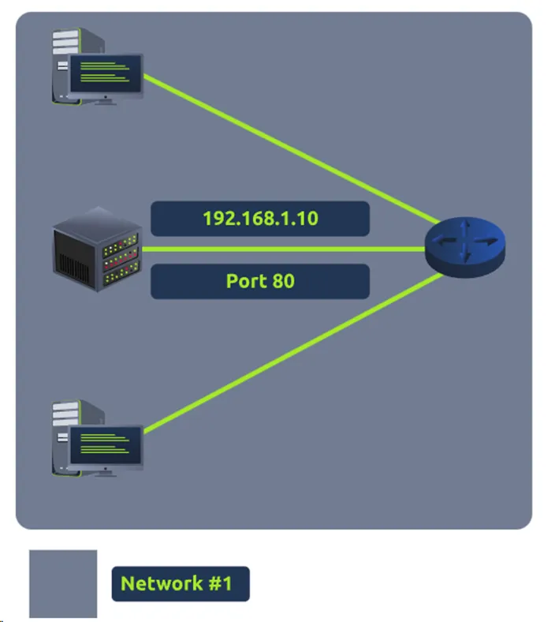
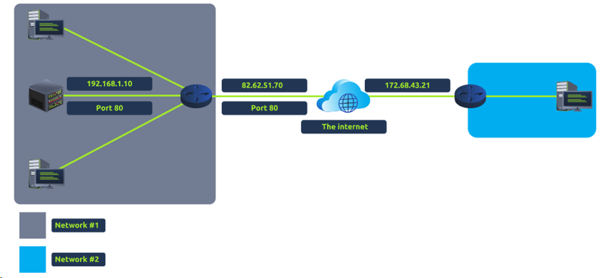

# Extending Your Network

## Mục Lục

1. [Task 1: Introduction to Port Forwarding](#task-1-introduction-to-port-forwarding)  
2. [Task 2: Firewalls 101](#task-2-firewalls-101)  
3. [Task 3: Practical — Firewall](#task-3-practical--firewall)  
4. [Task 4: VPN Basics](#task-4-vpn-basics)  
5. [Task 5: LAN Networking Devices](#task-5-lan-networking-devices)  
6. [Task 6: Practical — Network Simulator](#task-6-practical--network-simulator)

## nội dung

# Task 1: Introduction to Port Forwarding

**Chuyển tiếp cổng (Port Forwarding)** là một thành phần hữu ích được sử dụng để kết nối các ứng dụng và dịch vụ với internet.  

Ví dụ, một máy chủ có địa chỉ IP **“192.168.1.10”** chạy dịch vụ trên cổng **80**, cùng với hai máy tính được kết nối với nó (mạng nội bộ - intranet). Quản trị viên muốn làm cho nội dung trên máy chủ này hiển thị công khai cho mọi người. Vì vậy, anh ấy sử dụng khái niệm **chuyển tiếp cổng (port forwarding)** để nội dung này có thể được truy cập từ internet.

Nếu quản trị viên muốn trang web có thể được truy cập công khai (sử dụng Internet), họ sẽ phải triển khai **chuyển tiếp cổng (port forwarding)**, như trong sơ đồ bên dưới:

Với thiết kế này, **Mạng #2** bây giờ sẽ có thể truy cập vào máy chủ web đang chạy trên **Mạng #1** bằng cách sử dụng địa chỉ IP công khai của **Mạng #1** (**82.62.51.70**).

Rất dễ nhầm lẫn giữa **chuyển tiếp cổng (port forwarding)** với hành vi của **tường lửa (firewall)** (một công nghệ mà chúng ta sẽ thảo luận trong nhiệm vụ sau). Tuy nhiên, ở giai đoạn này, chỉ cần hiểu rằng chuyển tiếp cổng mở các cổng cụ thể (hãy nhớ cách các gói tin hoạt động). Ngược lại, **tường lửa** xác định xem lưu lượng truy cập có thể đi qua các cổng này hay không (ngay cả khi các cổng này đã được mở bằng cách chuyển tiếp cổng).

**Chuyển tiếp cổng** được cấu hình tại **router** của mạng.

**Câu hỏi:**  

Tên của thiết bị được sử dụng để cấu hình **chuyển tiếp cổng** là gì?  

  
  
Hiển thị đáp án
  
  Đáp án: router  

  

# Task 2: Firewalls 101

**Tường lửa (Firewall)** là một thiết bị trong mạng chịu trách nhiệm xác định loại lưu lượng nào được phép ra vào mạng. Hãy nghĩ về tường lửa như một lớp bảo vệ biên giới cho mạng. Quản trị viên có thể cấu hình tường lửa để **cho phép (permit)** hoặc **từ chối (deny)** lưu lượng truy cập vào hoặc ra khỏi mạng dựa trên nhiều yếu tố như:

- **Lưu lượng đến từ đâu?** (Tường lửa đã được cấu hình để chấp nhận/từ chối lưu lượng từ một mạng cụ thể chưa?)  
- **Lưu lượng đi đến đâu?** (Tường lửa đã được cấu hình để chấp nhận/từ chối lưu lượng đến một mạng cụ thể chưa?)  
- **Lưu lượng truy cập đến cổng nào?** (Tường lửa đã được cấu hình để chấp nhận/từ chối lưu lượng đến cổng 80 chưa?)  
- **Lưu lượng sử dụng giao thức nào?** (Tường lửa đã được cấu hình để chấp nhận/từ chối lưu lượng sử dụng giao thức **UDP**, **TCP** hay cả hai chưa?)  

Tường lửa thực hiện kiểm tra gói tin (**packet inspection**) để trả lời các câu hỏi trên.

**Tường lửa** có nhiều kích thước và hình dạng khác nhau. Từ các thiết bị phần cứng chuyên dụng (thường được tìm thấy trong các mạng lớn như doanh nghiệp) có thể xử lý lượng dữ liệu khổng lồ, đến các bộ định tuyến dân dụng (như tại nhà bạn!) hoặc phần mềm như **Snort**, tường lửa có thể được phân loại thành **2 đến 5 loại**.

Chúng ta sẽ khám phá **hai loại chính** của tường lửa trong bảng dưới đây:

| **Loại tường lửa** | **Mô tả**                                                                                                                                       |
|---------------------|-------------------------------------------------------------------------------------------------------------------------------------------------|
| **Stateful**        | Loại tường lửa này sử dụng toàn bộ thông tin từ một kết nối; thay vì kiểm tra từng gói tin riêng lẻ, tường lửa này xác định hành vi của một thiết bị dựa trên toàn bộ kết nối.    Loại tường lửa này tiêu thụ nhiều tài nguyên hơn so với tường lửa không trạng thái vì quá trình ra quyết định là động. Ví dụ: một tường lửa có thể cho phép các phần đầu tiên của quá trình bắt tay TCP, nhưng sau đó phát hiện và chặn nếu kết nối thất bại.     Nếu một kết nối từ một host là xấu, nó sẽ chặn toàn bộ thiết bị. |
| **Stateless**       | Loại tường lửa này sử dụng một tập hợp quy tắc tĩnh để xác định liệu các gói tin riêng lẻ (individual packets) có được chấp nhận hay không. Ví dụ: một thiết bị gửi một gói tin xấu sẽ không đồng nghĩa với việc toàn bộ thiết bị đó bị chặn.    Mặc dù các tường lửa này sử dụng ít tài nguyên hơn so với các lựa chọn khác, nhưng chúng kém thông minh hơn. Ví dụ: các tường lửa này chỉ hiệu quả nếu các quy tắc được định nghĩa chính xác. Nếu quy tắc không khớp chính xác, tường lửa sẽ không hoạt động hiệu quả.    Tuy nhiên, các tường lửa này rất hiệu quả khi xử lý lượng lớn lưu lượng từ một tập hợp các host (chẳng hạn như trong một cuộc tấn công từ chối dịch vụ phân tán - DDoS).|

**Câu hỏi :**  

1. Tường lửa hoạt động ở những lớp nào trong mô hình OSI?
   

  
  
Hiển thị đáp án
  
  Đáp án: Layer 3, Layer 4  

  

2. Loại tường lửa nào kiểm tra toàn bộ kết nối?  

  
  
Hiển thị đáp án
  
  Đáp án: stateful  

  

3. Loại tường lửa nào kiểm tra từng gói tin riêng lẻ?  

  
  
Hiển thị đáp án
  
  Đáp án: stateless  

  
