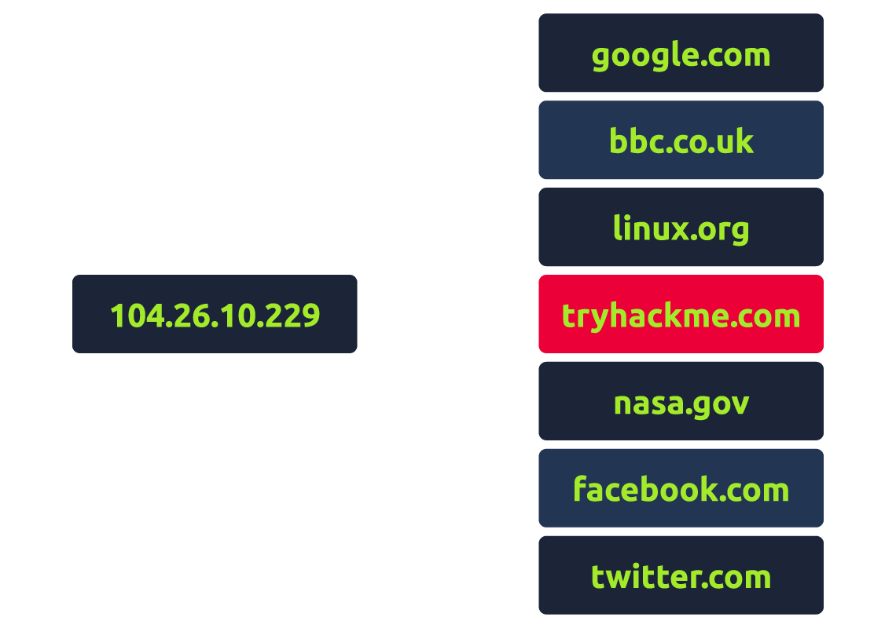

# DNS in detail

> Chi tiết về DNS: Tìm hiểu cách DNS hoạt động và cách nó hỗ trợ bạn truy cập các dịch vụ trên Internet.

## Mục lục

1. [Task 1: What is DNS?](#task-1-what-is-dns)  
2. [Task 2: Domain Hierarchy](#task-2-domain-hierarchy)  
3. [Task 3: Record Types](#task-3-record-types)  
4. [Task 4: Making A Request](#task-4-making-a-request)  
5. [Task 5: Practical](#task-5-practical)

## Nội dung

# Task 1: What is DNS?

 **DNS là gì?**

**DNS (Domain Name System)** cung cấp một cách đơn giản để chúng ta giao tiếp với các thiết bị trên Internet mà không cần nhớ những con số phức tạp. Giống như mỗi ngôi nhà có một địa chỉ duy nhất để gửi thư trực tiếp, mỗi máy tính trên Internet cũng có một địa chỉ duy nhất để giao tiếp, được gọi là **địa chỉ IP**.  

Một địa chỉ IP trông như sau: **104.26.10.229**, bao gồm 4 nhóm số trong khoảng từ **0 - 255**, được ngăn cách bằng dấu chấm. Khi bạn muốn truy cập một trang web, việc nhớ một dãy số phức tạp như vậy không hề thuận tiện, và đó là lúc **DNS** giúp ích.  

Thay vì phải nhớ **104.26.10.229**, bạn chỉ cần nhớ **tryhackme.com**.

**Câu hỏi:** DNS viết tắt của?

  
  
Hiển thị đáp án
  
  Đáp án: Domain Name System.  

  

# Task 2: Domain Hierarchy

## **Hệ thống phân cấp miền**

## TLD (Top-Level Domain)  
TLD là phần nằm ở bên phải nhất của một tên miền. Ví dụ, trong **tryhackme.com**, TLD là **.com**. Có hai loại TLD:  
- **gTLD (Generic Top Level Domain)**: Được sử dụng cho mục đích cụ thể, ví dụ: **.com** cho mục đích thương mại, **.org** cho tổ chức, **.edu** cho giáo dục và **.gov** cho chính phủ.  
- **ccTLD (Country Code Top Level Domain)**: Được sử dụng cho các mục đích địa lý, ví dụ: **.ca** cho Canada, **.co.uk** cho Vương quốc Anh, v.v.  

Do nhu cầu lớn, hiện nay có sự gia tăng về số lượng gTLD mới, ví dụ: **.online**, **.club**, **.website**, **.biz**, và nhiều loại khác.  

[Xem thêm các tên miền TLD tại đây](https://data.iana.org/TLD/tlds-alpha-by-domain.txt)

## Second-Level Domain  
Sử dụng ví dụ **tryhackme.com**, phần **.com** là TLD, và **tryhackme** là Second-Level Domain (Tên miền cấp hai). Khi đăng ký một tên miền, **Second-Level Domain** bị giới hạn tối đa 63 ký tự (bao gồm cả TLD) và chỉ được sử dụng các ký tự **a-z, 0-9** và **dấu gạch ngang (-)** (không được bắt đầu, kết thúc bằng dấu gạch ngang, hoặc có các gạch ngang liền nhau).

## Subdomain  
Subdomain nằm bên trái của **Second-Level Domain** và được tách ra bằng dấu chấm. Ví dụ: trong **admin.tryhackme.com**, phần **admin** là subdomain.  

Tên subdomain có các hạn chế tương tự như Second-Level Domain:  
- Giới hạn tối đa 63 ký tự, chỉ sử dụng các ký tự **a-z, 0-9** và **dấu gạch ngang (-)** (không được bắt đầu, kết thúc bằng dấu gạch ngang, hoặc có các gạch ngang liền nhau).  
- Có thể sử dụng nhiều subdomain được ngăn cách bằng dấu chấm để tạo tên dài hơn, ví dụ: **jupiter.servers.tryhackme.com**.  

Tuy nhiên, độ dài tối đa phải dưới **253 ký tự**. Không có giới hạn về số lượng subdomain bạn có thể tạo cho tên miền của mình.

**Trả lời các câu hỏi dưới đây:**

1. **Độ dài tối đa của một subdomain là bao nhiêu?**  
   

   
Hiển thị đáp án

   Đáp án: 63
   

2. **Ký tự nào sau đây không thể sử dụng trong subdomain (3 b _ - )?**  
   

   
Hiển thị đáp án

   Đáp án: _ (dấu gạch dưới)
   

3. **Độ dài tối đa của một tên miền là bao nhiêu?**  
   

   
Hiển thị đáp án

   Đáp án: 253
   

4. **TLD của .co.uk thuộc loại nào?**  
   

   
Hiển thị đáp án

   Đáp án: ccTLD
   

# Task 3: Record Types

### Các loại bản ghi DNS

#### **Bản ghi A**
Những bản ghi này ánh xạ tới địa chỉ IPv4, ví dụ: 104.26.10.229.

#### **Bản ghi AAAA**
Những bản ghi này ánh xạ tới địa chỉ IPv6, ví dụ: 2606:4700:20::681a:be5.

#### **Bản ghi CNAME**
Những bản ghi này ánh xạ tới một tên miền khác, ví dụ: cửa hàng trực tuyến của TryHackMe có tên miền phụ `store.tryhackme.com`, ánh xạ tới bản ghi CNAME `shops.shopify.com`. Một yêu cầu DNS khác sau đó sẽ được thực hiện để tìm địa chỉ IP.

#### **Bản ghi MX**
Những bản ghi này ánh xạ tới địa chỉ của các máy chủ xử lý email cho tên miền bạn truy vấn, ví dụ: một phản hồi bản ghi MX cho `tryhackme.com` có thể giống như `alt1.aspmx.l.google.com`. Những bản ghi này cũng đi kèm với cờ ưu tiên. Điều này cho biết khách hàng nên thử các máy chủ theo thứ tự nào, rất hữu ích nếu máy chủ chính bị lỗi và email cần được gửi tới máy chủ dự phòng.

#### **Bản ghi TXT**
Bản ghi TXT là các trường văn bản tự do nơi dữ liệu dựa trên văn bản có thể được lưu trữ. Các bản ghi TXT có nhiều ứng dụng, một số trong đó là liệt kê các máy chủ có thẩm quyền gửi email thay mặt cho tên miền (hữu ích trong việc chống lại thư rác và email giả mạo). Chúng cũng có thể được sử dụng để xác minh quyền sở hữu tên miền khi đăng ký các dịch vụ bên thứ ba.

**Câu hỏi:**

**Câu 1:** Loại bản ghi nào được sử dụng để xác định nơi gửi email?  

  
  
Hiển thị đáp án
  
  Đáp án: MX  

  

**Câu 2:** Loại bản ghi nào xử lý các địa chỉ IPv6?  

  
  
Hiển thị đáp án
  
  Đáp án: AAAA  

  
