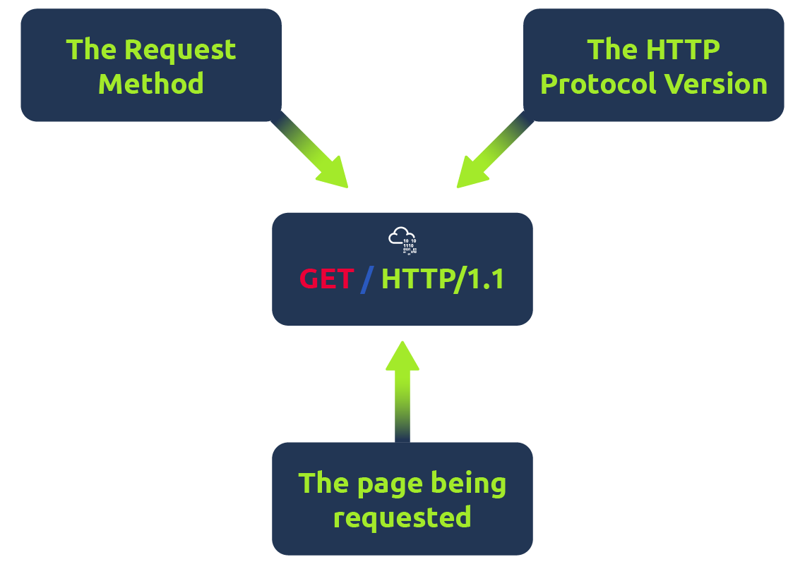

# HTTP in Detail

> Tìm hiểu cách bạn yêu cầu nội dung từ máy chủ web bằng giao thức HTTP.


## Mục Lục

1. [Task 1: What is HTTP(S)?](#task-1-what-is-https)  
2. [Task 2: Requests And Responses](#task-2-requests-and-responses)  
3. [Task 3: HTTP Methods](#task-3-http-methods)  
4. [Task 4: HTTP Status Codes](#task-4-http-status-codes)  
5. [Task 5: Headers](#task-5-headers)  
6. [Task 6: Cookies](#task-6-cookies)  
7. [Task 7: Making Requests](#task-7-making-requests)

## Nội dung

# Task 1: What is HTTP(S)?

**HTTP là gì? (HyperText Transfer Protocol)**

HTTP được sử dụng bất cứ khi nào bạn truy cập một trang web, được phát triển bởi Tim Berners-Lee và nhóm của ông trong khoảng thời gian 1989-1991. HTTP là tập hợp các quy tắc dùng để giao tiếp với máy chủ web nhằm truyền dữ liệu trang web, bao gồm HTML, hình ảnh, video, v.v.

**HTTPS là gì? (HyperText Transfer Protocol Secure)**

HTTPS là phiên bản bảo mật của HTTP. Dữ liệu HTTPS được mã hóa, giúp ngăn chặn người khác xem dữ liệu bạn nhận và gửi. Đồng thời, HTTPS đảm bảo rằng bạn đang giao tiếp với máy chủ web chính xác, không phải một máy chủ giả mạo.

**Câu hỏi:**

**Câu hỏi 1:** HTTP là viết tắt của cụm từ gì?  
<details>  
<summary>Hiển thị đáp án</summary>  
Đáp án: HyperText Transfer Protocol  
</details>  

**Câu hỏi 2:** Chữ "S" trong HTTPS là viết tắt của từ gì?  
<details>  
<summary>Hiển thị đáp án</summary>  
Đáp án: secure  
</details>  

**Câu hỏi 3:** Trên trang web giả lập bên phải có một vấn đề. Sau khi tìm ra vấn đề, hãy nhấp vào nó. Flag của thử thách là gì?  


> Ổ khóa có gạch chéo màu đỏ. Điều này chứng tỏ http bảo mật kém
<details>  
<summary>Hiển thị đáp án</summary>  
Đáp án: THM{INVALID_HTTP_CERT}  
</details>  

# Task 2: Requests And Responses

**Yêu cầu và Phản hồi**  
Khi chúng ta truy cập một trang web, trình duyệt của bạn sẽ cần gửi các yêu cầu đến máy chủ web để lấy các tài nguyên như HTML, hình ảnh và tải về các phản hồi. Trước khi làm điều đó, bạn cần cho trình duyệt biết cụ thể cách thức và nơi để truy cập các tài nguyên này, và đây là lúc URL sẽ giúp bạn.

## **URL là gì? (Uniform Resource Locator)**  

Nếu bạn đã từng sử dụng internet, bạn chắc chắn đã sử dụng URL. URL chủ yếu là một hướng dẫn về cách truy cập một tài nguyên trên internet. Hình ảnh dưới đây minh họa một URL với tất cả các thành phần của nó (không phải yêu cầu nào cũng sử dụng tất cả các thành phần này).


- **Scheme**: Đây là phần hướng dẫn sử dụng giao thức nào để truy cập tài nguyên, chẳng hạn như HTTP, HTTPS, FTP (File Transfer Protocol).  
- **User**: Một số dịch vụ yêu cầu xác thực để đăng nhập, bạn có thể đưa tên người dùng và mật khẩu vào URL để đăng nhập.  
- **Host**: Tên miền hoặc địa chỉ IP của máy chủ mà bạn muốn truy cập.  
- **Port**: Cổng mà bạn sẽ kết nối đến, thông thường là 80 cho HTTP và 443 cho HTTPS, nhưng cổng này có thể nằm trong phạm vi từ 1 - 65535.  
- **Path**: Tên tệp hoặc vị trí của tài nguyên mà bạn đang cố gắng truy cập.  
- **Query String**: Những phần thông tin bổ sung có thể được gửi đến đường dẫn yêu cầu. Ví dụ: `/blog?id=1` sẽ thông báo rằng bạn muốn nhận bài viết blog có ID là 1.  
- **Fragment**: Đây là tham chiếu đến một vị trí cụ thể trên trang mà bạn yêu cầu. Điều này thường được sử dụng cho các trang có nội dung dài và có thể liên kết trực tiếp đến một phần cụ thể, để nó có thể hiển thị cho người dùng ngay khi họ truy cập trang.  

## Thực hiện một yêu cầu (Request)

Có thể gửi một yêu cầu đến máy chủ web chỉ với một dòng lệnh:  `GET / HTTP/1.1`



Nhưng để có một trải nghiệm web phong phú hơn, bạn sẽ cần gửi thêm dữ liệu khác nữa. Dữ liệu này được gửi dưới dạng **headers** (tiêu đề), nơi chứa thông tin bổ sung để cung cấp cho máy chủ web mà bạn đang giao tiếp. Tuy nhiên, chúng ta sẽ tìm hiểu chi tiết hơn về vấn đề này trong nhiệm vụ **Header**.

## Ví dụ về Request

```bash
GET / HTTP/1.1

Host: tryhackme.com

User-Agent: Mozilla/5.0 Firefox/87.0

Referer: https://tryhackme.com/
```

**Để phân tích từng dòng của yêu cầu này:**

- **Dòng 1:** Yêu cầu này sử dụng phương thức **GET** (sẽ tìm hiểu thêm trong nhiệm vụ **HTTP Methods**), yêu cầu trang chủ với ký tự `/` và thông báo cho máy chủ web rằng chúng ta đang sử dụng giao thức **HTTP** phiên bản 1.1.

- **Dòng 2:** Chúng ta nói với máy chủ web rằng chúng ta muốn truy cập trang web **tryhackme.com**.

- **Dòng 3:** Chúng ta thông báo với máy chủ web rằng chúng ta đang sử dụng trình duyệt **Firefox phiên bản 87**.

- **Dòng 4:** Chúng ta thông báo với máy chủ web rằng trang web đã giới thiệu chúng ta đến trang này là **https://tryhackme.com**.

- **Dòng 5:** Các yêu cầu **HTTP** luôn kết thúc bằng một dòng trống để thông báo cho máy chủ web rằng yêu cầu đã hoàn tất.
  
## Ví dụ về Response

```bash
HTTP/1.1 200 OK

Server: nginx/1.15.8

Date: Fri, 09 Apr 2021 13:34:03 GMT

Content-Type: text/html

Content-Length: 98


<html>

<head>

    <title>TryHackMe</title>

</head>

<body>

    Welcome To TryHackMe.com

</body>

</html>
```

**Để phân tích từng dòng của phản hồi:**

- **Dòng 1:** **HTTP 1.1** là phiên bản của giao thức **HTTP** mà máy chủ đang sử dụng, theo sau đó là mã trạng thái **HTTP Status Code**, trong trường hợp này là **"200 Ok"**, cho biết yêu cầu đã được hoàn thành thành công.

- **Dòng 2:** Dòng này cho chúng ta biết phần mềm và phiên bản của máy chủ web.

- **Dòng 3:** Hiển thị ngày, giờ hiện tại và múi giờ của máy chủ web.

- **Dòng 4:** **Header Content-Type** cho khách hàng biết loại thông tin nào sẽ được gửi, chẳng hạn như **HTML**, hình ảnh, video, pdf, **XML**.

- **Dòng 5:** **Header Content-Length** cho khách hàng biết độ dài của phản hồi, từ đó có thể xác nhận rằng không có dữ liệu bị thiếu.

- **Dòng 6:** Phản hồi **HTTP** chứa một dòng trống để xác nhận kết thúc của phản hồi **HTTP**.

- **Dòng 7-14:** Là thông tin đã được yêu cầu, trong trường hợp này là trang chủ.

**Câu hỏi:**

**Câu hỏi 1:** Giao thức HTTP nào được sử dụng trong ví dụ trên?  
<details>  
<summary>Hiển thị đáp án</summary>  
Đáp án: HTTP/1.1  
</details>  

**Câu hỏi 2:** Header phản hồi nào cho trình duyệt biết lượng dữ liệu cần nhận?  
<details>  
<summary>Hiển thị đáp án</summary>  
Đáp án: Content-Length  
</details>  

