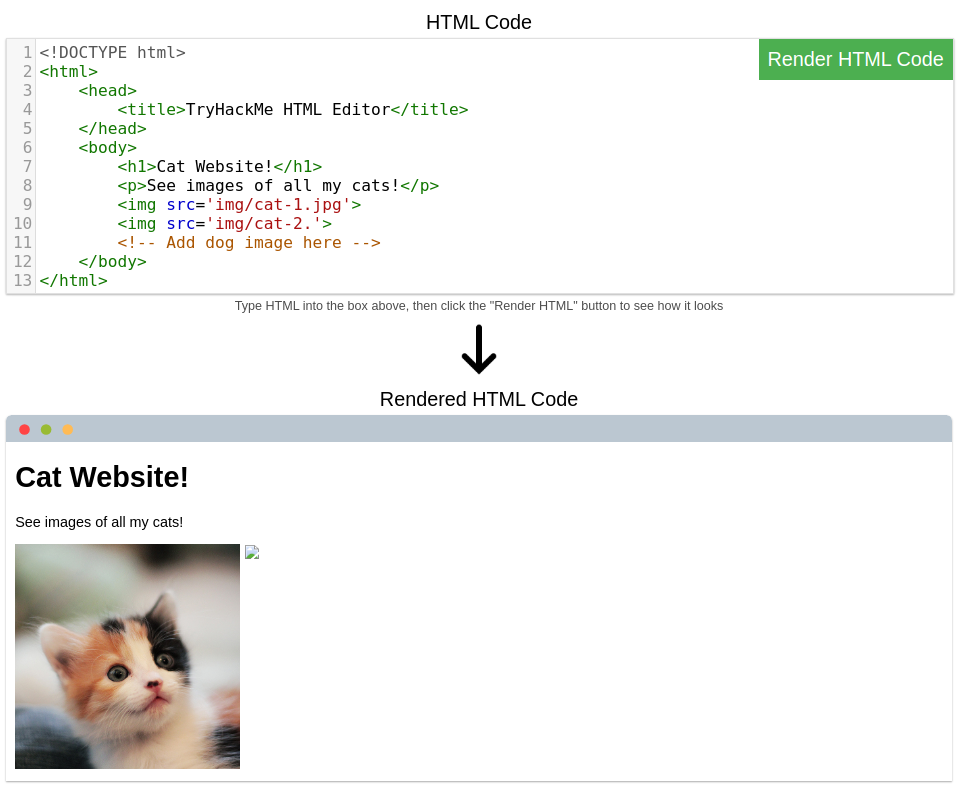
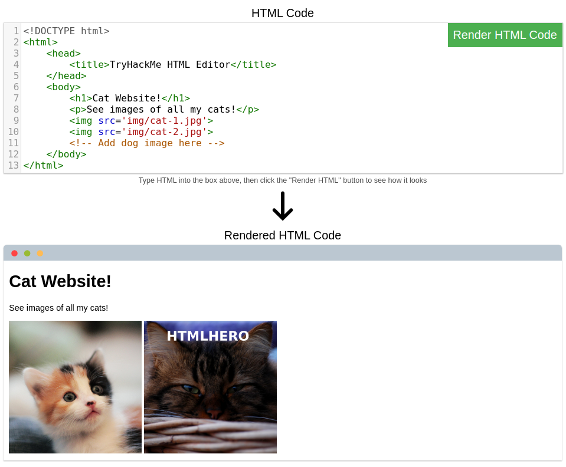
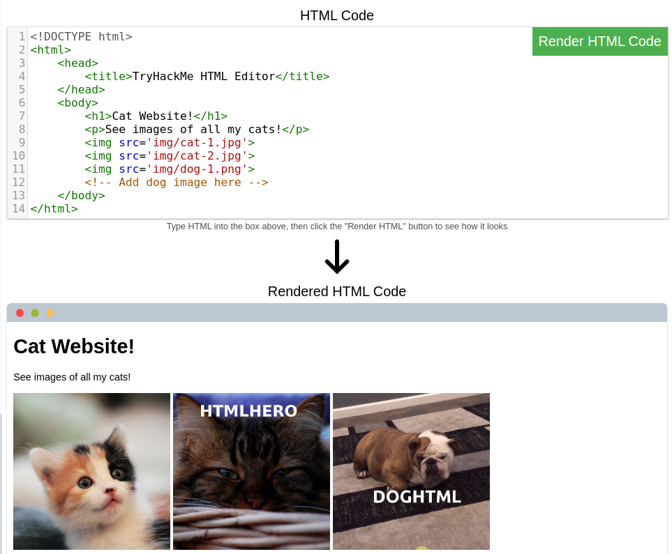

# How Websites Work

> Để khai thác một trang web, trước tiên bạn cần biết trang web đó được tạo ra như thế nào.

## Mục Lục

1. [Task 1: How Websites Work](#task-1-how-websites-work)

2. [Task 2: HTML](#task-2-html)

3. [Task 3: JavaScript](#task-3-javascript)

4. [Task 4: Sensitive Data Exposure](#task-4-sensitive-data-exposure)

5. [Task 5: HTML Injection](#task-5-html-injection)

## Nội dung

# Task 1: How Websites Work

Kết thúc bài học này, bạn sẽ hiểu cách các trang web được tạo ra và sẽ được giới thiệu về một số vấn đề bảo mật cơ bản.

Khi bạn truy cập một trang web, trình duyệt của bạn (như Safari hoặc Google Chrome) sẽ gửi một yêu cầu đến máy chủ web để yêu cầu thông tin về trang mà bạn đang truy cập. Máy chủ sẽ phản hồi bằng dữ liệu mà trình duyệt của bạn sử dụng để hiển thị trang; **máy chủ web** chỉ đơn giản là một máy tính chuyên dụng ở một nơi nào đó trên thế giới, xử lý các yêu cầu của bạn.


Một trang web được tạo thành từ hai thành phần chính:

- **Front End (Phía khách hàng)** - cách trình duyệt của bạn hiển thị một trang web.
- **Back End (Phía máy chủ)** - một máy chủ xử lý yêu cầu của bạn và trả về phản hồi.

Có nhiều quy trình khác liên quan đến việc trình duyệt của bạn gửi yêu cầu đến máy chủ web, nhưng hiện tại, bạn chỉ cần hiểu rằng bạn gửi yêu cầu đến một máy chủ, và máy chủ phản hồi bằng dữ liệu mà trình duyệt của bạn sử dụng để hiển thị thông tin cho bạn.

**Trả lời các câu hỏi dưới đây**  

**Thuật ngữ nào mô tả tốt nhất thành phần của một ứng dụng web được hiển thị bởi trình duyệt của bạn?**  

<details>  
<summary>Hiển thị đáp án</summary>  
Đáp án: Front End  
</details>  

# Task 2: HTML

Trang web chủ yếu được tạo bằng:

- **HTML**, để xây dựng trang web và xác định cấu trúc của chúng.
- **CSS**, để làm cho trang web trở nên đẹp mắt bằng cách thêm các tùy chọn tạo kiểu.
- **JavaScript**, triển khai các tính năng phức tạp trên trang web bằng cách sử dụng tính tương tác.

**HyperText Markup Language (HTML)** là ngôn ngữ mà các trang web được viết. Các thành phần (còn được gọi là thẻ) là các khối xây dựng của các trang HTML và cho trình duyệt biết cách hiển thị nội dung. Đoạn mã bên dưới hiển thị một tài liệu HTML đơn giản, với cấu trúc giống nhau cho mọi trang web:

```html
<!DOCTYPE html>
<html>
    <head>
        <title>Page Title</title>
    </head>
    <body>
        <h1>Example Heading</h1>
        <p>Example paragraph...</p>
    </body>
</html>
```

Cấu trúc HTML (như được hiển thị bên trên) bao gồm các thành phần sau:

- **`<!DOCTYPE html>`** xác định rằng trang là một tài liệu HTML5. Điều này giúp chuẩn hóa giữa các trình duyệt khác nhau và cho trình duyệt biết sử dụng HTML5 để diễn giải trang.
- **`<html>`** là phần tử gốc của trang HTML - tất cả các phần tử khác sẽ nằm bên trong phần tử này.
- **`<head>`** chứa thông tin về trang (chẳng hạn như tiêu đề của trang).
- **`<body>`** xác định nội dung của tài liệu HTML; chỉ nội dung bên trong phần body được hiển thị trong trình duyệt.
- **`<h1>`** xác định một tiêu đề lớn.
- **`<p>`** xác định một đoạn văn bản.
- Có rất nhiều phần tử khác (thẻ) được sử dụng cho các mục đích khác nhau. Ví dụ: có các thẻ cho nút (**`<button>`**), hình ảnh (**``**), danh sách, và nhiều thứ khác.


**Các thẻ có thể chứa các thuộc tính** như thuộc tính `class`, được sử dụng để định kiểu cho một phần tử (ví dụ: làm cho thẻ có màu khác nhau) **`<p class="bold-text">`**, hoặc thuộc tính `src`, được sử dụng trên hình ảnh để chỉ định vị trí của hình ảnh **``**. Một phần tử có thể có nhiều thuộc tính, mỗi thuộc tính có mục đích riêng, ví dụ: **`<p attribute1="value1" attribute2="value2">`**.

**Các phần tử cũng có thể có thuộc tính id**, ví dụ: **`<p id="example">`**, đây là thuộc tính duy nhất cho phần tử. Không giống như thuộc tính `class`, nơi nhiều phần tử có thể sử dụng cùng một lớp, mỗi phần tử phải có một `id` khác nhau để xác định duy nhất. `id` của phần tử được sử dụng để tạo kiểu và xác định nó thông qua JavaScript.

Bạn có thể xem HTML của bất kỳ trang web nào bằng cách nhấp chuột phải và chọn **"View Page Source"** (Chrome) / **"Show Page Source"** (Safari).

**Câu hỏi:**



1. Một trong những hình ảnh trên trang web về mèo bị hỏng - hãy sửa nó và hình ảnh sẽ hiển thị câu trả lời bằng văn bản ẩn!



<details>  
<summary>Hiển thị đáp án</summary>  
Đáp án: HTMLHERO
</details>  

2. Thêm hình ảnh con chó vào trang bằng cách thêm thẻ img khác () vào dòng 11. Vị trí hình ảnh con chó là img/dog-1.png. Văn bản trong hình ảnh con chó là gì?



<details>  
<summary>Hiển thị đáp án</summary>  
Đáp án: DOGHTML
</details>  

# Task 3: JavaScript

JavaScript (JS) là một trong những ngôn ngữ lập trình phổ biến nhất trên thế giới và cho phép các trang web trở nên tương tác. HTML được sử dụng để tạo cấu trúc và nội dung cho trang web, trong khi JavaScript được sử dụng để kiểm soát chức năng của các trang web - nếu không có JavaScript, một trang web sẽ không có các yếu tố tương tác và sẽ luôn là tĩnh. JS có thể cập nhật trang web theo thời gian thực, cung cấp các chức năng như thay đổi kiểu dáng của một nút khi một sự kiện cụ thể trên trang xảy ra (chẳng hạn như khi người dùng nhấp vào nút) hoặc hiển thị các hình ảnh động.

JavaScript được thêm vào trong mã nguồn của trang và có thể được tải trong các thẻ **`<script>`** hoặc được liên kết từ xa bằng thuộc tính **`src`**, như sau:  

```javascript
<script src="/location/of/javascript_file.js"></script>`**
```

Ví dụ sau đây trong JavaScript tìm một phần tử HTML trên trang với **id** là "demo" và thay đổi nội dung của phần tử đó thành "Hack the Planet":  
```javascript
document.getElementById("demo").innerHTML = "Hack the Planet";
```

Các phần tử HTML cũng có thể có các sự kiện, chẳng hạn như **"onclick"** hoặc **"onhover"**, để thực thi JavaScript khi sự kiện xảy ra. Ví dụ sau thay đổi nội dung của phần tử với ID "demo" thành "Button Clicked" khi nhấp vào nút:  
```html
<button onclick='document.getElementById("demo").innerHTML = "Button Clicked";'>Click Me!</button>
```

Các sự kiện **onclick** cũng có thể được định nghĩa trong các thẻ script JavaScript thay vì gắn trực tiếp trên các phần tử.
