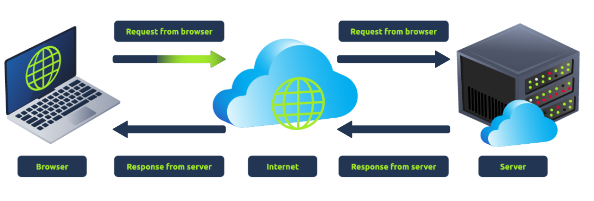

# How Websites Work

> Để khai thác một trang web, trước tiên bạn cần biết trang web đó được tạo ra như thế nào.

## Mục Lục

1. [Task 1: How Websites Work](#task-1-how-websites-work)

2. [Task 2: HTML](#task-2-html)

3. [Task 3: JavaScript](#task-3-javascript)

4. [Task 4: Sensitive Data Exposure](#task-4-sensitive-data-exposure)

5. [Task 5: HTML Injection](#task-5-html-injection)

## Nội dung

# Task 1: How Websites Work

Kết thúc bài học này, bạn sẽ hiểu cách các trang web được tạo ra và sẽ được giới thiệu về một số vấn đề bảo mật cơ bản.

Khi bạn truy cập một trang web, trình duyệt của bạn (như Safari hoặc Google Chrome) sẽ gửi một yêu cầu đến máy chủ web để yêu cầu thông tin về trang mà bạn đang truy cập. Máy chủ sẽ phản hồi bằng dữ liệu mà trình duyệt của bạn sử dụng để hiển thị trang; **máy chủ web** chỉ đơn giản là một máy tính chuyên dụng ở một nơi nào đó trên thế giới, xử lý các yêu cầu của bạn.

Một trang web được tạo thành từ hai thành phần chính:

- **Front End (Phía khách hàng)** - cách trình duyệt của bạn hiển thị một trang web.
- **Back End (Phía máy chủ)** - một máy chủ xử lý yêu cầu của bạn và trả về phản hồi.

Có nhiều quy trình khác liên quan đến việc trình duyệt của bạn gửi yêu cầu đến máy chủ web, nhưng hiện tại, bạn chỉ cần hiểu rằng bạn gửi yêu cầu đến một máy chủ, và máy chủ phản hồi bằng dữ liệu mà trình duyệt của bạn sử dụng để hiển thị thông tin cho bạn.

**Trả lời các câu hỏi dưới đây**  

**Thuật ngữ nào mô tả tốt nhất thành phần của một ứng dụng web được hiển thị bởi trình duyệt của bạn?**  

  

Hiển thị đáp án
  
Đáp án: Front End  

  

