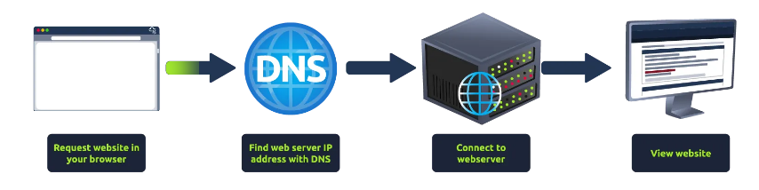
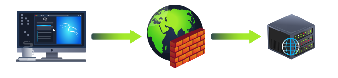

# Putting it all together

> Tổng hợp tất cả: Tìm hiểu cách tất cả các thành phần riêng lẻ của web hoạt động cùng nhau để giúp bạn truy cập vào các trang web yêu thích của mình.

## Mục Lục

1. [Task 1: Putting It All Together](#task-1-putting-it-all-together)

2. [Task 2: Other Components](#task-2-other-components)

3. [Task 3: How Web Servers Work](#task-3-how-web-servers-work)

4. [Task 4: Quiz](#task-4-quiz)

## Nội dung

# Task 1: Putting It All Together

**Tổng hợp tất cả**

Từ các module trước, bạn đã học được rằng có rất nhiều thứ diễn ra đằng sau khi bạn yêu cầu truy cập một trang web trong trình duyệt của mình.

Tóm lại, khi bạn yêu cầu một trang web, máy tính của bạn cần biết địa chỉ IP của máy chủ mà nó cần giao tiếp; để làm điều này, nó sử dụng DNS. Sau đó, máy tính của bạn giao tiếp với máy chủ web bằng một tập hợp lệnh đặc biệt được gọi là giao thức HTTP; máy chủ web sau đó trả về HTML, JavaScript, CSS, hình ảnh, v.v., mà trình duyệt của bạn sử dụng để định dạng và hiển thị chính xác trang web cho bạn.

Ngoài ra còn có một số thành phần khác giúp web hoạt động hiệu quả hơn và cung cấp các tính năng bổ sung.

# Task 2: Other Components

**Các thành phần khác**

## **Bộ cân bằng tải**

Khi lưu lượng truy cập vào một trang web trở nên rất lớn hoặc một ứng dụng cần có tính sẵn sàng cao, một máy chủ web duy nhất có thể không còn đủ khả năng xử lý. Bộ cân bằng tải cung cấp hai tính năng chính, đảm bảo rằng các trang web có lưu lượng cao có thể xử lý tải và cung cấp khả năng dự phòng nếu một máy chủ trở nên không phản hồi.

Khi bạn yêu cầu một trang web sử dụng bộ cân bằng tải, bộ cân bằng tải sẽ nhận yêu cầu của bạn trước và sau đó chuyển tiếp nó đến một trong các máy chủ phía sau nó. Bộ cân bằng tải sử dụng các thuật toán khác nhau để quyết định máy chủ nào là tốt nhất để xử lý yêu cầu. Một vài ví dụ về các thuật toán này là **vòng tròn luân phiên (round-robin)**, chuyển yêu cầu đến từng máy chủ lần lượt, hoặc **trọng số (weighted)**, kiểm tra số lượng yêu cầu mà một máy chủ hiện đang xử lý và gửi đến máy chủ ít bận rộn nhất.

Bộ cân bằng tải cũng thực hiện các kiểm tra định kỳ với từng máy chủ để đảm bảo chúng đang hoạt động chính xác; điều này được gọi là **kiểm tra tình trạng (health check)**. Nếu một máy chủ không phản hồi đúng cách hoặc không phản hồi, bộ cân bằng tải sẽ ngừng gửi lưu lượng truy cập đến máy chủ đó cho đến khi nó phản hồi bình thường trở lại.

## **CDN (Mạng phân phối nội dung - Content Delivery Networks)**

CDN có thể là một nguồn tài nguyên tuyệt vời để giảm tải lưu lượng truy cập cho một trang web bận rộn. Nó cho phép bạn lưu trữ các tệp tĩnh từ trang web của bạn, chẳng hạn như JavaScript, CSS, Hình ảnh, Video, và lưu trữ chúng trên hàng ngàn máy chủ trên khắp thế giới. Khi người dùng yêu cầu một trong những tệp được lưu trữ, CDN sẽ xác định vị trí máy chủ gần nhất về mặt vật lý và gửi yêu cầu đến đó thay vì phải gửi qua bên kia thế giới.

## **Cơ sở dữ liệu (Databases)**

Các trang web thường cần một cách để lưu trữ thông tin cho người dùng của họ. Máy chủ web có thể giao tiếp với cơ sở dữ liệu để lưu trữ và truy xuất dữ liệu từ đó. Cơ sở dữ liệu có thể chỉ đơn giản là một tệp văn bản đơn thuần hoặc phức tạp hơn là các cụm máy chủ nhiều lớp cung cấp tốc độ và khả năng phục hồi cao. Bạn có thể gặp các cơ sở dữ liệu phổ biến như: MySQL, MSSQL, MongoDB, Postgres, và nhiều loại khác; mỗi loại có các tính năng cụ thể riêng.

## **Tường lửa ứng dụng web (WAF - Web Application Firewall)**

WAF nằm giữa yêu cầu web của bạn và máy chủ web; mục đích chính của nó là bảo vệ máy chủ web khỏi bị tấn công hoặc từ chối dịch vụ (DoS). Nó phân tích các yêu cầu web để phát hiện các kỹ thuật tấn công phổ biến, bất kể yêu cầu đến từ trình duyệt thực hay từ bot. Nó cũng kiểm tra xem có quá nhiều yêu cầu web được gửi đi hay không bằng cách sử dụng một phương pháp gọi là **giới hạn tốc độ (rate limiting)**, chỉ cho phép một số lượng yêu cầu nhất định từ một địa chỉ IP trong mỗi giây. Nếu một yêu cầu bị coi là tiềm năng tấn công, nó sẽ bị loại bỏ và không bao giờ được gửi đến máy chủ web.

