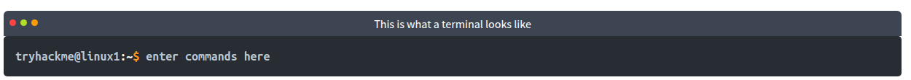
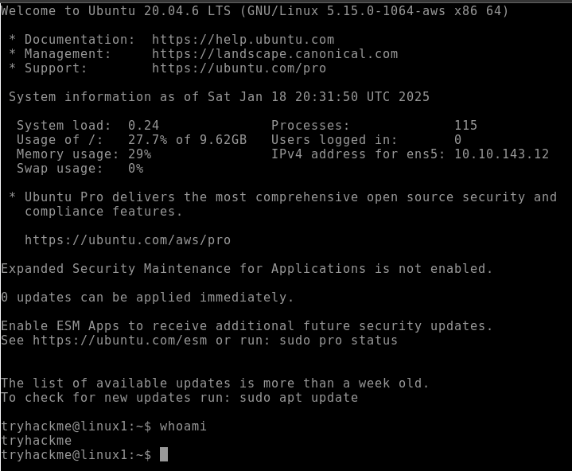

# Linux Fundamentals Part 1

>   Bắt đầu hành trình tìm hiểu những điều cơ bản của Linux. Học cách chạy một số lệnh thiết yếu đầu tiên trên thiết bị đầu cuối tương tác.

## Mục Lục

1. [Task 1: Introduction](#task-1-introduction)

2. [Task 2: A Bit of Background on Linux](#task-2-a-bit-of-background-on-linux)

3. [Task 3: Interacting With Your First Linux Machine (In-Browser)](#task-3-interacting-with-your-first-linux-machine-in-browser)

4. [Task 4: Running Your First Few Commands](#task-4-running-your-first-few-commands)

5. [Task 5: Interacting With the Filesystem!](#task-5-interacting-with-the-filesystem)

6. [Task 6: Searching for Files](#task-6-searching-for-files)

7. [Task 7: An Introduction to Shell Operators](#task-7-an-introduction-to-shell-operators)

8. [Task 8: Conclusions & Summaries](#task-8-conclusions-summaries)

9. [Task 9: Linux Fundamentals Part 2](#task-9-linux-fundamentals-part-2)

## Nội dung

# Task 1: Introduction

Chào mừng bạn đến với phần đầu tiên trong chuỗi “Linux Fundamentals”. Rất có thể bạn đang sử dụng máy tính Windows hoặc Mac, cả hai đều có thiết kế giao diện và cách hoạt động khác nhau. Cũng giống như Windows, iOS và MacOS, Linux chỉ đơn giản là một hệ điều hành khác và là một trong những hệ điều hành phổ biến nhất trên thế giới, vận hành xe hơi thông minh, thiết bị Android, siêu máy tính, thiết bị gia dụng, máy chủ doanh nghiệp, và hơn thế nữa.

Chúng ta sẽ tìm hiểu một chút về lịch sử của Linux và sau đó bắt đầu hành trình để bạn trở thành một “phù thủy Linux”! Trong phòng này, bạn sẽ được:

- Chạy những lệnh đầu tiên của mình trên một máy Linux tương tác ngay trong trình duyệt.  
- Học một số lệnh cần thiết để tương tác với hệ thống tệp (file system).  
- Tìm hiểu cách tìm kiếm tệp và được giới thiệu về các toán tử của shell.

# Task 2: A Bit of Background on Linux

**Một chút thông tin nền về Linux**  

**Linux được sử dụng ở đâu?**  
Có thể nói rằng Linux khiến nhiều người cảm thấy “khó tiếp cận” hơn so với các Hệ điều hành (OS) như Windows. Cả hai dạng này đều có những ưu điểm và nhược điểm riêng. Ví dụ, Linux nhẹ hơn đáng kể và bạn sẽ ngạc nhiên khi biết rằng có khả năng rất cao bạn đã sử dụng Linux ở một hình thức nào đó mỗi ngày! Linux hiện đang vận hành những thứ như:  

- Các trang web bạn truy cập  
- Hệ thống giải trí/bảng điều khiển trên xe hơi  
- Hệ thống POS (Point of Sale) như máy tính tiền và quầy thanh toán trong cửa hàng  
- Cơ sở hạ tầng quan trọng như bộ điều khiển đèn giao thông hoặc các cảm biến công nghiệp  

**Các “phiên bản” (flavours) của Linux**  
Tên gọi “Linux” thực chất là một thuật ngữ “bao trùm” cho nhiều Hệ điều hành (OS) dựa trên UNIX (một hệ điều hành khác). Nhờ Linux là mã nguồn mở, các phiên bản của Linux có đủ mọi hình dạng và kích cỡ – phù hợp nhất với mục đích sử dụng của hệ thống.  

Ví dụ, Ubuntu và Debian là một vài trong số những bản phân phối (distribution) Linux phổ biến hơn, bởi chúng rất mở rộng được. Nói cách khác, bạn có thể chạy Ubuntu như một máy chủ (ví dụ: cho website và ứng dụng web) hoặc dùng nó như một máy tính để bàn đầy đủ chức năng. Trong chuỗi bài học này, chúng ta sẽ sử dụng Ubuntu.  

> **Ubuntu Server có thể chạy trên các hệ thống chỉ với 512MB RAM**  

Tương tự như việc Windows có nhiều phiên bản khác nhau (7, 8 và 10), Linux cũng có rất nhiều phiên bản/bản phân phối (distribution) khác nhau.  

**Hãy trả lời các câu hỏi bên dưới**  

**Nghiên cứu: Năm đầu tiên phát hành một hệ điều hành Linux là năm nào?**  

  
Hiển thị đáp án

  Đáp án: 1991

# Task 3: Interacting With Your First Linux Machine (In-Browser)

# Task 4: Running Your First Few Commands

Như đã đề cập trước đó, một ưu điểm lớn khi sử dụng những Hệ điều hành như Ubuntu là khả năng hoạt động rất “nhẹ” của chúng. Dĩ nhiên, điều này không phải là không có nhược điểm. Chẳng hạn, thường thì không có giao diện đồ họa (GUI – Graphical User Interface), hay còn được gọi là môi trường desktop, để chúng ta tương tác với máy (trừ khi nó đã được cài đặt). Phần lớn việc tương tác với những hệ thống này được thực hiện qua “Terminal”.

“Terminal” hoàn toàn dựa trên văn bản (text-based) và ban đầu có thể khiến bạn e ngại. Tuy nhiên, nếu chúng ta phân tích một số lệnh, sau một thời gian, bạn sẽ nhanh chóng quen thuộc với việc sử dụng terminal!

Chúng ta cần có khả năng thực hiện những thao tác cơ bản như di chuyển đến các tệp, xuất nội dung của chúng và tạo tệp! Các lệnh để làm việc này khá dễ hiểu (một khi bạn biết chúng là gì, tất nhiên…).

Hãy bắt đầu với hai lệnh đầu tiên mà tôi đã trình bày trong bảng dưới đây:

**Lệnh** | **Mô tả**  
--- | ---  
**echo** | Xuất (in) bất kỳ đoạn văn bản nào mà chúng ta chỉ định  
**whoami** | Cho biết chúng ta đang đăng nhập bằng tài khoản người dùng nào  

**Trả lời các câu hỏi dưới đây**  

1. **Nếu chúng ta muốn xuất ra dòng chữ "TryHackMe", lệnh của chúng ta sẽ là gì?**  

  

Hiển thị đáp án
  
Đáp án: echo "TryHackMe"  

  

2. **Tên người dùng mà bạn đang đăng nhập trên máy Linux đã triển khai là gì?**

  

Hiển thị đáp án
  
Đáp án: tryhackme  

  
