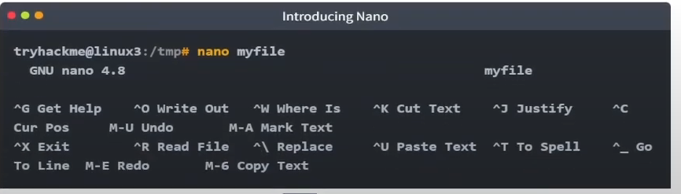
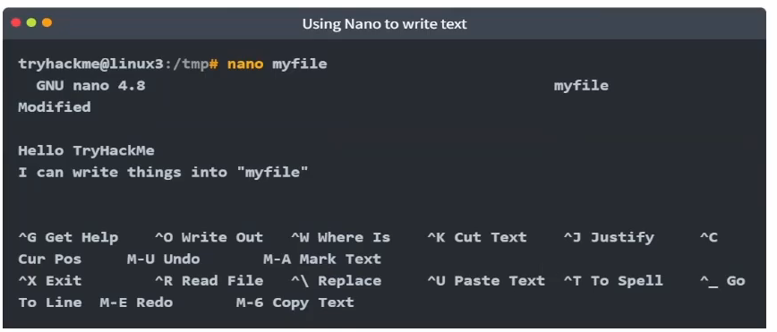
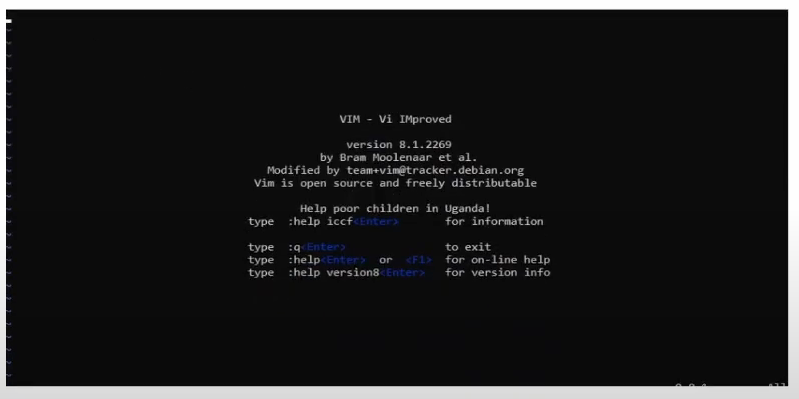
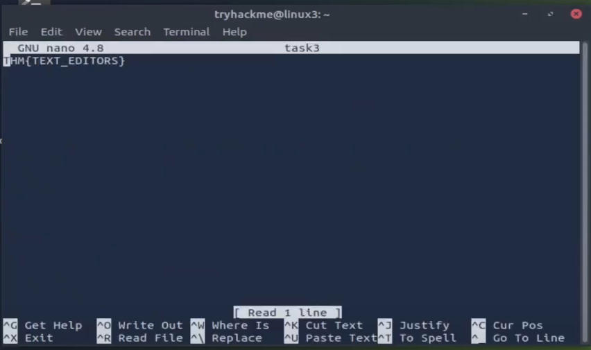

# Linux Fundamentals Part 3

> Nâng cao kỹ năng sử dụng Linux của bạn và thực hành một số tiện ích phổ biến mà bạn có thể sử dụng hàng ngày!

## Mục Lục

1. [Task 1: Introduction](#task-1-introduction)

2. [Task 2: Deploy Your Linux Machine](#task-2-deploy-your-linux-machine)

3. [Task 3: Terminal Text Editors](#task-3-terminal-text-editors)

4. [Task 4: General/Useful Utilities](#task-4-general-useful-utilities)

5. [Task 5: Processes 101](#task-5-processes-101)

6. [Task 6: Maintaining Your System: Automation](#task-6-maintaining-your-system-automation)

7. [Task 7: Maintaining Your System: Package Management](#task-7-maintaining-your-system-package-management)

8. [Task 8: Maintaining Your System: Logs](#task-8-maintaining-your-system-logs)

9. [Task 9: Conclusions & Summaries](#task-9-conclusions-summaries)


## Nội dung

# Task 1: Introduction

Chào mừng đến với phần ba (và phần kết) của mô-đun Linux Fundamentals. Cho đến nay, trong suốt loạt bài này, bạn đã thực hành một số khái niệm cơ bản và sử dụng một số lệnh quan trọng. Phòng này sẽ giới thiệu một số tiện ích và ứng dụng hữu ích mà bạn có thể sử dụng hàng ngày. Bạn cũng sẽ nâng cao các kỹ năng Linux-fu của mình bằng cách tìm hiểu về tự động hóa, quản lý gói và ghi nhật ký dịch vụ/ứng dụng.

# Task 2: Deploy Your Linux Machine

Sử Dụng Các Thông Tin Đăng Nhập Sau:
ĐỊA CHỈ IP: 10.10.141.159
Tên người dùng:  try hack me
Mật khẩu:  try hack me

Cách truy cập bằng SSH:

```bash
ssh tryhackme@10.10.141/159
```

# Task 3: Terminal Text Editors

**Trong suốt chuỗi bài viết này, chúng ta chỉ lưu văn bản vào các tệp bằng cách sử dụng kết hợp lệnh `echo` và các toán tử pipe (`>` và `>>`). Đây không phải là một cách hiệu quả để xử lý dữ liệu khi bạn làm việc với các tệp chứa nhiều dòng hoặc cần sắp xếp!**

## **Giới thiệu về trình chỉnh sửa văn bản trên terminal**

Có một số tùy chọn mà bạn có thể sử dụng, với mức độ thân thiện và tiện ích khác nhau. Nhiệm vụ này sẽ giới thiệu bạn đến **nano** và cũng chỉ ra một lựa chọn thay thế là **VIM** (mà TryHackMe có hẳn một phòng học chuyên về nó!).

## **Nano**

Thật dễ dàng để bắt đầu với Nano! Để tạo hoặc chỉnh sửa một tệp bằng nano, chúng ta chỉ cần sử dụng lệnh `nano tên_tệp` — thay thế "tên_tệp" bằng tên của tệp mà bạn muốn chỉnh sửa.



Khi chúng ta nhấn `enter` để thực hiện lệnh, `nano` sẽ khởi chạy! Nơi chúng ta có thể bắt đầu nhập hoặc sửa đổi văn bản của mình. Bạn có thể điều hướng từng dòng bằng phím mũi tên "lên" và "xuống" hoặc bắt đầu một dòng mới bằng phím "Enter" trên bàn phím.



**Nano** có một vài tính năng dễ nhớ và bao quát những điều cơ bản nhất mà bạn mong đợi từ một trình chỉnh sửa văn bản, bao gồm:

- Tìm kiếm văn bản  
- Sao chép và dán  
- Nhảy đến một số dòng cụ thể  
- Xác định bạn đang ở dòng nào  

Bạn có thể sử dụng những tính năng này của nano bằng cách nhấn phím **"Ctrl"** (trên Linux được biểu diễn bằng ký hiệu `^`) cùng với một chữ cái tương ứng. Ví dụ, để thoát, chúng ta cần nhấn **"Ctrl"** và **"X"** để thoát khỏi Nano.  

## **VIM**  

VIM là một trình chỉnh sửa văn bản tiên tiến hơn nhiều. Mặc dù bạn không bắt buộc phải biết tất cả các tính năng nâng cao, nhưng việc tìm hiểu nó sẽ rất hữu ích để nâng cao kỹ năng Linux của bạn.  



Một số lợi ích của VIM, mặc dù mất nhiều thời gian hơn để làm quen, bao gồm:

- Có thể tùy chỉnh - bạn có thể sửa đổi các phím tắt theo ý muốn
- Tô sáng cú pháp - điều này hữu ích nếu bạn đang viết hoặc bảo trì mã, khiến nó trở thành lựa chọn phổ biến cho
các nhà phát triển phần mềm

VIM hoạt động trên tất cả các thiết bị đầu cuối mà nano có thể không được cài đặt

Có rất nhiều tài nguyên như bảng hướng dẫn, hướng dẫn và các loại có sẵn để bạn sử dụng.

[Vim Cheat Sheet](https://vim.rtorr.com/)

[Học vim tại đây](https://tryhackme.com/r/room/toolboxvim)

**Câu hỏi: Chỉnh sửa "task3" nằm trong thư mục chính của"tryhackme" bằng Nano. Flag là gì?**

```bash
nano task3
```



<details>  
<summary>Hiển thị đáp án</summary>  
Đáp án: IHM{TEXT_EDITORS} 
</details>  

