# Linux Fundamentals Part 3

> Nâng cao kỹ năng sử dụng Linux của bạn và thực hành một số tiện ích phổ biến mà bạn có thể sử dụng hàng ngày!

## Mục Lục

1. [Task 1: Introduction](#task-1-introduction)

2. [Task 2: Deploy Your Linux Machine](#task-2-deploy-your-linux-machine)

3. [Task 3: Terminal Text Editors](#task-3-terminal-text-editors)

4. [Task 4: General/Useful Utilities](#task-4-general-useful-utilities)

5. [Task 5: Processes 101](#task-5-processes-101)

6. [Task 6: Maintaining Your System: Automation](#task-6-maintaining-your-system-automation)

7. [Task 7: Maintaining Your System: Package Management](#task-7-maintaining-your-system-package-management)

8. [Task 8: Maintaining Your System: Logs](#task-8-maintaining-your-system-logs)

9. [Task 9: Conclusions & Summaries](#task-9-conclusions-summaries)


## Nội dung

# Task 1: Introduction

Chào mừng đến với phần ba (và phần kết) của mô-đun Linux Fundamentals. Cho đến nay, trong suốt loạt bài này, bạn đã thực hành một số khái niệm cơ bản và sử dụng một số lệnh quan trọng. Phòng này sẽ giới thiệu một số tiện ích và ứng dụng hữu ích mà bạn có thể sử dụng hàng ngày. Bạn cũng sẽ nâng cao các kỹ năng Linux-fu của mình bằng cách tìm hiểu về tự động hóa, quản lý gói và ghi nhật ký dịch vụ/ứng dụng.

# Task 2: Deploy Your Linux Machine

Sử Dụng Các Thông Tin Đăng Nhập Sau:
ĐỊA CHỈ IP: 10.10.141.159
Tên người dùng:  try hack me
Mật khẩu:  try hack me

Cách truy cập bằng SSH:

```bash
ssh tryhackme@10.10.141/159
```

# Task 3: Terminal Text Editors

**Trong suốt chuỗi bài viết này, chúng ta chỉ lưu văn bản vào các tệp bằng cách sử dụng kết hợp lệnh `echo` và các toán tử pipe (`>` và `>>`). Đây không phải là một cách hiệu quả để xử lý dữ liệu khi bạn làm việc với các tệp chứa nhiều dòng hoặc cần sắp xếp!**

## **Giới thiệu về trình chỉnh sửa văn bản trên terminal**

Có một số tùy chọn mà bạn có thể sử dụng, với mức độ thân thiện và tiện ích khác nhau. Nhiệm vụ này sẽ giới thiệu bạn đến **nano** và cũng chỉ ra một lựa chọn thay thế là **VIM** (mà TryHackMe có hẳn một phòng học chuyên về nó!).

## **Nano**

Thật dễ dàng để bắt đầu với Nano! Để tạo hoặc chỉnh sửa một tệp bằng nano, chúng ta chỉ cần sử dụng lệnh `nano tên_tệp` — thay thế "tên_tệp" bằng tên của tệp mà bạn muốn chỉnh sửa.


Khi chúng ta nhấn `enter` để thực hiện lệnh, `nano` sẽ khởi chạy! Nơi chúng ta có thể bắt đầu nhập hoặc sửa đổi văn bản của mình. Bạn có thể điều hướng từng dòng bằng phím mũi tên "lên" và "xuống" hoặc bắt đầu một dòng mới bằng phím "Enter" trên bàn phím.


**Nano** có một vài tính năng dễ nhớ và bao quát những điều cơ bản nhất mà bạn mong đợi từ một trình chỉnh sửa văn bản, bao gồm:

- Tìm kiếm văn bản  
- Sao chép và dán  
- Nhảy đến một số dòng cụ thể  
- Xác định bạn đang ở dòng nào  

Bạn có thể sử dụng những tính năng này của nano bằng cách nhấn phím **"Ctrl"** (trên Linux được biểu diễn bằng ký hiệu `^`) cùng với một chữ cái tương ứng. Ví dụ, để thoát, chúng ta cần nhấn **"Ctrl"** và **"X"** để thoát khỏi Nano.  

## **VIM**  

VIM là một trình chỉnh sửa văn bản tiên tiến hơn nhiều. Mặc dù bạn không bắt buộc phải biết tất cả các tính năng nâng cao, nhưng việc tìm hiểu nó sẽ rất hữu ích để nâng cao kỹ năng Linux của bạn.  


Một số lợi ích của VIM, mặc dù mất nhiều thời gian hơn để làm quen, bao gồm:

- Có thể tùy chỉnh - bạn có thể sửa đổi các phím tắt theo ý muốn
- Tô sáng cú pháp - điều này hữu ích nếu bạn đang viết hoặc bảo trì mã, khiến nó trở thành lựa chọn phổ biến cho
các nhà phát triển phần mềm

VIM hoạt động trên tất cả các thiết bị đầu cuối mà nano có thể không được cài đặt

Có rất nhiều tài nguyên như bảng hướng dẫn, hướng dẫn và các loại có sẵn để bạn sử dụng.

[Vim Cheat Sheet](https://vim.rtorr.com/)

[Học vim tại đây](https://tryhackme.com/r/room/toolboxvim)

**Câu hỏi: Chỉnh sửa "task3" nằm trong thư mục chính của"tryhackme" bằng Nano. Flag là gì?**

```bash
nano task3
```


<details>  
<summary>Hiển thị đáp án</summary>  
Đáp án: IHM{TEXT_EDITORS} 
</details>  

# Task 4: General/Useful Utilities

## **Tải xuống tệp (Wget)**  

Một tính năng cơ bản của máy tính là khả năng truyền tải tệp. Ví dụ, bạn có thể muốn tải xuống một chương trình, một script, hoặc thậm chí một bức ảnh. May mắn thay, chúng ta có nhiều cách để tải các tệp này về.  

Chúng ta sẽ tìm hiểu cách sử dụng lệnh **wget**. Lệnh này cho phép chúng ta tải các tệp từ web qua HTTP — giống như khi bạn truy cập tệp trong trình duyệt của mình. Chúng ta chỉ cần cung cấp địa chỉ của tài nguyên mà mình muốn tải xuống. Ví dụ, nếu tôi muốn tải xuống một tệp có tên là "myfile.txt" vào máy của mình, giả sử tôi biết địa chỉ web của tệp đó — nó sẽ trông như thế này:  

```  
wget https://assets.tryhackme.com/additional/linux-fundamentals/part3/myfile.txt  
```  

## **Truyền tệp từ máy của bạn - SCP (SSH)**  

**SCP** (Secure Copy) là một phương pháp sao chép tệp an toàn. Không giống như lệnh **cp** thông thường, lệnh này cho phép bạn truyền tệp giữa hai máy tính bằng giao thức **SSH**, cung cấp cả xác thực và mã hóa.  

Dựa trên mô hình **SOURCE - NGUỒN** và **DESTINATION - ĐÍCH**, SCP cho phép bạn:  

- Sao chép tệp và thư mục từ hệ thống hiện tại của bạn sang một hệ thống từ xa.  
- Sao chép tệp và thư mục từ hệ thống từ xa về hệ thống hiện tại của bạn.  

Nếu chúng ta biết tên đăng nhập và mật khẩu của một người dùng trên hệ thống hiện tại và người dùng trên hệ thống từ xa, chúng ta có thể thực hiện sao chép. Ví dụ, hãy sao chép một tệp từ máy của chúng ta sang một máy từ xa, như minh họa trong bảng dưới đây.  

| **Biến**                      | **Giá trị**                   |
|-------------------------------|-------------------------------|
| Địa chỉ IP của hệ thống từ xa | 192.168.1.30                 |
| Người dùng trên hệ thống từ xa| ubuntu                       |
| Tên của tệp trên hệ thống cục bộ | important.txt                |
| Tên muốn lưu tệp trên hệ thống từ xa | transferred.txt           |

Với thông tin này, chúng ta hãy tạo lệnh **scp** của mình (nhớ rằng định dạng của **scp** chỉ là NGUỒN và ĐÍCH):

```bash
scp important.txt ubuntu@192.168.1.30:/home/ubuntu/transferred.txt
```

Và bây giờ, hãy đảo ngược điều này và trình bày cú pháp để sử dụng **scp** để sao chép một tệp từ máy tính từ xa mà chúng ta không đăng nhập vào:

| Biến số                         | Giá trị               |
|--------------------------------|-----------------------|
| Địa chỉ IP của hệ thống từ xa  | 192.168.1.30         |
| Người dùng trên hệ thống từ xa | ubuntu               |
| Tên tệp trên hệ thống từ xa    | documents.txt        |
| Tên mà chúng ta muốn lưu tệp trên hệ thống của mình | notes.txt |

Lệnh sẽ có dạng như sau:  
`scp ubuntu@192.168.1.30:/home/ubuntu/documents.txt notes.txt`


## **Phục Vụ Tệp Từ Máy Chủ Của Bạn - WEB**

Các máy Ubuntu đi kèm sẵn với Python3. Python cung cấp một module nhẹ và dễ sử dụng gọi là "HTTPServer". Module này biến máy tính của bạn thành một máy chủ web nhanh và dễ dàng, mà bạn có thể sử dụng để phục vụ các tệp của mình, nơi chúng có thể được tải xuống bởi một máy tính khác bằng cách sử dụng các lệnh như `curl` và `wget`.

"HTTPServer" của Python3 sẽ phục vụ các tệp trong thư mục nơi bạn chạy lệnh, nhưng điều này có thể được thay đổi bằng cách cung cấp các tùy chọn có thể tìm thấy trong tài liệu hướng dẫn. Đơn giản, tất cả những gì chúng ta cần làm là chạy lệnh sau trong terminal để khởi động module:  
```python
python3 -m http.server
```
Trong đoạn mã dưới đây, chúng ta đang phục vụ từ một thư mục có tên "webserver", trong đó chứa một tệp duy nhất được gọi là "file".

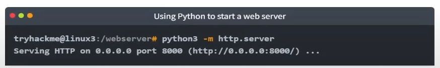

Bây giờ, hãy sử dụng `wget` để tải xuống tệp bằng địa chỉ `10.10.141.159` và tên tệp. Hãy nhớ rằng, vì máy chủ python3 đang chạy cổng 8000, bạn sẽ cần chỉ định điều này trong lệnh wget của mình. Ví dụ:

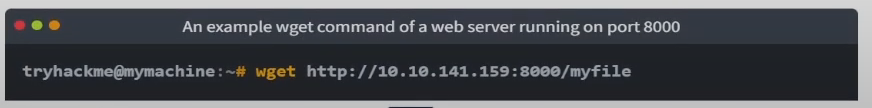

Lưu ý, bạn sẽ cần mở một terminal mới để sử dụng wget và để terminal mà bạn đã khởi động máy chủ web Python3. Điều này là do, sau khi bạn khởi động máy chủ web Python3, nó sẽ chạy trong terminal đó cho đến khi bạn hủy. Chúng ta hãy xem đoạn trích dưới đây làm ví dụ:


Hãy nhớ rằng, bạn sẽ cần chạy lệnh `wget` trong một terminal khác (trong khi vẫn giữ terminal đang chạy máy chủ Python3 hoạt động). Một ví dụ về điều này trên Try Hack Me Attack Box được minh họa bên dưới:


Một nhược điểm của module này là bạn không có cách lập chỉ mục, vì vậy bạn phải biết chính xác tên và vị trí của tệp mà bạn muốn sử dụng. Đó là lý do tại sao tôi thích sử dụng **Updog**. **Updog là gì?** Một máy chủ web tiên tiến hơn nhưng vẫn nhẹ. Tuy nhiên, hiện tại, chúng ta hãy tiếp tục sử dụng "HTTP Server" của Python.


**Trả lời các câu hỏi bên dưới**

1. **Đảm bảo bạn đã kết nối với instance được triển khai (10.10.141.159).**  
 
2. **Bây giờ, sử dụng module "HTTPServer" của Python 3 để khởi động một máy chủ web trong thư mục chính của người dùng "tryhackme" trên instance được triển khai.**  

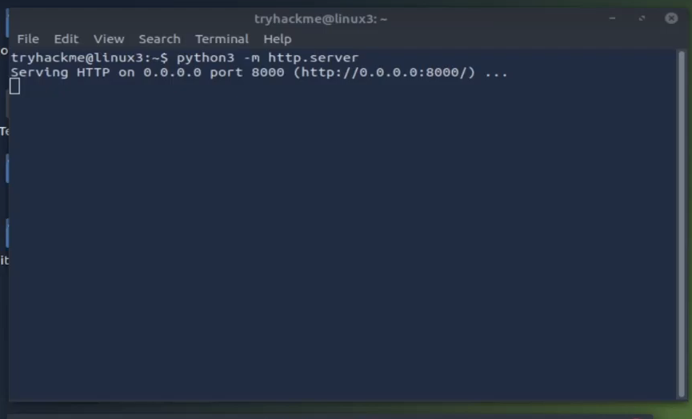

3. **Tải xuống tệp [http://10.10.141.159:8000/flag.txt](http://10.10.141.159:8000/flag.txt) vào TryHackMe AttackBox. Hãy nhớ rằng bạn sẽ cần thực hiện điều này trong một terminal mới. Nội dung là gì?**  

 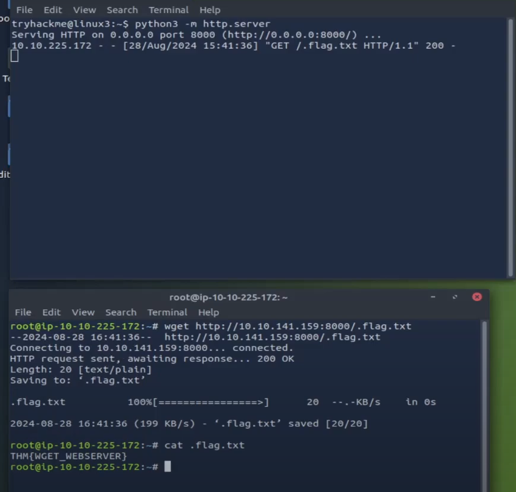

   <details>  
   <summary>Hiển thị đáp án</summary>  
   Đáp án: THM{WGET_WEBSERVER}  
   </details>  

4. **Tạo và tải xuống các tệp để áp dụng thêm kiến thức của bạn -- xem cách bạn có thể đọc tài liệu về module "HTTPServer" của Python 3.**  
   **Sử dụng Ctrl + C để dừng module HTTPServer của Python 3 sau khi bạn hoàn thành.**  


# Task 5: Processes 101

Các tiến trình (Processes) là các chương trình đang chạy trên máy của bạn. Chúng được quản lý bởi kernel, trong đó mỗi tiến trình sẽ có một ID liên kết với nó, còn được gọi là PID. PID tăng dần theo thứ tự mà tiến trình được khởi chạy. Ví dụ: tiến trình thứ 60 sẽ có PID là 60.

## **Xem các tiến trình**

Chúng ta có thể sử dụng lệnh thân thiện `ps` để hiển thị danh sách các tiến trình đang chạy dưới phiên làm việc của người dùng, cùng với một số thông tin bổ sung như mã trạng thái của nó, phiên đang chạy tiến trình, lượng thời gian CPU mà tiến trình sử dụng và tên của chương trình hoặc lệnh thực sự đang được thực thi:

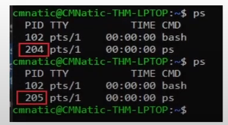

Lưu ý rằng trong ảnh chụp màn hình phía trên, quá trình thứ hai `ps` có **PID** là 204, và trong lệnh bên dưới, giá trị này được tăng lên thành 205.  

Để xem các tiến trình do người dùng khác chạy và những tiến trình không chạy từ một phiên (ví dụ: các tiến trình hệ thống), chúng ta cần thêm **aux** vào lệnh `ps`, như sau:  

```
ps aux
```  
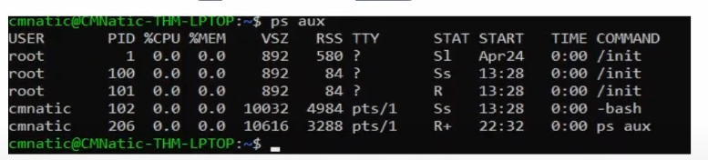

Lưu ý rằng chúng ta có thể thấy tổng cộng 5 tiến trình -- chú ý cách chúng ta hiện có "root" và "cmnatic".

Một lệnh rất hữu ích khác là lệnh `top`; `top` cung cấp các số liệu thống kê thời gian thực về các tiến trình đang chạy trên hệ thống của bạn thay vì chỉ xem một lần. Các số liệu này sẽ được làm mới sau mỗi 10 giây, nhưng cũng sẽ làm mới khi bạn sử dụng các phím mũi tên để duyệt qua các hàng khác nhau. Một lệnh tuyệt vời khác để tìm hiểu sâu hơn về hệ thống của bạn là lệnh `top`.

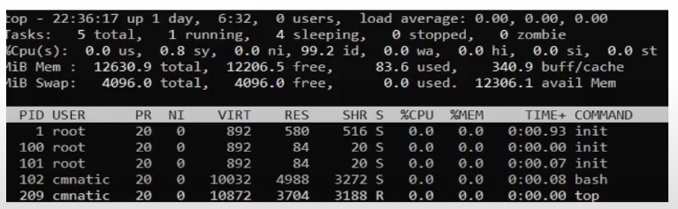

## Quản lý tiến trình

Bạn có thể gửi tín hiệu để kết thúc tiến trình; có nhiều loại tín hiệu khác nhau liên quan đến mức độ "sạch sẽ" mà hệ điều hành nhân (kernel) xử lý tiến trình. Để kết thúc một tiến trình, chúng ta có thể sử dụng lệnh có tên phù hợp là `kill` cùng với PID (Process ID) của tiến trình mà chúng ta muốn dừng. Ví dụ, để dừng tiến trình có ID 1337, chúng ta sử dụng:  
```bash
kill 1337
```

Dưới đây là một số tín hiệu mà chúng ta có thể gửi đến một tiến trình khi dừng nó:

- **SIGTERM** - Kết thúc tiến trình nhưng cho phép nó thực hiện một số nhiệm vụ dọn dẹp trước khi dừng.
- **SIGKILL** - Kết thúc tiến trình mà không thực hiện bất kỳ nhiệm vụ dọn dẹp nào.
- **SIGSTOP** - Dừng hoặc tạm dừng tiến trình.

## Tiến trình bắt đầu như thế nào?

Hãy bắt đầu với khái niệm **namespace**. Hệ điều hành (Operating System - **OS**) sử dụng namespace để chia nhỏ các tài nguyên có sẵn trên máy tính (như CPU, RAM và ưu tiên xử lý) cho các tiến trình. Hãy tưởng tượng việc chia nhỏ máy tính của bạn thành các lát, giống như bánh. Các tiến trình trong mỗi lát sẽ được truy cập vào một lượng tài nguyên nhất định, nhưng chỉ là một phần nhỏ trong tổng số tài nguyên có sẵn cho tất cả các tiến trình.

Namespace rất hữu ích cho bảo mật vì nó là một cách để cô lập các tiến trình với nhau — chỉ các tiến trình trong cùng một namespace mới có thể nhìn thấy nhau.

Chúng ta đã nói về cách PID hoạt động, và đây là nơi nó được sử dụng. Tiến trình có ID là 0 là một tiến trình bắt đầu khi hệ thống khởi động. Tiến trình này là tiến trình `init` của hệ thống trên Ubuntu, ví dụ như **systemd**, được sử dụng để quản lý các tiến trình của người dùng và nằm giữa hệ điều hành và người dùng.

Ví dụ, khi hệ thống khởi động và được khởi tạo, **systemd** là một trong những tiến trình đầu tiên được khởi động. Bất kỳ chương trình hoặc phần mềm nào mà chúng ta muốn khởi động sẽ bắt đầu như một tiến trình con của **systemd**. Điều này có nghĩa là nó được kiểm soát bởi **systemd**, nhưng sẽ chạy như một tiến trình độc lập (mặc dù chia sẻ tài nguyên từ **systemd**) để dễ dàng nhận dạng và quản lý.

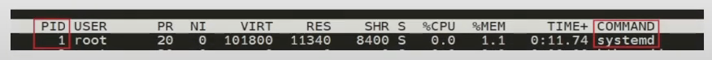

## Khởi động tiến trình/dịch vụ khi hệ thống khởi động

Một số ứng dụng có thể được khởi động ngay khi hệ thống khởi động. Ví dụ như máy chủ web, máy chủ cơ sở dữ liệu hoặc máy chủ truyền tệp. Phần mềm này thường rất quan trọng và được cấu hình để khởi động khi hệ thống bắt đầu bởi các quản trị viên.

Trong ví dụ này, chúng ta sẽ thiết lập máy chủ web Apache để khởi động thủ công và sau đó hướng dẫn hệ thống khởi động Apache2 khi hệ thống khởi động.

Lệnh **`systemctl`** được sử dụng để tương tác với tiến trình/dịch vụ **systemd**.  
Định dạng của lệnh như sau:
```
systemctl [tùy chọn] [dịch vụ]
```

Ví dụ, để yêu cầu Apache khởi động, chúng ta sử dụng:  
```bash
systemctl start apache2
```
Để dừng Apache, chúng ta chỉ cần thay **[tùy chọn]** bằng **stop** thay vì **start**.

Chúng ta có thể sử dụng bốn tùy chọn với lệnh **systemctl**:
- **Start** - Khởi động dịch vụ.
- **Stop** - Dừng dịch vụ.
- **Enable** - Bật dịch vụ để tự động khởi động cùng hệ thống.
- **Disable** - Tắt dịch vụ không cho tự động khởi động.

## **Giới thiệu về chạy nền và chạy tiền cảnh trong Linux**

Các tiến trình trong Linux có thể chạy ở hai trạng thái: trong nền (background) và trong tiền cảnh (foreground). Ví dụ, các lệnh mà bạn chạy trong terminal như lệnh `echo` hoặc những lệnh tương tự sẽ chạy trong tiền cảnh của terminal vì đó là lệnh duy nhất được cung cấp mà chưa được chỉ định chạy trong nền. `echo` là một ví dụ tuyệt vời, bởi vì kết quả của lệnh echo sẽ được trả về cho bạn trong tiền cảnh, nhưng sẽ không xảy ra nếu nó chạy trong nền. Hãy tham khảo ảnh chụp màn hình bên dưới để minh họa.

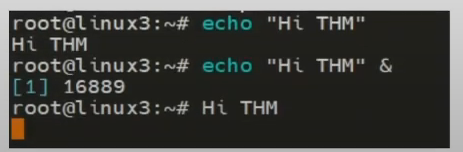

Ở đây, chúng ta đang chạy lệnh `echo "Hi THM"`, nơi mà chúng ta mong đợi kết quả sẽ được trả về giống như ban đầu. Nhưng sau khi thêm toán tử `&` vào lệnh, thay vì nhận được kết quả thực tế, chúng ta chỉ nhận được ID của tiến trình echo, vì nó đang chạy ở chế độ nền.

Điều này rất hữu ích đối với các lệnh như sao chép tệp, vì nó cho phép chúng ta chạy lệnh trong nền và tiếp tục thực hiện bất kỳ lệnh nào khác mà chúng ta muốn (mà không cần phải chờ quá trình sao chép tệp hoàn tất trước).

Chúng ta cũng có thể làm điều tương tự khi thực thi các tập lệnh (scripts) — thay vì dựa vào toán tử `&`, chúng ta có thể sử dụng tổ hợp phím `Ctrl + Z` trên bàn phím để chuyển tiến trình sang chế độ nền. Đây cũng là một cách hiệu quả để "tạm dừng" việc thực thi của một tập lệnh hoặc lệnh, như trong ví dụ dưới đây.

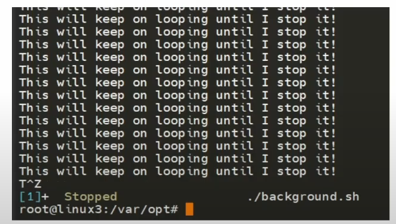

Script này sẽ tiếp tục lặp lại "This will keep on looping until I stop!" cho đến khi tôi dừng hoặc tạm ngưng tiến trình. Bằng cách sử dụng **Ctrl + Z** (được biểu thị bằng **T^Z**), terminal của chúng ta sẽ không còn bị lấp đầy bởi các tin nhắn nữa – cho đến khi chúng ta đưa nó trở lại foreground, điều này sẽ được thảo luận bên dưới.

## **Đưa tiến trình trở lại tiền cảnh**

Bây giờ chúng ta có một tiến trình đang chạy trong nền, ví dụ như tập lệnh "background.sh", và có thể xác nhận điều này bằng cách sử dụng lệnh `ps aux`. Chúng ta có thể quay lại và đưa tiến trình này trở lại chế độ tiền cảnh để tương tác.

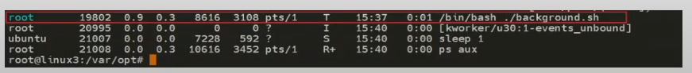

Với tiến trình của chúng ta được đưa vào chế độ chạy nền bằng cách sử dụng **Ctrl + Z** hoặc toán tử **&**, chúng ta có thể sử dụng lệnh **fg** để đưa tiến trình này trở lại foreground như bên dưới. Tại đây, chúng ta có thể thấy lệnh **fg** được sử dụng để đưa tiến trình chạy nền quay trở lại sử dụng trên terminal, nơi mà đầu ra của script bây giờ được trả về cho chúng ta.

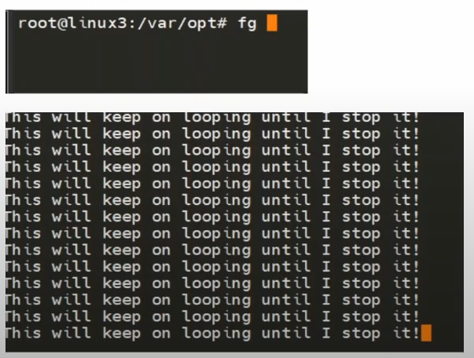

**Câu hỏi:**

1. **Nếu chúng ta khởi chạy một tiến trình mới trong đó ID trước đó là "300", ID của tiến trình mới này sẽ là gì?**  
   <details>  
   <summary>Hiển thị đáp án</summary>  
   Đáp án: 301  
   </details>  

2. **Nếu chúng ta muốn dừng tiến trình một cách sạch sẽ, tín hiệu nào sẽ được gửi đi?**  
   <details>  
   <summary>Hiển thị đáp án</summary>  
   Đáp án: SIGTERM  
   </details>  

3. **Xác định tiến trình đang chạy trên instance được triển khai (10.10.141.159). Flag được cung cấp là gì?**  

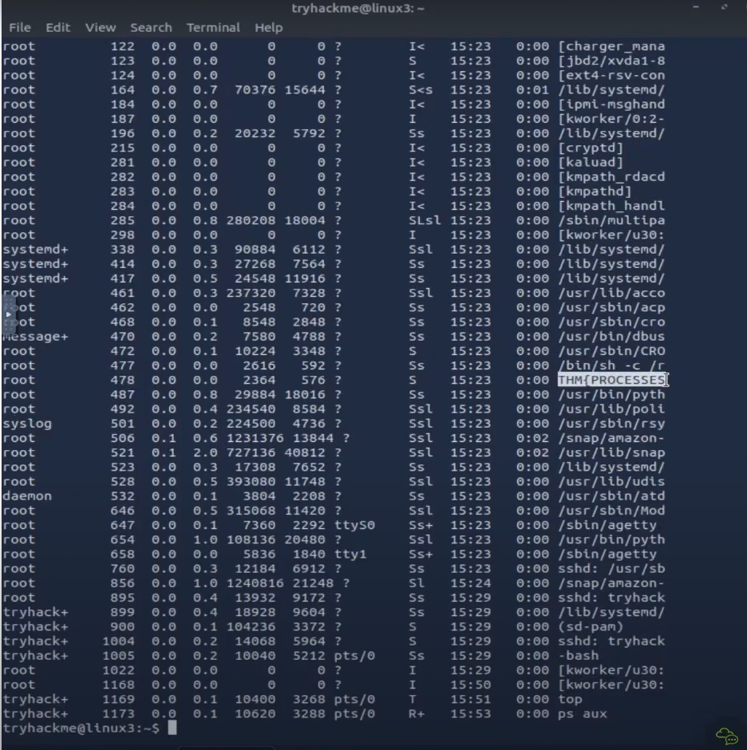

   <details>  
   <summary>Hiển thị đáp án</summary>  
   Đáp án: THM{PROCESSES}  
   </details>  

5. **Lệnh nào chúng ta sẽ sử dụng để dừng dịch vụ "myservice"?**  
   <details>  
   <summary>Hiển thị đáp án</summary>  
   Đáp án: systemctl stop myservice  
   </details>  

6. **Lệnh nào chúng ta sẽ sử dụng để khởi động cùng một dịch vụ khi hệ thống khởi động?**  
   <details>  
   <summary>Hiển thị đáp án</summary>  
   Đáp án: systemctl enable myservice  
   </details>  

7. **Lệnh nào chúng ta sẽ sử dụng để đưa một tiến trình đang chạy nền quay trở lại foreground?**  
   <details>  
   <summary>Hiển thị đáp án</summary>  
   Đáp án: fg  
   </details>  

   
