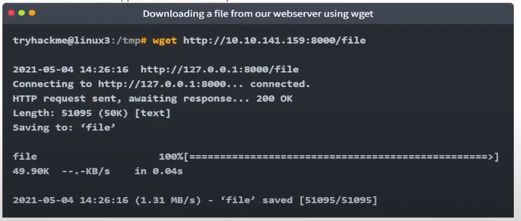
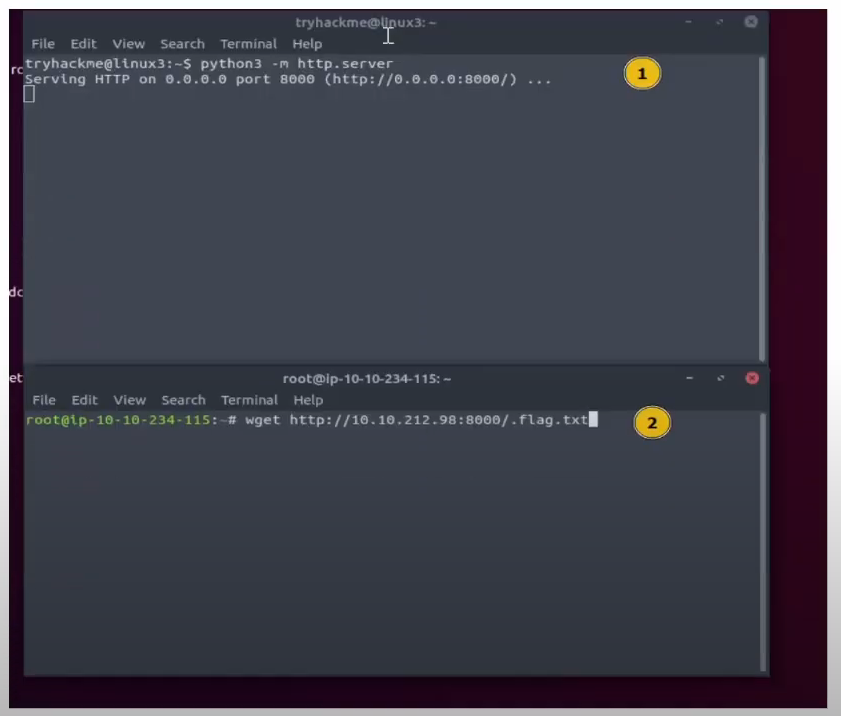

# Linux Fundamentals Part 3

> Nâng cao kỹ năng sử dụng Linux của bạn và thực hành một số tiện ích phổ biến mà bạn có thể sử dụng hàng ngày!

## Mục Lục

1. [Task 1: Introduction](#task-1-introduction)

2. [Task 2: Deploy Your Linux Machine](#task-2-deploy-your-linux-machine)

3. [Task 3: Terminal Text Editors](#task-3-terminal-text-editors)

4. [Task 4: General/Useful Utilities](#task-4-general-useful-utilities)

5. [Task 5: Processes 101](#task-5-processes-101)

6. [Task 6: Maintaining Your System: Automation](#task-6-maintaining-your-system-automation)

7. [Task 7: Maintaining Your System: Package Management](#task-7-maintaining-your-system-package-management)

8. [Task 8: Maintaining Your System: Logs](#task-8-maintaining-your-system-logs)

9. [Task 9: Conclusions & Summaries](#task-9-conclusions-summaries)


## Nội dung

# Task 1: Introduction

Chào mừng đến với phần ba (và phần kết) của mô-đun Linux Fundamentals. Cho đến nay, trong suốt loạt bài này, bạn đã thực hành một số khái niệm cơ bản và sử dụng một số lệnh quan trọng. Phòng này sẽ giới thiệu một số tiện ích và ứng dụng hữu ích mà bạn có thể sử dụng hàng ngày. Bạn cũng sẽ nâng cao các kỹ năng Linux-fu của mình bằng cách tìm hiểu về tự động hóa, quản lý gói và ghi nhật ký dịch vụ/ứng dụng.

# Task 2: Deploy Your Linux Machine

Sử Dụng Các Thông Tin Đăng Nhập Sau:
ĐỊA CHỈ IP: 10.10.141.159
Tên người dùng:  try hack me
Mật khẩu:  try hack me

Cách truy cập bằng SSH:

```bash
ssh tryhackme@10.10.141/159
```

# Task 3: Terminal Text Editors

**Trong suốt chuỗi bài viết này, chúng ta chỉ lưu văn bản vào các tệp bằng cách sử dụng kết hợp lệnh `echo` và các toán tử pipe (`>` và `>>`). Đây không phải là một cách hiệu quả để xử lý dữ liệu khi bạn làm việc với các tệp chứa nhiều dòng hoặc cần sắp xếp!**

## **Giới thiệu về trình chỉnh sửa văn bản trên terminal**

Có một số tùy chọn mà bạn có thể sử dụng, với mức độ thân thiện và tiện ích khác nhau. Nhiệm vụ này sẽ giới thiệu bạn đến **nano** và cũng chỉ ra một lựa chọn thay thế là **VIM** (mà TryHackMe có hẳn một phòng học chuyên về nó!).

## **Nano**

Thật dễ dàng để bắt đầu với Nano! Để tạo hoặc chỉnh sửa một tệp bằng nano, chúng ta chỉ cần sử dụng lệnh `nano tên_tệp` — thay thế "tên_tệp" bằng tên của tệp mà bạn muốn chỉnh sửa.


Khi chúng ta nhấn `enter` để thực hiện lệnh, `nano` sẽ khởi chạy! Nơi chúng ta có thể bắt đầu nhập hoặc sửa đổi văn bản của mình. Bạn có thể điều hướng từng dòng bằng phím mũi tên "lên" và "xuống" hoặc bắt đầu một dòng mới bằng phím "Enter" trên bàn phím.


**Nano** có một vài tính năng dễ nhớ và bao quát những điều cơ bản nhất mà bạn mong đợi từ một trình chỉnh sửa văn bản, bao gồm:

- Tìm kiếm văn bản  
- Sao chép và dán  
- Nhảy đến một số dòng cụ thể  
- Xác định bạn đang ở dòng nào  

Bạn có thể sử dụng những tính năng này của nano bằng cách nhấn phím **"Ctrl"** (trên Linux được biểu diễn bằng ký hiệu `^`) cùng với một chữ cái tương ứng. Ví dụ, để thoát, chúng ta cần nhấn **"Ctrl"** và **"X"** để thoát khỏi Nano.  

## **VIM**  

VIM là một trình chỉnh sửa văn bản tiên tiến hơn nhiều. Mặc dù bạn không bắt buộc phải biết tất cả các tính năng nâng cao, nhưng việc tìm hiểu nó sẽ rất hữu ích để nâng cao kỹ năng Linux của bạn.  


Một số lợi ích của VIM, mặc dù mất nhiều thời gian hơn để làm quen, bao gồm:

- Có thể tùy chỉnh - bạn có thể sửa đổi các phím tắt theo ý muốn
- Tô sáng cú pháp - điều này hữu ích nếu bạn đang viết hoặc bảo trì mã, khiến nó trở thành lựa chọn phổ biến cho
các nhà phát triển phần mềm

VIM hoạt động trên tất cả các thiết bị đầu cuối mà nano có thể không được cài đặt

Có rất nhiều tài nguyên như bảng hướng dẫn, hướng dẫn và các loại có sẵn để bạn sử dụng.

[Vim Cheat Sheet](https://vim.rtorr.com/)

[Học vim tại đây](https://tryhackme.com/r/room/toolboxvim)

**Câu hỏi: Chỉnh sửa "task3" nằm trong thư mục chính của"tryhackme" bằng Nano. Flag là gì?**

```bash
nano task3
```


<details>  
<summary>Hiển thị đáp án</summary>  
Đáp án: IHM{TEXT_EDITORS} 
</details>  

# Task 4: General/Useful Utilities

## **Tải xuống tệp (Wget)**  

Một tính năng cơ bản của máy tính là khả năng truyền tải tệp. Ví dụ, bạn có thể muốn tải xuống một chương trình, một script, hoặc thậm chí một bức ảnh. May mắn thay, chúng ta có nhiều cách để tải các tệp này về.  

Chúng ta sẽ tìm hiểu cách sử dụng lệnh **wget**. Lệnh này cho phép chúng ta tải các tệp từ web qua HTTP — giống như khi bạn truy cập tệp trong trình duyệt của mình. Chúng ta chỉ cần cung cấp địa chỉ của tài nguyên mà mình muốn tải xuống. Ví dụ, nếu tôi muốn tải xuống một tệp có tên là "myfile.txt" vào máy của mình, giả sử tôi biết địa chỉ web của tệp đó — nó sẽ trông như thế này:  

```  
wget https://assets.tryhackme.com/additional/linux-fundamentals/part3/myfile.txt  
```  

## **Truyền tệp từ máy của bạn - SCP (SSH)**  

**SCP** (Secure Copy) là một phương pháp sao chép tệp an toàn. Không giống như lệnh **cp** thông thường, lệnh này cho phép bạn truyền tệp giữa hai máy tính bằng giao thức **SSH**, cung cấp cả xác thực và mã hóa.  

Dựa trên mô hình **SOURCE - NGUỒN** và **DESTINATION - ĐÍCH**, SCP cho phép bạn:  

- Sao chép tệp và thư mục từ hệ thống hiện tại của bạn sang một hệ thống từ xa.  
- Sao chép tệp và thư mục từ hệ thống từ xa về hệ thống hiện tại của bạn.  

Nếu chúng ta biết tên đăng nhập và mật khẩu của một người dùng trên hệ thống hiện tại và người dùng trên hệ thống từ xa, chúng ta có thể thực hiện sao chép. Ví dụ, hãy sao chép một tệp từ máy của chúng ta sang một máy từ xa, như minh họa trong bảng dưới đây.  

| **Biến**                      | **Giá trị**                   |
|-------------------------------|-------------------------------|
| Địa chỉ IP của hệ thống từ xa | 192.168.1.30                 |
| Người dùng trên hệ thống từ xa| ubuntu                       |
| Tên của tệp trên hệ thống cục bộ | important.txt                |
| Tên muốn lưu tệp trên hệ thống từ xa | transferred.txt           |

Với thông tin này, chúng ta hãy tạo lệnh **scp** của mình (nhớ rằng định dạng của **scp** chỉ là NGUỒN và ĐÍCH):

```bash
scp important.txt ubuntu@192.168.1.30:/home/ubuntu/transferred.txt
```

Và bây giờ, hãy đảo ngược điều này và trình bày cú pháp để sử dụng **scp** để sao chép một tệp từ máy tính từ xa mà chúng ta không đăng nhập vào:

| Biến số                         | Giá trị               |
|--------------------------------|-----------------------|
| Địa chỉ IP của hệ thống từ xa  | 192.168.1.30         |
| Người dùng trên hệ thống từ xa | ubuntu               |
| Tên tệp trên hệ thống từ xa    | documents.txt        |
| Tên mà chúng ta muốn lưu tệp trên hệ thống của mình | notes.txt |

Lệnh sẽ có dạng như sau:  
`scp ubuntu@192.168.1.30:/home/ubuntu/documents.txt notes.txt`


## **Phục Vụ Tệp Từ Máy Chủ Của Bạn - WEB**

Các máy Ubuntu đi kèm sẵn với Python3. Python cung cấp một module nhẹ và dễ sử dụng gọi là "HTTPServer". Module này biến máy tính của bạn thành một máy chủ web nhanh và dễ dàng, mà bạn có thể sử dụng để phục vụ các tệp của mình, nơi chúng có thể được tải xuống bởi một máy tính khác bằng cách sử dụng các lệnh như `curl` và `wget`.

"HTTPServer" của Python3 sẽ phục vụ các tệp trong thư mục nơi bạn chạy lệnh, nhưng điều này có thể được thay đổi bằng cách cung cấp các tùy chọn có thể tìm thấy trong tài liệu hướng dẫn. Đơn giản, tất cả những gì chúng ta cần làm là chạy lệnh sau trong terminal để khởi động module:  
```python
python3 -m http.server
```
Trong đoạn mã dưới đây, chúng ta đang phục vụ từ một thư mục có tên "webserver", trong đó chứa một tệp duy nhất được gọi là "file".


Bây giờ, hãy sử dụng `wget` để tải xuống tệp bằng địa chỉ `10.10.141.159` và tên tệp. Hãy nhớ rằng, vì máy chủ python3 đang chạy cổng 8000, bạn sẽ cần chỉ định điều này trong lệnh wget của mình. Ví dụ:


Lưu ý, bạn sẽ cần mở một terminal mới để sử dụng wget và để terminal mà bạn đã khởi động máy chủ web Python3. Điều này là do, sau khi bạn khởi động máy chủ web Python3, nó sẽ chạy trong terminal đó cho đến khi bạn hủy. Chúng ta hãy xem đoạn trích dưới đây làm ví dụ:



Hãy nhớ rằng, bạn sẽ cần chạy lệnh `wget` trong một terminal khác (trong khi vẫn giữ terminal đang chạy máy chủ Python3 hoạt động). Một ví dụ về điều này trên Try Hack Me Attack Box được minh họa bên dưới:



Một nhược điểm của module này là bạn không có cách lập chỉ mục, vì vậy bạn phải biết chính xác tên và vị trí của tệp mà bạn muốn sử dụng. Đó là lý do tại sao tôi thích sử dụng **Updog**. **Updog là gì?** Một máy chủ web tiên tiến hơn nhưng vẫn nhẹ. Tuy nhiên, hiện tại, chúng ta hãy tiếp tục sử dụng "HTTP Server" của Python.

