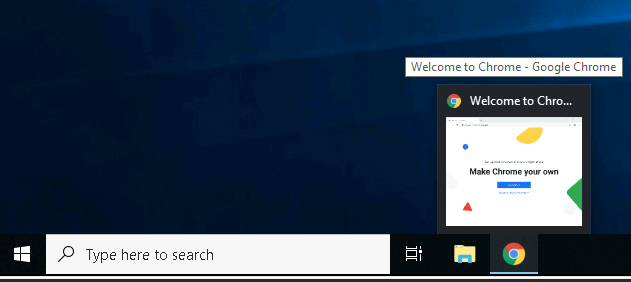

# Windows Fundamentals 1

> Trong phần 1 của mô-đun Cơ bản về Windows, chúng ta sẽ bắt đầu hành trình tìm hiểu về màn hình nền Windows, hệ thống tệp NTFS, UAC, Bảng điều khiển và nhiều nội dung khác.

## Mục Lục

1. [Task 1: Introduction to Windows](#task-1-introduction-to-windows)

2. [Task 2: Windows Editions](#task-2-windows-editions)

3. [Task 3: The Desktop (GUI)](#task-3-the-desktop-gui)

4. [Task 4: The File System](#task-4-the-file-system)

5. [Task 5: The Windows\System32 Folders](#task-5-the-windows-system32-folders)

6. [Task 6: User Accounts, Profiles, and Permissions](#task-6-user-accounts-profiles-and-permissions)

7. [Task 7: User Account Control](#task-7-user-account-control)

8. [Task 8: Settings and the Control Panel](#task-8-settings-and-the-control-panel)

9. [Task 9: Task Manager](#task-9-task-manager)

10. [Task 10: Conclusion](#task-10-conclusion)

## Nội dung

# Task 1: Introduction to Windows

Hệ điều hành (OS) Windows là một sản phẩm phức tạp với nhiều tệp hệ thống, tiện ích, cài đặt, tính năng, v.v.

Mô-đun này sẽ cố gắng cung cấp tổng quan chung về một số ít thành phần tạo nên HĐH Windows, điều hướng giao diện người dùng, thực hiện thay đổi cho hệ thống, v.v. Nội dung này hướng đến những người muốn hiểu và sử dụng HĐH Windows ở mức độ thoải mái hơn.

Máy ảo sẽ mở trong trình duyệt web của bạn.

Nếu bạn muốn truy cập máy ảo qua Remote Desktop, hãy sử dụng thông tin đăng nhập bên dưới.

Machine IP: MACHINE_IP

User: administrator

Password: letmein123!

Chấp nhận Chứng chỉ khi được nhắc và bạn sẽ được đăng nhập vào hệ thống từ xa ngay bây giờ.

Lưu ý: Máy ảo có thể mất tới 3 phút để tải.

# Task 2: Windows Editions

Hệ điều hành Windows có một lịch sử lâu dài, bắt đầu từ năm 1985, và hiện nay, nó là hệ điều hành chiếm ưu thế trong cả việc sử dụng tại gia và trong các mạng lưới công ty. Vì lý do này, Windows luôn là mục tiêu của các hacker và những kẻ viết phần mềm độc hại.

Windows XP là một phiên bản Windows phổ biến và hoạt động lâu dài. Microsoft đã công bố Windows Vista, đây là một cuộc đại tu hoàn toàn của hệ điều hành Windows. Tuy nhiên, Vista gặp phải nhiều vấn đề. Người dùng Windows không đón nhận Vista tốt, và nó nhanh chóng bị loại bỏ.

Khi Microsoft thông báo ngày kết thúc vòng đời của Windows XP, nhiều khách hàng hoảng sợ. Các tập đoàn, bệnh viện, v.v., phải gấp rút thử nghiệm và chuyển sang phiên bản Windows khả dụng tiếp theo, đó là Windows 7, cùng với nhiều phần cứng và thiết bị khác. Các nhà cung cấp phải làm việc hết tốc lực để đảm bảo sản phẩm của họ hoạt động với Windows 7 cho khách hàng của mình. Nếu họ không làm được, khách hàng buộc phải phá vỡ thỏa thuận và tìm nhà cung cấp khác nâng cấp sản phẩm để hoạt động với Windows 7. Điều này là một cơn ác mộng đối với nhiều người, và Microsoft đã lưu ý đến điều này.

Windows 7, được phát hành nhanh chóng ngay sau đó, đã được đánh dấu với một ngày kết thúc hỗ trợ. Windows 8.x xuất hiện và biến mất nhanh chóng, giống như Vista.

Sau đó, [Windows 10](https://www.microsoft.com/en-us/windows/tips?activetab=NewPopular?activetab=NewPopular) ra đời, là phiên bản hệ điều hành Windows hiện tại cho máy tính để bàn.

Windows 10 có hai phiên bản: Home và Pro. Bạn có thể đọc sự khác biệt giữa chúng [tại đây](https://www.microsoft.com/en-us/windows/?r=1).

Mặc dù chúng ta không nói về các máy chủ, phiên bản hệ điều hành Windows hiện tại cho máy chủ là **[Windows Server 2019](https://www.microsoft.com/en-us/windows-server)**.

Nhiều nhà phê bình chỉ trích Microsoft, nhưng họ đã có những bước tiến dài trong việc cải thiện tính khả dụng và bảo mật với mỗi phiên bản mới của Windows.

**Lưu ý:** Phiên bản Windows của máy ảo (VM) đính kèm là Windows Server 2019 Standard, như được thấy trong **System Information**.

**Cập nhật:** Từ tháng 6 năm 2021, Microsoft đã công bố ngày ngừng hỗ trợ cho Windows 10 [tại đây](https://learn.microsoft.com/en-us/lifecycle/products/windows-10-home-and-pro?ranMID=24542&ranEAID=kXQk6*ivFEQ&ranSiteID=kXQk6.ivFEQ-4cKUPfbv9lM_IR2EX7K_hw&epi=kXQk6.ivFEQ-4cKUPfbv9lM_IR2EX7K_hw&irgwc=1&OCID=AID2000142_aff_7593_1243925&tduid=(ir__feexvhocigkfqna9kk0sohznb32xutanagupypus00)(7593)(1243925)(kXQk6.ivFEQ-4cKUPfbv9lM_IR2EX7K_hw)()&irclickid=_feexvhocigkfqna9kk0sohznb32xutanagupypus00).

“Microsoft sẽ tiếp tục hỗ trợ ít nhất một phiên bản Windows 10 Semi-Annual Channel đến ngày 14 tháng 10 năm 2025.”

Kể từ ngày 5 tháng 10 năm 2021 - Windows 11 hiện là hệ điều hành Windows dành cho người dùng cuối. Đọc thêm về Windows 11 [tại đây](https://www.microsoft.com/en-us/windows?wa=wsignin1.0&r=1).

**Câu hỏi: Bạn có thể bật loại mã hóa nào trên Pro mà không thể bật trên Home?**

  

Hiển thị đáp án
  
Đáp án: BitLocker

  

Sự khác biệt chính về khả năng mã hóa giữa Windows **Pro** và **Home** nằm ở tính năng hỗ trợ **BitLocker**:

**Windows Pro:**

- **BitLocker Drive Encryption:** Có sẵn và có thể kích hoạt. BitLocker cung cấp mã hóa toàn bộ ổ đĩa, bảo vệ dữ liệu của bạn ngay cả khi ổ đĩa bị tháo ra khỏi thiết bị. Ngoài ra, BitLocker còn hỗ trợ các tính năng như **BitLocker To Go** (mã hóa USB) và quản lý qua **Group Policy**.

**Windows Home:**

- **BitLocker Drive Encryption:** Không được hỗ trợ một cách chính thức. Tuy nhiên, Windows Home có thể hỗ trợ một dạng mã hóa đơn giản hơn gọi là **Device Encryption** (Mã hóa thiết bị), nếu phần cứng của bạn hỗ trợ. Tính năng này ít tùy chọn và không mạnh mẽ bằng BitLocker.
- Để sử dụng tính năng mã hóa đầy đủ như BitLocker, bạn cần nâng cấp lên phiên bản Windows Pro hoặc sử dụng các công cụ mã hóa của bên thứ ba.

Nếu bạn cần một giải pháp mã hóa mạnh mẽ với khả năng quản lý nâng cao (ví dụ: quản lý qua Group Policy, tích hợp với Active Directory, hoặc mã hóa đồng loạt nhiều ổ đĩa), thì **Windows Pro** là lựa chọn phù hợp hơn.

# Task 3: The Desktop (GUI)

Windows Desktop, hay còn gọi là giao diện người dùng đồ họa hoặc GUI (graphical user interface), là màn hình chào đón bạn sau khi bạn đăng nhập vào máy tính Windows 10.

Theo truyền thống, trước tiên bạn cần phải vượt qua màn hình đăng nhập. Màn hình đăng nhập là nơi bạn cần nhập thông tin đăng nhập tài khoản hợp lệ; thường là tên người dùng và mật khẩu của tài khoản Windows đã tồn tại trước đó trên hệ thống cụ thể đó hoặc trong môi trường Active Directory (nếu đó là máy tính đã tham gia miền).

Ảnh chụp màn hình ở trên là ví dụ về một **Màn hình Desktop Windows** điển hình. Mỗi thành phần tạo nên giao diện người dùng đồ họa (GUI) được giải thích ngắn gọn dưới đây:

1. Màn hình Desktop  
2. Menu Start  
3. Hộp tìm kiếm (Cortana)  
4. Chế độ xem tác vụ (Task View)  
5. Thanh tác vụ (Taskbar)  
6. Thanh công cụ (Toolbars)  
7. Khu vực thông báo (Notification Area)  

## **Màn hình Desktop**

Màn hình Desktop là nơi bạn sẽ có các lối tắt (shortcut) đến chương trình, thư mục, tệp, v.v. Các biểu tượng này sẽ được tổ chức gọn gàng trong các thư mục được sắp xếp theo thứ tự bảng chữ cái hoặc phân tán ngẫu nhiên mà không có tổ chức cụ thể nào trên màn hình. Dù thế nào, các mục này thường được đặt trên màn hình Desktop để truy cập nhanh.

Giao diện và cách bố trí của màn hình Desktop có thể được thay đổi để phù hợp với sở thích của bạn. Bằng cách nhấp chuột phải vào bất kỳ đâu trên màn hình Desktop, một menu ngữ cảnh sẽ xuất hiện. Menu này cho phép bạn thay đổi kích thước các biểu tượng trên màn hình Desktop, sắp xếp chúng theo ý muốn, sao chép/dán các mục vào màn hình Desktop, và tạo các mục mới như thư mục, lối tắt, hoặc tài liệu văn bản.

Dưới **Cài đặt Màn hình** (Display settings), bạn có thể thay đổi độ phân giải và hướng của màn hình. Trong trường hợp bạn có nhiều màn hình máy tính, bạn có thể thực hiện cấu hình cho thiết lập đa màn hình tại đây.

Lưu ý: Trong phiên làm việc **Remote Desktop**, một số cài đặt hiển thị sẽ bị vô hiệu hóa.

Bạn cũng có thể thay đổi hình nền bằng cách chọn **Cá nhân hóa** (Personalize).

Trong mục **Cá nhân hóa** (Personalize), bạn có thể thay đổi hình nền cho Màn hình Desktop, thay đổi phông chữ, chủ đề, bảng màu, v.v.

## **Menu Start**

Trong các phiên bản trước của Windows, từ **Start** xuất hiện ở góc dưới bên trái của giao diện đồ họa (GUI) trên màn hình Desktop. Trong các phiên bản Windows hiện đại, chẳng hạn như Windows 10, từ "Start" không còn xuất hiện nữa, thay vào đó là biểu tượng logo Windows. Mặc dù giao diện của Menu Start đã thay đổi, mục đích chính của nó vẫn giữ nguyên.

Menu Start cung cấp quyền truy cập vào tất cả các ứng dụng/chương trình, tệp, công cụ tiện ích, v.v., hữu ích nhất.

Khi nhấp vào biểu tượng logo Windows, Menu Start sẽ mở ra. Menu Start được chia thành các phần khác nhau. Xem chi tiết bên dưới.

1. Phần này của Menu Start cung cấp các phím tắt nhanh để thực hiện các hành động liên quan đến tài khoản hoặc phiên đăng nhập của bạn, chẳng hạn như thay đổi thông tin tài khoản người dùng, khóa màn hình hoặc đăng xuất khỏi tài khoản. Các phím tắt khác dành riêng cho tài khoản của bạn bao gồm thư mục **Documents** (biểu tượng tài liệu) và thư mục **Pictures** (biểu tượng hình ảnh). Cuối cùng, biểu tượng bánh răng/cơ sẽ đưa bạn đến màn hình **Cài đặt (Settings)**, và biểu tượng nguồn sẽ cho phép bạn **ngắt kết nối khỏi phiên Remote Desktop**, tắt máy tính hoặc khởi động lại máy tính.

Trong hình bên dưới, bạn có thể thấy mỗi biểu tượng đại diện cho chức năng nào. Để mở rộng phần này, hãy nhấp vào biểu tượng giống như một chiếc bánh hamburger ở phía trên.

2. Phần này sẽ hiển thị tất cả các ứng dụng/chương trình **mới được thêm gần đây** (Recently added) ở phía trên cùng và tất cả các ứng dụng/chương trình đã cài đặt (được cấu hình để xuất hiện trong Menu Start). Trong phần này, bạn cũng sẽ thấy các ứng dụng/chương trình được liệt kê theo thứ tự bảng chữ cái. Mỗi chữ cái sẽ có một phần riêng. Xem chi tiết bên dưới.

Trong hình trên, ô đầu tiên là nơi hiển thị các ứng dụng/chương trình **mới được thêm gần đây**. Ô thứ hai là nơi hiển thị tất cả các ứng dụng/chương trình đã được cài đặt.

**Lưu ý:** Trong máy ảo (VM) của bạn, Google Chrome sẽ không còn hiển thị dưới dạng chương trình **Recently Added** nữa.

Nếu bạn có một danh sách **dài** các ứng dụng/chương trình đã cài đặt, bạn có thể nhanh chóng chuyển đến một phần cụ thể trong danh sách bằng cách nhấp vào các chữ cái đầu để hiển thị lưới bảng chữ cái. Xem chi tiết bên dưới.

**Lưu ý:** Các chữ cái màu trắng tương ứng với các tiêu đề chữ cái.

3. Phía bên phải của **Menu Start** là nơi bạn sẽ tìm thấy các biểu tượng cho các ứng dụng/chương trình hoặc tiện ích cụ thể. Các biểu tượng này được gọi là **tiles** (ô vuông). Một số ô vuông được thêm vào phần này theo mặc định. Nếu bạn nhấp chuột phải vào bất kỳ ô vuông nào, một menu sẽ xuất hiện cho phép bạn thực hiện thêm các hành động trên ô được chọn; chẳng hạn như thay đổi kích thước ô, gỡ ghim khỏi Menu Start, xem thuộc tính (Properties) của nó, v.v. Xem chi tiết bên dưới.

Các ứng dụng/chương trình có thể được thêm vào phần này của Menu Start bằng cách nhấp chuột phải vào ứng dụng/chương trình và chọn **Pin to Start**. Xem chi tiết bên dưới.

## **Thanh tác vụ (Taskbar)**

Một số thành phần được kích hoạt và hiển thị theo mặc định. Ví dụ, **Thanh công cụ (Toolbar)** (mục 6), được kích hoạt để minh họa mục đích sử dụng.

Nếu bạn giống tôi và muốn tắt một số thành phần này, bạn có thể nhấp chuột phải vào **Thanh tác vụ** để mở menu ngữ cảnh, cho phép bạn thực hiện các thay đổi.

Bất kỳ ứng dụng/chương trình, thư mục, tệp, v.v., nào mà bạn mở/chạy sẽ xuất hiện trên **Thanh tác vụ** (Taskbar).

Khi di chuột qua biểu tượng, một hình thu nhỏ xem trước sẽ xuất hiện, cùng với một chú thích (tooltip). Chú thích này rất hữu ích nếu bạn có nhiều ứng dụng/chương trình đang mở, chẳng hạn như Google Chrome, và bạn muốn tìm xem phiên bản nào của Google Chrome cần được đưa lên trước.

Khi bạn đóng bất kỳ mục nào trong số này, chúng sẽ biến mất khỏi thanh tác vụ (trừ khi bạn đã ghim chúng vào thanh tác vụ).

## **Khu vực Thông báo (Notification Area)**

Khu vực Thông báo, thường nằm ở góc dưới bên phải của màn hình Windows, là nơi hiển thị ngày và giờ. Các biểu tượng khác có thể hiển thị trong khu vực này bao gồm biểu tượng âm lượng, biểu tượng mạng/không dây, để nêu một vài ví dụ. Các biểu tượng có thể được thêm vào hoặc xóa khỏi Khu vực Thông báo trong cài đặt **Taskbar settings**.

Từ đó, cuộn xuống phần **Khu vực Thông báo** (Notification Area) để thực hiện các thay đổi.

