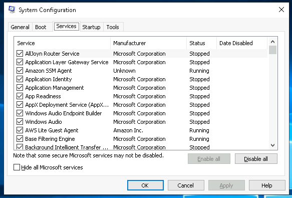
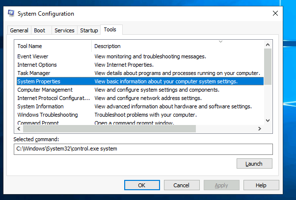

# Windows Fundamentals 2

> Trong phần 2 của module **Windows Fundamentals**, bạn sẽ khám phá thêm về **System Configuration** (Cấu hình Hệ thống), **UAC Settings** (Cài đặt UAC), **Resource Monitoring** (Giám sát Tài nguyên), **Windows Registry** (Sổ đăng ký Windows) và nhiều nội dung khác.

## Mục Lục

1. [Task 1: Introduction](#task-1-introduction)

2. [Task 2: System Configuration](#task-2-system-configuration)

3. [Task 3: Change UAC Settings](#task-3-change-uac-settings)

4. [Task 4: Computer Management](#task-4-computer-management)

5. [Task 5: System Information](#task-5-system-information)

6. [Task 6: Resource Monitor](#task-6-resource-monitor)

7. [Task 7: Command Prompt](#task-7-command-prompt)

8. [Task 8: Registry Editor](#task-8-registry-editor)

9. [Task 9: Conclusion](#task-9-conclusion)

## Nội dung

# Task 1: Introduction

If you wish to access the virtual machine via Remote Desktop, use the credentials below. 

Machine IP: MACHINE_IP

User: administrator

Password: letmein123!

# Task 2: System Configuration

Tiện ích **System Configuration** (**MSConfig**) được sử dụng để khắc phục sự cố nâng cao, với mục đích chính là giúp chẩn đoán các vấn đề khởi động hệ thống.  

Tham khảo tài liệu sau [tại đây](https://learn.microsoft.com/en-us/troubleshoot/windows-client/performance/system-configuration-utility-troubleshoot-configuration-errors) để biết thêm thông tin về tiện ích **System Configuration**.  

Có một số phương pháp để mở **System Configuration**. Một phương pháp là thông qua **Start Menu**.

**Lưu ý:** Bạn cần quyền quản trị viên cục bộ để mở tiện ích này.

Tiện ích này có năm thẻ (tab) chính ở phía trên. Dưới đây là tên của từng thẻ. Chúng ta sẽ đề cập ngắn gọn đến mỗi thẻ trong nhiệm vụ này:

1. **General** (Chung)  
2. **Boot** (Khởi động)  
3. **Services** (Dịch vụ)  
4. **Startup** (Khởi chạy)  
5. **Tools** (Công cụ)

Trong thẻ **General** (Chung), bạn có thể chọn các thiết bị và dịch vụ mà Windows sẽ tải khi khởi động. Các tùy chọn bao gồm:  
- **Normal** (Bình thường)  
- **Diagnostic** (Chẩn đoán)  
- **Selective** (Tùy chọn)  

Trong thẻ **Boot** (Khởi động), bạn có thể xác định các tùy chọn khởi động khác nhau cho hệ điều hành.

Thẻ **Services** (Dịch vụ) liệt kê tất cả các dịch vụ được cấu hình cho hệ thống bất kể trạng thái của chúng (đang chạy hoặc đã dừng). Một dịch vụ là một loại ứng dụng đặc biệt chạy ở chế độ nền.

Trong thẻ **Startup** (Khởi động), bạn sẽ không thấy điều gì đặc biệt trong máy ảo (VM) đính kèm. Bên dưới là ảnh chụp màn hình của thẻ Startup trong **MSConfig** từ máy cục bộ của tôi.

Như bạn thấy, Microsoft khuyến nghị sử dụng **Task Manager** (**taskmgr**) để quản lý (bật/tắt) các mục khởi động. Tiện ích **System Configuration** không phải là chương trình quản lý khởi động.

**Lưu ý:** Nếu bạn mở **Task Manager** trên máy ảo (VM) đính kèm, bạn sẽ nhận thấy rằng Task Manager không hiển thị thẻ **Startup**.

Trong thẻ **Tools** (Công cụ), có danh sách các tiện ích (tools) khác nhau mà bạn có thể chạy để cấu hình thêm hệ điều hành. Có một mô tả ngắn gọn cho mỗi công cụ để cung cấp cái nhìn tổng quan về mục đích sử dụng của nó.

Lưu ý phần **Selected command** (Lệnh được chọn). Thông tin trong hộp văn bản này sẽ thay đổi theo từng công cụ.

Để chạy một công cụ, bạn có thể sử dụng lệnh để khởi chạy công cụ qua **Run prompt**, **Command Prompt**, hoặc bằng cách nhấp vào nút **Launch**.

**Câu hỏi:**

**Câu hỏi 1: Tên của dịch vụ liệt kê Systems Internals là nhà sản xuất là gì?**  

  

Hiển thị đáp án
  
Đáp án: PsShutdown  

  

**Câu hỏi 2: Windows được đăng ký cho ai?**  

  

Hiển thị đáp án
  
Đáp án: Windows User  

  

**Câu hỏi 3: Lệnh cho Windows Troubleshooting là gì?**  

  

Hiển thị đáp án
  
Đáp án: `C:\Windows\System32\control.exe /name Microsoft.Troubleshooting`  

  

**Câu hỏi 4: Lệnh nào sẽ mở Control Panel? (Câu trả lời là tên file .exe, không phải đường dẫn đầy đủ)**  

  

Hiển thị đáp án
  
Đáp án: control.exe  

  
