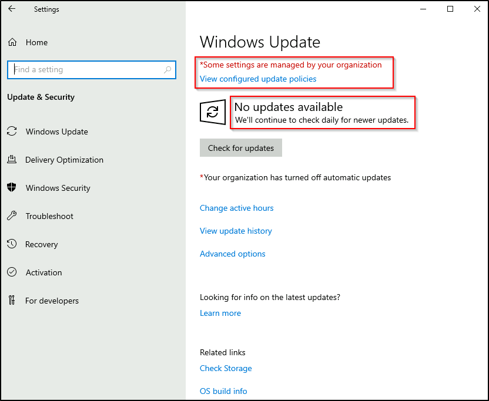

# Windows Fundamentals 3

> Trong phần 3 của module **Windows Fundamentals**, tìm hiểu về các công cụ tích hợp của Microsoft giúp bảo vệ thiết bị, chẳng hạn như **Windows Updates**, **Windows Security**, **BitLocker**, và nhiều công cụ khác...


## Mục Lục

1. [Task 1: Introduction](#task-1-introduction)

2. [Task 2: Windows Updates](#task-2-windows-updates)

3. [Task 3: Windows Security](#task-3-windows-security)

4. [Task 4: Virus & Threat Protection](#task-4-virus-threat-protection)

5. [Task 5: Firewall & Network Protection](#task-5-firewall-network-protection)

6. [Task 6: App & Browser Control](#task-6-app-browser-control)

7. [Task 7: Device Security](#task-7-device-security)

8. [Task 8: BitLocker](#task-8-bitlocker)

9. [Task 9: Volume Shadow Copy Service](#task-9-volume-shadow-copy-service)

10. [Task 10: Conclusion](#task-10-conclusion)

## Nội dung

# Task 1: Introduction

If you wish to access the virtual machine via Remote Desktop, use the credentials below. 

Machine IP: MACHINE_IP

User: administrator

Password: letmein123!

# Task 2: Windows Updates

Hãy bắt đầu với **Windows Update**.

**Windows Update** là một dịch vụ do Microsoft cung cấp nhằm cung cấp các bản cập nhật bảo mật, cải tiến tính năng và các bản vá cho hệ điều hành Windows cũng như các sản phẩm khác của Microsoft, chẳng hạn như Microsoft Defender.

- Các bản cập nhật thường được phát hành vào thứ Ba thứ hai của mỗi tháng, được gọi là **Patch Tuesday**. Điều này không có nghĩa là mọi bản vá/bản cập nhật quan trọng phải chờ đến Patch Tuesday tiếp theo để phát hành. Nếu bản cập nhật là khẩn cấp, Microsoft sẽ phát hành thông qua dịch vụ Windows Update đến các thiết bị Windows.

- Windows Update có thể được tìm thấy trong phần **Settings**.

**Mẹo:** Một cách khác để truy cập **Windows Update** là từ hộp thoại **Run** hoặc CMD, bằng cách chạy lệnh sau:

```bash
control /name Microsoft.WindowsUpdate
```


Trong **máy ảo (VM)** được đính kèm, có một số điểm cần lưu ý:

1. **Cài đặt Windows Update** được "quản lý". (Thông thường, người dùng cá nhân sẽ không thấy loại thông báo này).
2. **Không có bản cập nhật nào khả dụng** cho máy ảo. (Máy ảo được đính kèm không có quyền truy cập Internet để giao tiếp với Microsoft và nhận các bản cập nhật mới).



Trong nhiều năm qua, người dùng Windows đã quen với việc trì hoãn cập nhật Windows đến một ngày khác hoặc thậm chí không cài đặt bản cập nhật. Có nhiều lý do dẫn đến hành động này, một trong số đó là cần phải khởi động lại máy tính sau khi cập nhật Windows.

Microsoft đã giải quyết vấn đề này một cách đáng chú ý với Windows 10. Các bản cập nhật không còn bị bỏ qua hoặc trì hoãn đến mức bị lãng quên. Các bản cập nhật Windows chỉ có thể được hoãn lại, nhưng cuối cùng, chúng sẽ được thực hiện và máy tính của bạn sẽ khởi động lại. Microsoft cung cấp các bản cập nhật này để giữ cho thiết bị an toàn và bảo mật.

Dưới đây là hình ảnh minh họa **yêu cầu khởi động lại (Restart required)** và các tùy chọn liên quan đến việc lên lịch khởi động lại.


Refer to the Windows Updates [FAQ](https://support.microsoft.com/en-us/windows/windows-update-faq-8a903416-6f45-0718-f5c7-375e92dddeb2) for more information.


