# Windows Fundamentals 3

> Trong phần 3 của module **Windows Fundamentals**, tìm hiểu về các công cụ tích hợp của Microsoft giúp bảo vệ thiết bị, chẳng hạn như **Windows Updates**, **Windows Security**, **BitLocker**, và nhiều công cụ khác...


## Mục Lục

1. [Task 1: Introduction](#task-1-introduction)

2. [Task 2: Windows Updates](#task-2-windows-updates)

3. [Task 3: Windows Security](#task-3-windows-security)

4. [Task 4: Virus and Threat Protection](#task-4-virus-and-threat-protection)

5. [Task 5: Firewall & Network Protection](#task-5-firewall-network-protection)

6. [Task 6: App and Browser Control](#task-6-app-and-browser-control)

7. [Task 7: Device Security](#task-7-device-security)

8. [Task 8: BitLocker](#task-8-bitlocker)

9. [Task 9: Volume Shadow Copy Service](#task-9-volume-shadow-copy-service)

10. [Task 10: Conclusion](#task-10-conclusion)

## Nội dung

# Task 1: Introduction

If you wish to access the virtual machine via Remote Desktop, use the credentials below. 

Machine IP: MACHINE_IP

User: administrator

Password: letmein123!

# Task 2: Windows Updates

Hãy bắt đầu với **Windows Update**.

**Windows Update** là một dịch vụ do Microsoft cung cấp nhằm cung cấp các bản cập nhật bảo mật, cải tiến tính năng và các bản vá cho hệ điều hành Windows cũng như các sản phẩm khác của Microsoft, chẳng hạn như Microsoft Defender.

- Các bản cập nhật thường được phát hành vào thứ Ba thứ hai của mỗi tháng, được gọi là **Patch Tuesday**. Điều này không có nghĩa là mọi bản vá/bản cập nhật quan trọng phải chờ đến Patch Tuesday tiếp theo để phát hành. Nếu bản cập nhật là khẩn cấp, Microsoft sẽ phát hành thông qua dịch vụ Windows Update đến các thiết bị Windows.

- Windows Update có thể được tìm thấy trong phần **Settings**.

**Mẹo:** Một cách khác để truy cập **Windows Update** là từ hộp thoại **Run** hoặc CMD, bằng cách chạy lệnh sau:

```bash
control /name Microsoft.WindowsUpdate
```


Trong **máy ảo (VM)** được đính kèm, có một số điểm cần lưu ý:

1. **Cài đặt Windows Update** được "quản lý". (Thông thường, người dùng cá nhân sẽ không thấy loại thông báo này).
2. **Không có bản cập nhật nào khả dụng** cho máy ảo. (Máy ảo được đính kèm không có quyền truy cập Internet để giao tiếp với Microsoft và nhận các bản cập nhật mới).


Trong nhiều năm qua, người dùng Windows đã quen với việc trì hoãn cập nhật Windows đến một ngày khác hoặc thậm chí không cài đặt bản cập nhật. Có nhiều lý do dẫn đến hành động này, một trong số đó là cần phải khởi động lại máy tính sau khi cập nhật Windows.

Microsoft đã giải quyết vấn đề này một cách đáng chú ý với Windows 10. Các bản cập nhật không còn bị bỏ qua hoặc trì hoãn đến mức bị lãng quên. Các bản cập nhật Windows chỉ có thể được hoãn lại, nhưng cuối cùng, chúng sẽ được thực hiện và máy tính của bạn sẽ khởi động lại. Microsoft cung cấp các bản cập nhật này để giữ cho thiết bị an toàn và bảo mật.

Dưới đây là hình ảnh minh họa **yêu cầu khởi động lại (Restart required)** và các tùy chọn liên quan đến việc lên lịch khởi động lại.

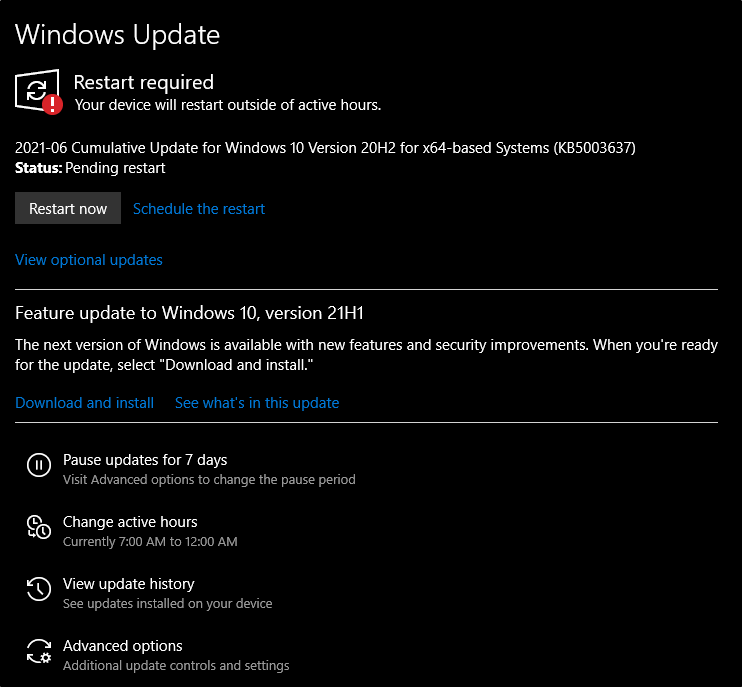

Refer to the Windows Updates [FAQ](https://support.microsoft.com/en-us/windows/windows-update-faq-8a903416-6f45-0718-f5c7-375e92dddeb2) for more information.


**Câu hỏi: Có hai bản cập nhật định nghĩa được cài đặt trong máy ảo đính kèm. Các bản cập nhật này được cài đặt vào ngày nào?**  

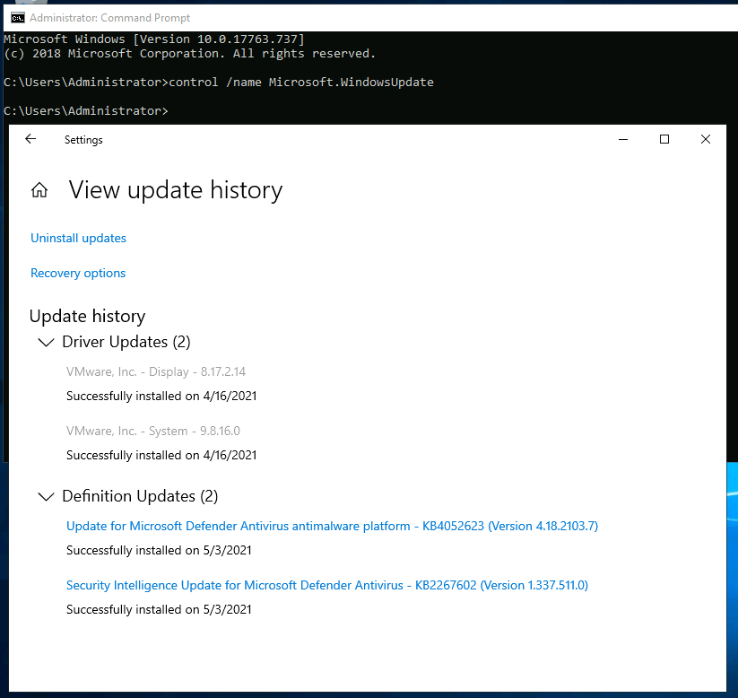

<details>  
<summary>Hiển thị đáp án</summary>  
Đáp án: 5/3/2021  
</details>  

# Task 3: Windows Security

Theo Microsoft, **"Windows Security là nơi quản lý các công cụ bảo vệ thiết bị và dữ liệu của bạn".**

Nếu bạn chưa để ý, **Windows Security** cũng có sẵn trong phần **Cài đặt (Settings)**.

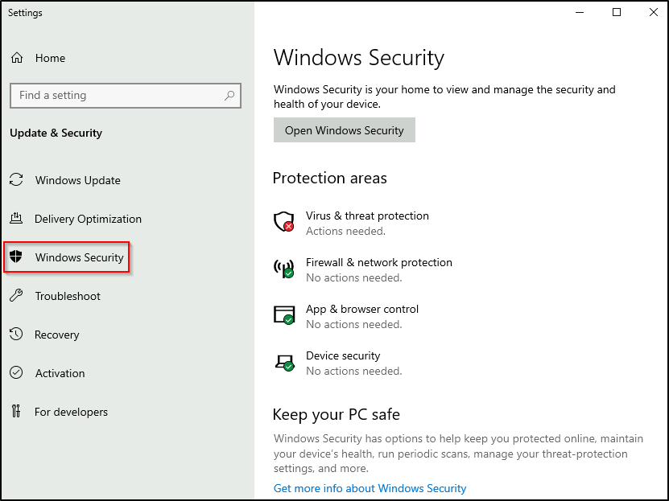

Trong hình trên, hãy tập trung vào phần **Protection areas** (Khu vực bảo vệ):

- **Virus & threat protection**  
- **Firewall & network protection**  
- **App & browser control**  
- **Device security**  

Mỗi nhiệm vụ tiếp theo sẽ đề cập ngắn gọn về những khu vực này.

Trước khi tiếp tục, hãy xem xét nhanh về các biểu tượng trạng thái:

- **Màu xanh lá cây** nghĩa là thiết bị của bạn được bảo vệ đủ và không có hành động cần thiết nào.  
- **Màu vàng** nghĩa là có khuyến nghị về an toàn mà bạn cần xem xét.  
- **Màu đỏ** là cảnh báo rằng cần sự chú ý ngay lập tức từ bạn.

Nhấp vào **Open Windows Security** (Mở Windows Security).

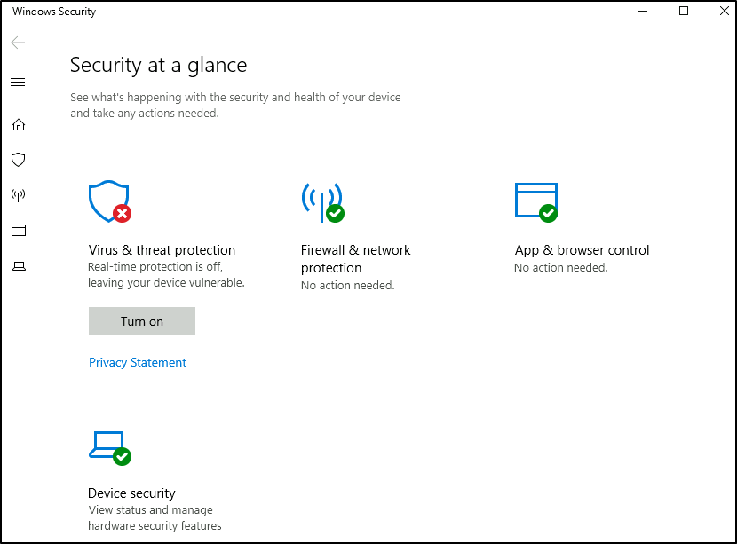

**Lưu ý:** Vì máy ảo (VM) được đính kèm là phiên bản **Windows Server 2019**, giao diện của nó sẽ khác với phiên bản **Windows 10 Home** hoặc **Professional**.

Hình ảnh bên dưới được chụp từ một thiết bị sử dụng Windows 10.

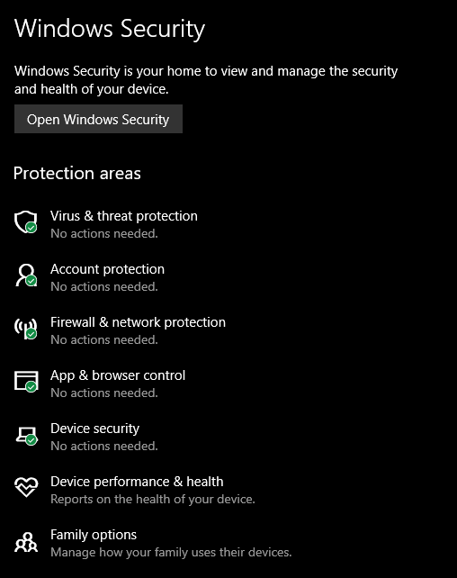

Tiếp theo, chúng ta sẽ tìm hiểu về Bảo vệ chống virus và mối đe dọa (Virus & threat protection.)

**Câu hỏi: Khi kiểm tra phần Security trên máy ảo của bạn, khu vực nào cần sự chú ý ngay lập tức?**  

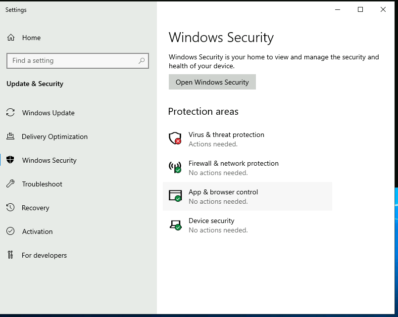

<details>  
<summary>Hiển thị đáp án</summary>  
Đáp án: Virus & threat protection  
</details>  

# Task 4: Virus and Threat Protection

Phần **Bảo vệ chống virus và mối đe dọa** được chia thành hai phần:

- Các mối đe dọa hiện tại (Current threats)
- Cài đặt bảo vệ chống virus và mối đe dọa (Virus & threat protection settings)

Hình ảnh dưới đây chỉ tập trung vào **Các mối đe dọa hiện tại**.

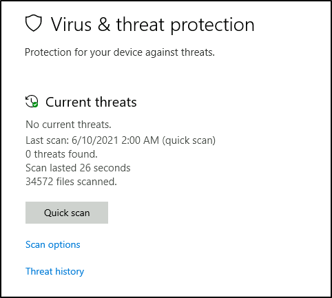

## **Current threats - Các mối đe dọa hiện tại**

### Tùy chọn quét (*Scan options*):
- **Quét nhanh (Quick scan)**: Kiểm tra các thư mục trên hệ thống nơi thường tìm thấy các mối đe dọa.
- **Quét toàn bộ (Full scan)**: Kiểm tra tất cả các tệp và chương trình đang chạy trên ổ đĩa cứng. Thời gian quét có thể kéo dài hơn một giờ.
- **Quét tùy chỉnh (Custom scan)**: Lựa chọn tệp và vị trí bạn muốn kiểm tra.

### Lịch sử mối đe dọa (*Threat history*):
- **Quét cuối cùng (Last scan)**: Windows Defender Antivirus tự động quét thiết bị của bạn để phát hiện virus và các mối đe dọa khác nhằm giúp thiết bị an toàn.
- **Các mối đe dọa bị cách ly (Quarantined threats)**: Những mối đe dọa đã được cách ly và ngăn không cho chạy trên thiết bị của bạn. Chúng sẽ được xóa định kỳ.
- **Các mối đe dọa được phép (Allowed threats)**: Các mối đe dọa được xác định là nguy hiểm nhưng bạn đã cho phép chúng chạy trên thiết bị của mình.

### Cảnh báo:
Chỉ cho phép một mục chạy nếu nó đã được xác định là mối đe dọa khi bạn **hoàn toàn chắc chắn (100%)** về những gì bạn đang làm.

## **Cài đặt bảo vệ chống virus và mối đe dọa** (*Virus & threat protection settings*).


### Quản lý cài đặt (*Manage settings*):
- **Real-time protection (Bảo vệ thời gian thực):** Xác định và ngăn chặn phần mềm độc hại khỏi cài đặt hoặc chạy trên thiết bị của bạn.
- **Cloud-delivered protection (Bảo vệ dựa trên đám mây):** Cung cấp khả năng bảo vệ nhanh hơn với quyền truy cập vào dữ liệu bảo vệ mới nhất từ đám mây.
- **Automatic sample submission (Gửi mẫu tự động):** Gửi các tệp mẫu cho Microsoft để giúp bảo vệ bạn và những người khác khỏi các mối đe dọa tiềm ẩn.
- **Controlled folder access (Truy cập thư mục được kiểm soát):** Bảo vệ tệp, thư mục và vùng bộ nhớ trên thiết bị của bạn khỏi các thay đổi trái phép bởi ứng dụng không mong muốn.
- **Exclusions (Loại trừ):** Windows Defender Antivirus sẽ không quét các mục mà bạn đã loại trừ.
- **Notifications (Thông báo):** Windows Defender Antivirus sẽ gửi thông báo với thông tin quan trọng về tình trạng bảo mật và sức khỏe của thiết bị của bạn.

### Cảnh báo:
Các mục loại trừ có thể chứa mối đe dọa làm cho thiết bị của bạn dễ bị tấn công. Chỉ sử dụng tùy chọn này nếu bạn **hoàn toàn chắc chắn (100%)** về những gì mình đang làm.

### Cập nhật bảo vệ chống virus và mối đe dọa (*Virus & threat protection updates*):
- **Check for updates (Kiểm tra cập nhật):** Kiểm tra cập nhật thủ công để làm mới định nghĩa Windows Defender Antivirus.

### Bảo vệ ransomware (*Ransomware protection*):
- **Controlled folder access (Truy cập thư mục được kiểm soát):** Tính năng bảo vệ ransomware yêu cầu phải bật tùy chọn này, và điều này cũng yêu cầu kích hoạt chế độ bảo vệ thời gian thực.

### Lưu ý:
- Bảo vệ thời gian thực đã được tắt trong **VM** đính kèm để giảm nguy cơ ảnh hưởng đến hiệu suất. Vì **VM** không có kết nối internet và không có mối đe dọa nào, điều này là an toàn.
- Tính năng bảo vệ thời gian thực nên được bật trên các thiết bị Windows cá nhân của bạn, trừ khi bạn có phần mềm của bên thứ ba cung cấp khả năng bảo vệ tương tự. Đảm bảo nó luôn được cập nhật và kích hoạt.

### Mẹo:
Bạn có thể thực hiện quét theo yêu cầu trên bất kỳ tệp hoặc thư mục nào bằng cách nhấp chuột phải vào mục đó và chọn **'Scan with Microsoft Defender'**.

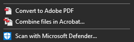

**Câu hỏi: Cụ thể, chức năng nào đang bị tắt mà Windows đang thông báo bạn bật lên?**  

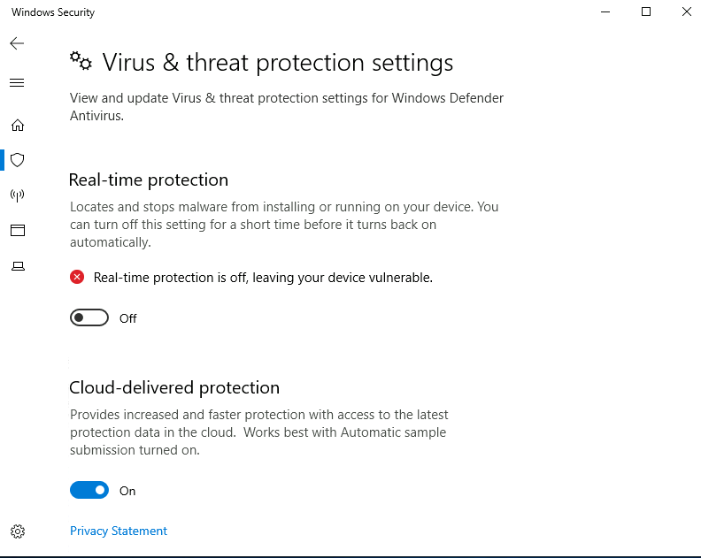

<details>  
<summary>Hiển thị đáp án</summary>  
Đáp án: Real-time protection  
</details>  

# Task 5: Firewall & Network Protection

**Tường lửa và bảo vệ mạng (Firewall & network protection):**

### Tường lửa là gì?
Theo Microsoft, **"Lưu lượng mạng đi vào và ra khỏi các thiết bị thông qua các cổng mà chúng ta gọi là ports. Tường lửa là thứ kiểm soát những gì được - và quan trọng hơn là không được - phép đi qua những cổng này. Bạn có thể hình dung nó như một nhân viên bảo vệ đứng trước cửa, kiểm tra ID của mọi thứ cố gắng đi vào hoặc rời khỏi"**.

Hình ảnh minh họa phía dưới cho thấy giao diện khi bạn điều hướng đến **Firewall & network protection**.


**Lưu ý:** Mỗi mạng có thể có các biểu tượng trạng thái khác nhau.

### Sự khác biệt giữa ba loại cấu hình mạng (Domain, Private và Public) là gì?

Theo Microsoft, **"Tường lửa Windows cung cấp ba cấu hình (firewall profiles): domain, private và public"**.

- **Domain**: Cấu hình miền áp dụng cho các mạng mà hệ thống máy chủ có thể xác thực với bộ điều khiển miền (domain controller).  
- **Private**: Cấu hình riêng tư do người dùng gán và được sử dụng để chỉ định các mạng riêng tư hoặc mạng tại nhà.  
- **Public**: Cấu hình mặc định là cấu hình công khai, được sử dụng để chỉ định các mạng công cộng như điểm phát Wi-Fi tại quán cà phê, sân bay và các địa điểm khác.  

Nếu bạn nhấp vào bất kỳ cấu hình tường lửa nào, màn hình khác sẽ xuất hiện với hai tùy chọn: **bật/tắt tường lửa (turn the firewall on/off)** và **chặn tất cả kết nối đến (block all incoming connections)**.

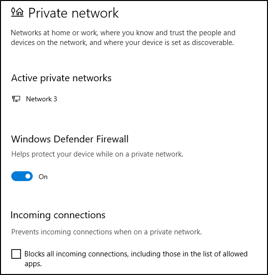

**Cảnh báo:** Trừ khi bạn hoàn toàn **100% tự tin** về những gì bạn đang làm, **khuyến nghị** rằng bạn nên giữ Tường lửa Windows Defender được bật.  

### Cho phép ứng dụng thông qua tường lửa  


Bạn có thể xem các cài đặt hiện tại cho bất kỳ hồ sơ tường lửa nào. Trong hình trên, một số ứng dụng có quyền truy cập vào hồ sơ tường lửa **Private** và/hoặc **Public**. Một số ứng dụng sẽ cung cấp thông tin bổ sung nếu có sẵn thông qua nút **Details**.

### Cài đặt nâng cao


Việc cấu hình **Windows Defender Firewall** dành cho người dùng Windows nâng cao. Vui lòng tham khảo tài liệu chính thức của Microsoft về các phương pháp tốt nhất tại [đây](https://learn.microsoft.com/en-us/windows/security/operating-system-security/network-security/windows-firewall/configure).

**Mẹo:**

Lệnh để mở **Windows Defender Firewall** là:  
`WF.msc`.

**Câu hỏi: Nếu bạn kết nối với Wi-Fi ở sân bay, hồ sơ tường lửa nào có khả năng hoạt động nhất?**  
<details>  
<summary>Hiển thị đáp án</summary>  
Đáp án: Public network  
</details>  

# Task 6: App and Browser Control

Phần này cho phép bạn thay đổi các thiết lập của **Microsoft Defender SmartScreen**.

Theo Microsoft, **Microsoft Defender SmartScreen** "bảo vệ chống lại các trang web hoặc ứng dụng chứa mã độc hoặc lừa đảo, và ngăn chặn việc tải xuống các tệp có thể gây hại".

Vui lòng tham khảo tài liệu chính thức của Microsoft để biết thêm thông tin chi tiết về **Microsoft Defender SmartScreen** tại [đây](https://feedback.smartscreen.microsoft.com/smartscreenfaq.aspx).

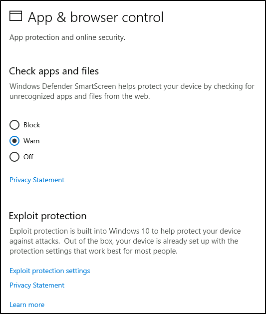

## **Kiểm tra ứng dụng và tệp**

- **Windows Defender SmartScreen** giúp bảo vệ thiết bị của bạn bằng cách kiểm tra các ứng dụng và tệp không được nhận diện từ web.

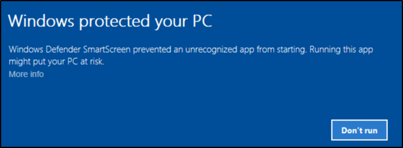

## **Bảo vệ khai thác (Exploit protection)**

- Bảo vệ khai thác được tích hợp sẵn trong Windows 10 (và trong trường hợp này là Windows Server 2019) để giúp bảo vệ thiết bị của bạn khỏi các cuộc tấn công.

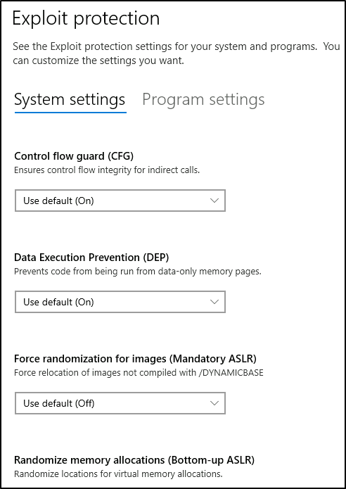

**Cảnh báo:** Trừ khi bạn hoàn toàn **100% tự tin** vào những gì mình đang làm, bạn nên giữ nguyên các thiết lập mặc định.

